# 我如何在 12 个月内从零设计经验到找到一份全职工作(再版)

> 原文：<https://www.freecodecamp.org/news/0-100-from-no-experience-to-a-6-figure-sf-design-job-in-12-months-cd7546034077/>

理查德·杨

# 我如何在 12 个月内从零设计经验到找到一份全职工作

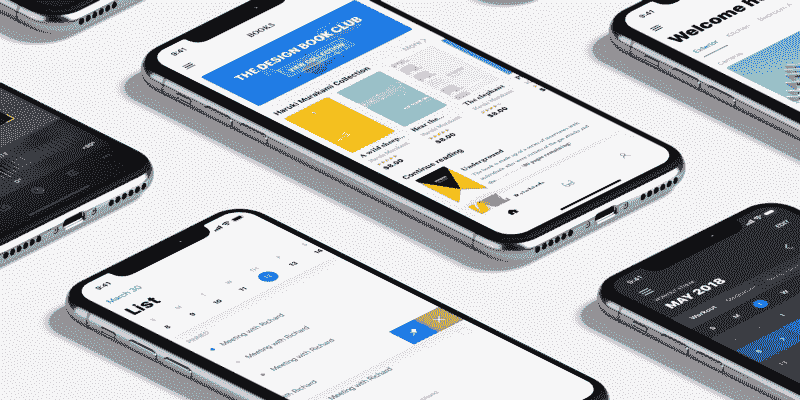

### **四分之一人生危机**

聚集在孩子们周围，这是 2015 年的夏天，在一个偏僻的地方。我在一家农业公司实习，担任人体工程学顾问(基本上是填写花哨的清单，没有应用我在学校学到的任何东西)。

我记得我坐在办公桌前打开脸书的应用程序，然后第八次关闭它，心想，“哦，太好了，乍得刚刚发布了另一张他在工作时喝免费啤酒的照片# startup life # technology # imake more money than you。”

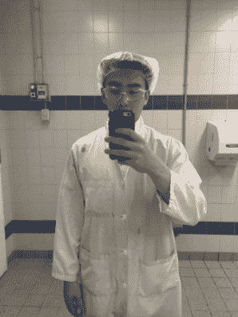

Me at my job. Excited for the boundless opportunities in life.

看到我试图把我的眼睛向后翻得更远变得越来越徒劳，我更早地离开了工作，并开始思考我可以做些什么来更像乍得。

显然，进入技术领域的最佳方式是成为一个“有想法的人”,然后找一群开发人员来编码整个事情(自我畏缩闪回)。

突然灵光一现(至少我当时是这么认为的)，我决定创建一个名为“Joinmi”的应用程序，在那里你可以与朋友和陌生人见面。

这有点像 Tinder x SMS 的优步，注定会成为下一个脸书。我不确定当时是什么让我着魔，但我非常确定这是一个价值百万美元的创业想法(剧透:不是)。

### 一个糟糕的创业想法

事实证明，我的“X 的优步”类比和外卖餐巾纸背面的钢笔草图并没有很好地传达我的想法。

我决定寻找某种设计工具来满足我的需求。我最终使用免费试用的 Moqups 创建了一个#lit 设计。

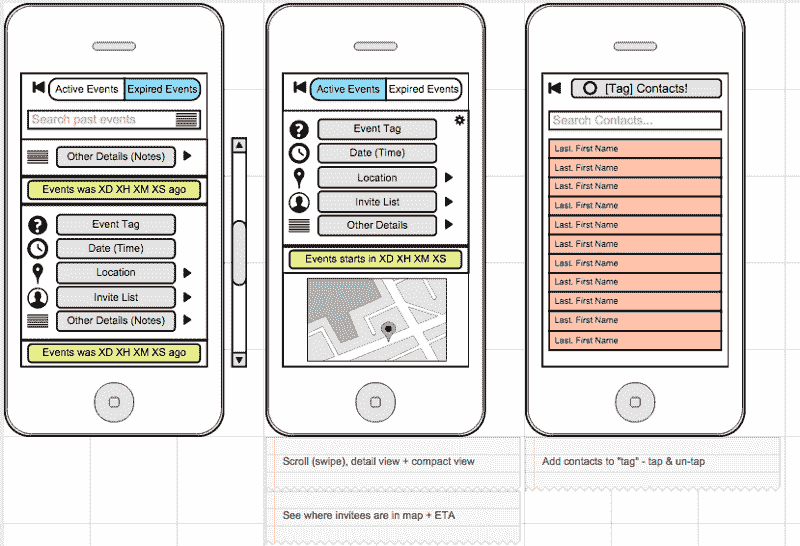

It was not lit.

我对自己的线框很有信心，于是给我认识的每个技术人员发了垃圾邮件，试图推销我的想法。不知道我怎么和他们大多数人还是朋友。

在被屏蔽了几次和坚持不懈之后，我的一个朋友决定帮我一把(？J [ay)](https://www.linkedin.com/in/jaybamimore/) 。他说，“这是个好主意——但我需要的不仅仅是线框。创建一些样机，我会看看我能做些什么。

我不知道什么是用户界面设计，所以“模型”的概念一度对我来说是陌生的。经过一番研究，我最终选择了 [Sketch](https://sketchapp.com/) 作为我的工具。

幸运的是，我决定尝试一下设计，而不是去找一个设计师来为我设计。当我第一次打开这个程序时，我立刻沉浸在图层、形状、颜色和糟糕的排版的世界中。

我一整天都在工作，看教程，读设计文章——平均每天 4-6 个小时。尽管我一直坚持到实习结束，但我并没有得到那么好的成绩(见下文)。

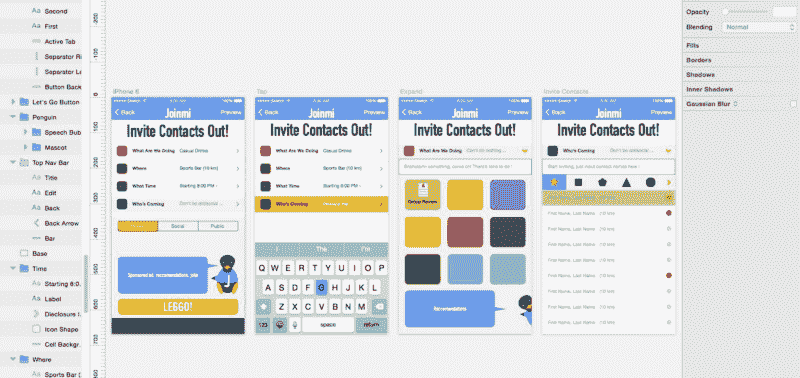

This just proves that you don’t need talent to be a designer, or a sense of colour for that matter.

### 赌博

很快我的实习结束了，我回到了大学。在我意识到 Joinmi 的工作量有多大，以及我在设计方面有多糟糕之后，我就把它搁置了。

在人生的这个阶段，我是一名大学三年级学生，正在学习我 18 岁时选择的某个专业，当时我认为这应该是“激情”。在得到“医生、律师和会计”这三个职业选择后，我打算继续行医，实现每个亚洲父母的梦想。

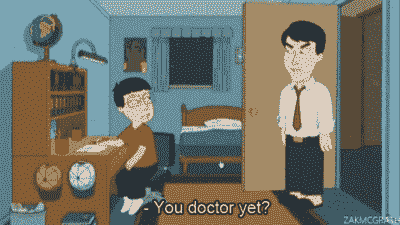

What every Asian kid knows…

随着学期的进展，虽然我一开始从未专心听课，但我发现自己打开了 Sketch 而不是 Steam，阅读设计文章而不是 Reddit。

很快就到了寻找下一份实习工作的时候了。在浏览 10 个与我专业相关的招聘信息时，我偶然发现了几个 UX 的设计工作，它们并没有很高的要求。

然而，我决定去找我过去申请过的“安全”的工作，因为我认为自己根本没有资格从事真正的设计工作。

在所有申请关闭的 48 小时前，我经历了本周的第二次四分之一生活危机，在我的 S/O 和朋友的说服下，我决定放手一搏。

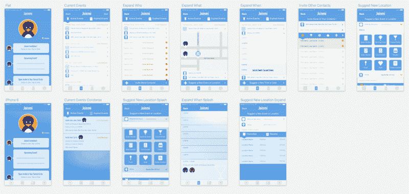

With 10–20 hours of practice each week, I got somewhat better…

鉴于我只有不到 48 小时的时间去“争取”，我决定尽快创建一个投资组合。由咖啡、失眠和激情的混合物提供动力(？)，我选择了翘掉一周所有的课，不睡觉。不知怎的，我设法在紧要关头拼凑出了一些东西。

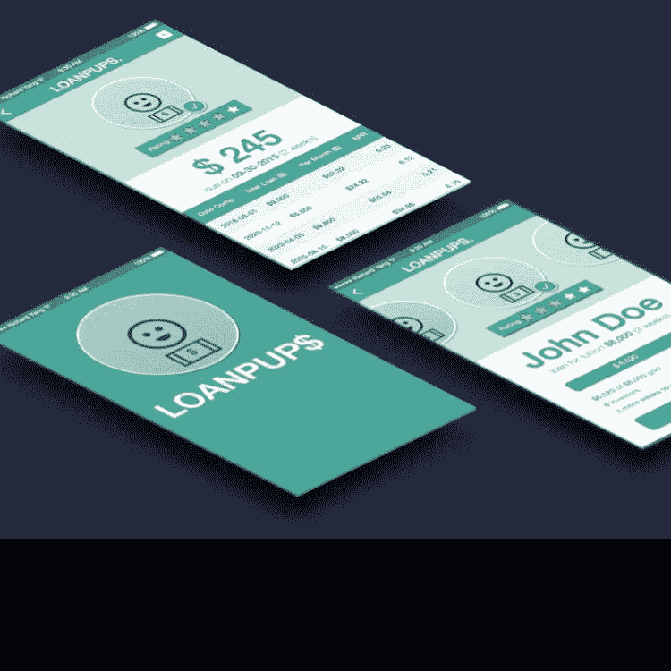

I thought 3D isometric mockups made me look pro.

### 第四幕:重大突破

等了几个星期后，乌云散去，星星排成一行，给了我几个设计面试的机会。

有了这样一个难得的机会，我决定跳过所有的讲座，放弃所有的课外活动，把醒着的每一分钟都用来准备面试。我认为每天大部分时间睡 2-4 个小时。

Those isometric 3D mockups got me these interviews.

在面试准备期间，我着重于理解设计中的各种学科，用户体验的定义，以及常见的设计原则和工具。

我还特别注意每天与我互动的每一个用户界面。我专注于理解他们的设计，并找出用户体验中的差距。

我每天晚上在吃饭、上厕所和睡觉的时候练习和阅读，直到凌晨 2 点。我试图尽可能多地吸收，以增加我的机会。

我不确定它有多有效，但我会截取移动应用的截图，并尝试在 Sketch 中从头开始重建整个 UI，同时思考他们的设计决策。

> 一点点的痴迷是成功的一部分。

当然，一旦他们发现我有 3 周的设计经验，我立刻被大多数公司拒绝了。

尽管我的大部分作品集看起来很糟糕，我还是设法在一家著名的软件公司找到了一份实习工作。

我还设法通过了技术技能面试，其中包括在 Photoshop 中重新创建一个用户界面。我很确定我在测试中谷歌了好几次如何做事情。

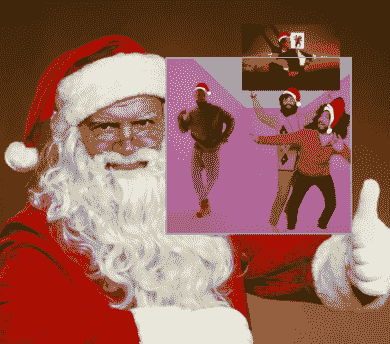

The Photoshop skills I had back then.

### 感觉像个骗子

在确认这不是一个梦之后，想到我第一天上班会有多无能，我感到很害怕。

接下来的几个月我拼命工作。我开始减少睡眠，跳过任何与设计无关的事情。我觉得做一件事比做多件事要好。

我想在第一天鼓起勇气走进办公室之前，我在街区里转了大概 10 圈。尽管我付出了很多努力，但我仍然觉得自己不能胜任这份工作。

起初，我没有太多复杂的工作要做——大部分都是简单的 UI 调整。然而，在工作中没有产生巨大影响的感觉引起了我的共鸣。

这激励我更加努力地工作，超越每个项目。尽管如此，我还是对进入设计领域心存疑虑。

放弃多年的学习去追求我一无所知的东西，这在理论上听起来很疯狂。在这一点上，它不是关于在工作中获得免费啤酒，或者让它下雨——我只是想设计东西。

与此同时，从父母的角度来看，我的父母认为这是一种爱好，我仍然会按计划成为一名医生。

我最终和他们达成了一项协议，我将花一整年的时间专注于设计，如果到年底我还没有任何有意义的成果，我就辞职。

### 苦差事

我一生都不明白对某件事充满激情意味着什么。我一直认为激情是成功人士与生俱来的神奇燃料。

我以为自己对所学的东西“充满热情”。我相信，作为一个普通人，热情的程度包括在听课时有轻微的兴趣，以及偶尔阅读科学杂志。

沉浸在设计中几个月后，我发现我一直都是错的。激情必须被发现。激情是当你放弃睡眠、不吃饭、放弃社交生活——只是为了在一天中多安排几个设计小时。

有无数个夜晚，我灵光一现，打开速写，然后在一眨眼的工夫就听到我的闹钟响了。

如果你好奇，这大概是我一年多来做的事情:

*   每天阅读 10 篇设计文章
*   每天至少创建一个新的用户界面
*   每个周末去参加一次黑客马拉松(误差不大)
*   每天至少设计 10 个小时
*   抓住每一个可能的设计机会(不管是什么)

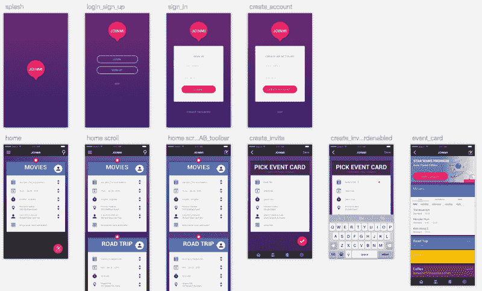

Probably the 10th iteration of Joinmi that I designed at Hack the 6ix, my first hackathon

我做的一些我觉得最有用的事情包括:

*   下载 Sketch UI 套件(从原生 [iOS](https://developer.apple.com/ios/human-interface-guidelines/resources/) & [Android](https://material.io/guidelines/resources/sticker-sheets-icons.html#sticker-sheets-icons-components) 开始)从头开始重新创建
*   从流行的应用程序截图中重新创建草图内的实体模型
*   评论常用的应用程序，如 Yelp、优步、脸书，并针对具体问题和/或人物角色提出替代设计方案
*   检查设计案例研究，如[车载用户](http://www.useronboard.com/onboarding-teardowns/)
*   [100 天 UI 挑战](http://www.dailyui.co/)(最后做了几次)

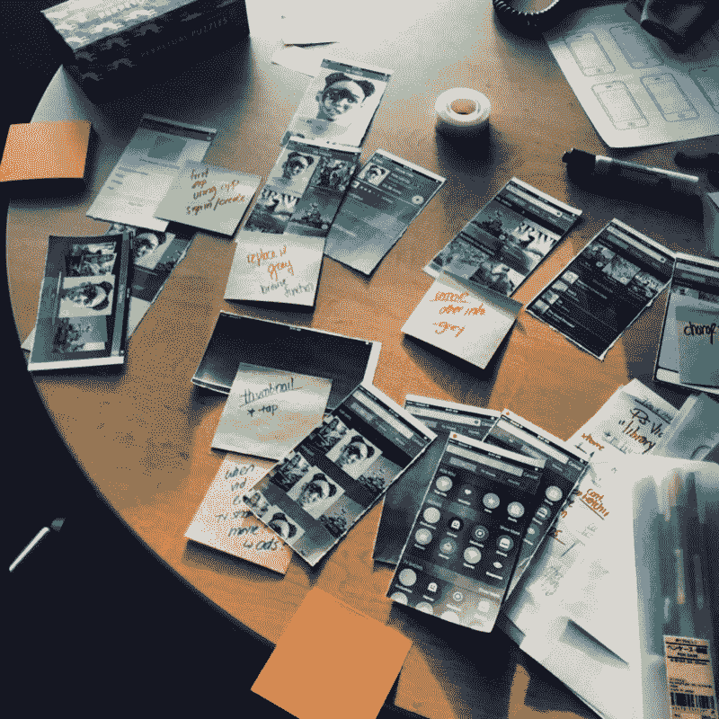

Post it notes make you look more legit.

我还上了几门在线课程。其中一些是付费的，但是一旦我停止外出，我就有了很多闲钱:

*   [Udacity 的谷歌产品设计课程](https://www.udacity.com/course/product-design--ud509)
*   [孟设计+代码到](https://designcode.io/)
*   [Coursera 的交互设计沉浸式](https://www.coursera.org/specializations/interaction-design)
*   [交互设计基础设计课程](https://www.interaction-design.org/)

我发现黑客马拉松对新设计师特别有价值。你学习如何区分优先次序，与多学科团队合作，并尝试新的想法。

> Protip:在向开发人员传递规格时，不要像我一样在房间里大喊大叫——使用 Invision Inspect、Zeplin 或其他类似的工具。

我不认为有一个确切的时刻我可以确定，但在几个月的过程中，我变得越来越好。我在工作中发挥了更大的影响力，并做出了扎实的工作。

这导致我被分配到一个大型的具有挑战性的项目，这个项目在当时对我来说可能太超前了。面对不确定性，这是我推动自己成为更好的设计师所需要的。

无论如何，对生活中的机遇做好百分之百的准备是很难得的。因此，我认真对待，通过多轮测试和审查，一遍又一遍地完善解决方案。每个草图文件变得如此之大，以至于我不得不创建新的文件来避免延迟。我想确保在设计投入生产之前，我犯了所有可能的错误。

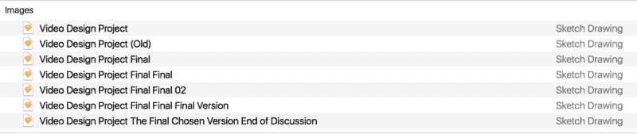

Like this if you also name your Sketch files like I do

这根本不是一项简单的任务。我记得我第一次做设计报告时，有很多尴尬的流汗和口吃。

实习结束后，我一边上学，一边过渡到兼职合同工。那学期我上了五节课，但一节都没去。

我确实注意到的一件事是，我在课堂上无法再集中注意力。坐着听完 10 分钟的讲座就像拔牙一样。

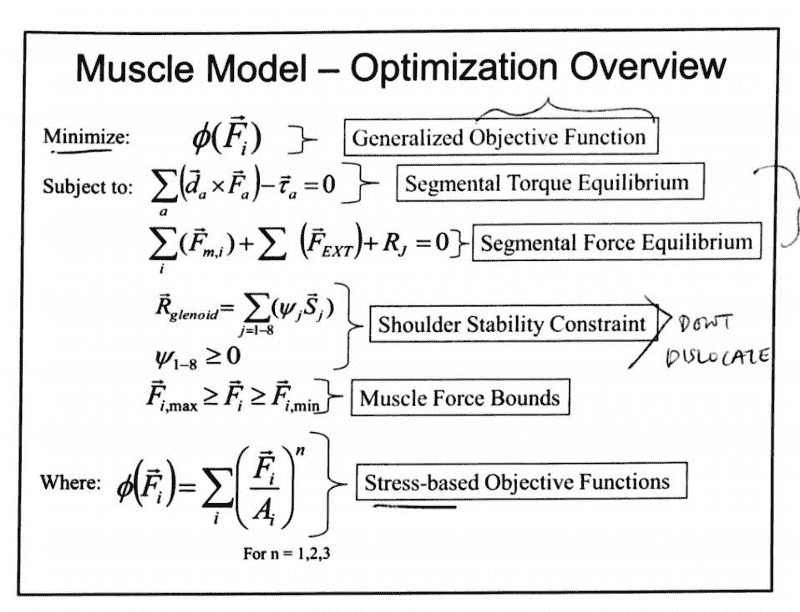

You cannot possibly have a more unrelated design major than mine.

然而，我最终还是每周完成了 20-40 份合同工作。我很确定我想成为一名设计师，而不是别的。

合同到期后，我最担心的是毕业后能否找到一份全职工作。有点操之过急，但我在接下来的周末申请了大约 100 份工作。

在科技公司面试是艰苦的，大多数包括几轮和一个设计挑战。我最终把它们当成了练习，因为我几乎遭到了所有的拒绝。

我做的一件有助于激励我的事情是打印出我收到的所有拒绝，并将它们钉在墙上，以提醒我更加努力地工作(灵感来自斯蒂芬·金在《[写作](https://www.amazon.ca/Writing-10th-Anniversary-Memoir-Craft/dp/1439156816)》中的哲学)。

> “我墙上的钉子再也支撑不住钉在上面的退稿单的重量了。我把钉子换成了长钉，继续写。”斯蒂芬·金

有时候这最终会变成一个数字游戏，你必须自己创造运气。在 80 多次被拒绝后，我设法找到了一份很好的工作，遇到了一些签证问题，最终不得不再次寻找工作，反复冲洗，直到我在目前的公司结束。

两年后(在编辑和重新发布这篇文章后)，我在新的工作岗位上差不多一年了，可以自信地说 Joinmi 绝对是一个糟糕的想法，但我很高兴它把我带到了今天的位置。

作为副业，从那以后我开始了 [orgamiUI](https://www.origamiui.com) (关注 insta gram[@ origamuishop](https://www.instagram.com/origamiuishop/)和 [@richard.ux](https://www.instagram.com/richard.ux/) )。origamiUI 的目标是帮助新设计师开发他们第一份工作所需的 UI 和视觉设计技能。

我计划用每个源文件的结构化分解来打包教育 UI 工具包，以帮助新设计师学习平台和工具特定的设计细节。

这仍然是一项正在进行中的工作——所以请随时给我([hi@origamiui.com](mailto:hi@origamiui.com))发电子邮件，就我如何改进这些教育套件提供反馈和建议。