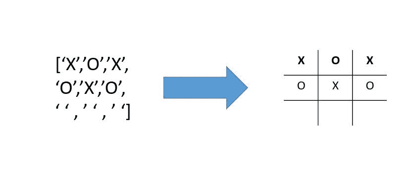
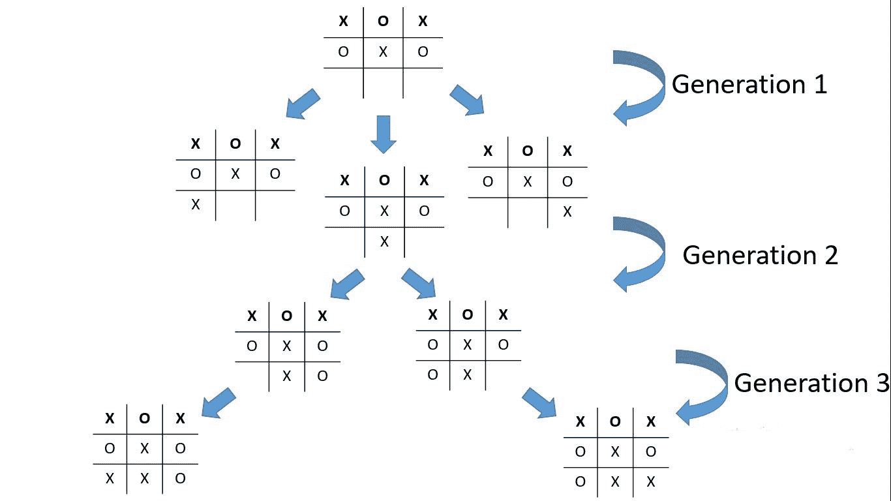
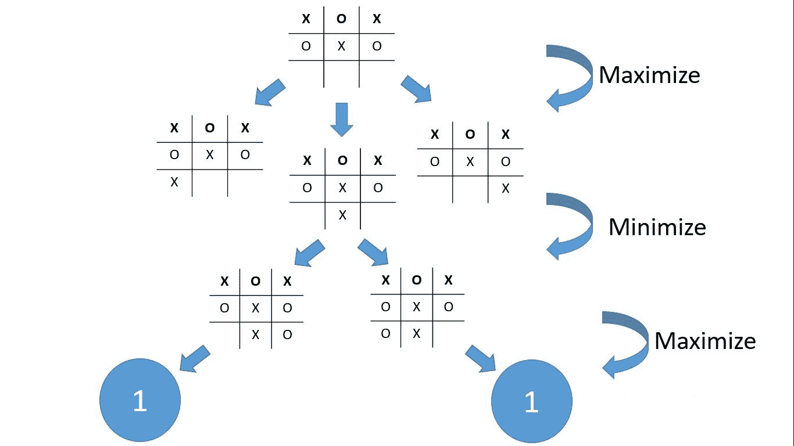
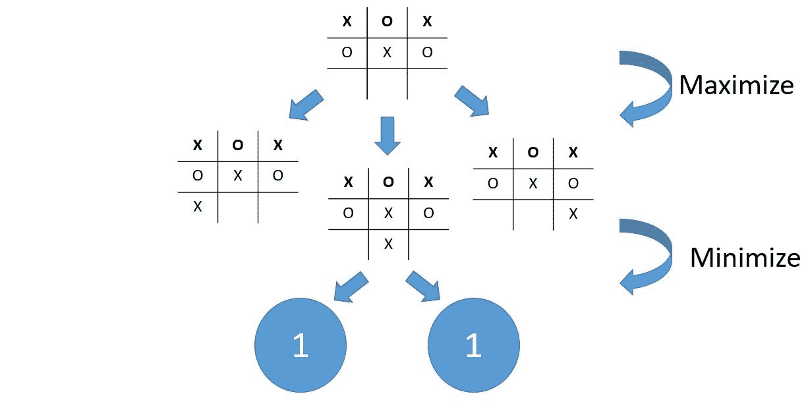
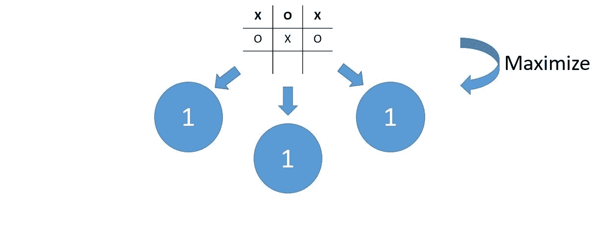

# 如何为双人回合制游戏构建人工智能

> 原文：<https://www.freecodecamp.org/news/build-an-ai-for-two-player-turn-based-games/>

双人回合制游戏是两个玩家轮流对战，直到其中一人获胜。这类游戏的例子有井字游戏、西洋双陆棋、曼卡拉、国际象棋和 Connect 4。

在本教程中，我们将学习 **Minimax** 算法。这是一种回溯算法，用于决策和博弈论。它为一个玩家找到最优的移动，假设他们的对手也是最优的。广泛应用于双人回合制游戏中。

你将学习如何创建你自己的 AI 来玩上面提到的任何游戏或任何其他类似的游戏。此外，为了尽可能地让人理解，我将把这个算法应用到一个**井字游戏**中。

我们不会涵盖创建游戏的整个过程，而只是与人工智能相关的部分，因为这是我们的主题。如果你对游戏制作过程感兴趣，你可以在 [**GitHub**](https://github.com/HousseinBadra/BadraAI.github.io.git) 上看看这个使用 AI 的 [**井字游戏及其源代码。这是我很久以前建立的一个项目，但它仍然是我的最爱之一。**](https://housseinbadra.github.io/BadraAI.github.io/)

### 目录

*   极大极小算法的工作原理
*   极大极小算法的局限性
*   如何提高算法的时间复杂度
*   Tic-Tac-Toe 代码
*   结论

## 极大极小算法的工作原理

极大极小算法的方法非常简单。首先，它从给定的位置检查所有可能的组合。然后它会选择最有可能获胜的一步棋，假设两个玩家都玩得很完美。

为了说明这一点，让我们考虑一个井字游戏，使这更有说服力。正如你可能知道的，在这个游戏中有 2 个玩家和 9 个空位。所以我们可以用一个长度为 9 的数组来表示一个博弈。

现在让我们以这个棋盘为例:如你所见，一个游戏棋盘是一个长度为 9 的数组，它的值可以是 **X** 、 **O** ，或者是一个空字符串。空字符串表示该职位仍然空缺。



Board array to game board

现在轮到 **X** 了。极大极小算法将从这个位置尝试所有的游戏组合。然后，它会尝试所有的游戏组合，从产生的子位置，直到到达一个位置，游戏结束，要么 X 赢，O 赢，或一个平局(当棋盘已满，没有人赢时发生)。

这张图片说明了这是如何工作的:



All game combinations demo

我们可以通过递归来实现。我将在最后展示代码，但是现在，让我们集中于理解我们如何处理游戏组合以获得最优移动。我们将考虑这些情况:

*   对 X 有获胜位置的棋盘用 **1 点**来估价
*   对 O 有获胜位置的棋盘的估价为- **1 点**
*   位置是和棋的棋盘有 **0 分**

如果我们在寻找 X 的最优移动，我们应该找到点数最多的棋盘。但是如果一块板子还没有完成呢？然后，我们应该根据其子板选择一个板，但是我们选择哪一个呢？

我需要你把注意力集中在这一部分，因为这是最重要的部分。当我介绍这个算法的时候，我说过它会找到所有的游戏组合，假设两个玩家都是最优的。

第一代子板之后，就轮到 O 了。假设 O 处于最优状态，我们应该选择一张 O 尽最大努力的牌，这是得分最少的牌之一(因为当 O 赢时，该牌返回-1)。

为什么我们要这样选择？想象一下，如果轮到 O 的时候我们选择最大值，那么我们就是让 X 赢了。这使得算法毫无用处，因为我们需要假设最优策略为 O。

对于第三代，玩家再次是 X，我们将再次选择分数最高的棋盘。

这种交替选择最大值和最小值的方法是该算法被称为极大极小算法的原因。请查看此图片，进一步了解详情:



Minimax mechanism 

这与上面给出的例子相同。底部的两块板赢了 X，所以每块板的返回值都是 1。这里，轮到 X 了，所以我们将选择最佳值——碰巧两块板的值都是 1。

如前所述，如果一个棋盘不满足赢或抽的条件，我们将查看它的子棋盘。这就是为什么值为 1 的板子的父代值为 1。



Minimax algorithm mechanism

这里轮到 O 了，所以我们将选择可能的最小值，恰好是 1。我选择这个具体的例子是为了使事情变得简单，但这适用于所有的电路板。



Minimax mechanism

最后，再次轮到 X，我们将最大化所选棋盘的价值。这就是为什么我们可以选择左边或右边或中间的子板，因为它们的值是相同的。

最终，X 最大化其获胜机会的最优移动是在位置 7，8 或 9。如果你仍然不相信，取任意一个棋盘组合，画出组合树，你会得到一个满意的结果——我强烈建议把这个画在纸上。

## 极大极小算法的局限性

如您所见，该算法是递归的，执行次数可能会非常多。

例如，对于井字游戏，执行次数大约是**“9！”【9 阶乘】(T1)。原因是第一次移动有 9 种可能性，然后每次后续移动有 8 种，以此类推。**

这对于井字游戏来说不是问题，但是考虑一下象棋游戏。如果我们要写组合的数目，整个宇宙都不够。因此，minimax 经常被用作引擎的一部分，但它不足以满足我们的需求。

## 如何提高算法的时间复杂度

您可能已经注意到，使用这种方法可能会产生一些重复的板，我们需要多次计算它们的值。那么为什么不在计算时存储每块板的值呢？

所以现在，对于每一次迭代，我们将检查一个位置是否已经出现。如果是这样，我们将使用它的存储值。否则，我们可以计算位置的值，然后存储它。

为了存储值，我们将使用一个允许在 O(1)中搜索的字典。使用这种方法，我们可以降低时间复杂性，但在某些情况下，它仍然不是很有效。

我用这个算法构建了一个 Connect 4 游戏，从运行时间的角度来看很糟糕。所以，我没有寻找所有的组合，而是停在了某个深度，这导致了一个可以看到 n 步移动的人工智能。

如果你感兴趣，可以查看这个 [GitHub 库](https://github.com/HousseinBadra/badraconnect4AI.github.io.git)中的 Connect 4 游戏代码。我很久以前写的，但是看起来很酷。

## Tic-Tac-Toe 代码

现在让我们先实现一些助手函数。我们将首先检查 board 数组中是否有 3 个水平、垂直或对角线的非空字符串值。

```
// Board array
let xo=['','','',
        '','','',
        '','','']

// Writing this function we need to make sure the equal values are not empty strings

// Before this I will write a helper function to make sure 3 indexes have no empty strings

function helper(index1,index2,index3){
  return xo[index1] !='' && xo[index2] !='' && xo[index3]!=''
}

function checkwin(){

   return (xo[0]==xo[1] && xo[1] ==xo[2] && helper(0,1,2)) ||
          (xo[3]==xo[4] && xo[4] ==xo[5] && helper(3,4,5)) ||
          (xo[6]==xo[7] && xo[7] ==xo[8] && helper(6,7,8)) ||
          (xo[0]==xo[3] && xo[3] ==xo[6] && helper(0,3,6)) ||
          (xo[1]==xo[4] && xo[4] ==xo[7] && helper(1,4,7)) || 
          (xo[2]==xo[5] && xo[5] ==xo[8] && helper(2,5,8)) ||
          (xo[0]==xo[4] && xo[4] ==xo[8] && helper(0,4,8)) ||
          (xo[2]==xo[4] && xo[4] ==xo[6] && helper(2,4,6))

}

//And finally a function to check if there is a draw which will check if all board values are not empty strings. This only works after checking that there is no winning conditions first

function boardfull(){
  return xo.every((elem)=>{
   return elem !=''
  })
}
```

现在我们有了检查是否有获胜状态的函数，我们最终可以这样写 Minimax(我已经在代码中添加了注释来帮助解释它):

```
// As I said erlier, the algorithm will take the board, the ismax parameter to check if we want to maximize or minimize for a certain turn

function minimax(board,depth,ismax){

    // This is a recursive function, so we should set the bases cases first which will be getting a draw a win or reaching the depth

    // As you've seen in the visualizations, when there is a draw or winning conditions no more child boards are generated. So if a winning condition occured when it's X's turn. It got to be X who won that's why I returned 1, and the same logic applies for when Y won and I returned -1 when we were minimizing.

    if (checkwin()) return ismax ? 1 : -1
    if (boardfull()) return 0

    if(ismax){

        // When we're maximizing we will set a counter to -Infinity and whenever we encounter a board value higher than the counter, we will consider it as the best move

     let best=-Infinity
     board.forEach((elem,index)=>{

         //Now to check all resulting positions we will iterate over the board and whenever there is an avaible slot we will set it to X and run minimax on this position. Look how I incrimented the depth

     if(elem ==''){
       board[index]='X'
       let  localscores=minimax(test,depth+1,false)

       // Here I am reetting the board to the same position 

       board[index]=''
       best=max(best,localscores)
     }})
     return best
     }

 // This else here means we're minimizing

 else{

     // Here we will set our counter to + Infinity because we want to find the lowest possible value

    let best=Infinity
    board.forEach((elem,index)=>{
    if(elem ==''){
     board[index]=humanicon
     let localscores=minimax(test,depth+1,true)
     board[index]=''
     best=min(best,localscores)
    }})
    return best
  }
}
```

现在我们完成了！

## 结论

在本文中，我们学习了极大极小算法，它的机制，局限性，以及如何改进它。现在你可以定制它来运行各种游戏，创建一些很酷的游戏机器人。

最后，我希望你能从这篇文章中学到一些新的东西。

如果你觉得这很有用，并想获得更多精彩的内容，请在 LinkedIn 上关注我。会有很大帮助。