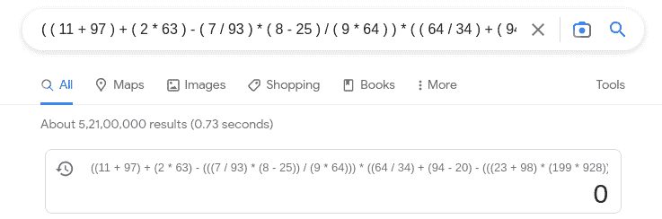
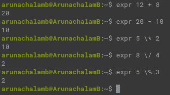
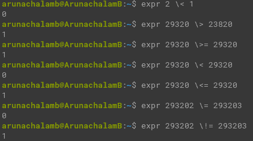
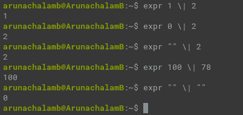
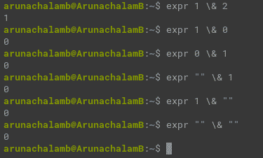
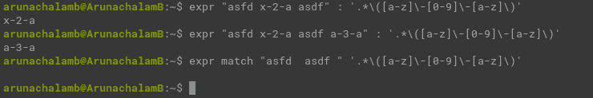
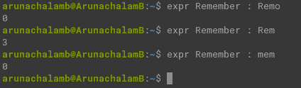
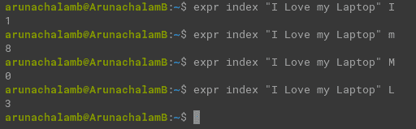

# 如何将您的 Linux 终端用作计算器——数学表达式求解器

> 原文：<https://www.freecodecamp.org/news/solve-your-math-equation-on-terminal/>

你能在不使用任何设备的情况下自己解决下面的数学表达式吗？需要多少时间就花多少时间，但不允许使用任何工具:

```
( ( 11 + 97 ) + ( 2 * 63 ) - ( 7 / 93 ) * ( 8 - 25 ) / ( 9 * 64 ) ) * ( ( 64 / 34 ) + ( 94 - 20 ) - ( 23 + 98 ) * ( 199 * 928 ) / ( 92 * 26 ) ) * ( ( ( 2 * 1 ) / 2 ) - 1 )
```

Long mathematical expression

如果你自己解决了这个问题，那就太好了。我敢肯定，当你发现这个长表达式的结果等于零时，你会生我的气。

那么如果你用你的浏览器找到了答案呢？那需要多长时间？

在谷歌上搜索这个表达式不到一秒钟就得到答案(使用 500MBPS 的连接)和 52100000 个结果。



Search results by Google for the given expression

雅虎在不到 500 毫秒的时间里给了我们答案，同时还有 1，480，000，000 条搜索结果。


Search results by Yahoo for the given expression

Bing 甚至什么都没回。

但是我的终端和系统计算器几乎是瞬间就找到了答案(用了不到 10 毫秒)。

使用终端是计算数学表达式最快的方法之一。但是许多开发者并不知道你可以用你的终端解决数学表达式。

在本文中，您将学习如何在 Linux 终端中解决数学问题。

## 如何在 Linux 终端中计算一个数学表达式

您可以在终端中使用`expr`命令来计算数学表达式。加、减、乘、除和取模等基本数学运算都使用`expr`命令。

让我们快速看一下这些操作:

```
expr 12 + 8   # Addition

expr 20 - 10  # Subtraction

expr 5 \* 2   # Multiplication

expr 8 \/ 4   # Division

expr 5 \% 3   # Modulus
```

Evaluating Mathematical expressions with `expr` command



Using the `expr` terminal command to find answers to arithmetic operations

在终端中运行这些命令，计算并返回该表达式的答案(您可以在所附的屏幕截图中验证)。

您可能会想，“为什么最后 3 个运算(乘法、除法和取模)有一个反斜杠(\)？”

编程中的反斜杠基本上是用来转义字符的。让我们以乘法符号(*)为例。“*”用在正则表达式中，基本意思是包括所有文件和文件夹。

这里有一个简单的例子:

```
cp ./* ../backup/
```

Copy command using * to select all files and folders

运行上述命令会将当前目录中的所有文件和文件夹复制到备份目录中。

同样，每个符号都有自己的含义。使用反斜杠(\)将会脱离它的常规用法模式。这就是大多数符号以反斜杠为前缀的原因。

但是，您可能想知道，这个命令能做的就这些吗？

答案是否定的。我已经分享了一个表达式的样本，但是我们可以使用任何其他的表达式，并在几分之一秒内得到结果。

## 如何在终端中评估一个逻辑表达式

除了查找数学表达式的结果，您还可以使用此命令来计算逻辑表达式。

包含、> =、=、！=可以用这个命令来计算。

让我们快速看一下它是如何工作的:

```
expr 2 \< 1

expr 29320 \> 23820

expr 29320 \>= 29320

expr 29320 \< 29320

expr 29320 \<= 29320

expr 293202 \= 293203

expr 293202 \!= 293203
```

Evaluate logical expressions with `expr` command



Evaluate logical expressions with `expr` command

如果表达式的计算结果为真，则该命令返回“1”，如果计算结果为假，则返回“0”。

从上面的命令中，您可以注意到所有的逻辑操作符都用反斜杠(\)进行了转义。

## 特殊逻辑运算符是做什么的？

我知道你在想什么。你在想，“我知道逻辑运算符。有哪些特殊的逻辑运算符？”。

特殊的逻辑运算符有:

*   和(&)
*   或者(|)

从编程的角度来看，如果 AND 运算符的两端都计算为 true，则该运算符的计算结果为 true。如果任一侧的计算结果为 true，OR 运算符的计算结果为 true。

这是表格，供你参考。有些人可能对`1`和`0`比较熟悉。对于那些人，用`0`代替假，用`1`代替真。

| X | Y | x 或 Y | x 和 Y |
| 错误的 | 错误的 | 错误的 | 错误的 |
| 错误的 | 真实的 | 真实的 | 错误的 |
| 真实的 | 错误的 | 真实的 | 错误的 |
| 真实的 | 真实的 | 真实的 | 真实的 |

但是它们与`expr`命令的用法完全不同。让我们快速浏览一下。

`expr`命令的工作方式与上表类似。但是有一个特例。如果表达式的计算结果为真，该命令将不会返回`1`,而是返回一个参数。

如果 ARG1 既不是`null`也不是`0`，评估`expr ARG1 | ARG2`将返回 ARG1，否则将返回 ARG2。另一方面，如果参数都不是`null`或`0`，评估`expr ARG1 & ARG2`将返回 ARG1。否则返回`0`。

让我们看几个逻辑 OR 运算符的例子:

```
expr 1 \| 2     # Returns first argument (1)

expr 0 \| 2     # Returns second argument (2) as first argument is 0

expr "" \| 2    # Returns second argument (2) as first argument is null 
                  (Empty string [""] is considered as null in terminal)

expr 100 \| 78	# Returns first argument 100

expr "" \| ""   # Returns 0 as both arguments are null ("")
```

Terminal commands to evaluate logical OR expressions



Evaluating logical OR expressions with `expr` command

上面的屏幕截图显示了使用逻辑 OR 运算符(|)的操作。读到这里，你可能还有几个问题:

### 表达式中使用空双引号("")的目的是什么？

在 bash 中，空双引号表示一个`null`值。因此，如前所述，如果第一个参数为空，则返回第二个参数。

### 如果两个参数都为空呢？

当用空值评估两个参数时，逻辑 OR 和 and 运算符都返回`0`。

让我们看几个使用逻辑 AND 运算符的例子:

```
expr 1 \& 2     # Returns first argument (1)

expr 1 \& 0     # Returns 0 as one (second) argument is 0

expr 0 \& 1     # Returns 0 as one (first) argument is 0

expr "" \& 1	# Returns 0 as one (first) argument is null ("")

expr 1 \& ""	# Returns 0 as one (second) argument is null ("")

expr "" \| ""   # Returns 0 as both arguments are null ("")
```

Terminal commands to evaluate logical AND expressions



Evaluating logical AND expressions with `expr` command

## 如何用`expr`命令执行字符串操作

`expr`命令不限于数学和逻辑运算。它也可以执行字符串操作。

### 使用正则表达式进行模式匹配

`expr`命令可以验证文本是否与正则表达式模式匹配。如果匹配的文本模式存在，它将返回匹配的文本模式，否则将返回一个空行。

验证正则表达式的语法是:

```
expr STRING : REGEXP

or

expr match STRING REGEXP
```

Evaluate Regex pattern with the text



`expr` command evaluates regex pattern match with the given text

您可以通过使用`match`关键字或者在字符串和 regex 模式之间使用分号(`:`)来实现这一点。

或者，您可以使用分号来查找两个文本之间匹配的字符数。

这里有一个例子:

```
expr Remember : Remo    # Returns 0

expr Remember : Rem     # Returns 3
```

`expr` command to find the number of characters matching the given text



`expr` command to find the number of characters matching the given text

### 求一篇文章的长度

你可以使用`expr length`命令找到给定文本的长度。

```
expr length Linux

expr length "Learning Linux is fun"
```

Find number of characters in a text using `expr` command


`expr length` command showing the number of characters in the given text

如果没有空格，可以直接在`expr length`命令后输入文本。如果文本中有空格，请用双引号("")将它们括起来，否则会出现错误。

### 在文本中查找字符

您可以使用`expr index`命令从给定的文本中找到特定的字符。它返回字符存在的位置。

```
expr index STRING CHAR
```

Terminal command to find a character from the given text



`expr index` to find a character from a text

记住，`expr index`命令执行区分大小写的搜索，并从文本中返回字符的第一个匹配索引。

### 从字符串中提取子字符串

使用`expr`命令从字符串中提取子串很简单。输入字符串、起始索引和要在起始索引后剪切的字符数将返回预期的子字符串。

```
expr substr Carpenter 4 3      # Returns pen
```

`expr substr` command returns a substring from a string


`expr substr` command to find a substring from a string

## 结论

在本文中，您已经学习了`expr`命令的用例。

如果你喜欢我的教程，你可以在我的[个人网站](https://5minslearn.gogosoon.com/)上订阅我的时事通讯，直接在你的收件箱里收到更多这样有见地的文章。你还会发现我所有博客文章的综合列表。