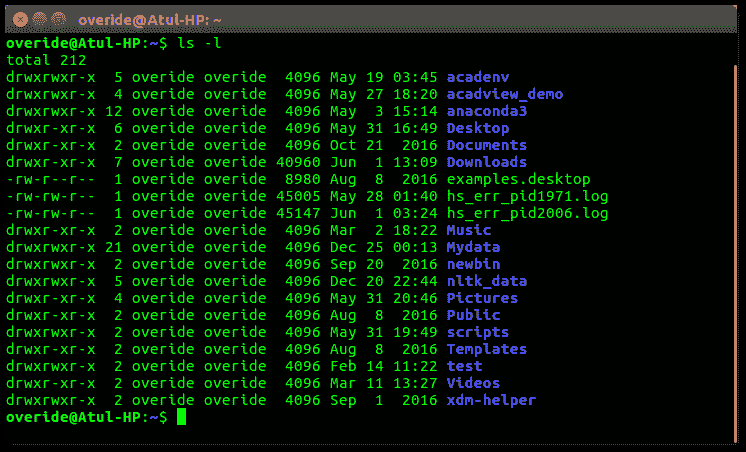
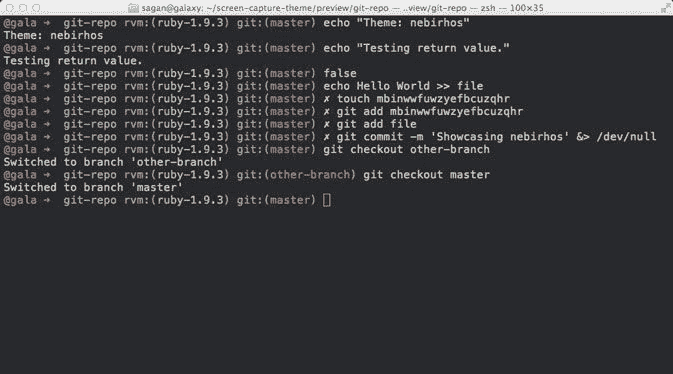
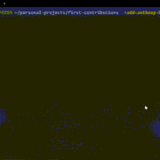
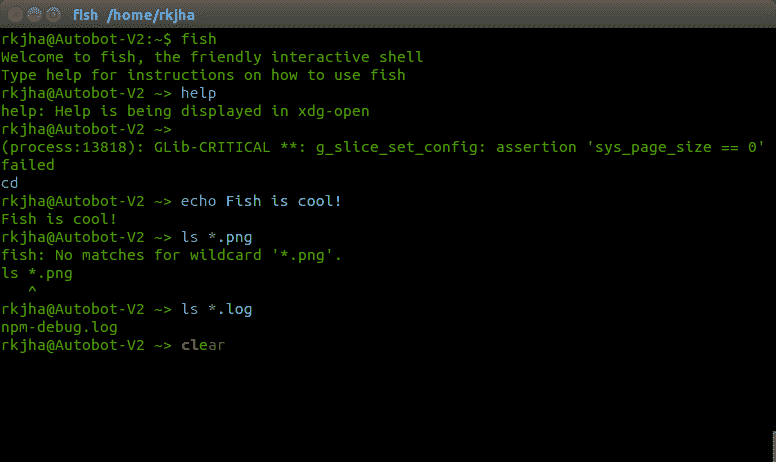
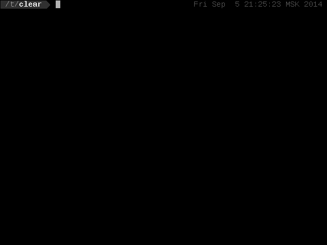
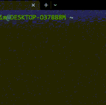
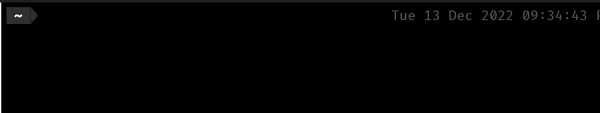

# 面向初学者的 Linux shell——Bash、Zsh 和 Fish 解释

> 原文：<https://www.freecodecamp.org/news/linux-shells-explained/>

当您打开终端时，它很可能使用 Bash 作为它的 UNIX shell 环境。但是存在其他“外壳”环境。

还有其他环境，如 C Shell、Korn Shell、Z Shell，甚至是 Fish Shell。所有这些不同的 shell 环境都有各自的优缺点，您应该在选择一个用于您自己的系统之前考虑它们。

在本文中，我将介绍一些流行的 shells 及其主要特性，以帮助您选择一个。

## Bash Shell

Bash Shell(或 Bourne Shell)是一种 UNIX shell 和命令语言。它是由 Brain Fox 为 GNU 项目编写的，作为 Bourne Shell (sh)的免费软件替代品。

Bash 首次发布于 1989 年，对于大多数 Linux 发行版来说，它是默认的 Shell 环境。其他发行版，如 Kali Linux，使用 Z Shell 作为默认 Shell。

Bash 是 Linus Torvalds(Linux 的创始人)移植到 Linux 的第一批程序之一。



[Image Source](https://www.geeksforgeeks.org/introduction-linux-shell-shell-scripting/)

您不应该混淆的是，Bash 也是一种编程语言。所以它是一个“外壳”，但是你也可以在 Bash 中编程行为。例如:

```
#!/bin/bash
echo "Hello World"
```

a "Hello World" program in Bash

### 关于 Bash 的要点

*   大多数用户使用 Bash，因为它是大多数系统上的默认 shell 环境
*   Bash 没有内联通配符表达式。当您想要在 Shell 中搜索模式时，可以使用通配符表达式，类似于 Regex。三个主要的通配符是`*`、`?`和`[]`。
*   您不能自动更改目录名
*   `#`在脚本中被视为注释
*   它有`shopt`设置
*   提示有反斜杠转义
*   用户配置设置在`.bashrc`中

## Z 外壳

Z Shell 或 Zsh 也是一个与 Bash 非常相似的 UNIX shell。您还可以编写脚本并将 shell 用作命令解释器。

Zsh 是 Bourne shell 的扩展，有很多改进。Zsh 由 Paul Falstad 于 1990 年发布，它具有 Bash、Korn Shell 和 C Shell 共有的一些特性。

macOS 默认使用 Zsh Shell。



[Image Source](https://ohmyz.sh/)

### 关于 Zsh 的要点

*   使用终端时附带自动完成功能。因此，当您按下`Tab ↹`来自动完成您想要运行的任何命令时，它不仅会自动完成，还会下拉所有其他可能的文件和目录:



*   支持内联通配符表达式
*   比 Bash 更易于配置
*   支持插件和主题。这里有一个适用于 Zsh 的插件列表。

也有围绕 Z Shell 构建的框架。其中最流行的是 [Oh My Zsh](https://ohmyz.sh/) ，这是一个社区驱动的开源框架，用于管理 Zsh 配置。(我用哦我的 Zsh😄)


[Image Source](https://osxdaily.com/2021/11/15/how-install-oh-my-zsh-mac/)

Zsh 和 Oh My Zsh 是相似的，但不是完全相同的东西。重申一下，我的 Zsh 是管理你的 Zsh 配置的一种方式，它不是 Shell 本身。

## 鱼壳

Fish 是一个 UNIX shell 环境，强调交互性和可用性。与 Zsh 不同，Fish 旨在默认情况下为用户提供交互性，而不是信任用户实现他们自己的配置。

它是由 Axel Liljencrantz 于 2005 年创建的。由于不符合 POSIX shell 标准，Fish 被认为是一种“奇异的 shell”。[ [来源](https://en.wikipedia.org/wiki/Fish_(Unix_shell)



[Image Source](https://blog.sudobits.com/2015/06/05/fish-a-user-friendly-command-line-shell-for-ubuntulinux/)

### 关于鱼的要点

*   Fish 会根据您的命令历史和您所在的目录自动提供“键入时搜索”的建议。类似于 Bash 的历史搜索，鱼壳的搜索历史是**始终**开启的。这样，用户在终端上工作时将能够获得交互式反馈。



[Image Source](https://taskwarrior.org/news/news.20140906/)

*   Fish 也更喜欢作为命令而不是语法的特性。这使得功能在带有选项和帮助文本的命令方面可见
*   因为默认情况下，Fish 已经设置了很多配置，所以它被认为比 Zsh 等其他`sh`选项对初学者更友好。
*   Fish 的脚本语言不同于 Zsh 和 Bash。Zsh 使用更多的别名，而 Fish 避免在脚本语言中使用别名。

如果您只是使用基本命令来编写脚本，比如，`cd`、`cp`、`vim`、`ssh`等等，您不会注意到 Fish 和 Bash 的脚本语言在工作方式上有任何不同。

最大的区别之一是当您试图从命令中捕获输出时。在 Bash 中，您可能已经习惯了:

```
todays_date=$(date)
echo "Todays date is $todays_date"
```



```
Todays Date is Tue Dec 13 15:29:28 CST 2022 
```

然而在鱼类中，捕获输出的方式不同。脚本中 Fish 的等价形式如下所示:

```
set date (date)
echo "Todays Date $date"
```



```
todays date is Tue Dec 13 21:35:03 UTC 2022 
```

## 结论

Bash、Z Shell 和 Fish Shell 各有千秋，也有一些相似之处。现在你对它们有了更多的了解，你可以在你的工作环境中有效地使用它们。

如果您想要更具可配置性的东西，您可以使用 Zsh(或者甚至安装 Oh My Zsh)。如果您想要更多的交互式终端体验，而不需要太多的配置，您可以使用 Fish Shell。如果你想要经典的感觉，你可以保持巴什。

这完全取决于您作为开发人员的偏好——所以只需选择最适合您的 shell。

希望这对你有所帮助！感谢您阅读🐚🐚🐚