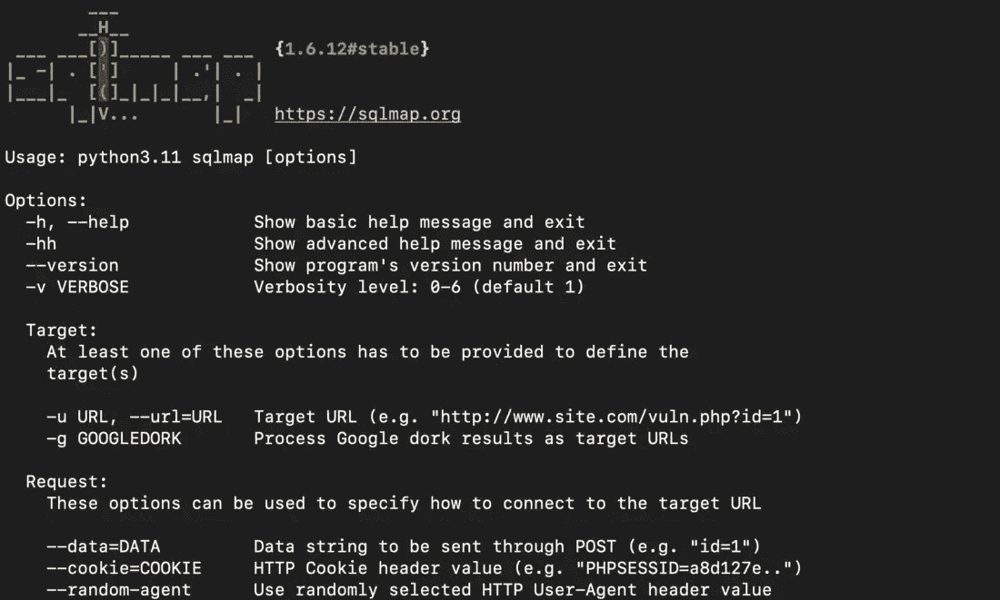
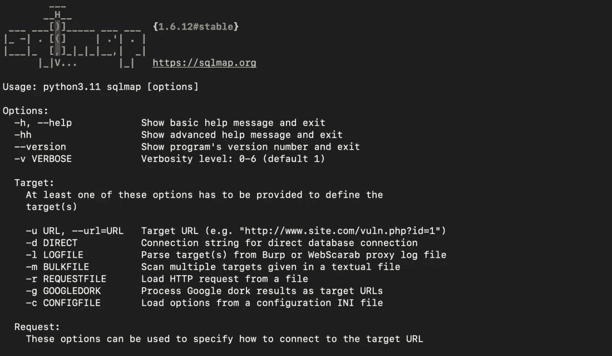
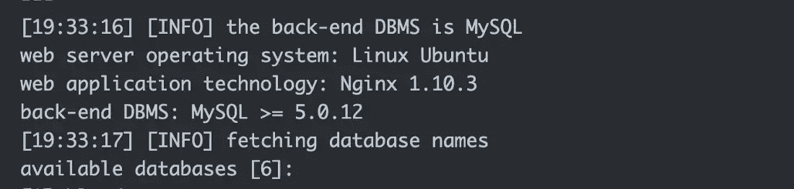

# SQL 注入攻击——如何使用 SQLMap 发现数据库漏洞

> 原文：<https://www.freecodecamp.org/news/how-to-protect-against-sql-injection-attacks/>

数据库是任何应用程序的支柱。它们为我们提供了一种存储和组织大量数据的方法，使我们能够轻松地访问、管理和更新这些数据。

从小型企业到大型企业，数据库在保持系统正常运行方面发挥着至关重要的作用。恶意行为者总是希望在网络攻击期间获得对数据库的控制。

在本文中，您将了解攻击者如何获得对数据库的控制，以及您可以对此做些什么。

**注意，本文仅出于教育目的**。如果你做了什么违法的事，惹上了麻烦，我不负责。在扫描/暴力破解/利用系统之前，一定要获得站点/系统所有者的许可。

## 什么是 SQL 注入？

SQL 注入是一种网络攻击，攻击者在 SQL 语句中插入恶意代码。如果成功，它将帮助攻击者访问数据库中的敏感数据。

一旦攻击者控制了数据库，他们就可以窃取、修改甚至删除数据。

下面是 SQL 注入的几个场景。

*   攻击者可能会在登录表单中插入一段恶意代码。例如，如果登录表单要求用户输入他们的用户名和密码，攻击者可能会输入类似 admin '或' 1'='1 这样的用户名。这将始终评估为真，并将允许攻击者在不知道实际密码的情况下登录。
*   攻击者可能会在搜索表单中插入一段恶意代码。例如，如果搜索表单希望用户输入一个关键字，攻击者可以输入一个关键字，如'或' 1'='1。这将返回数据库中的所有记录，而不是匹配关键字的记录。
*   攻击者可以在允许用户更新信息的表单中插入一段恶意代码。例如，如果表单希望用户输入他们的电话号码，攻击者可能会输入一个电话号码，如；删除表用户；— ,.这将从数据库中删除整个 users 表。

这些只是 SQL 注入袭击的几个例子。攻击者还可以通过许多其他方式使用这些技术来访问数据库。不定期更新/维护的数据库通常容易受到 SQL 注入攻击。

## 什么是 SQL Map？

SQLmap 是一款开源工具，可以自动发现并利用 SQL 注入漏洞。我们可以用它来测试 web 应用程序的 SQL 注入漏洞，并获得对易受攻击的数据库的访问权限。

SQLmap 因其易用性和灵活性而成为笔测试人员最喜欢的工具。它是用 Python 编写的，可以在 Windows、Linux 和 MacOS 上运行。

我们可以使用 SQLmap 执行各种各样的攻击。这包括数据库指纹识别、数据提取，甚至接管整个数据库。我们还可以使用它绕过登录表单，在底层操作系统上执行任意命令。

## 如何安装 SQLMap

SQLMap 预装在 Kali Linux 和 Parrot OS 中。要在基于 Ubuntu / Debian 的系统中安装 SQLMap，请使用 apt 包管理器。

```
apt install sqlmap
```

在 Mac 上安装 SQLMap，我们可以用[自制](https://brew.sh/)。

```
brew install sqlmap
```

如果您使用的是其他平台，您可以[在这里](https://sqlmap.org/)找到安装说明。

安装完成后，我们可以使用`-h`命令查看帮助菜单。在使用 SQLMap 时，这也是一个方便的参考。

```
sqlmap -h
```



SQLMap help menu

SQLMap 还提供了详细的帮助菜单。我们可以使用`-hh`命令来访问它。

```
sqlmap -hh
```



SQLMap advanced help menu

现在我们已经安装了 SQLMap，让我们看看如何使用它。

## **如何使用 SQL 映射**

SQLMap 是一种用于自动利用 SQL 注入漏洞的工具。我们可以使用 SQLMap 来测试网站和数据库的漏洞，并利用这些漏洞接管数据库。

要使用 SQLMap，我们首先需要确定易受 SQL 注入攻击的网站或数据库。我们可以手动操作，也可以使用 SQLMap 扫描网站。一旦我们确定了易受攻击的网站或数据库，我们就可以使用 SQLMap 来利用它。

下面是基本的 SQLMap 命令:

```
$ sqlmap -u [URL] -p [parameter] --dbs
```

该命令将告诉 SQLMap 扫描指定的 URL 和参数以查找漏洞。这包括公开数据、更新数据，甚至转储整个数据库。

检查网站是否易受 SQL 注入攻击的最简单方法是通过查询参数。让我们假设一个网站使用一个 id 参数列出用户信息——例如，testsite.com/page.php?id=1.

这可以作为输入传递给 SQLMap，SQLMap 将自动扫描站点以查看数据库是否易受攻击。以下是命令:

```
sqlmap -u http://testsite.com/page.php?id=1 --dbs
```

`-u`标志用于指定一个 URL，而`--dbs`命令告诉 SQLMap 尝试枚举数据库。

如果攻击成功，SQLMap 将列出使用的数据库以及表列表。



SQLMap output

一旦我们获得了一个初步的立足点，我们现在可以使用数据库。下面是列出数据库中的表的命令。

```
sqlmap -u https://testsite.com/page.php?id=1 -D <db_name> --tables
```

要列出表格中的列，我们可以使用以下命令:

```
sqlmap -u https://testsite.com/page.php?id=7 -D <database_name> -T <table_name> --columns
```

要转储整个数据库，以下是命令:

```
sqlmap -u https://testsite.com/page.php?id=7 -D <database_name> --dump-all
```

SQLMap 提供了许多其他有用的命令，如设置 cookies、循环用户代理等。要了解更多信息和完整的选项列表，您可以[参考 SQLMap 文档](https://github.com/sqlmapproject/sqlmap/wiki/Introduction)。

## 如何防御 SQL 注入攻击

为防止 SQL 注入袭击，我们应该遵循以下步骤:

### 使用参数化查询

当与数据库交互时，总是使用参数化查询。这意味着我们应该在 SQL 语句中为任何用户输入使用占位符。然后，在执行查询时，我们可以将输入作为单独的参数提供。

这将防止攻击者能够将任意 SQL 注入到我们的 SQL 语句中。

### 永远不要相信用户输入

我们应该总是检查和净化任何用户输入，以确保它是安全的。我们必须确保输入不包含任何危险的字符或恶意代码。

这将有助于防止攻击者能够注入 SQL 查询，即使他们能够找到绕过我们使用参数化查询的方法。

### 使用准备好的语句

如果数据库支持预处理语句，我们应该使用它们来代替参数化查询。

预准备语句是预编译的 SQL 语句。我们可以用不同的参数多次执行这些语句。

这将使攻击者更难注入恶意代码，因为准备好的语句是预编译的。

### 认证和访问控制

我们应该对数据库进行强有力的认证和访问控制。这将确保只有授权用户能够访问我们的数据库，并保护它免受恶意行为者。

### 监控和警报

始终监视数据库中的可疑活动，并设置警报。这包括失败的登录尝试或大量的 SQL 查询。

这可以帮助我们在早期检测到 SQL 注入攻击，并采取适当的措施来阻止它。

## 摘要

数据库是每个企业的支柱。更新、维护和保护数据库对于保护数据库免受恶意行为者的攻击至关重要。

SQLmap 是一个帮助我们审计数据库漏洞的强大工具。对于开发人员和安全专业人员来说，熟悉 SQLMap 来防御 SQL 注入攻击是非常重要的。

**喜欢这篇文章？加入隐形安全* *[每周简讯](https://stealthsecurity.io/)，让文章每周五送达你的收件箱。也可以在 Linkedin 上** [**与我**](https://www.linkedin.com/in/manishmshiva/) **联系。**