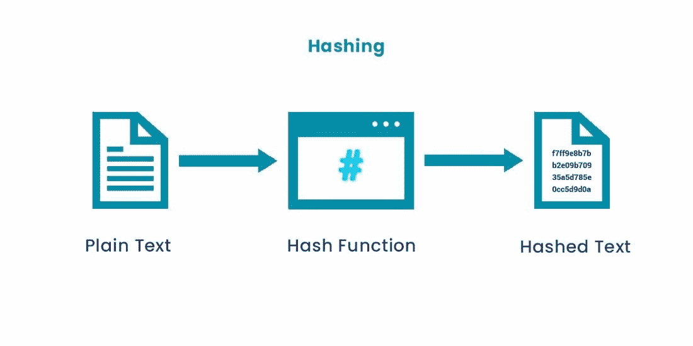
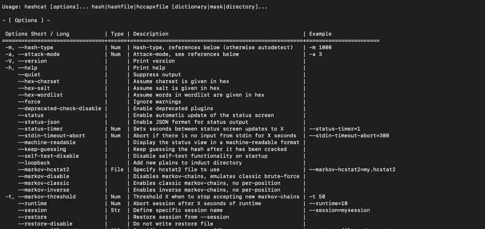
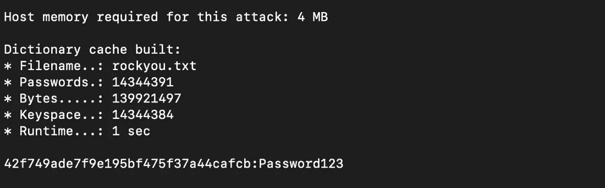
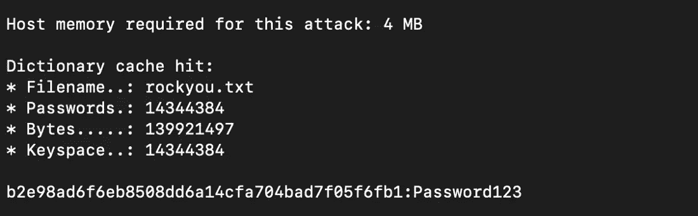

# 如何用 Hashcat 破解哈希——实用测试指南

> 原文：<https://www.freecodecamp.org/news/hacking-with-hashcat-a-practical-guide/>

哈希是网络安全的支柱之一。从保护密码到敏感数据，哈希有各种各样的使用案例。

哈希常常与加密混淆。一个简单的区别是散列数据是不可逆的。加密的数据可以用密钥还原。这就是为什么像 Telegram 这样的应用程序使用加密，而密码是散列的。

在本文中，我们将看看如何安装和使用 [Hashcat](https://hashcat.net/hashcat/) 。Hashcat 是一个简单但功能强大的命令行工具，可以帮助我们——你猜对了——破解散列。

我们将首先详细了解哈希是如何工作的。

> **注:我所有的文章都是出于教育目的。如果你非法使用*这个信息*而惹上麻烦，我不负任何责任。在扫描/暴力破解/利用系统之前，一定要获得所有者的许可。**

## 什么是密码哈希？

哈希是使用哈希函数将字母数字字符串转换为固定大小字符串的过程。哈希函数是一种数学函数，它接受输入字符串并生成另一个字母数字字符串。



How hashing works

有许多散列算法，如 MD5、SHA1 等等。要了解更多关于不同散列算法的信息，[你可以在这里阅读文章](https://www.okta.com/identity-101/hashing-algorithms/#:~:text=A%20hashing%20algorithm%20is%20a,and%20decoded%20by%20anyone%20else.)。

不管输入的长度是多少，散列的长度总是一个常数。例如，如果我们使用 MD5 算法并哈希两个字符串，如“Password123”和“HelloWorld1234”，则最终的哈希将具有固定的长度。

这是“密码 123”的 MD5 散列。

```
42f749ade7f9e195bf475f37a44cafcb
```

如果我们使用输入字符串“HelloWorld1234”，结果将是:

```
850eaebd5c4bb931dbb2bbcf7994c021
```

现在有一种类似的算法叫做编码。一种流行的编码算法是 base64。如果我们用 base64 编码，同样的“密码 123”看起来是这样的:

```
UGFzc3dvcmQxMjM=
```

那么哈希和编码的区别是什么呢？当我们对一个字符串进行编码时，可以很容易地解码得到源字符串。但如果我们散列一个字符串，我们永远无法到达源字符串(也许用量子计算机，但那是另一个讨论的话题)。

哈希和编码有不同的用例。我们可以应用编码来屏蔽/简化字符串，而哈希则用于保护密码等敏感数据。

如果散列是不可逆的，我们如何比较字符串呢？很简单——我们比较哈希值。

当我们注册一个网站时，他们会在保存密码之前对我们的密码进行哈希运算(希望如此！).当我们再次尝试登录时，相同的散列算法用于为我们的输入生成散列。然后将它与数据库中保存的原始哈希进行比较。

这种方法也是导致哈希攻击的原因。攻击散列的一个简单方法是将一系列常用密码散列在一起。这个列表被称为[彩虹表](https://en.wikipedia.org/wiki/Rainbow_table)。哈希表的有趣名称。

现在我们知道了散列是如何工作的，让我们看看什么是 Hashcat。

## 什么是 Hashcat？

Hashcat 是一个快速的密码恢复工具，有助于破解复杂的密码哈希。这是一个灵活和功能丰富的工具，提供了许多方法来寻找密码从散列。

Hashcat 也是为数不多的可以与 GPU 协同工作的工具之一。虽然 CPU 非常适合顺序任务，但 GPU 具有强大的并行处理能力。GPU 用于游戏、人工智能，也可用于加速密码破解。

如果你想了解更多，这里是 CPU 和 GPU 的区别。

Hashcat 的其他显著特性包括:

*   完全开源。
*   支持 200 多种哈希算法。
*   支持 Windows、Linux 和 Mac。
*   支持并行破解多个散列。
*   内置基准系统。

现在我们知道了 Hashcat 是什么，让我们去安装它。

## 如何安装 Hashcat

Hashcat 预装在 Kali 和 Parrot OS 中。要在基于 Ubuntu / Debian 的系统中安装它，请使用以下命令:

```
$ apt install hashcat
```

要在 Mac 上安装，可以用[家酿](https://brew.sh/)。以下是命令:

```
$ brew install hashcat
```

对于其他操作系统，完整的安装说明列表可以在找到[。](https://hashcat.net/hashcat/https://hashcat.net/hashcat/)

安装完成后，我们可以使用以下命令检查 Hashcat 的帮助菜单:

```
$ hashcat -h
```



Hashcat help menu

除了 Hashcat，我们还需要一个单词表。词汇表是常用术语的列表。这可以是一个[密码词表](https://github.com/danielmiessler/SecLists/blob/master/Passwords/Common-Credentials/10-million-password-list-top-100.txt)、[用户名词表](https://github.com/danielmiessler/SecLists/blob/master/Usernames/Names/names.txt)、子域词表等等。

一个流行的密码词表是 [rockyou.txt](https://github.com/teamstealthsec/wordlists/blob/master/rockyou.txt.gz) 。它包含一个常用密码列表，在钢笔测试人员中很受欢迎。您可以在 Kali Linux 中的/usr/share/wordlists 下找到 Rockyou wordlist。

## 如何使用 Hashcat

现在我们知道了什么是散列和 Hashcat，让我们开始破解一些密码。

在破解一个散列之前，让我们创建几个散列来使用。我们可以使用像 [Browserling](https://www.browserling.com/tools/all-hashes) 这样的网站来为输入字符串生成散列。

让我们创建两个散列:一个 MD5 散列和一个字符串“Password123”的 SHA1 散列。我使用弱密码来帮助您理解破解这些密码有多容易。

下面是为输入字符串生成的散列。

```
MD5 hash -> 42f749ade7f9e195bf475f37a44cafcb
SHA1 hash -> b2e98ad6f6eb8508dd6a14cfa704bad7f05f6fb1
```

我们可以将这些散列存储在名称 md5.txt 和 sha1.txt 下，以便在使用 Hashcat 时使用它们。

要使用 Hashcat 破解密码，一般语法如下。

```
$ hashcat -m value -a value hashfile wordlist
```

让我们剖析一下语法。我们使用了两个标志，`-m`和`-a`。`-m`标志用于指定哈希类型，`-a`标志用于指定攻击模式。你可以在这里找到[的哈希类型和攻击模式列表](https://hashcat.net/wiki/doku.php?id=hashcat)。

让我们首先破解我们的 md5 散列。我们将使用字典模式来破解这个散列。这是一个简单的攻击，我们提供了一个单词列表(rock you ), Hashcat 将从这个列表中生成并比较哈希。

我们可以使用值 0 将哈希模式指定为“md5”。但是 Hashcat 也可以自动识别常见哈希算法的哈希类型。

对于攻击模式，我们将使用字典模式(0)，使用标志`-a`。以下是完整的命令:

```
$ hashcat -m 0 -a 0 md5.txt rockyou.txt
```

Hashcat 将快速找到哈希值，在本例中为“Password123”:



Hashcat MD5 crack

看起来很简单，不是吗？现在让我们来破解我们的 SHA 哈希。SHA1 的哈希模式值是 100。以下是命令:

```
$ hashcat -m 100 -a 0 sha1.txt rockyou.txt
```

下面是 Hashcat 的输出:



Hashcat SHA1 crack

Hashcat 支持几乎所有具有各种攻击模式的哈希算法。让我们来看看几种攻击模式，看看它们是如何工作的。

### 字典攻击(-a 0)

正如我们在上面的例子中看到的，字典攻击是通过使用单词表来执行的。字典攻击也是 Hashcat 中的默认选项。单词列表越好，破解密码的几率就越大。

### 组合攻击(-a 1)

组合符攻击将从我们的单词列表中尝试不同的单词组合。例如，如果我们的单词列表包含单词“pass”、“123”和“hello”，Hashcat 将生成下面的单词列表。

```
passpass
pass123
passhello
123pass
123123
123hello
hellopass
hello123
hellohello
```

正如你所看到的，使用一个简单的单词表可以给我们很多组合。如果我们知道密码中可能使用的一些术语，这种攻击就很厉害。记住，初始单词表越大，最终单词表就越复杂。

### 面具攻击(-a 3)

掩码攻击类似于字典攻击，但它更具体。像字典攻击这样的暴力方法可能需要很长时间来破解密码。但是如果我们有关于密码的信息，我们可以用它来加快破解密码的时间。

例如，如果我们知道密码的长度和密码中可能包含的几个字符，我们就可以用这些字符生成一个定制的单词表。

掩码攻击超出了本文的范围，但是您可以[在这里](https://hashcat.net/wiki/doku.php?id=mask_attackhttps://hashcat.net/wiki/doku.php?id=mask_attack)了解关于掩码攻击的更多信息。

除了这些常见的攻击类型，Hashcat 中还有更多攻击模式。这包括混合模式、置换攻击、基于规则的攻击等等。这些模式中的每一种都可以用于特定的用例，并加速密码破解。

## 如何防御 Hashcat

第一步也是最明显的一步是设置强密码。密码越强，越难破解。您可以在这里查看您的密码是否已经[暴露在互联网上。](https://haveibeenpwned.com/)

更有效的方法是[在密码散列](https://www.freecodecamp.org/news/why-a-little-salt-can-be-great-for-your-passwords/)中添加盐。salt 是添加到现有密码中的附加字符串，因此生成的哈希不同于正常的字符串哈希。

例如，如果将字符串“sdf909”添加到密码“Password123”，彩虹表攻击将立即失败，因为它们没有添加 salt 的哈希。

要破解加盐密码，攻击者应该知道哈希值和加盐值。这使得使用彩虹表等方法破解哈希变得更加困难。

我们可以通过使用动态盐代替静态盐来进一步加强盐渍。我们可以编写一个函数，为每个字符串生成一个 salt 值，使得破解 salt 密码的难度成倍增加。

你可以[阅读这篇文章](https://auth0.com/blog/adding-salt-to-hashing-a-better-way-to-store-passwords/)来了解更多关于 Salts 如何在密码散列中工作的信息。

## 摘要

哈希是使用数学函数生成随机字符串的方法。这是一个单向函数，有助于保护用户密码等数据。

Hashcat 是一个帮助破解密码散列的强大工具。Hashcat 支持大多数哈希算法，可以处理各种攻击模式。

要加强安全性并保护哈希免受攻击，请在哈希密码之前使用强密码和 salts。

**喜欢这篇文章？加入** [**隐身安全周报**](https://tinyletter.com/stealthsecurity) **，每周五将文章发送到您的收件箱。也可以在 Linkedin 上** [**与我**](https://www.linkedin.com/in/manishmshiva/) **联系。**