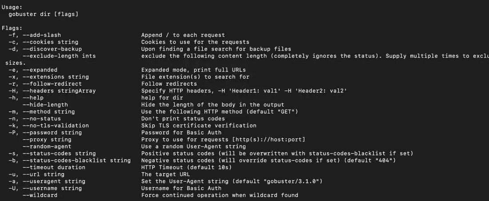
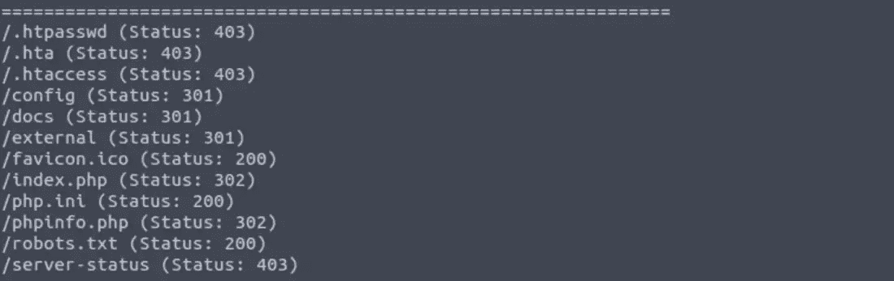
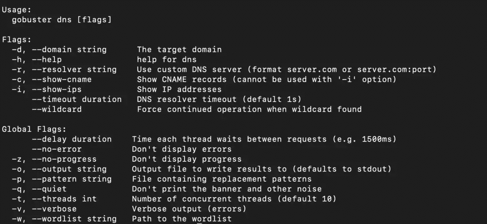

# Gobuster 教程-如何找到隐藏的目录，子域，和 S3 桶

> 原文：<https://www.freecodecamp.org/news/gobuster-tutorial-find-hidden-directories-sub-domains-and-s3-buckets/>

网络服务器和网站比表面上看起来要多得多。

攻击者攻击网站的第一步是找到 URL 和子域列表。Web 开发人员在构建或维护站点时，经常会暴露敏感文件、URL 路径甚至子域。

对于恶意行为者来说，这是一个很好的攻击媒介。

例如，如果您有一个电子商务网站，您可能有一个名为“admin”的子域。这可能不会链接到网站上的任何地方，但由于关键字“管理”是常见的，该网址很容易找到。这就是为什么你必须经常扫描你的网站，以检查未受保护的资产。

通常的方法是依靠被动枚举站点，如 [crt.sh](http://crt.sh/) 来寻找子域。但是这些被动的方法非常有限，并且经常会错过关键的攻击媒介。

Gobuster 是一款帮助您对网站和应用程序执行主动扫描的工具。攻击者用它来寻找攻击媒介，我们可以用它来保护自己。

在本文中，我们将学习安装和使用 Gobuster。我们还将详细了解 Gobuster 提供的选项。最后，我们将学习如何防御这些类型的暴力攻击。

注:**我所有的文章都是为了教育目的。**如果你非法使用这些信息，惹上麻烦，我不负责。在扫描/暴力破解/利用系统之前，一定要获得所有者的许可。

## **什么是 Gobuster？**

Gobuster 用 Go 语言编写，它是一个积极的扫描器，可以帮助你无缝地找到隐藏的目录、URL、子域和 S3 桶。

这就是人们问:[Ffuf](https://blog.stealthsecurity.io/fuzzing-web-applications-using-ffuf-c4ad74190b72)怎么样？

Ffuf 是一个很棒的网络模糊器，但是 Gobuster 是一个更快更灵活的替代品。Gobuster 也支持扩展，我们可以通过扩展来增强它的功能。Gobuster 还可以使用多线程进行扩展，并执行并行扫描来加速结果。

## **如何安装 Gobuster**

让我们看看如何安装 Gobuster。如果你用的是 Kali 或者 Parrot OS，会预装 Gobuster。

如果你用的是 Ubuntu 或者基于 Debian 的 OS，可以用`apt`安装 Gobuster。

```
$ apt install gobuster
```

要在 Mac 上安装 Gobuster，可以使用 Homebrew。

```
$ brew install gobuster
```

要在 Windows 和其他版本的 Linux 上安装 Gobuster，可以在这里找到[安装说明。](https://github.com/OJ/gobuster)

完成安装后，您可以使用 help 命令检查您的安装。

```
$ gobuster -h 
```


Gobuster help command

## 什么是单词表？

如果你不熟悉单词表，单词表是常用术语的列表。这可以是一个[密码词表](https://github.com/danielmiessler/SecLists/blob/master/Passwords/Common-Credentials/10-million-password-list-top-100.txt)、[用户名词表](https://github.com/danielmiessler/SecLists/blob/master/Usernames/Names/names.txt)、子域词表等等。你可以在这里找到很多[有用的单词表。](https://github.com/danielmiessler/SecLists)

我会推荐下载 [Seclists](https://github.com/danielmiessler/SecLists) 。Seclists 是安全评估期间使用的多种类型列表的集合。这包括用户名、密码、网址等。如果您使用的是 Kali Linux，可以在/usr/share/wordlists 下找到 seclists。

要实时尝试 Gobuster，你可以使用自己的网站，也可以使用类似于[Damn Vulnerable web app](https://github.com/digininja/DVWA)(DVWA)这样的练习用 Web app。DVWA 是一种故意错误配置的易受攻击的 web 应用程序，被 pen 测试人员用来练习 web 应用程序攻击。

## **如何使用 Gobuster**

现在我们已经安装了 Gobuster 和所需的单词表，让我们开始使用 Gobuster。

注意:我让 DWVA 在 10.10.171.247 的端口 80 上运行，所以我将用它作为例子。只需用你的网址或 IP 地址来代替。我还将使用 Kali linux 作为攻击机器。

如果您查看 help 命令，我们可以看到 Gobuster 有几种模式。

1.  目录—目录枚举模式。
2.  dns —子域枚举模式。
3.  模糊—模糊模式。
4.  s3 — S3 枚举模式。
5.  vhost — Vhost 枚举模式。

在本文中，我们将研究三种模式:dir、dns 和 s3 模式。

每种模式都有独特的用途，帮助我们找到我们想要的东西。我们来详细看一下三种模式。

### 如何使用目录模式(dir)

Gobuster 的目录模式帮助我们寻找隐藏的文件和 URL 路径。这可能包括图像、脚本文件和几乎任何暴露在互联网上的文件。

以下是运行目录模式的命令:

```
$ gobuster dir -u <url> -w <wordlist>
```

我们还可以使用帮助模式来查找 Gobuster 随 dir 模式提供的附加标志。

```
$ gobuster dir -h
```



Gobuster dir mode help

现在让我们试试 dir 模式。下面是用常用单词表查找 URL 的命令。

```
$ gobuster dir -u 10.10.171.247:80 -w /usr/share/wordlists/dirb/common.txt
```

这是结果。我们可以看到在 DVWA 网站中有一些被曝光的文件。



dir enumeration results

如果我们只想查找特定的文件扩展名，我们可以使用-x 标志。以下是过滤图像的示例命令:

```
$ gobuster dir -u 10.10.171.247:80 -w /usr/share/wordlists/dirb/common.txt -x jpg,png,jpeg
```

### 如何使用 dns 模式(DNS)

您可以使用 DNS 模式在目标域中查找隐藏的子域。例如，如果您有一个名为 mydomain.com 的域，那么可以使用 Gobuster 找到 admin.mydomain.com、support.mydomain.com 等子域。

让我们从查看 dns 模式的帮助命令开始。

```
$ gobuster dns -h
```



Gobuster dns help

要执行 dns 枚举，我们可以使用以下命令:

```
$ gobuster dns -d mydomain.com -w /usr/share/wordlists/dirb/common.txt
```

由于我们不能枚举子域的 IP 地址，我们只能在我们自己的网站或我们有权扫描的网站上运行此扫描。

```
$gobuster s3 -h
```


Gobuster S3 mode help

S3 模式最近被添加到 Gobuster，是一个发现公共 S3 桶的伟大工具。因为 S3 桶有唯一的名字，所以可以用一个特定的单词表来枚举它们。

例如，如果我们有一个名为 Acme 的公司，我们可以使用带有 acme-admin、acme-user、acme-images 等的单词列表。然后可以将这个单词列表输入 Gobuster，以查找是否有与单词列表中的 bucket 名称相匹配的公共 bucket。

下面是使用 Gobuster 执行 S3 枚举的命令:

```
$gobuster s3 -w bucket_list.txt
```

## **如何防御 Gobuster**

Gobuster 是一款出色的工具，可以用来查找隐藏的目录、URL、子域和 S3 桶。

但是这使得恶意的黑客能够使用它并攻击您的 web 应用程序资产。那么我们该如何防御 Gobuster 呢？

您可以使用以下步骤来防止和阻止对您的 web 应用程序的暴力攻击。

1.  ****审核自己:**** 在自己的应用程序上使用 Gobuster 并执行审核。这将帮助您找到攻击者可以看到的信息。
2.  ****应用安全策略:**** 为了防止像 S3 这样的资源暴露在互联网上，使用 AWS bucket 策略来防止未经授权的访问。
3.  ****使用 bot 保护解决方案:****cloud flare 等 Bot 保护服务将阻止任何暴力攻击，使攻击您的 web 应用程序变得异常困难。

## **结论**

Gobuster 是一个快速的强力工具，用于发现网站中隐藏的 URL、文件和目录。这将帮助我们删除/保护隐藏文件和敏感数据。

Gobuster 还有助于保护子域和虚拟主机不被暴露给互联网。总的来说，Gobsuter 是一个帮助您减少应用程序受攻击面的出色工具。

**喜欢这篇文章？加入** [**隐身安全周报**](https://tinyletter.com/stealthsecurity) **，每周五将文章发送到您的收件箱。你也可以** [**跟我**](https://www.linkedin.com/in/manishmshiva/) **联系上*我 *n.**