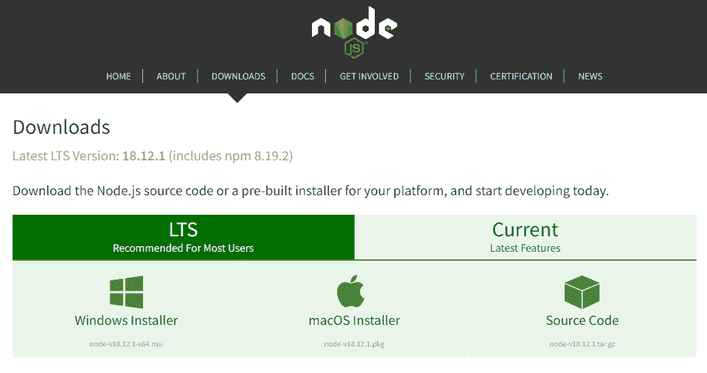
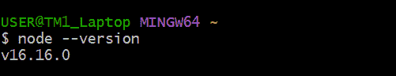
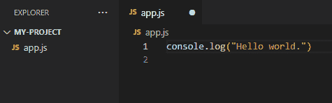
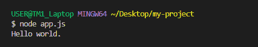

# Node.js 到底是什么？为初学者解释

> 原文：<https://www.freecodecamp.org/news/what-is-node-js/>

Node.js 允许开发人员使用 JavaScript 创建前端和后端应用程序。它由瑞安·达尔于 2009 年发行。

在本文中，您将了解 Node.js。您将了解以下内容:

*   Node.js 是什么？
*   Node.js 环境与浏览器有何不同。
*   为什么要学习 Node.js。
*   Node.js 如何入门？
*   帮助你学习 Node.js 的资源。

## Node.js 是什么？

> " Node.js 是一个开源的跨平台 JavaScript 运行时环境."- [Nodejs.dev 文档](https://nodejs.dev/en/learn/introduction-to-nodejs/)

这听起来像是一个很酷很直接的答案。但是对于初学者来说，这个定义可能会引发更多的问题。所以我们来分解一下，了解一下是什么意思。

Node.js 是开源的:这意味着 Node.js 的源代码是公开的。它由来自世界各地的贡献者来维护。 [Node.js 投稿指南](https://nodejs.org/en/get-involved/contribute/)告诉你如何投稿。

**Node.js 跨平台:** Node.js 不依赖任何操作系统软件。它可以在 Linux、macOS 或 Windows 上运行。

**Node.js 是一个 JavaScript 运行时环境:**当您在文本编辑器中编写 JavaScript 代码时，该代码无法执行任何任务，除非您执行(或运行)它。为了运行你的代码，你需要一个运行时环境。

像 Chrome 和 Firefox 这样的浏览器都有运行时环境。这就是为什么他们可以运行 JavaScript 代码。在 Node.js 创建之前，JavaScript 只能在浏览器中运行。它仅用于构建前端应用程序。

Node.js 在浏览器之外提供了一个运行时环境。它也建立在 Chrome V8 JavaScript 引擎之上。这使得使用您可能熟悉的同一种 JavaScript 编程语言构建后端应用程序成为可能。

## Browser 和 Node.js 运行时环境之间的差异

浏览器和 Node.js 都能够执行 JavaScript 程序。但是你需要知道一些关键的区别。它们包括以下内容。

### 访问 DOM APIs

使用浏览器运行时，您可以访问文档对象模型(DOM)。并且可以执行所有的 DOM 操作。但是 Node.js 不能访问 DOM。

Node.js 向您的程序公开了几乎所有的系统资源。这意味着您可以与操作系统交互，访问文件系统，以及读写文件。但是，您无法从浏览器访问操作系统和文件系统。

### 窗口与全局对象

JavaScript 有一个内置的全局对象。浏览器的 JavaScript 全局对象称为`window`对象。在 Node.js 中，全局对象被命名为`global`。

`window`对象包含仅在浏览器环境中可用的方法和属性。

### 对运行时版本的控制

使用 Node.js，您可以选择在哪个版本上运行服务器端应用程序。因此，您可以使用现代 JavaScript 特性，而不必担心任何特定于版本的不一致。

与浏览器运行时环境形成对比。作为开发人员，您无法控制客户端访问您的应用程序所使用的浏览器版本。

### 加载模块(`import` vs `require`关键字)

Node.js 为 CommonJS 和 ES 模块提供了现成的支持。您可以使用`require`关键字(CommonJS 语法)和`import`关键字(es 语法)加载模块。

一些现代浏览器支持 ES 模块。这意味着您可以使用`import` ES 模块。但是您仍然需要创建包来迎合不支持 es 模块的旧浏览器。

## Node 入门需要多少 JavaScript？

如果你是 JavaScript 的绝对初学者，我建议你从基础开始。

首先熟悉基本的 JavaScript 概念。然后，您可以继续学习使用 Node.js 构建服务器端应用程序。

你不可能穷尽所有关于 JavaScript 的知识。那么，如何确定自己什么时候对 JavaScript 的了解足够入门 Node.js 呢？

Nodejs.dev 文档提供了在深入研究 Node.js 之前需要学习的 JavaScript 主题列表。

一旦掌握了 JavaScript 基础知识，就可以开始使用 Node.js 了

## Node.js 如何入门

让我们看看如何创建第一个 Node.js 应用程序。本节将向您展示如何从命令行运行 Node.js 脚本。

### 如何下载并安装 Node.js

首先，您需要下载并安装 Node.js。如果你是初学者，我会建议你[从官网](https://nodejs.org/en/download/)下载 Node.js。



*Screenshot of the official Node.js website*

所有主要平台(Windows、macOS 和 Linux)的官方软件包都可以在网站上获得。为您的系统下载并安装合适的软件包。

### 如何检查 Node.js 版本

要检查 Node.js 版本，请在终端中运行命令`node --version`。
如果安装成功，您将看到您安装的 Node.js 版本。您应该会得到类似下面截图的响应。



### 如何从命令行运行 Node.js

我们来搭建一个简单的`Hello World` app。

创建新的项目文件夹。你可以调用它`my-project.`在你的代码编辑器中打开项目。在文件夹中，创建一个`app.js`文件。

将以下代码添加到`app.js`



如你所见，这是 JavaScript 代码。

您可以通过运行命令`node <fileName>`在命令行中运行脚本。在这种情况下，文件名是`app.js`。

在您的终端中运行以下命令来执行`Hello world.`程序:

```
node app.js
```

您应该会看到字符串“Hello world”像这样登录你的终端。



恭喜你！您刚刚运行了第一个 Node.js 应用程序。

## 该不该学 Node.js？

以下是您应该考虑学习 Node.js 的一些原因

### Node.js 允许您在客户端和服务器端编写 JavaScript。

Node.js 的优势之一是它允许您在应用程序的前端和后端工作。你可以使用一种编程语言——JavaScript——来实现。

这对使用 JavaScript 的前端开发人员来说是个好消息。如果你想开始做服务器端的工作，这比从头开始学习一门新的后端语言要容易得多。

### Node 有一个充满活力的社区。

正如我在文章前面提到的，Node.js 是开源的。它由来自世界各地的开发人员积极维护。

围绕 Node.js 有一个充满活力的社区，你可以在卡住的时候找到优秀的教程和解决问题的方法。

### Node 建立在谷歌 Chrome 的 V8 引擎之上。

Node.js 构建在 Chrome V8 JavaScript 引擎之上。这一点意义重大，因为 V8 引擎支持谷歌的一些浏览器内应用，如 Gmail。因此，谷歌投入巨资以确保其提供高性能。

### 市场需求

许多知名公司，如网飞、优步、Paypal 和 LinkedIn，以及其他公司都使用 Node.js。除了这些知名公司，许多初创公司也使用 Node.js 开发他们的应用程序。

学会使用 Node.js 将使你成为就业市场上的理想候选人。

### NPM 图书馆

NPM 库是 Node.js 附带的优秀资源之一。包是一段可重用的代码。

您可以为重复出现的任务或问题创建一个包，并通过注册表与其他人共享代码。

您也可以下载其他人共享的包。对于开发人员经常执行的许多任务，都有可用的包。

## 学习资源节点

如果您对学习如何构建 Node.js 应用程序感兴趣，我推荐以下资源。

*   [freeCodeCamp YouTube 频道](https://www.youtube.com/watch?v=Oe421EPjeBE)8 小时 Node.js 和 Express.js 课程。
*   [freeCodeCamp 后端开发和 API 课程](https://www.freecodecamp.org/learn/back-end-development-and-apis/)
*   nodejs . dev 文件

此外，下面是 Ryan Dahl 首次展示 Node.js 时的视频链接。

[Ryan Dahl:JSConf 2009 上的原始 Node.js 演示文稿](https://www.youtube.com/watch?v=ztspvPYybIY)

## 结论

像这样的一篇博客文章不足以了解 Node.js 的所有知识，本文的目的是给你一个 Node.js 的概述。

如果您不确定 Node.js 是什么，我希望这篇文章能够解决您的问题，消除您的困惑。

感谢阅读。还有快乐编码！