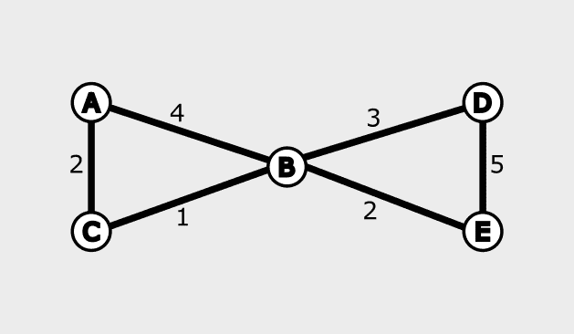
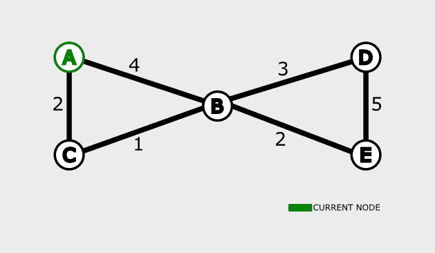
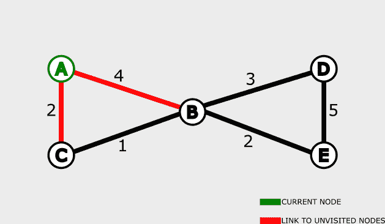
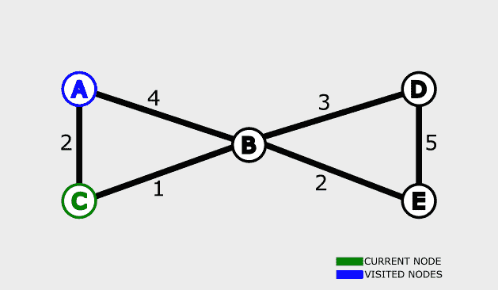
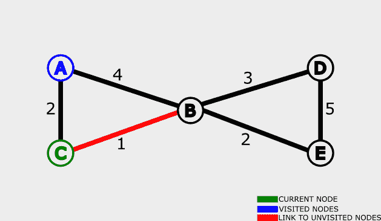
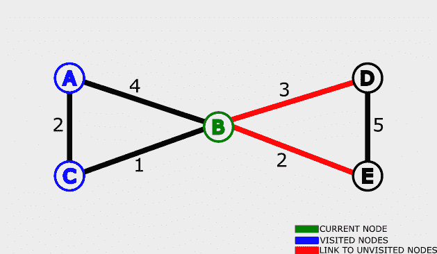
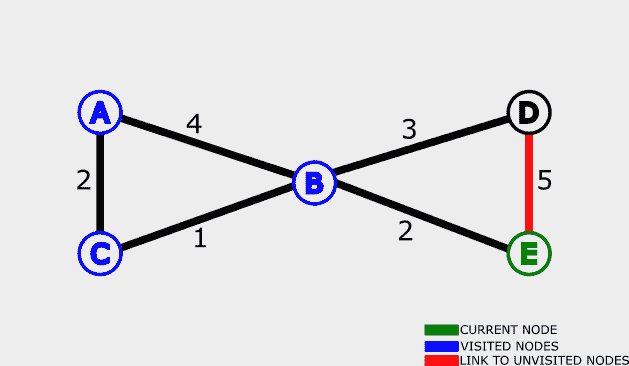
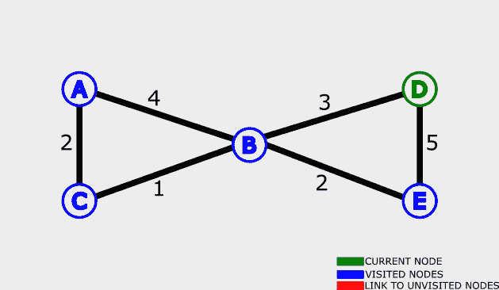

# Dijkstra 算法——用伪代码示例解释

> 原文：<https://www.freecodecamp.org/news/dijkstras-algorithm-explained-with-a-pseudocode-example/>

您可以在编程中使用算法，通过一组精确的指令或程序来解决特定的问题。

Dijkstra 的算法是你会遇到的许多图形算法之一。它用于查找从一个固定节点到图中所有其他节点的最短路径。

Dijkstra 算法有不同的表现形式。您可以找到两个节点之间的最短路径，或者从一个固定节点到图中其余节点的最短路径。

在本文中，您将了解 Dijkstra 的算法如何在可视化指南的帮助下工作。

## Dijkstra 的算法是如何工作的？

在我们深入更详细的可视化示例之前，您需要了解 Dijkstra 的算法是如何工作的。

虽然理论上的解释可能看起来有点抽象，但它会帮助你更好地理解实际情况。

在包含不同节点的给定图中，我们需要得到从给定节点到其余节点的最短路径。

这些节点可以表示任何对象，如城市名称、字母等。

每个节点之间有一个数字表示两个节点之间的距离，如下图所示:


我们通常使用两个数组——一个用于已访问的节点，另一个用于未访问的节点。在下一节中，您将了解更多关于数组的内容。

当访问一个节点时，该算法计算到达该节点需要多长时间，并存储距离。如果找到了到节点的较短路径，则更新分配给该距离的初始值。

注意，一个节点不能被访问两次。

该算法递归运行，直到所有节点都被访问过。

## Dijkstra 算法示例

在这一节中，我们将通过一个实例来展示 Dijkstra 算法的工作原理。

这是我们将要使用的图表:



我们将使用下表来记录访问过的节点以及它们与固定节点的距离:

| 结节 | 到固定节点的最短距离 |
| --- | --- |
| A | ∞ |
| B | ∞ |
| C | ∞ |
| D | ∞ |
| E | ∞ |

已访问节点= []
未访问节点= [A，B，C，D，E]

上面，我们有一个表格显示了每个节点以及从该节点到固定节点的最短距离。我们还没有选择固定的节点。

请注意，表中每个节点的距离当前表示为无穷大(∞)。这是因为我们还不知道最短距离。

我们还有两个阵列—已访问和未访问。每当访问一个节点时，它都被添加到已访问节点数组中。

我们开始吧！

为了简化事情，我将把过程分解成迭代。借助图表，你会看到每一步发生了什么。

### 迭代#1

第一次迭代可能看起来令人困惑，但这完全没问题。一旦我们开始在每次迭代中重复这个过程，你就会对算法的工作原理有一个更清晰的了解。

##### **步骤#1 -挑选一个未访问的节点**

我们将选择 **A** 作为固定节点。所以我们将找到从 **A** 到图中所有其他节点的最短距离。



我们给**一个**一个**一个**距离 0，因为它是初始节点。所以这个表看起来像这样:

| 结节 | 到固定节点的最短距离 |
| --- | --- |
| A | Zero |
| B | ∞ |
| C | ∞ |
| D | ∞ |
| E | ∞ |

##### **步骤#2 -找到与当前节点的距离**



选择一个节点后接下来要做的就是求它到周围未访问节点的距离。

直接链接到 **A** 的两个未访问节点是 **B** 和 **C** 。

为了得到从 **A** 到 **B** 的距离:

0 + 4 = 4

0 为当前节点的值( **A** )，4 为图中 **A** 和 **B** 之间的距离。

为了得到从 **A** 到 **C** 的距离:

0 + 2 = 2

##### **步骤#3 -用已知距离更新表格**

最后一步，我们分别得到 4 和 2 作为 **B** 和 **C** 的值。因此，我们将用这些值更新表:

| 结节 | 到固定节点的最短距离 |
| --- | --- |
| A | Zero |
| B | four |
| C | Two |
| D | ∞ |
| E | ∞ |

##### **步骤#4 -更新数组**

至此，第一次迭代完成。我们将把节点 **A** 移动到已访问节点数组:

已访问节点= [A]
未访问节点= [B，C，D，E]

在我们进行下一次迭代之前，您应该了解以下内容:

*   一旦节点被访问，它就不能链接到当前节点。参考上面迭代中的步骤 2 和下一次迭代中的步骤 2。
*   一个节点不能被访问两次。
*   如果获得的值小于记录的距离，则只能更新最短的已知距离。

### 迭代#2

##### **步骤#1 -挑选一个未访问的节点**

我们有四个未访问的节点— [B，C，D，E]。那么，您如何知道为下一次迭代选择哪个节点呢？

我们选择表中记录的已知距离最小的节点。表格如下:

| 结节 | 到固定节点的最短距离 |
| --- | --- |
| A | Zero |
| B | four |
| C | Two |
| D | ∞ |
| E | ∞ |

所以我们选择节点 **C** 。



##### **步骤#2 -找到与当前节点的距离**

为了找到从当前节点到固定节点的距离，我们必须考虑链接到当前节点的节点。

链接到当前节点的节点是 **A** 和 **B** 。

但是**在前一次迭代中已经访问了一个**,所以它不会链接到当前节点。那就是:



从上图来看，

*   绿色表示当前节点。
*   蓝色表示被访问的节点。我们无法链接到它们或再次访问它们。
*   红色显示从未访问过的节点到当前节点的链接。

求从 **C** 到 **B** 的距离:

2 + 1 = 3

上面的 2 是记录的节点 **C** 的距离，而 1 是图中 **C** 和 **B** 之间的距离。

##### **步骤#3 -用已知距离更新表格**

最后一步，我们得到了 **B** 的值为 3。在第一次迭代中，它是 4。

我们将把表中的距离更新为 3。

| 结节 | 到固定节点的最短距离 |
| --- | --- |
| A | Zero |
| B | three |
| C | Two |
| D | ∞ |
| E | ∞ |

所以，**A**->-**B**= 4(第一次迭代)。

**A**->**C**->**B**= 3(第二次迭代)。

该算法帮助我们找到了从 **A** 到 **B** 的最短路径。

##### **步骤#4 -更新数组**

我们完成了最后一个访问的节点。让我们将它添加到已访问节点数组中:

已访问节点= [A，C]
未访问节点= [B，D，E]

### 迭代#3

##### **步骤#1 -挑选一个未访问的节点**

我们只剩下三个未访问的节点— [B，D，E]。从数组来看， **B** 的已知距离最短。



重申上图中的情况:

*   绿色表示当前节点。
*   蓝色表示被访问的节点。我们无法链接到它们或再次访问它们。
*   红色显示从未访问过的节点到当前节点的链接。

##### **步骤#2 -找到与当前节点的距离**

链接到当前节点的节点是 **D** 和 **E** 。

**B** (当前节点)的值为 3。因此，

对于节点 **D** ，3 + 3 = 6。

对于节点 **E** ，3 + 2 = 5。

##### **步骤#3 -用已知距离更新表格**

| 结节 | 到固定节点的最短距离 |
| --- | --- |
| A | Zero |
| B | three |
| C | Two |
| D | six |
| E | five |

##### **步骤#4 -更新数组**

已访问节点= [A，C，B]
未访问节点= [D，E]

### 迭代#4

##### **步骤#1 -挑选一个未访问的节点**

像其他迭代一样，我们将使用已知距离最短的未访问节点。那就是 **E** 。



##### **步骤#2 -找到与当前节点的距离**

根据我们的表， **E** 的值为 5。

对于当前迭代中的 **D** ，

5 + 5 = 10.

这里为 **D** 得到的值是 10，大于前一次迭代中记录的值 6。因此，我们不会更新该表。

##### **步骤#3 -用已知距离更新表格**

我们的桌子保持不变:

| 结节 | 到固定节点的最短距离 |
| --- | --- |
| A | Zero |
| B | three |
| C | Two |
| D | six |
| E | five |

##### **步骤#4 -更新数组**

已访问节点= [A，C，B，E]
未访问节点= [D]

### 迭代#5

##### **步骤#1 -挑选一个未访问的节点**

我们目前只剩下未访问数组中的一个节点— **D** 。



##### **步骤#2 -找到与当前节点的距离**

算法已经到了最后一次迭代。这是因为链接到当前节点的所有节点都已经被访问过，所以我们不能链接到它们。

##### **步骤#3 -用已知距离更新表格**

我们的桌子保持不变:

| 结节 | 到固定节点的最短距离 |
| --- | --- |
| A | Zero |
| B | three |
| C | Two |
| D | six |
| E | five |

此时，我们已经用从固定节点到图中所有其他节点的最短距离更新了表。

##### **步骤#4 -更新数组**

已访问节点= [A，C，B，E，D]
未访问节点= []

从上面可以看出，我们已经没有节点可以访问了。使用 Dijkstra 的算法，我们找到了从固定节点到图中其他节点的最短距离。

## Dijkstra 算法伪代码示例

本节中的伪代码示例来自维基百科。这是:

```
 1  function Dijkstra(Graph, source):
 2      
 3      for each vertex v in Graph.Vertices:
 4          dist[v] ← INFINITY
 5          prev[v] ← UNDEFINED
 6          add v to Q
 7      dist[source] ← 0
 8      
 9      while Q is not empty:
10          u ← vertex in Q with min dist[u]
11          remove u from Q
12          
13          for each neighbor v of u still in Q:
14              alt ← dist[u] + Graph.Edges(u, v)
15              if alt < dist[v]:
16                  dist[v] ← alt
17                  prev[v] ← u
18
19      return dist[], prev[]
```

## 迪杰斯特拉算法的应用

以下是 Dijkstra 算法的一些常见应用:

*   在地图中获取位置之间的最短距离。谷歌地图就是一个例子。
*   在电信技术中，用来确定传输速率。
*   在机器人设计中为自动机器人确定最短路径。

## 摘要

在本文中，我们讨论了 Dijkstra 算法。它用于查找从一个固定节点到图中所有其他节点的最短距离。

我们首先简要介绍了算法的工作原理。

然后，我们看了一个例子，进一步解释了 Dijkstra 算法的步骤使用视觉指南。

我们以一个伪代码示例和 Dijkstra 算法的一些应用作为结束。

编码快乐！