# 如何在 Gmail 中安排电子邮件–分步指南

> 原文：<https://www.freecodecamp.org/news/schedule-email-in-gmail/>

有时你可能想写一封电子邮件，但稍后再发送。你知道 Gmail 允许你安排多达 100 封邮件吗？

在这篇文章中，你将学习如何使用 Gmail 来安排你的邮件。没有必要安装任何软件或插件。

## 你将学到什么

*   [如何在 Gmail 中安排电子邮件](#how-to-schedule-an-email-in-gmail)
*   [如何在 Gmail 中查看或编辑预定邮件](#how-to-view-or-edit-a-scheduled-email-in-gmail)
*   [如何在 Gmail 中取消预定邮件](#how-to-cancel-a-scheduled-email-in-gmail)

## 如何在 Gmail 中安排电子邮件

**第一步:**登录您的 Gmail 帐户。

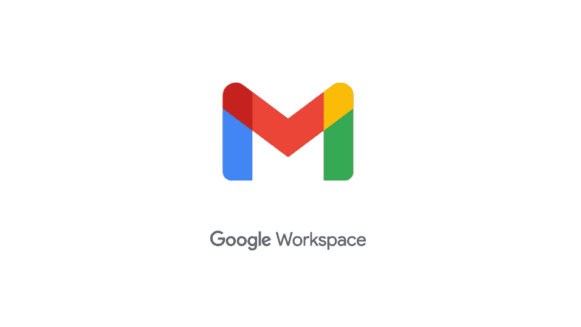

**第二步:**点击撰写创建您的电子邮件。

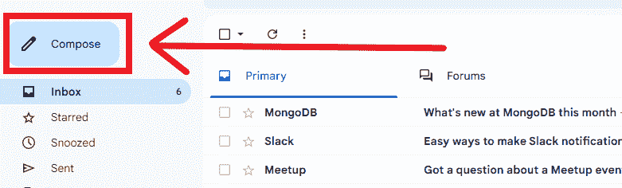

**第三步:**创建您想要安排的电子邮件。

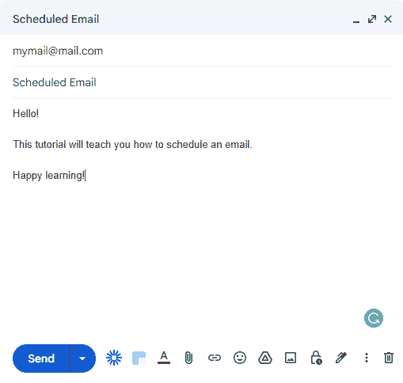

**第四步:**点击`Send`按钮上的向下箭头。

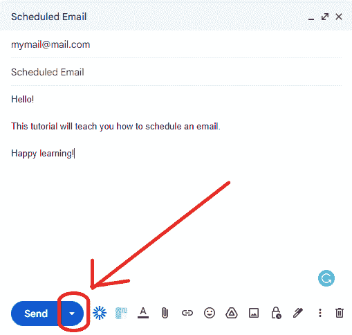

**第五步:**点击`Schedule send`。

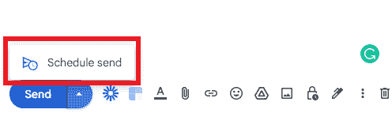

**第六步:**弹出模态给你几个选项。你可以选一个。或者您可以点击`Select date and time`创建自定义日期/时间。

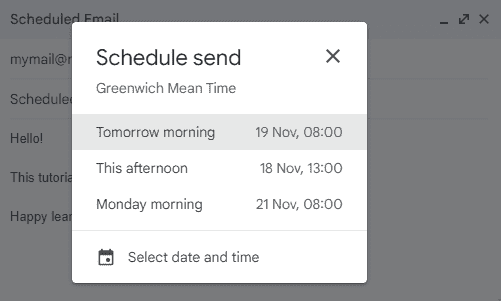

**第七步:**点击`Schedule send`按钮。

就是这样！您的电子邮件现已安排好。您将看到 Gmail 发出的通知(如下所示),确认日程安排成功。

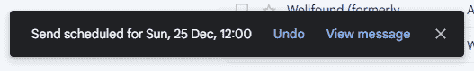

接下来，让我们看看如何在 Gmail 中编辑预定邮件。这可以是编辑邮件内容或更改预定时间。

## 如何在 Gmail 中编辑预定的电子邮件

假设您已经登录到 Gmail，请继续下面的步骤。如果没有，首先登录，然后继续下面的步骤。

**第一步:**要编辑预定邮件，点击左侧面板上的`Scheduled`。

**第二步:**你会看到一个你预定的电子邮件列表。选择您想要编辑的电子邮件。

**第三步:**点击邮件右上角的`Cancel send`。

**第四步:**如果您想编辑电子邮件的内容，请进行更改。如果您只想更改预定时间，请转到步骤 5。

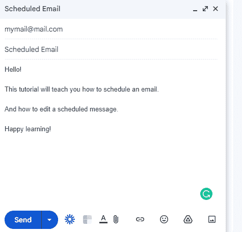

**步骤 5:** 接下来，您使用与初始时间表相同的流程。

*   点击`Send`按钮旁边的向下箭头。
*   然后点击`Schedule send`。
*   选择新的日期和时间。

就是这样！您已经成功编辑了预定电子邮件。

## 如何在 Gmail 中取消预定的电子邮件

假设您已经登录到 Gmail，请继续下面的步骤。如果没有，首先登录，然后继续下面的步骤。

**第一步:**要取消预定的邮件，点击左侧面板的`Scheduled`。

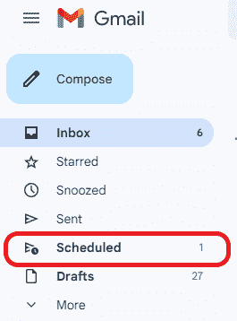

**第二步:**你会看到一个你预定的电子邮件列表。选择您想要取消的电子邮件。

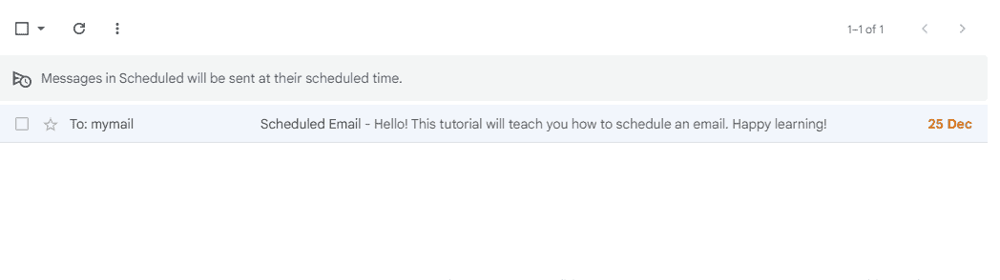

**第三步:**点击邮件右上角的`Cancel send`。

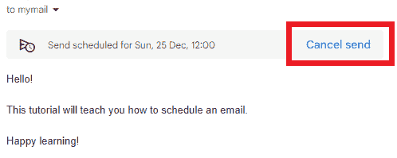

请注意，在 Gmail 中取消预定的电子邮件并不会将其删除。Gmail 将其视为草稿，并将其添加到草稿文件夹中。请参见下面的 Gmail 通知。

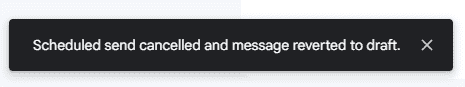

## 结论

您现在知道如何执行以下操作。

*   在 Gmail 中安排电子邮件。
*   编辑或更改预定电子邮件的日期/时间。
*   取消预定的电子邮件。

你也可以看看这篇关于如何批量删除邮件的文章。

感谢阅读！