# 如何使用 Cloudflare Pages、Vercel 和 Netlify 部署 React 应用程序

> 原文：<https://www.freecodecamp.org/news/deploy-react-app/>

您已经开发了一个 React 应用程序，现在您已经准备好将它发布到 web 上了。你用什么服务来发布你的网站，并让它向世界直播？

无论你是准备把你的网站作为一个成品发布，还是正在开发过程中，让我们来看看这三个最好的(而且是免费的！)立即部署 React 应用程序的方法。

想要一个学习 React 的好资源吗？用我的****[React boot camp](https://reactbootcamp.com/)**每天 30 分钟成为 React pro。**

## 如何使用 Cloudflare 页面部署 React 应用程序

部署 React 应用程序的最新方法之一是使用 Cloudflare 页面。

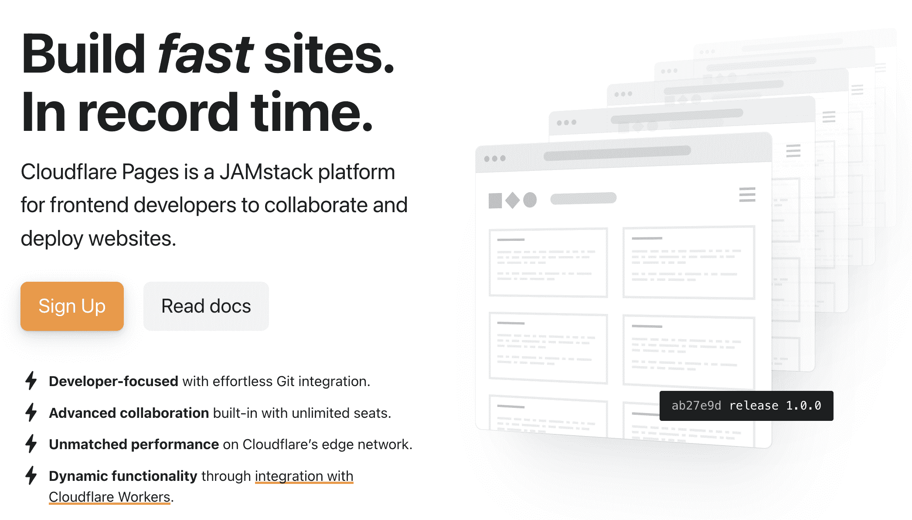

Cloudflare Pages

大约有 20%的网站出于各种原因使用 Cloudflare，通常是为了免费的功能，如减少 DDoS(拒绝服务攻击)。

在过去的几年里，它已经进入了 Pages 的部署领域。托管在 Cloudflare 页面上的网站由 Cloudflare edge 网络提供服务，这是向全球用户提供网站服务的最快方式之一。

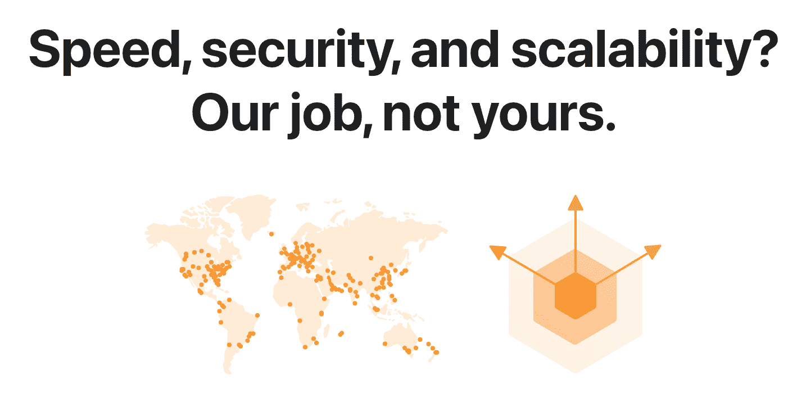

The Cloudflare edge is one the fastest networks

要开始使用 Cloudflare pages，您只需要一个(免费)Cloudflare 帐户。

您可以通过从您的 GitHub 帐户中选择一个 Git 存储库来将您的站点部署到页面。或者，您可以直接推送包含您站点所有资源的文件夹。

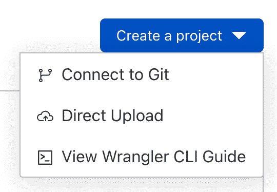

Options to deploy to Cloudflare Pages

之后，选择你正在使用的框架。Pages 包括 React 和 Next.js 的选项。

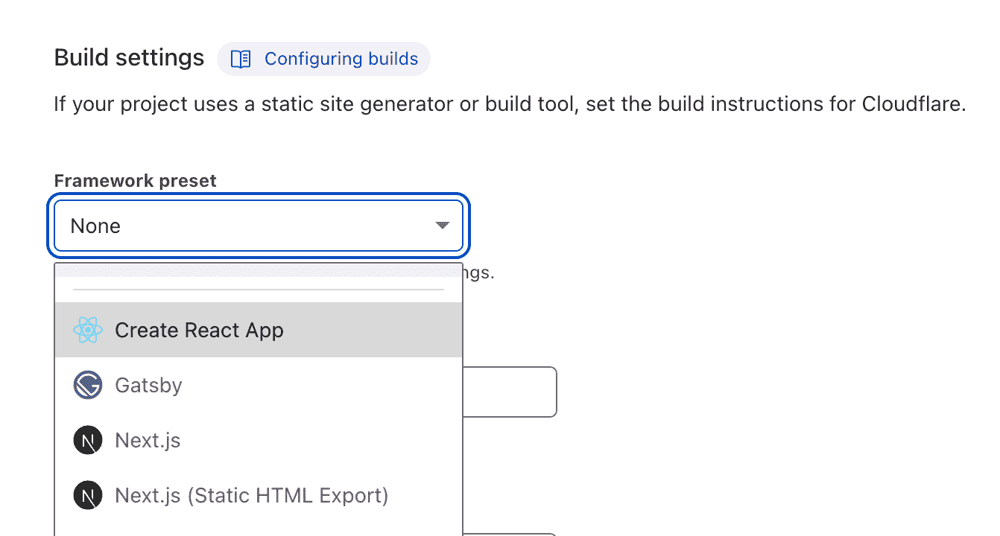

Framework presets for Cloudflare Pages

要完成部署，您只需点击 Deploy 按钮。之后，您的站点将在几分钟内部署到他们的边缘网络上！

Cloudflare Pages 附带内置的 web analytics。但最终部署到 Cloudflare Pages 的最大好处是，您可以免费部署无限带宽的无限站点。

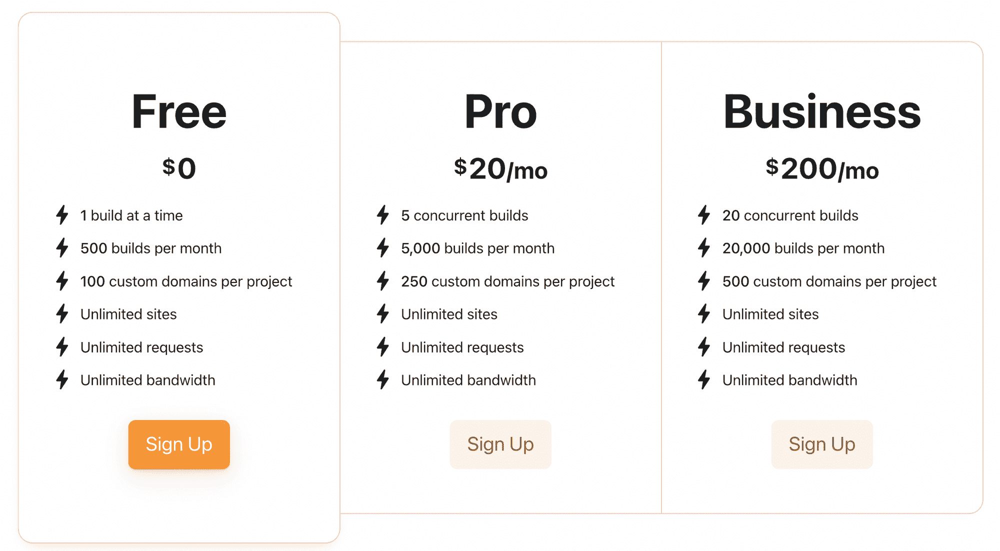

Cloudflare Pricing

有专业和业务层，但这些是为那些希望有更多并发构建(一次构建多个站点)、每月更多站点构建和更多自定义域的客户而存在的。

## 如何使用 Vercel 部署 React 应用程序

Vercel 是一个部署平台，由负责 Next.js 框架的同一批人构建。

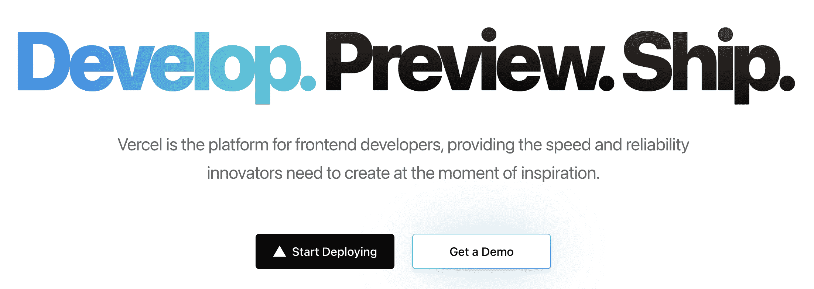

Vercel deployment platform

因此，Vercel 针对使用 Next.js 构建的项目进行了优化。但是，支持您选择的任何 React 框架，包括 Create React App 和 Gatsby。

在所有部署平台中，Vercel 的部署速度最快。一个中等大小的 Next.js 应用程序在一分钟多一点的时间内构建完成。

Vercel 的强大之处在于，它们有大量的集成，使得与您可能已经使用或可能想要使用的一系列其他服务的连接变得非常容易。

集成包括像 MongoDB 或 PlanetScale 这样的数据库，以及 CMS 工具、监控工具和开发人员工具。

与 Cloudflare Pages 一样，Vercel 也为您的项目提供了一个全球 CDN，可以非常快速地交付内容，以及基于 Git 的部署和内置分析。

Vercel analytics 每天都会监控网站的性能以及网站的用户数量。

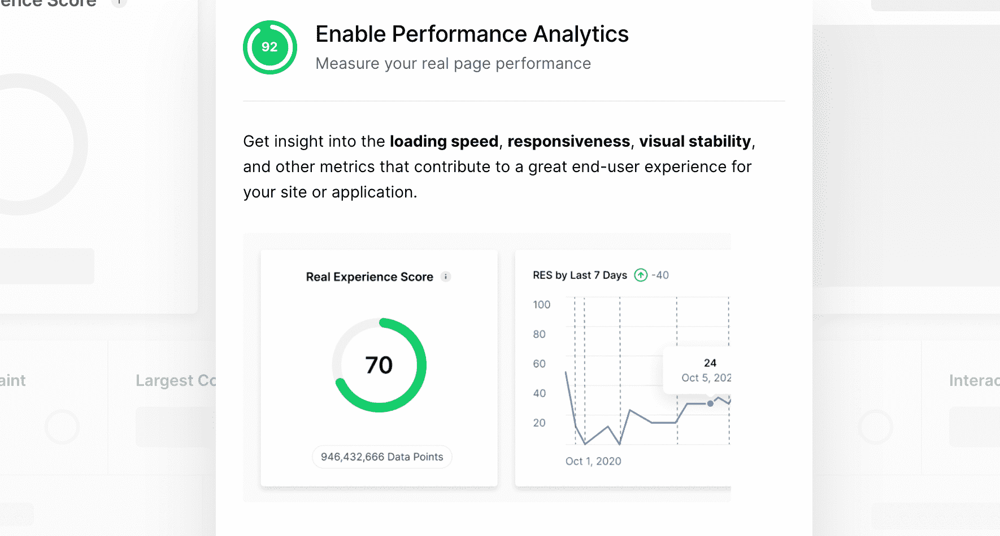

Vercel Analytics

Vercel 有一个简洁的界面来管理您的项目，这比 Cloudflare 页面更复杂。

然而，如果你有一个商业项目或者你每月使用超过 100 千兆字节的带宽，Vercel 的价格会让你却步。在这种情况下，你必须升级到他们的专业计划，这是每月 20 美元。

## 如何使用 Netlify 部署 React 应用程序

Netlify 是一个与 Vercel 非常相似的平台，具有许多独有的特性，比如表单和身份验证。

Vercel 和 Netlify 都支持所有 React 框架，针对 Next.js 进行了优化，内置了 CDN，并且通过 Git 进行部署。

Netlify 有一个类似的复杂的仪表板和用户界面。像 Vercel 一样，Netlify 的特点是大量的集成可以立即添加到您的项目中。

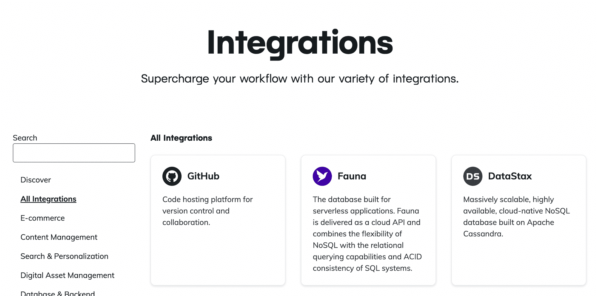

Netlify Integrations

然而，Netlify 有一些功能，如 Netlify Analytics，需要单独付费。此外，Netlify 有一个表单服务，允许您接收表单提交，而无需任何服务器端代码或 JavaScript。

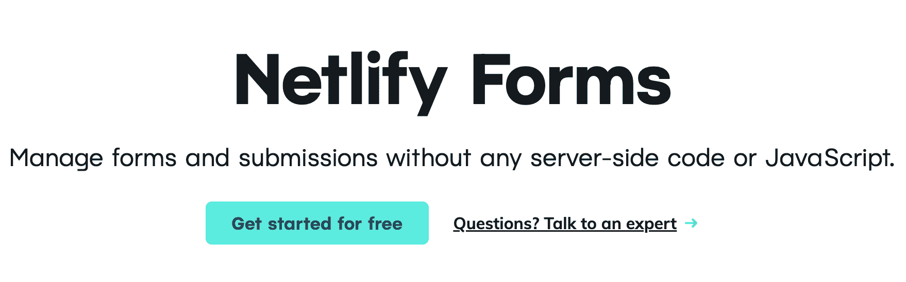

Netlify Forms

它还包括一些其他解决方案，如使用名为 Netlify identity 的服务进行身份验证，如果您希望对静态站点上的用户进行身份验证，这将非常有用。

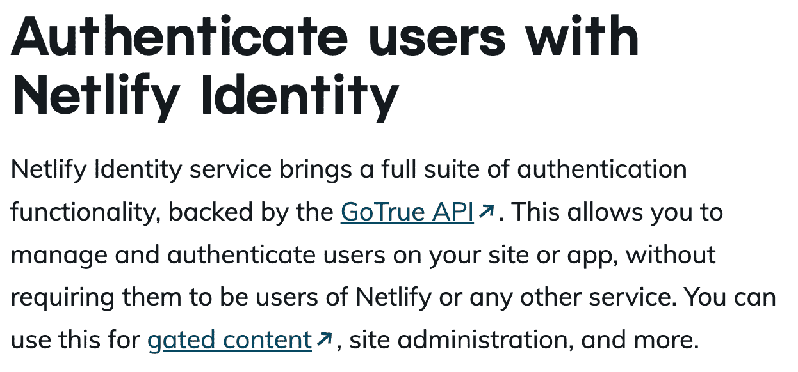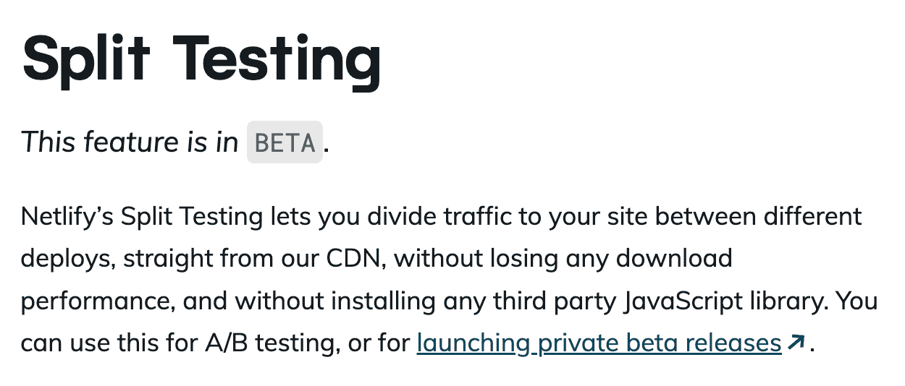

Premium Netlify Features

它也有一些新的功能，比如分割测试，允许你在你的网站上测试一个功能和另一个功能。

说到定价，即使你有一个商业产品，你也可以免费使用 Netlify。如果您超过了他们的 100GB 免费层限制，您将需要升级到 pro 以获得 1TB 的带宽。

如果你想无限制地访问 Netlify 表单和身份等功能，Netlify 每月将花费你 99 美元，其中还包括每月 1.5 兆字节的带宽。简而言之，Netlify 凭借一些价格昂贵的独家功能，与 Vercel 竞争非常激烈。

## 感谢阅读！

希望本文已经为您提供了这些不同部署方法的全面概述，以便您可以立即开始部署 React 应用程序。

## 想成为一名工作就绪的 React 开发人员吗？

如果你喜欢这个 React 教程，看看我的 [React 训练营](https://reactbootcamp.com)。

它将为您提供所需的所有培训:

*   每天只需 30 分钟，就能从完全的初学者变成专业的反应者
*   从零开始到部署，构建 4 个全栈 React 项目
*   了解构建您喜欢的任何应用程序的强大技术堆栈

 
*点击加入 React 训练营*