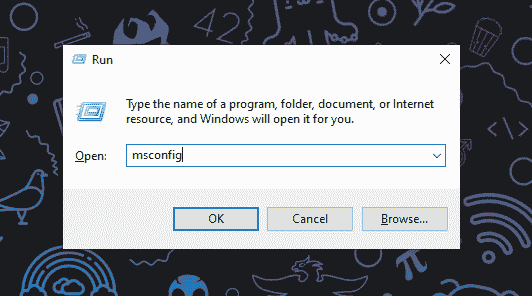
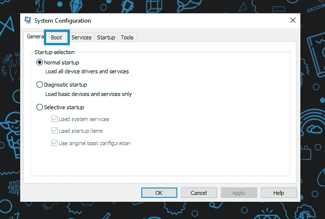
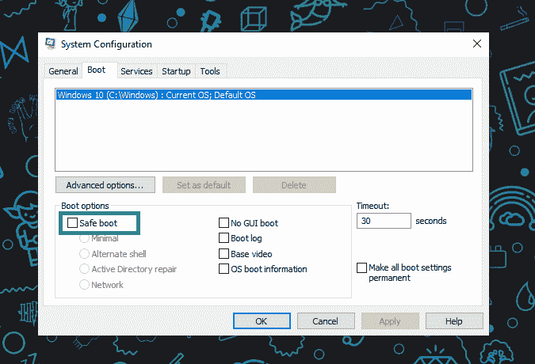
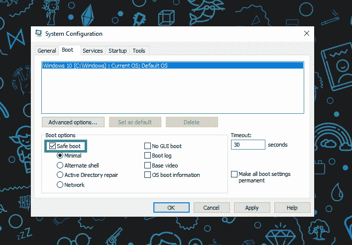
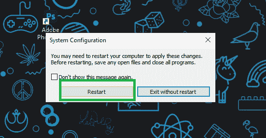
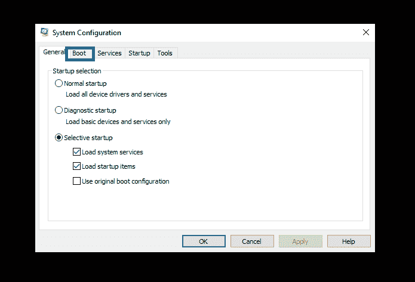
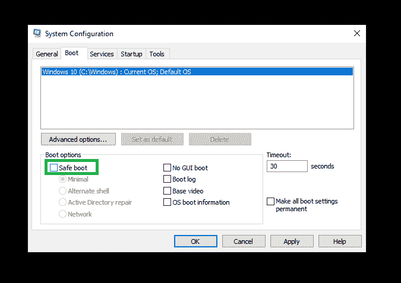
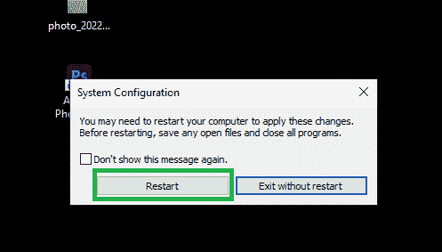

# 如何在 Windows 操作系统上进入“安全引导”

> 原文：<https://www.freecodecamp.org/news/how-to-enter-safe-boot-on-windows-operating-systems/>

如果你使用的是 Windows 操作系统，你可能听说过“重启到安全启动”之类的话。

在本教程中，我将解释这意味着什么，以及如何在您的 Windows 机器上做到这一点。

## 什么是 Windows 的安全启动或安全模式？

安全引导或安全模式在基本状态下启动 Windows 操作系统，使用最少的文件和驱动程序集。

出于多种原因，您可能希望重新引导到安全引导，从识别任何与软件/驱动程序相关的问题到安全地做一些在 Windows 的默认模式下可能无法做到的事情。

## 如何启用安全启动

首先，你需要从你的操作系统中打开**运行**程序。你可以简单地点击任务栏上的搜索框，或者你也可以使用快捷键`Windows Key` + `R`。

然后输入`msconfig`并按下 **Enter** 键，或者简单地点击 **OK** 。

它将打开**系统配置**窗口。

只需进入**引导**部分。

检查“安全启动”选项。你必须启用它。只需选中下图中的复选框:

然后你可以点击“应用”，然后点击“确定”。

请确保您已经保存了所有工作，因为您需要重新启动计算机。点击“重启”。它将重新启动您当前的操作系统进入安全模式。

## 如何禁用安全引导

完成安全引导任务后，您会想要禁用安全引导来继续您的常规引导，对吗？

为此，我们将遵循上面提到的所有过程，但有点相反。不要担心，我将再次向您展示每个步骤。

再次打开**运行**窗口。我更喜欢快捷键，`Windows Key` + `R`。

键入`msconfig`并点击**确定**。

它将再次打开**系统配置**窗口。转到**引导**部分。

确保取消选中“安全启动”复选框。然后单击“应用”，然后单击“确定”。

确保您已经保存了所有任务，然后单击“重新启动”。您的计算机将重新启动到默认模式。

## 结论

感谢您阅读整篇文章。如果你有兴趣阅读更多，那么一定要看看我在 [freeCodeCamp](https://www.freecodecamp.org/news/author/fahimbinamin) 和我的[博客](https://blog.fahimbinamin.com/)上的其他文章。

此外，我还维护着两个 YouTube 频道。如果你对编程相关的内容感兴趣，一定要去看看。

➡️英语频道:[法希姆·宾·阿明-英语](https://www.youtube.com/@FahimBinAminEnglish)➡️孟加拉语频道:[法希姆·宾·阿明-孟加拉语](https://www.youtube.com/@FahimBinAminBengali)

您还可以通过我的 [Twitter](https://twitter.com/Fahim_FBA) 和 [LinkedIn](https://www.linkedin.com/in/fahimfba/) 账户与我联系，您也可以就我认为适合我的相关技能为我背书！

你可以在 GitHub 上找到我: [FahimFBA](https://github.com/FahimFBA)
这是我的个人网站:[fahimbinamin.com](https://www.fahimbinamin.com/)

谢谢大家！😊

封面图片来自 pexels(Eduardo du tra)。