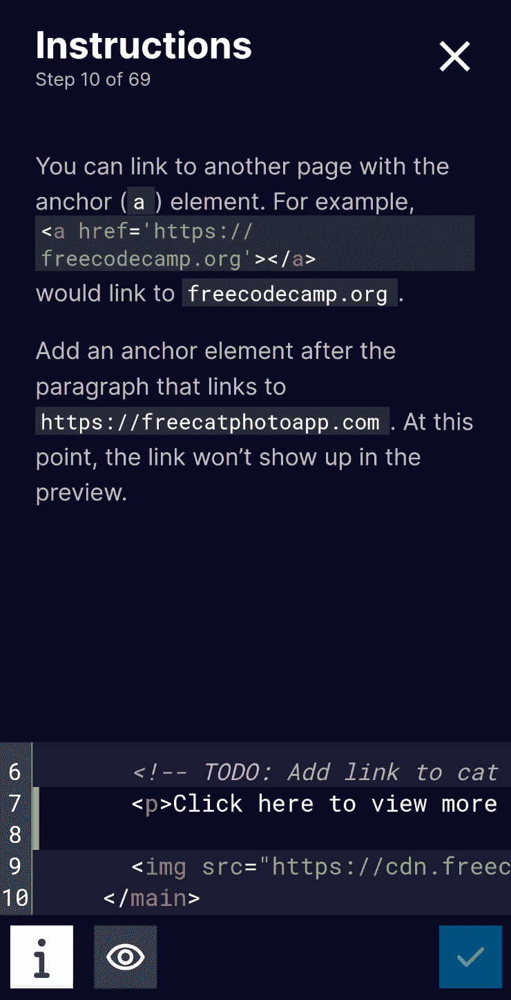
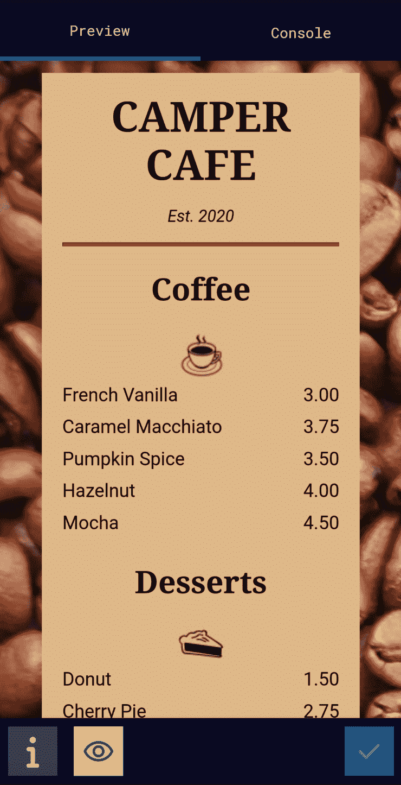
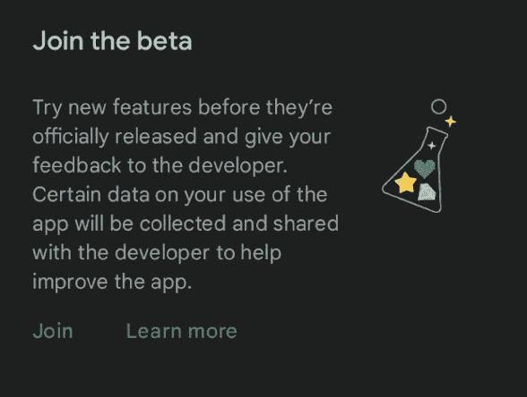

# freeCodeCamp 移动应用——在手机上学习编码

> 原文：<https://www.freecodecamp.org/news/freecodecamp-mobile-app-curriculum-update/>

我很高兴地宣布，freeCodeCamp 移动应用程序终于准备好接受测试员了。🧑‍💻

移动开发团队刚刚推出了一个包含许多有益改进的大更新。这次更新的一个重要部分是 freeCodeCamp 课程(AKA /learn)的实现。

我们仍在努力实现更多的认证，如 JavaScript 算法和数据结构认证。但是现在，新的和传统的响应性网页设计认证是可用的。

/learn 组件有一个内置的代码编辑器，专门用于在移动设备上完成挑战。您还可以使用它来构建您的认证项目。

以下是移动设备上的课程简介:

A view of the instructions pane telling the user how to complete the challenge

也可以预览你的挑战和项目。这展示了 Camper Café项目的预览:

当然，在移动应用程序中有更多的内容和更多的功能可以探索。但是这些是你自己去发现的。

我们还对/news、Code Radio 和我们的播客组件进行了一些改进，这些也可以在应用程序中找到。

## 我如何报名参加公测？

以下是如何在 Android 上注册公开测试版。(我们也在努力让 iOS 版本尽快上线。)

首先，[访问 Play 商店页面](https://play.google.com/store/apps/details?id=org.freecodecamp)。

在页面的底部，应该有一个消息说“加入测试版。”只需点击 join，应用程序页面会很快显示一个更新按钮。

就这样，你现在正式进入了测试程序。🧑‍💻

You may see this message in the Google Play Store.

请注意，您的进度不会保存在 freeCodeCamp 的服务器上。它将仅存储在您的本地设备上。这意味着你所取得的任何进展都不会计入 freeCodeCamp 网站上的任何项目。但是我们正在努力尽快增加这个功能。

感谢所有到目前为止帮助开发 freeCodeCamp 移动应用程序的开源贡献者。我们才刚刚开始。

如果您有兴趣为移动应用程序做贡献，您可以在帮助社区的同时了解很多关于 Flutter 开发和用户体验的知识。我鼓励你[从这个指南](https://contribute.freecodecamp.org/#/how-to-setup-freecodecamp-mobile-app-locally)开始你的贡献之旅。

快乐编码。🙂