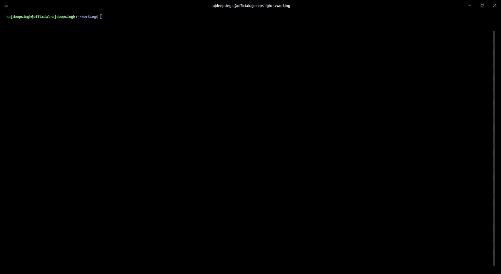
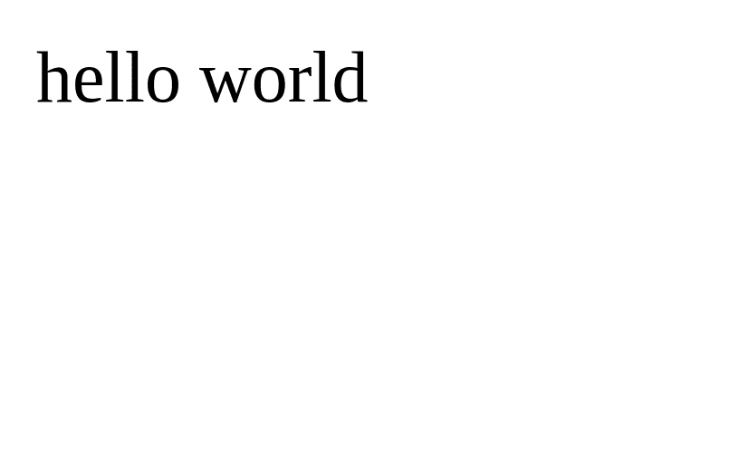
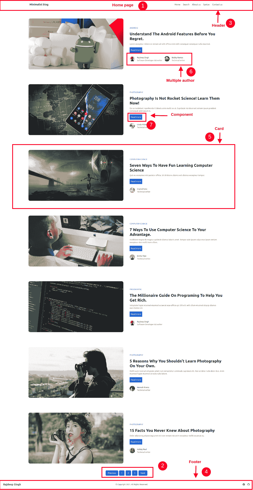
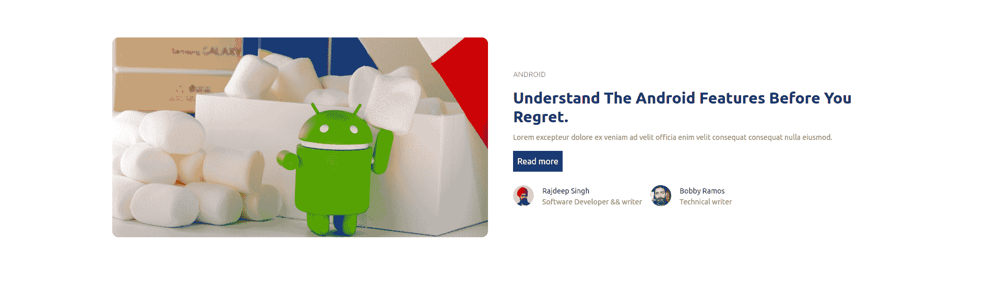
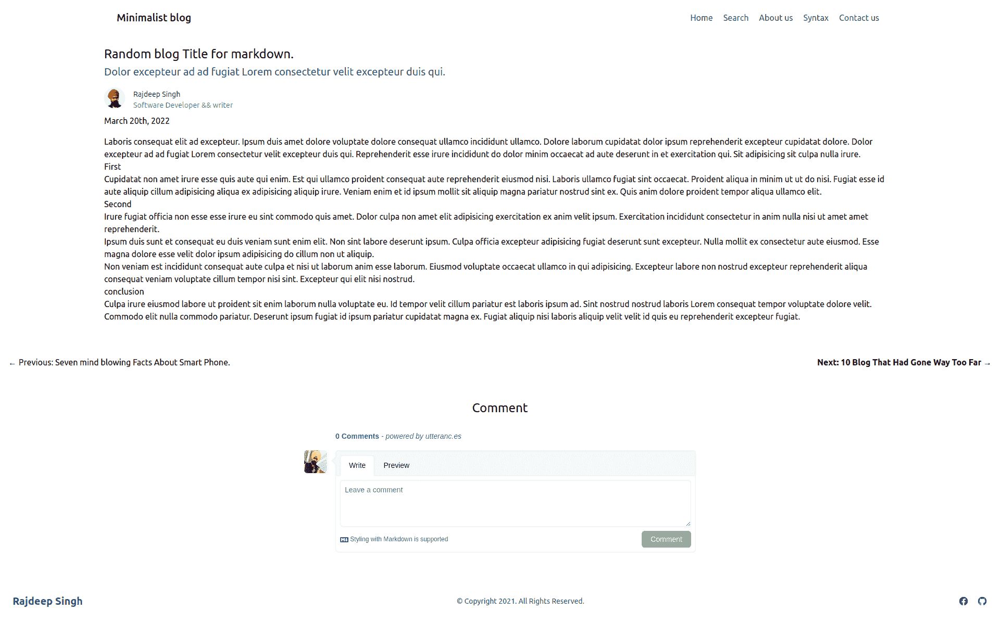
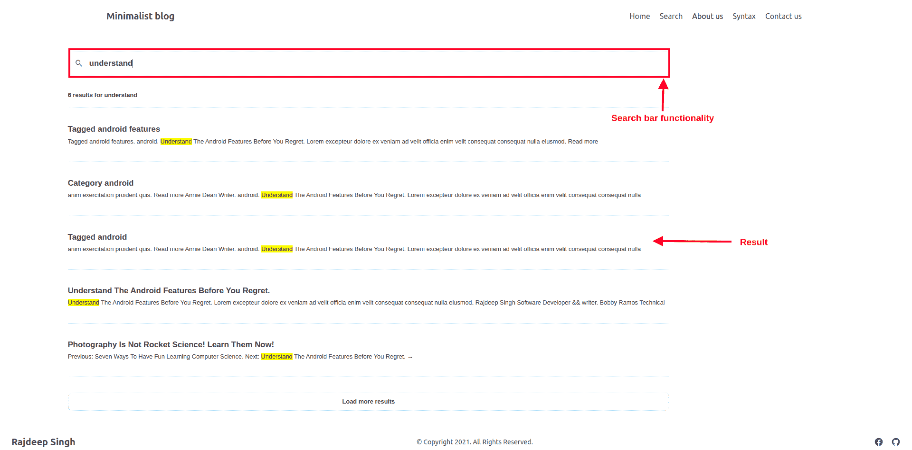
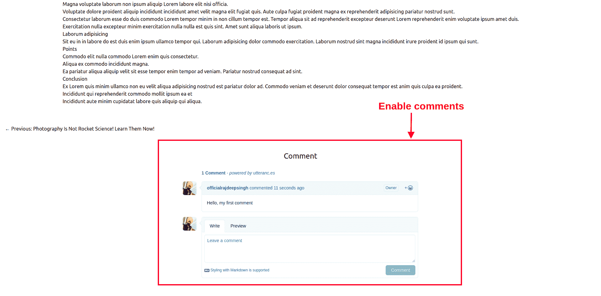

# Lume SSG 手册——如何用 Lume 创建一个静态博客

> 原文：<https://www.freecodecamp.org/news/how-to-create-a-static-blog-with-lume/>

Lume 是一个新的基于 Deno 的静态站点生成器。Deno 是一个基于 JavaScript 的运行时环境，支持 TypeScript。

Lume 不是围绕任何特定语言构建的。默认情况下，它支持 Markdown、Nunjucks、TypeScript 和 JavaScript。Lume 也支持插件。有些插件是默认预装的。这就是为什么 Lume 本身是模板语言不可知的。

在进一步了解 Lume 之前，我们先讨论一下 Deno，并考虑一些重要的 Deno 特性。

## 什么是德诺？

Deno 是 Node.js 的替代品，由 Ryan Dahl(他也开发了 Node)创建。Deno 基于 Rust 编程语言，Deno 中的第二个主要组件是用于 WebAssembly 的 JavaScript V8 引擎。

Deno 有许多很酷的特性——它很快，默认情况下是安全的，与 web assembly 兼容，有 TypeScript 支持，有内置的开发工具，等等。Deno 还支持 Node.js APIs，因此您可以使用 Deno 打包的所有 npm。

在 Deno 中，您不需要创建配置文件来运行简单的程序。您只需使用第二个边缘网络立即部署您的网站。但是我最后最喜欢的功能是工作区中新的`node_modules`文件夹。Deno 在本地缓存所有包并使用它们，与 Node 相比速度非常快。

你可以在这里查看[演示博客网站，](https://minimalist-blog.deno.dev/)和所有的[代码都可以在这里](https://github.com/officialrajdeepsingh/Minimalist-blog)的 GitHub 上找到。

现在让我们深入教程。

## 目录

1.  [Lume +降价](#lume-markdown)
2.  [Lume 为什么特别？](#why-is-lume-special)
3.  Lume 与其他静态站点生成器相比如何？
4.  [如何用 Lume 开始一个新项目](#how-to-start-a-new-project-with-lume)
5.  [Lume 文件夹结构](#lume-folder-structure)
6.  [附加文件夹](#additional-folders)
7.  [如何创建全局数据](#how-to-create-global-data)
8.  [如何创建动态页面](#how-to-create-a-dynamic-page)
9.  [如何创建主页和分页页面](#how-to-create-a-home-and-pagination-page)
10.  [如何建立一个文章页面](#how-to-build-an-articles-page)
11.  [如何生成分类页面](#how-to-generate-a-category-page)
12.  [如何生成标签页](#how-to-generate-a-tag-page)
13.  [如何启用搜索功能](#how-to-enable-search-functionality)
14.  [如何安装页面查找](#how-to-install-page-find)
15.  [Lume SEO](#lume-seo)
16.  [Lume Sitemap](#lume-sitemap)
17.  [Lume 插件](#lume-plugins)
18.  [如何启用评论](#how-to-enable-comments)
19.  [如何通过 Lume 使用 Netlify CMS](#how-to-use-netlify-cms-with-lume)
20.  [如何用 Deno Deploy 部署你的博客](#how-to-deploy-your-blog-with-deno-deploy)
21.  github pages
22.  [结论](#conclusion)

## Lume +降价

Lume 是一个新的基于 Deno 的静态站点生成器，由奥斯卡·奥特罗创建和维护。Lume 使用 **markdown-it** 作为默认降价。您可以使用[备注插件](https://lume.land/plugins/remark/)来更改默认降价。

Markdown 是一种帮助在互联网上编写文档、自述文件和博客的语言。约翰·格鲁伯于 2004 年创立了 markdown。

**Markdown-it** 类似于[GitHub 风味的 Markdown](https://github.github.com/gfm/)【GFM】Markdown。GFM 和 [markdown-it](https://github.com/markdown-it/markdown-it) 都遵循精确的 [markdown 规范](https://commonmark.org/)。

如果你使用过 GitHub 并写过自述文件，这意味着你很可能熟悉 GFM markdown。如果你不喜欢默认的(markdown-it) markdown，你可以用 remark 插件改变 markdown。

有成千上万的静电发生器。那么 Lume 为什么特别呢？与其他静态站点生成器相比，它提供了什么？让我们找出答案。

## Lume 为什么特别？

如你所知，Lume 是建立在 Deno 基础上的，Deno 是 Node.js 的替代品——这就是为什么 Lume 提供了许多开箱即用的功能。

Lume 的工作方式类似于 GitHub 自述文件。如果您熟悉编写其中的一个(并使用 markdown)，那么使用 Lume 编写文章和文档不需要学习任何其他东西。

以下是 Lume 的一些优势:

1.  Lume 支持多种模板引擎，如 Markdown、 [Nunjucks](https://lume.land/plugins/nunjucks/) 、 [Eta](https://lume.land/plugins/eta/) 、 [JSX](https://lume.land/plugins/jsx/) 、 [Liquid](https://lume.land/plugins/liquid/) 或 [Pug](https://lume.land/plugins/pug/) 。
2.  它支持多个作者
3.  它有代码语法突出显示
4.  有很大的搜索引擎优化支持
5.  Lume 支持多种语言
6.  它有 Windi CSS 支持
7.  有分页和组件支持
8.  它支持缩小 JavaScript、HTML、CSS 和 SASS
9.  它有关系支持
10.  有内置的搜索功能
11.  它支持网络 CMS
12.  它支持图像和 SVG
13.  有 Remark.js 插件支持
14.  您可以使用 Netlify、Vercel、GitLab 页面和 GitHub 页面进行部署。

## Lume 与其他静态站点生成器相比如何？

与其他的相比，Lume 是一个新的静态站点生成器，但是它有很多配置选项，你可以用它做任何事情。甚至不需要使用任何第三方插件。

使用 Lume 处理器和预处理器，您可以轻松地使用 JavaScript DOM API 操作 HTML 代码。其他静态站点生成器支持一些模板引擎，但 Lume 支持许多模板引擎，如 JavaScript、JSX、Nunjucks、Eta、JSX、Liquid 和 Pug。

注意，对于初学者来说，Lume 似乎很难上手。但是如果你在关注我的文章，请确保[打开代码](https://github.com/officialrajdeepsingh/Minimalist-blog),这将使事情对你来说更加清晰。

## 如何用 Lume 开始一个新项目

您可以使用 Lume CLI 通过以下命令设置一个新项目:

```
deno run -Ar https://deno.land/x/lume/init.ts
```

Setup the project



Lume installation demo

#### 请遵循以下步骤:

1.  首先，创建一个空的`mkdir lume-deno`文件夹项目。
2.  然后运行 lume `init.ts`命令。
3.  从列表中选择一个可用插件。

你应该已经准备好了。

## Lume 文件夹结构

安装完成后，我们看到了三个文件:

1.  `_config file`用于配置 Lume。
2.  `deno.json`是为 Deno 定义的脚本或任务。
3.  `import_map.json`是帮你导入一个 Deno 包上网。


lume default folder structure 

### 如何运行 Lume 服务器

要运行本地开发服务器，您将使用`deno task lume --serve`命令。要建立一个网站，运行`deno task build`命令。

如果您遇到 404 - not found 错误，您可以在根文件夹中创建一个`index.njk`文件。


在`index.njk`文件中，粘贴以下代码。

```
---
title: "hello"
---
hello world
```

index.njk

您将看到以下输出:



Lume hello-world

### 其他文件夹:

1.  `posts`文件夹不是强制文件夹。它包含了你所有帖子的降价文件。
2.  `pages`文件夹不是强制文件夹。里面有你所有页面的降价文件。
3.  `author`文件夹不是强制文件夹。它有你所有的作者减价文件。
4.  `_components`文件夹是一个**强制的**文件夹。它有你所有的组件。
5.  `_includes`文件夹是一个**强制的**文件夹。它包含了你的站点的布局和模板。
6.  `images`文件夹不是强制文件夹。它包含了你所有的图像。

文章、页面、作者和图像文件夹是可选的。您可以根据自己的意愿重命名这些文件夹。`_components`和`_includes`文件夹是必需的，不能重命名。

组件、布局和模板之间的区别如下:

*   组件是可重用的代码
*   布局和模板不像组件一样可重用。

## 如何创建全局数据

在 Lume 中，您可以创建一个数据变量，它可以通过所有模板引擎访问整个网站。

```
// Set a variable
site.data("post_per_page", 10);

// Set a function
site.data("randomNumber", function () {
  return Math.random();
});
```

#### 如何创建帖子、页面和作者减价文件

您可以在根文件夹中创建文章、页面和作者文件夹。然后，在每个文件夹中，你写下降价文件。

您可以在浏览器上通过文件名访问所有帖子、页面和作者:

1.  `localhost:3000/posts/your-title.html`
2.  `localhost:3000/pages/your-pages.html`
3.  `localhost:3000/author/your-author.html`

假设您需要一个项目或模板的演示帖子、页面和作者减价。然后，你可以为你的项目使用 [demo-markdown 帖子](https://github.com/officialrajdeepsingh/Demo-markdown-posts)。它是免费和开源的，你可以创建自己的模板。

### 如何创建动态页面

在 Lume 中，`.tmpl.js`和`.tmpl.ts`扩展使用 JS 和 TS 作为[模板引擎](https://lume.land/plugins/modules/)。您可以将它们用于常规页面或动态页面，为您的网站创建类别、标签、分页等。

### 如何创建主页和分页页面

首页基于分页，分页基于帖子。Lume 动态生成分页。

在 Lume 中，我选择了 nunjucks 和 JavaScript 来创建我的演示网站。Nunjucks 是默认的模板引擎。您可以通过复制粘贴代码用另一个模板引擎轻松地更改默认的 Nunjucks 引擎。



home page

Lume 提供了 JavaScript 模板功能，帮助创建动态网页。如果您为站点创建了一个主页，您需要在您的根目录或 src 文件夹中创建一个`index.tmpl.js`文件。Lume 还支持 src 文件夹来组织你的项目。在我的演示项目中，我没有使用`src`文件夹。

`*.tmpl.js`是一个 [JavaScript 模板](https://lume.land/plugins/modules/#creating-pages)的扩展，帮助网站创建动态页面。它预装在 Lume 中，带有[模块插件](https://lume.land/plugins/modules/)。

例如，下面的代码为您的网站创建分页。但是布局来自于`_includes`文件夹。

```
// index.tmpl.js

// title for SEO
export const title = "Minimalist blog"
// description for SEO
export const description = "Minimalist blog theme is liteweight and work with lume."

export default function* ({ search, paginate }) {

//  Get all posts of type article.
  const posts = search.pages("type=article", "date=desc");

  // Configation for pagination
  const options = {
    // Page 1 is the homepage, set "/" as url
    url: (n) => n === 1 ? "/" : `/page/${n}/`,
    // par page posts
    size: 7,
  };

  // Yield the pages, but the index needs a different layout
  for (const page of paginate(posts, options)) {

    //  if home page, use diffrent layout "/"
    if (page.pagination.page === 1) {
      page.menu = {visible: true, order: 1, title:"Home" }
      page.title = "Home page"

      //  comes from _includes folder

      page.layout = "layouts/home.njk";
    } else {
      // Render diffrent layout if it is not home page page "/page/2","/page/3",etc
      page.title = "Pagination page"

      page.layout = "layouts/home.njk";
    }

    yield page;
  }

}
```

index.tmpl.js

‌Lume 有一个[搜索插件](https://lume.land/plugins/search/)可以帮助你搜索网页。在我的演示博客中，我根据类型搜索所有页面。

在我的所有帖子文件夹中，所有帖子都在`type=article`中定义，作者在`type=author`中描述，页面在`type=page`中定义。搜索插件预装了 Lume。

在`index.tmpl.js`文件中，您可以使用下面的代码:`const posts = search.pages("type=article", "date=desc");`获得所有类型为“文章”(`type=article`)的页面。`search.pages("type=article", "date=desc")`函数只返回那些有`type=article`的。

布局文件包含一个 HTML 基础，并包括网站的页眉和页脚。

```
<!doctype html>
<html lang="en">
  <head>
    <meta charset="utf-8">
    <meta name="viewport" content="width=device-width, initial-scale=1.0">
    <title>{{ title }}</title>
    <meta name="description" content="{{ description or site.description }}">
   </head>
  <body>

    

    <main class="{{ bodyClass }}">
      {{ content | safe }}
    </main>

    

  </body>
</html>
```

layouts/base.njk

在`{{ content | safe }}`中，Lume 呈现其他 HTML，比如卡片、文章、主页模板、标签和类别页面等等。

```
// rest code ...
  for (const page of paginate(posts, options)) {
  }
// rest code ...
```

for loop index.tmp.js

我在`index.tmp.js`文件上使用了 for 循环，这有助于获取所有的帖子并将它们发送到`layouts/home.njk`文件和`layouts/home.njk`文件。您从结果中获取所有帖子，然后将它们传递给`card.njk`模板。

```
---
layout: layouts/base.njk
---


    

    <h2> Posts is empty </h2>



```

layouts/home.njk

‌The 文件为所有博客运行，并为每个博客生成 HTML。你的卡片看起来像这样:



card.njk

在`card.js`模板中，你可以使用`{{}}`花括号来访问它。使用`{{post.data.title}}`和`{{post.data.description}}`获得标题。

在我的演示博客中，我只获得了卡片中显示的第一个类别。所以我使用一个定义好的过滤器`_config.ts`并和符号`|`一起使用。在`card.njk`中，我们从代码为`{{ post.data.category | category }}`的类别中获得一个零索引或第一个值。

为了在`card.njk`上找到作者，我定义了文章和作者类型之间的[关系](https://lume.land/plugins/relations/)，你可以从文档中了解到这一点。

```
<div class="container px-6 py-10 mx-auto">

    <div class="mt-8 lg:-mx-6 lg:flex lg:items-center">

        

        <div class="mt-6 lg:w-1/2 lg:mt-0 lg:mx-6 ">

            <a class="text-sm text-blue-500 uppercase" href="/category/{{ post.data.category | category }}" >
                {{ post.data.category | category }}
            </a>

            <a href="{{ post.data.url }}" class="block mt-4 text-2xl font-semibold text-gray-800 hover:text-gray-500 dark:text-white md:text-3xl">{{ post.data.title }}</a>

            <p class="mt-3 text-sm text-gray-500 dark:text-gray-300 md:text-sm">
                {{ post.data.description }}
            </p>

            <a href="{{  post.data.url }}" class="inline-block p-2 bg-blue-700 mt-4 text-white hover:bg-blue-500">Read more</a>

            <div class="flex items-center mt-6">

                

                    

                        

                        <div class="mx-4">
                            <a href="{{author.url}}" class="text-sm text-gray-700 dark:text-gray-200">
                                {{ author.author_name}}</a>
                            <p class="text-sm text-gray-500 dark:text-gray-400">
                                {{author.job}}
                            </p>
                        </div>
                    
                

                    

                    <div class="mx-4">
                        <a href="{{ post.data.author.url}}" class="text-sm text-gray-700 dark:text-gray-200">
                            {{ post.data.author.author_name}}</a>
                        <p class="text-sm text-gray-500 dark:text-gray-400">
                            {{post.data.author.job}}
                        </p>
                    </div>
                

            </div>
        </div>
    </div>
</div>
```

templates/card.njk

`{{ title }}`和`{{description}}`都显示降价文件的标题和描述。为了显示类别，我使用了一个过滤器在文章页面上显示单个类别，并在`_config.ts`文件上定义过滤器。我还用 For 循环展示了单个和多个作者。每张卡片都有自己的`post.data.url`属性，在用户点击阅读更多按钮后，用户才尊重文章阅读页面。为了显示图像，我使用了`{{ post.data.image }}`属性。我还展示了在`card.njk`文件上使用 For 循环的单个和多个作者。

## 如何建立一个文章页面

我知道包含文章内容的页面对于一个博客来说是最重要的。这是读者应该花费大部分时间的地方，而不是网站的主页。



```
---
category:
  - Blog
date: 2022-03-20T13:09:24Z
description: Dolor excepteur ad ad fugiat Lorem consectetur velit excepteur duis qui.
image: /images/dice.jpg
tags:
  - npm
  - npm cli
  - npm install command
title: Random blog Title for markdown.
draft: false
author_id: 1
type: article
layout: templates/article.njk
---

Laboris consequat elit ad excepteur. Ipsum duis amet dolore voluptate dolore consequat ullamco incididunt ullamco. Dolore laborum cupidatat dolor ipsum reprehenderit excepteur cupidatat dolore.

## First
Cupidatat non amet irure esse quis aute qui enim. Est qui ullamco proident consequat aute reprehenderit eiusmod nisi. Laboris ullamco fugiat sint occaecat.

## Second 
Irure fugiat officia non esse esse irure eu sint commodo quis amet. Dolor culpa non amet elit adipisicing exercitation ex anim velit ipsum.

## conclusion
Culpa irure eiusmod labore ut proident sit enim laborum nulla voluptate eu. Id tempor velit cillum pariatur est laboris ipsum ad. Sint nostrud nostrud laboris Lorem consequat tempor voluptate dolore velit. Commodo elit nulla commodo pariatur. Deserunt ipsum fugiat id ipsum pariatur cupidatat magna ex. Fugiat aliquip nisi laboris aliquip velit velit id quis eu reprehenderit excepteur fugiat. 
```

posts/*.md

我在`type=article`下的 posts 文件夹中创建了一篇文章。`author_id`定义了作者和文章之间的关系。

我使用`templates/article.njk`作为我的文章页面的布局。你可以根据自己的需求设计。您还可以设计文章标题、描述、作者卡和标签。

```
---
layout: layouts/base.njk
---
<article class="container mx-auto p-2">
  <div class="flex flex-col">

    <h1 class="text-2xl text-black mt-3">{{ title }}</h1>
    <p class="text-xl mt-1 text-gray-600">{{ description }}</p>

    
      <div class="flex flex-row mt-4">

        

          

            

            <div class="mx-4">
              <a href="{{author.url}}" class="text-sm text-gray-700 dark:text-gray-200">
                {{ author.author_name}}</a>
              <p class="text-sm text-gray-500 dark:text-gray-400">
                {{author.job}}
              </p>
            </div>
          

        

          

          <div class="mx-4">
            <a href="{{ author.url}}" class="text-sm text-gray-700 dark:text-gray-200">
              {{ author.author_name}}</a>
            <p class="text-sm text-gray-500 dark:text-gray-400">
              {{ author.job}}
            </p>
          </div>
        

      </div>

    

      <nav class="flex flex-row my-5">
        
          <a href="/tag/{{ tag.trim().toLowerCase().split(' ').join("-") }}/" class=" bg-blue-500 text-black p-2  mx-1">{{ tag }}</a>
        
      </nav>

    <time class="mt-2" datetime="{{ date | date('DATETIME') }}">
      {{ date | date('HUMAN_DATE') }}
    </time>

  </div>

  <div class="mt-4">
    {{ content | safe }}
  </div>
</article>




  <ul class="flex flex-row w-full mt-10 justify-between p-4">
    
      <li class="w-6/12 text-left">
      ← Previous: <a href="{{ previousPost.data.url }}" rel="prev">{{ previousPost.data.title }}</a>
      </li>
    

    
    
      <li class="w-6/12 text-right">
        <strong>Next: <a href="{{ nextPost.data.url }}" rel="next">{{ nextPost.data.title }}</a> →</strong>
      </li>
    
  </ul>


<div class="container p-2 mx-auto mt-6"> 

{# ==== #}
{#  Addding the utteranc Commenting script #}
{# ==== #}

<h1 class="text-center text-2xl my-3"> Comment </h1> 

<script src="https://utteranc.es/client.js"
        repo="officialrajdeepsingh/Minimalist-blog"
        issue-term="pathname"
        theme="github-light"
        crossorigin="anonymous"
        async>
</script>
</div>
```

templates/article.njk

`layouts/base.njk`文件是我们博客的基础文件(我已经解释过了)。`{{ title }}`和`{{description}}`都显示降价文件的标题和描述。

为了在文章页面上显示标签，我使用了 for 循环。我还用 for 循环展示了单个和多个作者。

为了将日期转换成人类可读的格式，我使用了 Lume date 插件，并用日期过滤器对其进行了包装，如下所示:`{{ date | date('HUMAN_DATE') }}`。为了显示所有降价的段落，我使用了`{{ content | safe }}`。

对于分页，我使用了 Lume 分页插件，通过`search.previousPage(url, "type=article")`函数，我在文章页面上显示了下一篇和上一篇文章。对于评论，我用了 [utteranc.es](#how-to-enable-comments) 。

## 如何生成类别页面

在 Lume 中，你可以根据文章类型创建一个动态类别。Lume 还提供了内置的功能，称为 JavaScript 模板引擎，可以帮助您创建动态页面。这类似于创建分页功能。

在 Lume 中，有一个名为`.tmpl.js`的特殊文件可以帮助你创建一个动态类别。

```
export const layout = "layouts/category.njk";

export default function* (props) {

  const { search }= props

  for (const category of search.values("category") ) {

    yield {
      url: `/category/${category}/`,
      title: `Categoryed ${category}`,
      type:"category",
      category,
    };

  }

} 
```

category.tmpl.js

在 lume `search.values()`中有一个功能可以帮助你使用 markdown meta 标签找到一个类别，并将数据发送到`layout/category.njk`文件中。它将生成所有类别与下列网址一样，`/category/android/`，`/category/android-phone/`，`/category/human/`等等。

## 如何生成标签页

生成动态标签页类似于类别。Lume 提供了一个特殊的`search.tags()`函数来生成标签:

```
export const layout = "layouts/tag.njk";

export default function* ({ search }) {

  for (const tag of search.tags()) {
    yield {
      url: `/tag/${tag}/`,
      title: `Tagged ${tag}`,
      type: "tag",
      tag,
    };
  }
}
```

tag.tmpl.js

下面的代码生成所有带有以下 URL 的标签，如`/tag/android/`、`/tag/android-phone/`、`/tag/human/`等等。

## 如何启用搜索功能

Lume 有许多内置插件，提供了出色的开发体验。你可以用 Lume 插件解决很多问题，它们允许你轻松地添加和删除功能。

Lume 为网站提供了内置的搜索功能。您可以使用 lume 页面查找插件来启用它。



Add a search bar in lume

### 如何安装页面查找

Lume page finds 插件为你提供了一个搜索栏。只需复制下面的代码并将其粘贴到`_config.ts`文件中，然后重启您的服务器。

```
import pagefind from "lume/plugins/pagefind.ts";
```

pagefind plugin

#### 如何配置页面查找插件

你在`_config.ts`文件中配置插件。您也可以更改默认配置。

```
// rest of code ...
import lume from "lume/mod.ts";
import pagefind from "lume/plugins/pagefind.ts";

const site = lume();

// config the pagefind plugin with default config
site.use(pagefind());

 // or 

// change the default config in pagefind plugin
site.use(pagefind({
  ui: {
    containerId: "search",
    showImages: false,
    showEmptyFilters: true,
    resetStyles: true,
  },
}));

export default site;
```

_config.ts

## Lume SEO

Lume 有一个名为 metas 的插件来帮助 SEO。有了这个插件，你可以很容易地添加各种 SEO 友好的配置。

### 如何安装 metas

您在`config.ts`文件中安装所有插件。复制下面的代码并粘贴到`config.ts`文件中，然后重启服务器。

```
import metas from "lume/plugins/metas.ts";
```

#### 如何配置 metas

您可以在`_config.ts`文件中以各种方式配置 metas。请看下面的评论:

```
import lume from "lume/mod.ts";

// install metas plugin for SEO
import metas from "lume/plugins/metas.ts";

const site = lume();

// config the metas plugin with default config
site.use(metas());

or

// add custom config 
site.use(metas({
  defaultPageData: {
    title: "title", // Use the `title` value as fallback.
  },
}));

export default site;
```

Config of metas plugin

### 如何在 Lume 中使用 Metas SEO 插件

要使用 SEO metas 插件，您需要在项目文件夹的根目录下创建一个`_data.yml`文件，并将以下代码粘贴到其中:

```
metas:
  site: Minimalist blog
  twitter: "@Official_R_deep"
  icon: /images/icon.png
  lang: en
  generator: true

mergedKeys:
  metas: object
```

下面的代码帮助你为你的网站创建各种各样的 SEO 标签，你可以用 Lume 中的 [metas 插件](https://lume.land/plugins/metas/)轻松扩展它。

### Lume Sitemap

Lume 有一个插件叫做 [sitemap](https://lume.land/plugins/sitemap/) 。这个插件帮助你为你的博客创建站点地图。有了 Lume 13，你不需要手动创建一个网站地图。

#### 如何安装网站地图插件

您在`config.ts`文件中安装所有插件。复制下面的代码并粘贴到`config.ts`文件中，然后重启服务器。

```
import sitemap from "lume/plugins/sitemap.ts"; 
```

sitemap lume plugin

#### 如何配置站点地图插件

您可以在`_config.ts`文件中以各种方式配置站点地图插件。请看下面的评论:

```
import lume from "lume/mod.ts";
import sitemap from "lume/plugins/sitemap.ts";

const site = lume();

site.use(sitemap());

// or

// add custom config 
site.use(sitemap({
  filename: "my-sitemap.xml", // to change the sitemap filename
  query: "indexable=true", // Select only pages with the indexable attribute as true
  sort: "date=desc", // To sort by data in ascendent order
}));

export default site;
```

Config the sitemap plugin in _config.ts

### 如何在 Lume 中使用 sitemap 插件

你不需要任何特殊文件来使用站点地图插件。只需在调用`config.ts`中的插件后添加插件，它就会开始在你的网站上工作。这将创建`sitemap.xml`文件，您可以在`_config.ts`文件中用自定义配置更改文件名。

### 如何访问网站上的网站地图

你可以用文件名访问站点地图，例如默认在本地主机`[http://localhost:3000/sitemap.xml](http://localhost:3000/sitemap.xml)`和生产`[http://my-domain-name/sitemap.xml](http://localhost:3000/sitemap.xml)`中。

## Lume 插件

Lume 自带[内置插件](https://lume.land/plugins/?status=all)，但你可以根据自己的需求轻松添加或删除功能。你不需要网站上的所有东西，你可以随心所欲地配置一切。

您可以添加更多的模板引擎，使用插件缩小 HTML、CSS 和 JavaScript，启用代码高亮显示、日期操作、图像操作、SVG 支持等等。

你也可以用 lume 轻松创建自己的插件。Lume 还提供了优秀的文档资料，您可以从中了解更多信息。

## 如何启用评论

要在你的 Lume 站点上添加评论，我认为 [utteranc.es](https://utteranc.es/) 是所有静态站点生成器的最佳选择。ut tanc . es 是一个基于 GitHub 的开源评论系统。看起来是这样的:



Enable comment 

如果你想在网站上启用评论，第一步是在 GitHub 上安装一个[话语应用程序](https://github.com/apps/utterances)。然后，将下面的代码复制并粘贴到文章阅读文件中，或者您在站点上显示评论的地方。

```
<script src="https://utteranc.es/client.js"
        repo="officialrajdeepsingh/Minimalist-blog"
        issue-term="pathname"
        theme="github-light"
        crossorigin="anonymous"
        async>
</script>
```

接下来，您需要更改话语注释脚本。回购名称的第一个变化是强制性的。其他人不是。您可以根据自己的需求进行调整，例如，更改主题、发行期限等。

要阅读更多关于话语的内容，这里有一篇由乔希·柯林斯沃斯写的很棒的文章。

最好的方法是在 lume 中添加话语评论，然后阅读 [GitHub 讨论](https://github.com/lumeland/lume/discussions/312)。

## 如何在 Lume 上使用 Netlify CMS

Netlify CMS 是一个开源的内容管理系统。您可以使用 [netllify_cms](https://lume.land/plugins/netlify_cms/) 插件轻松集成 Netlify 和 Lume。它是由 Lume 提供的，你只需要安装它并复制/粘贴代码。

### 如何安装 Netlify 插件

将 Netlify 插件导入到您的`_config.ts`文件中，这样使用它:

```
import lume from "lume/mod.ts";
import netlifyCMS from "lume/plugins/netlify_cms.ts";

const site = lume();

site.use(netlifyCMS());

export default site;
```

要配置它，您需要在根级别创建一个`/_data/netlify_cms.yml`文件，然后在重启服务器后粘贴以下代码:

```
backend:
  name: git-gateway
  branch: master

media_folder: statics

collections:
  - label: Posts
    name: posts
    description: List of posts
    folder: posts
    extension: md
    create: true
    fields:
      - label: Title
        name: title
        widget: string
      - label: Content
        name: body
        widget: markdown
```

Netlify 将向您询问 CMS 代理的权限。在终端中键入`npx netlify-cms-proxy-server`，按回车键或`type y`，你的 Netlify CMS 将开始在[http://localhost:3000/admin](http://localhost:3000/admin)URL 上本地运行。现在你的 Lume 博客已经可以部署到 Netlify 上了。

## 如何用 Deno Deploy 部署你的博客

您可以在各种平台上部署 Lume，如 Deno Deploy、GitHub Pages、Gitlab Pages、Netlify、Vercel、Fleek、AWS Amplify 和 Cloudflare Pages。Lume 还提供了关于部署的优秀文档。

在本文中，我将使用 Deno Deploy 部署我的 Lume 博客(我们还将看到如何使用 GitHub 页面)。Deno Deploy 是 Deno 团队构建的一个官方平台，用于部署基于 Deno 的应用程序。

在 Deno Deploy 上部署你的 Lume 博客之前，确保你在根级别创建了一个`server.ts`文件。

```
 import Server from "lume/core/server.ts";

const server = new Server({
  port: 8000,
  root: `${Deno.cwd()}/_site`,
});

server.start();

console.log("Listening on http://localhost:8000"); 
```

Create a server.ts file in the root level

#### 部署步骤:

1.  在 Deno Deploy 上创建一个帐户。
2.  将您的本地代码推送到 GitHub，然后选择`server.ts`文件。Deno Deploy 自动创建一个基于`server.ts`文件的站点。
3.  确保首先创建一个自定义的`server.ts`文件。然后进入下一步。
4.  部署站点最简单的方法是使用 GitHub Actions。在项目根级别创建一个新的`.github/workflows/deno.yml`文件，并将以下代码粘贴到其中:

```
name: Deploy
on: [push]

jobs:
  deploy:
    name: Deploy
    runs-on: ubuntu-latest
    permissions:
      id-token: write # Needed for auth with Deno Deploy
      contents: read # Needed to clone the repository

    steps:
      - name: Clone repository
        uses: actions/checkout@v3

      # TODO: add a build step here

      - name: Upload to Deno Deploy
        uses: denoland/deployctl@v1
        with:
          project: "minimalist-blog"
          entrypoint: "./serve.ts" 
```

Paste the following code deno.yml

## 如何用 Github 页面部署你的博客

GitHub 页面是免费的静态站点，您可以使用它来托管页面。你也可以部署你的 Lume 博客吧。部署的过程非常简单。

要在 GitHub 页面上部署 Lume，您需要设置 GitHub 操作。

#### 部署步骤

1.  如果你有一个 GitHub 库，那么你就可以把你的本地网站转换成 GitHub 页面，这是最好的。
2.  创建一个新的 repo，并将所有本地代码放入其中。
3.  在您的项目根级别中创建一个新的`.github/workflows/deno.yml`，然后将以下代码粘贴到其中，并将其推送到 GitHub repo 中。GitHub 动作基于`github.yml`动作运行，并生成一个 GitHub 页面。

```
name: Publish on GitHub Pages

on:
  push:
    branches: [ main ]

jobs:
  build:
    runs-on: ubuntu-latest

    steps:
      - name: Clone repository
        uses: actions/checkout@v3

      - name: Setup Deno environment
        uses: denoland/setup-deno@v1
        with:
          deno-version: v1.x

      - name: Build site
        run: deno task build

      - name: Deploy
        uses: crazy-max/ghaction-github-pages@v3
        with:
          build_dir: _site
        env:
          GITHUB_TOKEN: ${{ secrets.MY_GITHUB_TOKEN_PAGE }}
```

`github.yml`

您需要一个 GitHub 令牌来将您的 Lume 网站部署到 GitHub 页面。这是设置的必要部分。我找到了 Davide 写的一篇很棒的文章，可以帮助你了解更多关于 GitHub 动作以及如何创建一个 GitHub 动作。

GitHub Actions 需要两三分钟来完成在 GitHub 页面上托管您的网站。

查看 [GitHub 仓库](https://github.com/officialrajdeepsingh/minimalist-blog-github-page)以了解如何为 GitHub 页面配置 GitHub 工作流。你也可以在 GitHub 页面上看到一个现场演示[网站。](https://officialrajdeepsingh.github.io/minimalist-blog-github-page/)

快速提示:如果您在 GitHub 页面上部署 Lume 站点，而您的图像没有显示在网站上，这可能有两个原因:

1.  如果所有的图像名称不是小写的，您可能会得到一个错误。要解决这个错误，用这个命令把你的图片名转换成小写:`your.github.com/your-reponame/images/my-image.png`
2.  如果你在项目中使用了`base_path`和`relative_urls` Lume 插件，而`relative_urls`是多余的，那么你需要移除项目中的`relative_urls`插件。您的图像现在应该工作正常。

## 结论

Lume 是一个简单易学、功能丰富的静态站点生成器。你可以用它做任何你想做的事情。Lume 在代码方面给了你很大的自由。

Lume 社区没有 Hugo、11ty、Jekyll 和其他工具的社区大。但是，Lume 的维护者会积极回复每个在 GitHub 讨论中发表评论的人。如果没有一个强大的社区，这个工具应该能够产生强大的影响。

Lume 的一个挑战是它对初学者来说很难上手，更适合中级和高级开发人员。如果你是一个使用 Lume 的初学者，你可能会因为缺乏关于静态站点生成器如何工作的背景知识而苦恼。

正因为如此，对 Nuckjunks、JSX 和其他基于 markdown 的模板引擎有一点点了解是很有帮助的。一旦你获得了这种经验，你就可以很容易地使用 Lume 来设计你的基于 markdown 的博客。

我推荐使用 lume MDX 插件进行降价。您可以在 markdown 文件中使用基于 JSX 的组件，并且可以创建漂亮的代码块、提示块等等。

我强烈鼓励所有开发者尝试 Lume out。如果你对 Lume 有问题，你可以在 GitHub 讨论区和 T2 不和谐服务器上联系它的创建者。

如果你的课程是关于计算机科学、生物信息学和生物技术的。你可以加入我的免费[简讯](https://www.getrevue.co/profile/officialrajdeepsingh)。