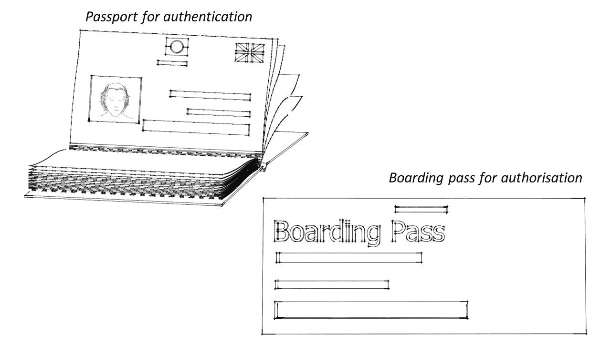
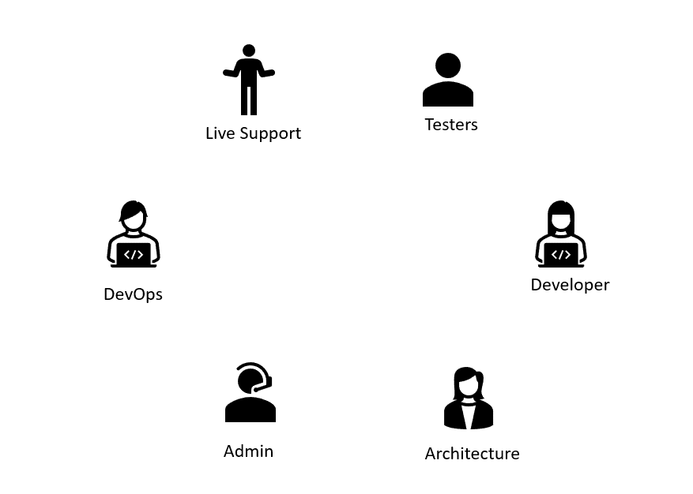
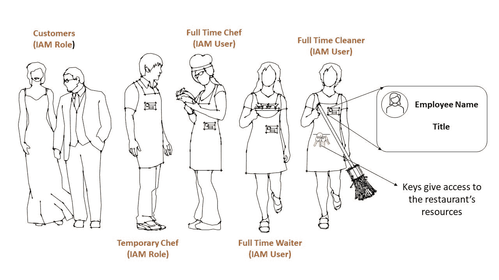
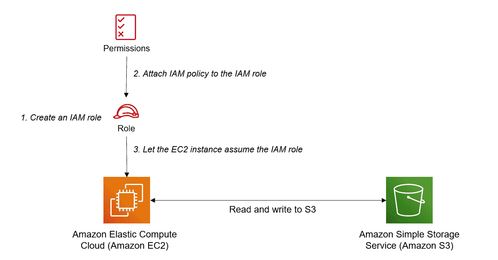

# AWS 身份和访问管理(IAM)——用类比解释

> 原文：<https://www.freecodecamp.org/news/aws-iam-explained/>

AWS IAM(身份和访问管理)让您可以根据一些预定义的**权限**来控制**谁**可以访问您的 AWS 服务和资源。

这里的两个关键词是“谁”和“权限”。“谁”是指一个特定的身份，可以是一个**用户**、**组**或**角色**。“权限”指的是附加到身份的**策略**。这些权限允许或拒绝对资源的访问。

IAM 是 AWS 认证和授权身份的方式。然而，认证不同于授权。认证与“**谁**有关，而授权与“**权限**有关。

## 身份验证和授权的区别

身份验证是指身份证明其身份。另一方面，授权证明你有访问资源的权限。

为了充分理解这种差异，请考虑下面的类比。为了登机，你需要经过身份验证和授权。身份验证是用你的护照或身份证来完成的，护照或身份证会被检查以确保护照上的照片与你的脸相匹配。这证明了你就是你所说的那个人。

通过身份验证后，您需要证明您拥有乘坐特定航班的权限。这是你的登机牌。

在您登机之前，需要进行身份验证和授权。类似地，在访问 AWS 资源之前，两者都需要执行。

你可以[在这里](https://www.freecodecamp.org/news/whats-the-difference-between-authentication-and-authorisation/)阅读更多关于授权与认证的信息。



Authentication & authorisation are not the same

IAM 用户、组和角色关心身份验证，也就是说，证明您就是您所说的那个人。它们就像护照，让你通过机场的安检。

然而，如果没有登机牌，你就不能登机。IAM 策略就像一张登机牌，它允许或拒绝对特定资源的访问。

## 什么是 IAM 用户？

这是任何需要长期访问 AWS 资源的身份(人或应用程序)。在允许与 AWS 资源进行任何交互之前，这些实体向 IAM 发出请求以获得身份验证。

对于通过控制台访问 AWS 的用户，使用用户名/密码组合进行身份验证；对于通过命令行界面访问 AWS 的应用程序或用户，使用访问密钥进行身份验证。

## 什么是 IAM 组？

IAM 用户可以放在一个 IAM 组中。IAM 组使组织大量 IAM 用户和在组级别而不是个人级别应用权限变得更加容易。这是因为后者不适合大量用户。

想象一下，你有一个由开发人员、架构师、管理人员、DevOps 工程师、现场支持和测试人员组成的团队。这些团队每个团队 10 人，总共 60 人。

您可以将 IAM 用户放入各自的组中，并在组级别上应用权限，而不是分别为 60 个人设置权限策略。这使得组织权限变得更容易，也更容易随着团队的成长而扩展。



IAM groups can be created for separate teams

IAM 组没有登录凭据。此外，一个用户可以属于多个组，例如，DevOps 组中的 IAM 用户也可以属于 live support 组。这清楚地反映了现实世界，在现实世界中，DevOps 工程师也可以获得实时支持。

## 什么是 IAM 角色？

IAM 角色用于向多个身份授予**临时访问权**。这些身份可能是访问您的服务的 AWS 外部的人、IAM 用户或应用程序。

这些身份临时承担该角色，任何附加到该角色的权限策略都通过代理应用到承担该角色的身份。

IAM 角色很重要，因为 AWS 对 IAM 用户的数量有硬性限制([目前为 5000](https://docs.aws.amazon.com/IAM/latest/UserGuide/reference_iam-quotas.html) )。

### 信任策略与权限策略

附加到角色的 IAM 策略有两种类型——信任策略和许可策略。

信任策略控制哪些身份(例如 IAM 用户、AWS 资源(如 EC2 实例)、匿名实体)可以承担该角色。一旦某个身份承担了某个角色，AWS 就会向其颁发[临时安全证书](https://docs.aws.amazon.com/IAM/latest/UserGuide/id_credentials_temp.html)。

您可以将信任策略视为 AWS 如何对 IAM 角色进行身份验证，以确保只有被允许承担该角色的身份才能承担该角色——也就是说，某个身份已经证明了它是它所声称的那个人。

但是有一个问题。对于信任策略，这种身份验证只在一段时间内有效。过了这段时间后，身份需要重新认证并获取新的临时安全凭证。

权限策略相对简单:它定义了角色拥有的权限，通过代理，它定义了承担该角色的身份将拥有的权限。

IAM 角色是一个相对难以理解的概念，所以如果你还不太理解，请继续阅读，它会变得更加清晰。

## IAM 策略如何工作

IAM 策略附加到身份，因此也附加到用户、组或角色。IAM 策略也可以附加到一些 AWS 资源。这些类型的策略称为[基于资源的策略](https://docs.aws.amazon.com/IAM/latest/UserGuide/access_policies_identity-vs-resource.html)。

IAM 策略是 JSON 文档，由一个或多个允许或拒绝访问 AWS 资源的语句组成。

下面的 IAM 策略显示了如何向身份授予从 S3 存储桶读取和写入的权限。

```
{
    "Version": "2012-10-17",
    "Statement": [
        {
            "Sid": "ListObjectsInBucket",
            "Effect": "Allow",
            "Action": ["s3:ListBucket"],
            "Resource": ["arn:aws:s3:::bucket-name"]
        },
        {
            "Sid": "AllObjectActions",
            "Effect": "Allow",
            "Action": "s3:*Object",
            "Resource": ["arn:aws:s3:::bucket-name/*"]
        }
    ]
}
```

An IAM policy that grants read & write access to an S3 bucket

*   `Sid`代表语句 ID，这是一个可选字段，可让读者快速识别语句的功能。
*   `Effect`可以是允许也可以是拒绝
*   `Action`指你试图执行什么动作。格式为**服务:操作**。
*   `Resource`指的是你正在与之交互的资源。通常你会使用 [ARN](https://docs.aws.amazon.com/general/latest/gr/aws-arns-and-namespaces.html) (亚马逊资源名)，它唯一地标识 AWS 资源。

默认情况下，所有请求都被隐式拒绝，除非策略显式地具有“allow ”,如上例所示。

这个最小特权原则确保一个身份不能使用一个资源，除非他们被明确授予这样做的权限。

## 将所有这些整合在一起——我是如何工作的

考虑一家披萨店。它会有一些全职员工，比如厨师、服务员和清洁工。它也可能有一些兼职厨师在晚上和周末需求高峰期帮忙。如果这家餐馆有什么好的，它也会有可以在里面吃和带走的顾客。


IAM restaurant analogy

用 AWS IAM 打个比方，全职员工就像 IAM 用户。如上所示，他们需要长期访问餐厅的资源。这些用户将属于不同的组——服务员、厨师和清洁工组(也就是说，例如，所有服务员都有相同的职称“服务员”)。



IAM restaurant analogy

餐厅的员工是如何认证的？我们怎么知道他们就是他们所说的那个人？有照片的名牌就可以了。这也可以显示他们的标题，类似于他们所属的 IAM 组。

定义餐厅员工可以访问哪些资源的权限策略应用于组级别，因为每个服务员、厨师和清洁工都有相同的权限。这在现实中可能不是真的，因为例如厨师长可能有特权访问。但是为了简单起见，让我们假设它是真实的。

餐厅经理如何控制谁可以访问哪些资源？带锁的门就可以了。钥匙就像一项政策，因为它们控制着对餐厅某些部分的访问。

将向所有服务员发放一套相同的设备，因为服务员需要同等级别的通道进入食品/饮料储藏室、厨房和座位区。

同样的逻辑也适用于其他全职员工，他们会得到一套合适的钥匙，这样他们就可以根据需要使用餐厅的资源。

将钥匙交给餐馆员工类似于将策略附加到 IAM 用户或组。没有钥匙，员工无法进入餐厅的部分区域。

类似地，在 AWS 中，如果没有明确允许操作的策略，就不能向 AWS 资源发出请求。当试图访问资源时，AWS 和我们的餐馆模拟中的默认状态都是隐式拒绝。

兼职员工(例如临时厨师)和客户不需要长期访问资源，但需要短期访问，类似于 IAM 角色。

兼职员工只能在很短的时间内工作，比如周末的晚上。在这个时间之外，他们没有使用餐厅资源的权限。

这个兼职厨师不一定是同一个人。每周可能会有不同的人，不像全职员工有特定的身份。

因此，兼职厨师将**承担**厨师的角色，并获得**临时**徽章，在他们轮班期间一直保留。这类似于一个实体承担一个附加了策略的 IAM 角色，并获得一个临时安全凭证，该凭证将在一段时间后过期。

同样，这里的策略是授予餐馆部分权限的一组密钥，而临时安全凭证是用于验证厨师身份的临时徽章。

类似地，客户类似于 IAM 角色有两个原因。首先，他们只需要暂时进入餐厅。其次，也许更重要的是，一家成功的餐厅在其一生中将拥有数万至数十万的独特顾客。

拥有大量未标识的实体是 IAM 角色的完美用例。回想一下，对于 AWS，您可以拥有的 IAM 用户数量有一个 5000 的硬性限制。如果在某个用例中，所需的 IAM 用户数将超过这个 5000 的限制，那么使用 IAM 角色是唯一的选择。

就像如何假设 IAM 角色一样，客户首先需要订购一些东西来证明他们是客户，并且可以假设客户的角色。

承担客户角色后，附加到客户角色的权限策略也将应用到客户。顾客有权只使用一些资源，如座位区和厕所。

为了保持类比的真实性，进入厕所是通过输入每天都在变化的密码来控制的，因此确保了进入是暂时的。这个密码类似于附加到客户角色的策略，授予临时进入厕所的权限。


## IAM 角色的使用案例示例

考虑下面这个非常简单的架构:一个 EC2 实例运行一个需要完全访问 S3 桶的应用程序。

如何授予 EC2 实例从 S3 桶中读写对象的权限？下图对此进行了解释:



Attaching a policy to an IAM role and letting an EC2 instance assume that role

1.  为 EC2 实例创建一个 IAM 角色
2.  将 IAM 策略附加到授予 S3 时段完全访问权限的角色
3.  让 EC2 实例承担这个角色

步骤 2 中提到的完全 S3 访问的 IAM 策略是:

```
{
    "Version": "2012-10-17",
    "Statement": [
        {
            "Effect": "Allow",
            "Action": [
                "s3:*",
                "s3-object-lambda:*"
            ],
            "Resource": "*"
        }
    ]
}
```

现在，您可以读取和写入 S3 存储桶。请注意，在上面的策略中，它没有指定任何 ARN，只是为资源指定了“*”。这意味着所有 S3 水桶。如果这是你想要的，那么这个政策是好的。但是如果你想指定一个单独的桶，那么你需要给这个桶指定 ARN。

## 包扎

了解 IAM 以及用户、角色、组之间的差异和策略的工作方式，为您设计和构建安全的 AWS 解决方案打下坚实的基础。

感谢您的阅读！