# 如何用 VitePress 建立一个现代文档网站

> 原文：<https://www.freecodecamp.org/news/how-to-build-a-modern-documentation-site-with-vitepress/>

文档是软件开发的一个重要方面。但是开发人员经常忽略它，因为维护起来很麻烦。这就是为什么使用有助于简化这一过程的工具很重要。

在本教程中，您将学习如何利用一个叫做 VitePress 的现代工具快速构建一个完整的 docs 站点。

## 什么是 VitePress？

VitePress 是一个简单而高效的静态站点生成器，建立在 T2 Vite T3 的基础上，可以让你在几分钟内创建文档。它由 V [uejs](https://vuejs.org/) 和 Vite 提供动力，内置可定制组件。

VitePress 支持一些流行的文档网站，如 Vuejs、V [itest](https://vitest.dev/) 、 [faker.js](https://faker.js/dev) 和 Vite 本身。

## 先决条件

要学习本教程，您需要对以下内容有一个基本的了解:

*   [降价](https://daringfireball.net/projects/markdown/)语法
*   对 NPM 和维特的基本了解

下面是本教程结束时您将构建的内容的屏幕截图:


想玩玩吗？查看[现场演示](http://adocs.vercel.app/)。此外，这方面的源代码可以在 [GitHub](https://github.com/Evavic44/adocs) 上找到。

## 步骤 1:创建新项目

如果您已经创建了一个文件夹，您可以跳过这一步，继续下一步。如果没有，请使用以下命令创建一个项目文件夹，并移入该文件夹。

```
mkdir project-name
cd project-name 
```

接下来，您需要用首选的包管理器初始化项目。在本指南的其余部分，我将使用 NPM。

```
npm init
// or use this command if you want to skip all the questions
npm init -y 
```

如果您使用的是第一个命令，系统会提示您一些问题，所以只需适当地完成它们。

成功操作后，您的根目录中应该有一个`package.json`文件。这是安装 VitePress dev 依赖项的地方。

## 步骤 2:安装 VitePress

下一步是将 VitePress 和 Vue 作为开发依赖项添加到项目中，如下所示:

```
npm install --dev vitepress vue
```

您已经成功安装了 VitePress 和 Vue，并将它们添加为开发依赖项。现在你可以开始创建你各自的文档文件了。

但在此之前，我认为有必要解释一下 VitePress 是如何工作的。

## VitePress Vork 如何？

VitePress 使用 Markdown `.md`文件作为其标记，自动转换成静态 HTML。在 other 中，在根目录中创建一个名为`docs`的特殊文件夹。

该文件夹的行为类似于 NextJS 中的`pages`文件夹，在该目录中创建的任何`.js`文件都被自动视为网页。在这种情况下，名为`index.md`的文件将被视为`index.html`，并作为 docs 模板的根。

现在您已经了解了它是如何工作的，您可以创建各自的 doc 文件了。

## 步骤 3:创建各自的 Doc 文件

可以手动创建 docs 文件夹和`index.md`文件，也可以像黑客一样用终端完成。

```
mkdir docs && echo '# Hello VitePress' > docs/index.md
```

这个命令只是创建一个名为`docs`的文件夹，并添加一个包含“Hello World”的`h1`元素的`index.md`文件。

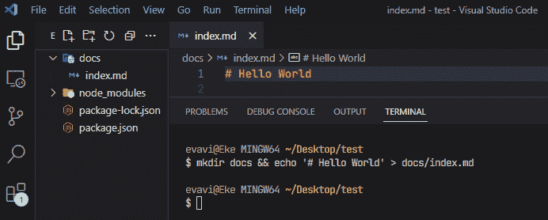

这样，您就可以启动您的开发环境，看看到目前为止已经创建了什么。

## 步骤 4:启动您的开发环境

为了在本地运行您的文档，您需要在`package.json`文件中添加以下脚本。简单地复制下面的代码并用它替换`"script"`对象:

```
// package.json
"scripts": {
    "docs:dev": "vitepress dev docs",
    "docs:build": "vitepress build docs",
    "docs:serve": "vitepress serve docs"
  },
```

最后，可以通过运行以下命令在本地服务器上提供文档站点:

```
npm run docs:dev 
```

这将在`http://localhost:5173`启动一个热重装开发服务器，您可以访问它来查看您的 docs 站点。

以下是输出结果:

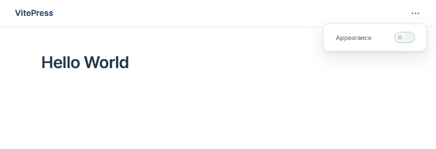

您所要做的就是添加标记，VitePress 从其模板引擎处理外观。在下一节课中，您将了解如何定制文档以满足您的需求。

## 如何使用 VitePress 定制您的文档

首先在前面创建的 docs 目录中创建一个`.vitepress`文件夹。这是所有 VitePress 特定文件的存放位置。

在这个新目录中，您需要一个`config.js`文件。同样，您可以像这样使用终端命令:

```
mkdir .vitepress && touch .vitepress/config.js
```

要测试这个配置文件，您可以从更改 docs 站点的元标题和描述开始。复制该标记并粘贴到`config.js`文件中:

```
// .vitepress/config.js
export default {
  title: 'Adocs',
  description: 'An awesome docs template built by me'
}
```

如果您检查开发工具，您应该在元标题和描述中看到变化。

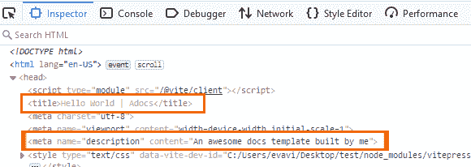

### 如何更新标题和徽标

为了更改徽标标题并添加图像，复制下面的标记并将其粘贴到同一个`config.js`文件中一个名为`themeConfig`的新对象中。这将覆盖当前标题并向您的文档网站添加一个徽标。

```
// config.js
export default {
  themeConfig: {
    logo: "/logo.svg",
    siteTitle: "Adocs",
  },
}; 
```

对于图像源，可以传入图像 URL 或指定本地图像的路径。要在本地完成，请确保将图像放在`public`目录中。

以下是输出结果:

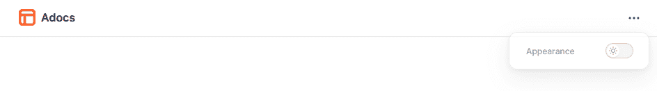

请注意，公共目录中的文件位于根路径。所以不要../public/logo.svg，用/logo.svg 就行了。

### 如何自定义导航栏

定制`Navbar`也是一个非常简单的过程。在您的`themeConfig`文件中，粘贴下面的标记。这里我们有一个包含两个属性的对象:锚文本`text`，路径`link`定义了 URL 路径。

```
// .vitepress/config.js
{  
  // ...
   nav: [
    { text: "About", link: "/about" },
    { text: "Contact", link: "/contact" },
    { text: "Guide", link: "/guide" },
    { text: "Configs", link: "/configs" },
    { text: "Changelog", link: "https://github.com/..." },
  ],
  // ...     
}
```

基本上导航到 [localhost:5173/about](http://localhost:5173/about) 应该会把你带到一个 about 页面(虽然我们还没有创建这个页面)。

以下是输出结果:

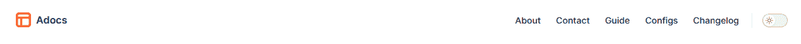

导航链接也可以是下拉菜单。要添加一个，只需用包含一个链接数组的 items 对象替换任何一个`links`属性。

```
// .vitepress/config.js
{
  text: "Changelog",
  items: [
   { text: "v0.0.1", link: "/item-1" },
   { text: "v0.0.2", link: "/item-2" },
   { text: "v0.0.3", link: "/item-3" },
  ],
}, 
```

现在，changelog 将变成一个下拉菜单，里面有您传递的各个链接。

以下是输出结果:

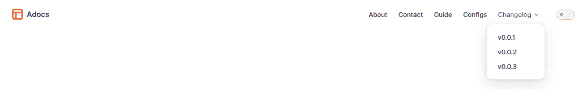

### 如何添加社交图标

导航菜单通常有社交图标，访问者可以用它来访问你的社交平台。要添加它们，在`themeConfig`中定义一个名为`socialLinks`的新对象，并简单地传入社交图标和您希望它导航到的链接。

```
// .vitepress/config.js
socialLinks: [
  { icon: "github", link: "https://github.com/Evavic44/adocs" },
  { icon: "twitter", link: "https://twitter.com/victorekea" },
  { icon: "discord", link: "..." },
] 
```

默认情况下，只提供了 8 个图标(Discord、脸书、GitHub、Instagram、LinkedIn、Slack、Twitter 和 YouTube)。如果要添加自定义图标，请使用 svg 属性来定义 SVG 图像。你可以从 icones.js.org 那里得到免费的图标。

例如，这里有一个`apple`图标的片段。

```
{
  icon: {
    svg: '<svg role="img" width="26.01" height="32" viewBox="0 0 256 315"><path d="M213.803 167.03c.442 47.58 41.74 63.413 42.197 63.615c-.35 1.116-6.599 22.563-21.757 44.716c-13.104 19.153-26.705 38.235-48.13 38.63c-21.05.388-27.82-12.483-51.888-12.483c-24.061 0-31.582 12.088-51.51 12.871c-20.68.783-36.428-20.71-49.64-39.793c-27-39.033-47.633-110.3-19.928-158.406c13.763-23.89 38.36-39.017 65.056-39.405c20.307-.387 39.475 13.662 51.889 13.662c12.406 0 35.699-16.895 60.186-14.414c10.25.427 39.026 4.14 57.503 31.186c-1.49.923-34.335 20.044-33.978 59.822M174.24 50.199c10.98-13.29 18.369-31.79 16.353-50.199c-15.826.636-34.962 10.546-46.314 23.828c-10.173 11.763-19.082 30.589-16.678 48.633c17.64 1.365 35.66-8.964 46.64-22.262"/></svg>',
    },
  link: "https://www.apple.com/",
},
```

对于自定义 SVG 图标，确保将`role="img"`属性添加到`svg`标签，因为这允许字符串正确地转换它。

以下是输出结果:


### 如何添加边栏

VitePress 还带有内置组件，如侧边栏菜单。要添加侧边栏，创建一个名为`sidebar`的对象，并在其中添加接受三个值的嵌套对象:嵌套标题、可折叠功能(默认设置为 true)和嵌套链接。

```
// .vitepress/config.js
sidebar: [
    {
      text: "Section A",
      collapsible: true,
      items: [
        { text: "Introduction", link: "/introduction" },
        { text: "Getting Started", link: "/getting-started" },
      ],
    },
    {
      text: "Section B",
      collapsible: false,
      items: [
        { text: "Introduction", link: "/introduction" },
        { text: "Getting Started", link: "/getting-started" },
      ],
    },
    {
      text: "Section C",
      collapsible: true,
      items: [
        { text: "Introduction", link: "/introduction" },
        { text: "Getting Started", link: "/getting-started" },
      ],
    },
  ], 
```

通过将`collapsible: "true"`添加到侧边栏对象，它显示一个切换按钮来隐藏/显示每个部分。您可以根据需要创建任意多个部分。

以下是输出结果:

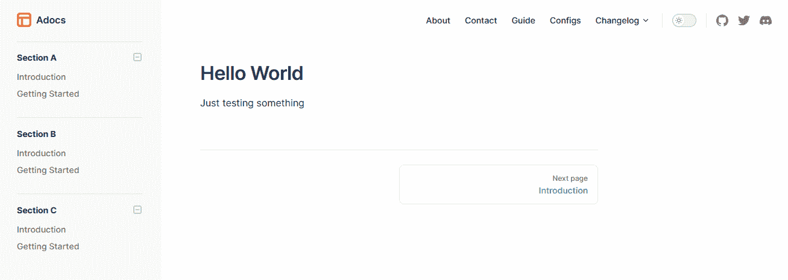

您可以看到 B 部分是不可折叠的，我们在页面底部有一个漂亮的下一页按钮。

### 如何设置页面传送

如前所述，VitePress 自动将 docs 目录根目录下的每个`.md`文件转换成可以在地址栏中访问的静态 HTML。比如`index.md`转换成`index.html`，还有`about.md`、`about.html`等等。

因为您已经创建了导航链接并将其指向各自的 URL，所以您可以通过创建它们来轻松访问这些页面。

```
docs/
├── .vitepress/
│   └── config.js
├── public/
│   └── logo.svg
├── about.md
├── contact.md
├── guide.md
├── configs.md
└── get-started.md
```

在 docs 文件夹中创建这些文件，并在其中添加一个简单的标记，看看它是如何工作的。这个页面是基本的 markdown，所以你所有的 markdown 语法，比如链接、代码块、标题等等，都可以在这里使用。

出于测试目的，复制这个降价内容，并将其粘贴到您刚刚创建的任何`.md`文件中:

```
# About

Welcome to the about page.

This markdown supports html elements like the `p` tag coupled with inline styles

<p style="color: #ff7340; border: 1px solid rgba(255, 135, 23, 0.25); border-radius:5px; padding: 1rem;">Lorem Ipsum is simply dummy text of the printing and typesetting industry. Lorem Ipsum has been the industry's standard dummy text ever since the 1500s.</p>

Even satire code snippets with syntax highlighting are also supported. 😅

```js
const lang = prompt("What is your favorite programming language?");

(lang === "JavaScript") | (lang === "javascript") | (lang === "js")
  ? alert("JavaScript to the world! 🚀🟡")
  : alert(`We don't permit such languages here 💩`);
```

Of course, images are not left out.


```

以下是输出结果:

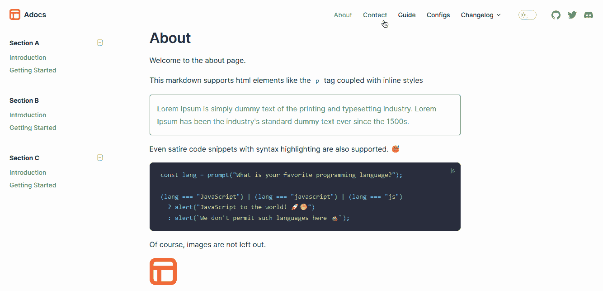

太好了！您已经设置了文档，添加了具有下拉功能的导航菜单，添加了侧边栏，并定制了导航到不同页面的链接。接下来，让我们在主页上工作。

## 如何定制主页

就像其他组件一样，VitePress 为我们提供了构建主页的标记。我把它分成了三个部分:英雄、特性和页脚部分。

### 英雄区

首先，我们将从英雄部分开始。用以下标记替换`index.md`页面中的 Hello World 文本:

```
# docs/index.md
---
layout: home

hero:
  name: Adocs
  text: Static docs template built with VitePress.
  image:
    src: /logo-big.svg
    alt: Adocs logo
  tagline: A free to use template for creating docs for your projects
  actions:
    - theme: brand
      text: Get Started
      link: /get-started
    - theme: alt
      text: View on GitHub
      link: https://github.com/evavic44/adocs-template
--- 
```

### 特写部分

此外，您可以在英雄部分之后添加功能部分。只需将下面的代码粘贴到 hero 对象下:

```
# /docs/index.md
---
link: https://github.com/evavic44/adocs-template

features:
  - icon: ⚡️
    title: Adocs, The DX that can't be beat
    details: Lorem ipsum...
  - icon: 🎉
    title: Power of Vue meets Markdown
    details: Lorem ipsum...
  - icon: 🔥
    title: Simple and minimal, always
    details: Lorem ipsum...
  - icon: 🎀
    title: Stylish and cool
    details: Lorem ipsum...
--- 
```

以下是输出结果:

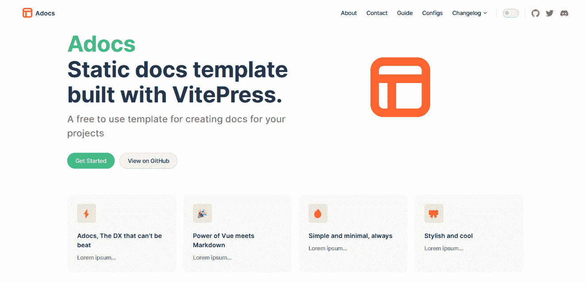

### 页脚部分

您可以在页面底部添加页脚消息，但这只会显示在主页上。

根据 [*VitePress* 文档](https://vitepress.vuejs.org/guide/theme-footer#footer):

> 请注意，当侧边栏可见时，页脚不会显示。

要添加页脚组件，请转到`config.js`文件并将标记粘贴到`themeConfig`对象中:

```
// .vitepress/config.js
 footer: {
   message: "Released under the MIT License.",
   copyright: "Copyright © 2022-present Adocs",
 },
```

以下是输出结果:


除了标记之外，您还可以使用自定义 CSS 来定制组件，以更改字体系列、颜色、布局等。

## 如何添加自定义 CSS

默认主题`CSS`是通过覆盖根级 CSS 变量定制的。如果你愿意，你可以查看可定制的 CSS 变量的完整列表。

首先，创建一个`.vitepress/theme`目录，在这个主题文件夹中，添加一个`index.js`和`custom.css`文件。如果您一直在跟进，您可以使用下面的终端命令来快速完成这项工作:

```
mkdir docs/.vitepress/theme && touch docs/.vitepress/theme/index.js && touch docs/.vitepress/theme/custom.css
```

如果您在使用终端命令时遇到任何问题，只需手动创建文件，然后继续下一步。

以下是文件夹结构的概述:

```
docs/
├── .vitepress/
│   ├── config.js
│   └── theme/
│       ├── index.js
│       └── custom.css
├── public/
│   └── logo.svg
├── about.md
├── contact.md
├── guide.md
├── configs.md
└── get-started.md
```

创建这些文件后，在`.vitepress/theme/index.js`文件中粘贴导入命令:

```
// .vitepress/theme/index.js
import DefaultTheme from "vitepress/theme";
import "./custom.css";

export default DefaultTheme; 
```

### 颜色主题

颜色由 CSS 变量控制。你可以简单地用你想要的颜色替换它们。

请注意，这种颜色提供了亮暗两种模式。因此，请确保相应地更改它们。

下面是我自定义颜色的一个例子:

```
/* .vitepress/theme/custom.css */

:root {
  --vp-c-brand: rgb(255, 115, 64);
  --vp-c-brand-light: rgb(255, 87, 25);
  --vp-c-brand-lighter: rgb(255, 115, 64);
  --vp-c-brand-dark: #FF622D;
  --vp-c-brand-darker: rgb(226, 60, 0);

  --vp-c-sponsor: #fd1d7c;
} 
```

如果您没有立即看到效果，请尝试停止服务器并再次启动它。

除了颜色主题，您还可以覆盖其他内容，如字体系列、版式、布局、断点等等。

### 如何使用自定义字体

您可以在 CSS 文件中导入 [Google 字体](https://fonts.google.com/)来覆盖默认字体系列。

```
@import url(https://fonts.googleapis.com/css?family=Space+Mono:regular,italic,700,700italic);
@import url(https://fonts.googleapis.com/css?family=Space+Grotesk:regular,italic,700,700italic);

:root {
  --vp-c-brand: #ff7340;
  --vp-c-brand-light: #ff5719;
  --vp-c-brand-lighter: #ff7340;
  --vp-c-brand-lighter: rgba(255, 135, 23, 0.25);
  --vp-c-brand-dark: #ff622d;
  --vp-c-brand-darker: #e23c00;

  --vp-c-sponsor: #fd1d7c;

  /* Typography */
  --vp-font-family-base: "Space Grotesk", "Inter var experimental", "Inter var",
    -apple-system, BlinkMacSystemFont, "Segoe UI", Roboto, Oxygen, Ubuntu,
    Cantarell, "Fira Sans", "Droid Sans", "Helvetica Neue", sans-serif;

  /* Code Snippet font */
  --vp-font-family-mono: "Space Mono", Menlo, Monaco, Consolas, "Courier New",
    monospace;
} 
```

使用`--vp-font-family-base`变量，你可以改变主字体和`--vp-font-family-mono`，代码片段的字体。

以下是输出结果:

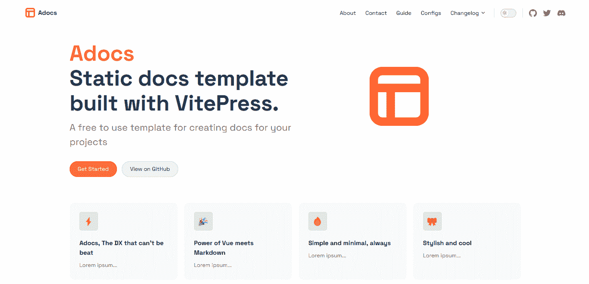

您已经成功地使用 CSS 定制了主题并更改了字体系列。虽然在样式方面你还可以做更多的事情，但是在这一点上，我希望你能清楚如何用 CSS 定制你的文档。

让我们在下一节讨论托管。

## 如何托管您的文档网站

你可以在不同的平台上发布或托管你的文档网站，如 [Netlify](https://netlify.com) 、 [Vercel](https://vercel.com) 、 [AWS Amplify](https://aws.com) 等等。

首先，运行构建命令:

```
npm run docs:build 
```

这将创建一个新的`dist`文件夹，其中包含您的文档的所有静态文件。

在决定使用什么托管服务时，你可以选择我前面提到的任何一个选项，但是在本指南中我们将使用 Vercel。此外，请随意查看您选择的其他替代方案。

如果您没有一个 Vercel 帐户，那么在进入下一步之前，请按照本指南[创建一个并配置您的 Git 提供者](https://vercel.com/docs/concepts/get-started/deploy)。

假设您已经成功设置了您的帐户并将您的 docs 站点上传到 Vercel，导航到**项目>** **设置** **>构建和部署设置**，并将以下命令粘贴到它们各自的字段中:

*   构建命令:`npm run docs:build`
*   输出目录:`docs/.vitepress/dist`

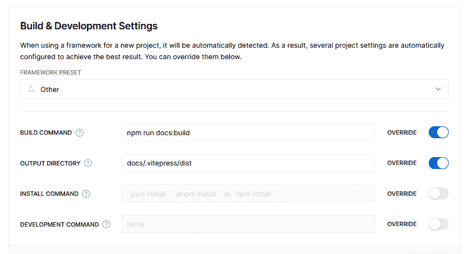

编辑设置后，保存它们并部署您的站点！

## 结论

在本教程中，您已经建立了一个成熟的文档站点，并使用 CSS 和 VitePress 内置组件对其进行了定制。

请记住，本教程只涵盖了 VitePress 的一小部分功能。要了解更多信息，请查看 [VitePress 文档](https://vitepress.vuejs.org)。

### 附加阅读

这里有一些本文没有涉及到的东西，我认为也值得研究一下:

*   [定制集装箱](https://vitepress.vuejs.org/guide/markdown#custom-containers)
*   [在降价中使用 Vue](https://vitepress.vuejs.org/guide/using-vue#using-vue-in-markdown)
*   [团队部分](https://vitepress.vuejs.org/guide/theme-team-page)
*   [碳广告](https://vitepress.vuejs.org/guide/theme-carbon-ads)

### 资源

*   [现场演示](https://adocs.vercel.app)
*   [GitHub 回购](https://github.com/Evavic44/adocs)

如果你像我一样是开源爱好者，或者你喜欢听这些很酷的项目，请关注我的社交网站，这样你就不会错过我的下一篇文章。干杯。🍷

[GitHub](https://github.com/evavic44) | [推特](https://twitter.com/victorekea) | [博客](https://eke.hashnode.dev) | [作品集](https://victoreke.com)