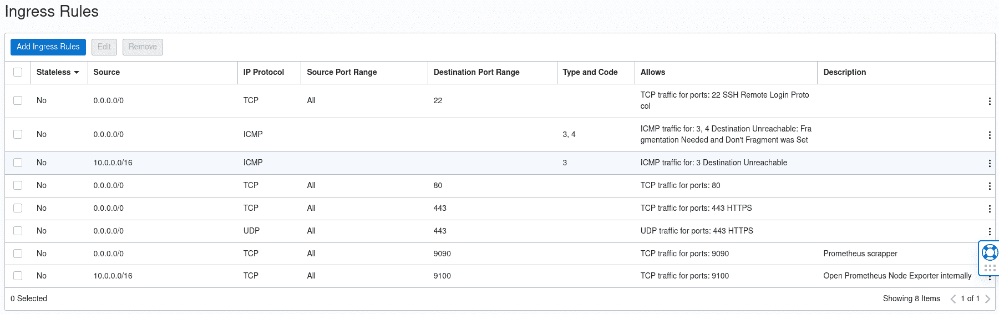

# 如何使用 Oracle 云和 Ansible 配置家庭实验室

> 原文：<https://www.freecodecamp.org/news/provision-home-lab-with-oracle-cloud-and-ansible/>

想象一下，你一直在努力建立一个网站，用 SSL 保护，然后你的硬件出现故障。这意味着除非你有一个完美的机器备份，否则你需要手动安装所有的软件和配置文件。

如果不只是一台服务器而是多台呢？修复所有这些问题所需的时间将呈指数级增长，而且因为是手动过程，所以更容易出错。

然后是噩梦般的场景:你没有最新的备份，或者你有不完整的备份。最糟糕的是，根本没有备份。最后一种情况比你想象的更常见，尤其是在你自己动手摆弄东西的家庭实验室里。

在本教程中，我将向您展示如何使用 [SSL](https://www.cloudflare.com/learning/ssl/what-is-ssl/) 证书和 [Prometheus](https://prometheus.io/docs/introduction/overview/) 监控指标，在云提供商上完成一对 web 服务器的完整基础设施供应。

## 这个装置需要什么

你首先需要的是一个云提供商。Oracle Cloud 提供了他们云服务的*免费层版本*，允许你免费设置虚拟机。这对于一个拥有许多丰富功能的家庭实验室来说是非常棒的，您可以使用这些功能来尝试新的工具和技术。

你还需要一个自动化工具。我使用了 [Ansible](https://www.ansible.com/) ,因为它没有太多要求(你只需要一个 SSH 守护进程和公钥认证就可以了)。我喜欢它的另一个原因是，无论您尝试配置什么样的云环境，它都能很好地工作。

在本教程中，我们将使用这个工具的[开源版本](https://github.com/ansible/ansible)，因为它对于我们的目的来说已经足够了。

### Ansible 行动手册包括哪些内容

一个[可行的剧本](https://docs.ansible.com/ansible/latest/user_guide/playbooks_intro.htmlhttps://docs.ansible.com/ansible/latest/user_guide/playbooks_intro.html)只不过是你定义的一组指令，用来执行*任务*，这些任务将改变主机的状态。这些操作是在您定义的[主机清单](https://docs.ansible.com/ansible/latest/user_guide/intro_inventory.html)上执行的。

在这里，您将了解以下内容:

*   如何[利用行动手册中的适当布局清理库存来源](https://www.redhat.com/sysadmin/ansible-dynamic-inventories)。
*   如何提供两个 [NGINX](https://nginx.org/en/) 实例，使用 [Certbot](https://certbot.eff.org/instructions?ws=nginx&os=pip) 请求它们适当的免费 SSL 证书。
*   如何设置本地 Linux 防火墙并添加 Prometheus node_exporter 代理和一个 scraper 来收集数据。
*   变量、角色(包含任务)和条件执行等概念。
*   一些重要的技术，比如任务标记、调试消息和使用 [ansible-lint](https://www.redhat.com/sysadmin/ansible-lint-YAML) 的静态验证。

所有代码都可以在这个 [GitHub 库](https://github.com/josevnz/OracleCloudHomeLab)中找到。

## 在尝试之前你应该知道什么

因为我们将在这里讨论几个任务，所以您可能需要熟悉几件事情(我会在讨论过程中提供链接):

*   这不是 Ansible 的[入门课程，更像是一个更详细但不太复杂的“如何将所有的东西组合在一起”的剧本。](https://www.redhat.com/sysadmin/ansible-introduction)
*   一个 [OCI 云自由层](https://www.oracle.com/cloud/free/)账户
*   特权账户，很可能是 [SUDO](https://www.sudo.ws/)
*   TCP/IP 和防火墙的基本知识
*   如何使用 [RPM](https://www.redhat.com/sysadmin/how-manage-packages) 以及如何[打包](https://www.redhat.com/sysadmin/package-linux-applications-rpm)应用程序(我们不会在这里这样做，但它有助于理解什么时候 RPM 比 Ansible 中的复杂任务更好)

### 这里不包括什么

OCI 云有一个[完整的 REST API](https://docs.oracle.com/en-us/iaas/api/#/en/network-firewall/20211001/NetworkFirewallPolicy/UpdateNetworkFirewallPolicy) 来管理他们云环境的许多方面。[他们的设置页面](https://docs.oracle.com/en-us/iaas/Content/API/Concepts/sdkconfig.htm#SDK_and_CLI_Configuration_File)(具体是 SDK)也很详细。

## 你可能会在生产中做不同的事情。

### 在虚拟机上安装 OCI 度量数据源，而不是普罗米修斯代理

你可以去[这个页面](https://grafana.com/grafana/plugins/oci-metrics-datasource/?tab=installation)把它安装到你的 Grafana 实例上(裸机或者云)。你还需要[按照这里的说明](https://docs.oracle.com/en-us/iaas/Content/API/SDKDocs/grafana.htm)设置你的凭证和权限。

这可能是监控资源最有效的方式，因为您不需要在虚拟机上运行代理。但是我会安装一个[Prometheus node _ exporter agent](https://github.com/prometheus/node_exporter)和 [scraper](https://github.com/prometheus/prometheus) ，它们可以从 [Grafana Cloud](https://grafana.com/) 实例中看到。

### 暴露在互联网端点上的普罗米修斯不是一个好主意

很明显，我把我的 Prometheus scraper 暴露在互联网上，这样 Grafana cloud 就可以接触到它。在拥有私有云和本地 Grafana 的内部网中，这不是问题——但在这里，Prometheus 代理将数据推送到 Grafana 将是更好的选择。

尽管如此，Grafana 还是提供了一个公共 IP 地址列表,你可以用它来设置你的允许列表。

因此，以下内容将会起作用:



Oracle Cloud Ingress Rules

但不是最好的。相反，您希望限制可以从您公开的服务中提取数据的特定 IP 地址。普罗米修斯出口者可以完全隐藏在 9100 港口的格拉夫纳面前。相反，我们只需要暴露侦听端口 9000 的普罗米修斯刮刀。

对于这个家庭实验室来说，完全公开这样的服务没什么大不了的。但是如果您的服务器上有敏感数据，您必须限制谁可以访问该服务！

Prometheus 端点的一个替代方法是通过使用 Grafana 代理将数据推送到 Grafana [,但是我不会在这里讨论这个选项。](https://grafana.com/docs/agent/latest/)

# 剧本分析

Ansible 让您拥有一个包含剧本说明的文件，但是最终您会发现这样的结构很难维护。

对于我的剧本，我决定保留建议的结构:

```
tree -A 
.
├── inventory
│   └── cloud.yaml
├── oracle.yaml
├── roles
│   └── oracle
│       ├── files
│       │   ├── logrotate_prometheus-node-exporter
│       │   ├── prometheus-node-exporter
│       │   └── requirements_certboot.txt
│       ├── handlers
│       │   └── main.yaml
│       ├── meta
│       ├── tasks
│       │   ├── controller.yaml
│       │   ├── main.yaml
│       │   ├── metrics.yaml
│       │   └── nginx.yaml
│       ├── templates
│       │   ├── prometheus-node-exporter.service
│       │   ├── prometheus.service
│       │   └── prometheus.yaml
│       └── vars
│           └── main.yaml
└── site.yaml 
```

以下是内容组织方式的简要说明:

1.  您可以拥有多个站点。您可以在 [site.yaml](file:///home/josevnz/OracleCloudHomeLab/site.yaml) 文件中控制它。
2.  主机列表位于清单目录中。您可以有多个清单文件或脚本来生成主机列表，或者两者的组合。
3.  角色/oracle 对任务进行分组。我们只有一个名为“oracle”的角色，因为这是我在这里重点关注的云提供商。
4.  我们的剧本使用变量形式的元数据，每个变量都定义在“vars”目录中。这样，我们可以在多个地方定制行动手册的行为:

```
---
# Common variables for my Oracle Cloud environments
controller_host: XXXX.com
ssl_maintainer_email: YYYYYY@ZZZZ.com
architecture: arm64
prometheus_version: 2.38.0
prometheus_port: 9090
prometheus_node_exporter_nodes: "['X-server1:{{ node_exporter_port }}', 'Y-server2:{{ node_exporter_port }}' ]"
node_exporter_version: 1.4.0
node_exporter_port: 9100
internal_network: QQ.0.0.0/24 
```

roles/oracle files 目录包含可以按原样复制到远程目录的文件。模板的目录是相似的，但是那里的文件可以通过使用 [Jinja 模板语言](https://docs.ansible.com/ansible/latest/user_guide/playbooks_templating.html)为每个主机定制。

```
# A template for the prometheus scraper configuration file
---
global:
    scrape_interval: 30s
    evaluation_interval: 30s
    scrape_timeout: 10s
    external_labels:
        monitor: 'oracle-cloud-metrics'

scrape_configs:
  - job_name: 'node-exporter'
    static_configs:
      - targets: {{ prometheus_node_exporter_nodes }}
    tls_config:
      insecure_skip_verify: true 
```

“tasks”目录是我们存储任务的地方，也就是修改服务器状态的操作。注意，如果没有必要，Ansible 不会执行任务。这个想法是，您可以根据需要多次重新运行剧本，最终状态将是相同的。

```
# Fragment of the nginx tasks file. See how we notify a handler to restart nginx after the SSL certificate is renewed.
---
- name: Copy requirements file
  ansible.builtin.copy:
    src: requirements_certboot.txt
    dest: /opt/requirements_certboot.txt
  tags: certbot_requirements

- name: Setup Certbot
  pip:
    requirements: /opt/requirements_certboot.txt
    virtualenv: /opt/certbot/
    virtualenv_site_packages: true
    virtualenv_command: /usr/bin/python3 -m venv
  tags: certbot_env

- name: Get SSL certificate
  command:
    argv:
      - /opt/certbot/bin/certbot
      - --nginx
      - --agree-tos
      - -m {{ ssl_maintainer_email }}
      - -d {{ inventory_hostname }}
      - --non-interactive
  notify:
    - Restart Nginx
  tags: certbot_install 
```

有一个名为“handlers”的特殊目录。在那里，我们定义了当一个任务改变了我们主机的状态时必须发生的动作。

我们现在有了所有部分如何一起工作的画面，所以让我们来谈谈一些具体的细节。

### 防火墙供应

使用 Ansible，您可以替换如下命令序列:

```
sudo firewall-cmd --permanent --zone=public --add-service=http
sudo firewall-cmd --permanent --zone=public --add-service=https
sudo firewall-cmd --reload 
```

带[防火墙模块](https://docs.ansible.com/ansible/latest/collections/ansible/posix/firewalld_module.html):

```
---
- name: Enable HTTP at the Linux firewall
  firewalld:
    zone: public
    service: http
    permanent: true
    state: enabled
    immediate: yes
  notify:
    - Reload firewall
  tags: firewalld_https

- name: Enable HTTPS at the Linux firewall
  firewalld:
    zone: public
    service: https
    permanent: true
    state: enabled
    immediate: yes
  notify:
    - Reload firewall
  tags: firewalld_https 
```

### **普通任务有很好的替代品**

因此，与其用特权命令来管理 SUDO:

```
sudo dnf install -y nginx
sudo systemctl enable nginx.service --now 
```

你可以有这样的东西:

```
# oracle.yaml file, which tells which roles to call, included from site.yaml
---
- hosts: oracle
  serial: 2
  remote_user: opc
  become: true
  become_user: root
  roles:
  - oracle
# NGINX task (roles/oracle/tasks/nginx.yaml)
- name: Ensure nginx is at the latest version
  dnf:
    name: nginx >= 1.14.1
    state: present
    update_cache: true
  tags: install_nginx
# And a handler that will restart NGINX after it gets modified (handlers/main.yaml)
---
- name: Restart Nginx
  ansible.builtin.service:
    name: nginx
    state: restarted
- name: Reload firewall
  ansible.builtin.systemd:
    name: firewalld.service
    state: reloaded 
```

## 如何运行行动手册

通常情况下，你不会等着写完整部剧本，而是按照正确的顺序运行你需要的部分。在某个时候，你将完成你的整个剧本，并准备好出发。

### 在进行任何更改之前，确保剧本与`--check`一起正常运行

第一步是检查剧本文件中的错误。为此，您可以使用 yamllint:

```
yamllint roles/oracle/tasks/main.yaml 
```

但是对剧本中的每个 yaml 文件都这样做可能会很乏味，而且容易出错。或者，您可以在“预演”模式下运行剧本，看看会发生什么情况，而无需实际进行任何更改:

[](https://asciinema.org/a/537302)

另一种逐步测试复杂剧本的方法是通过使用一个标签或一组标签来执行特定的任务。这样，您就可以有控制地执行您的行动手册:

*请记住，这不会执行您在行动手册上定义的任何依赖关系，尽管*:

[](https://asciinema.org/a/537303)

### **当 ansible-playbook - check 不够好时使用 ansi ble-lint**

有些错误更微妙，不会被`ansible-playbook --check`发现。为了在小问题变得令人头疼之前更全面地检查你的剧本，你可以使用 [ansible-lint](https://ansible-lint.readthedocs.io/philosophy/) 。所以让我们来安装它:

```
python3 -m venv ~/virtualenv/ansiblelint && . ~/virtualenv/ansiblelint/bin/activate
pip install --upgrade pip
pip install --upgrade wheel
pip install ansible-lint 
```

现在我们可以查看行动手册:

```
(ansiblelint) [josevnz@dmaf5 OracleCloudHomeLab]$ ansible-lint site.yaml 
WARNING  Overriding detected file kind 'yaml' with 'playbook' for given positional argument: site.yaml
WARNING  Listing 1 violation(s) that are fatal
syntax-check[specific]: couldn't resolve module/action 'firewalld'. This often indicates a misspelling, missing collection, or incorrect module path.
roles/oracle/tasks/nginx.yaml:2:3 
```

奇怪，防火墙在我们的 Ansible 安装中可用。ansible-lint 还装了什么？

```
(ansiblelint) [josevnz@dmaf5 OracleCloudHomeLab]$ ansible --version
ansible [core 2.14.0]
  config file = /etc/ansible/ansible.cfg
  configured module search path = ['/home/josevnz/.ansible/plugins/modules', '/usr/share/ansible/plugins/modules']
  ansible python module location = /home/josevnz/virtualenv/ansiblelint/lib64/python3.9/site-packages/ansible
  ansible collection location = /home/josevnz/.ansible/collections:/usr/share/ansible/collections
  executable location = /home/josevnz/virtualenv/ansiblelint/bin/ansible
  python version = 3.9.9 (main, Nov 19 2021, 00:00:00) [GCC 10.3.1 20210422 (Red Hat 10.3.1-1)] (/home/josevnz/virtualenv/ansiblelint/bin/python3)
  jinja version = 3.1.2
  libyaml = True 
```

Ansible-lint 安装了自己的 ansible [core]，firewalld 是 [ansible.posix 集合](https://docs.ansible.com/ansible/latest/collections/ansible/posix/firewalld_module.html)的一部分。我们将使用 [Ansible Galaxy](https://docs.ansible.com/ansible/latest/cli/ansible-galaxy.html) 来安装它:

```
(ansiblelint) [josevnz@dmaf5 OracleCloudHomeLab]$ which ansible-galaxy
~/virtualenv/ansiblelint/bin/ansible-galaxy
(ansiblelint) [josevnz@dmaf5 OracleCloudHomeLab]$ ansible-galaxy collection install ansible.posix
Starting galaxy collection install process
Process install dependency map
Starting collection install process
Downloading https://galaxy.ansible.com/download/ansible-posix-1.4.0.tar.gz to /home/josevnz/.ansible/tmp/ansible-local-18099xpw_8usc/tmp8msc9uf5/ansible-posix-1.4.0-_f17f525
Installing 'ansible.posix:1.4.0' to '/home/josevnz/.ansible/collections/ansible_collections/ansible/posix'
ansible.posix:1.4.0 was installed successfully 
```

再次运行:

```
(ansiblelint) [josevnz@dmaf5 OracleCloudHomeLab]$ ansible-lint site.yaml 
WARNING  Overriding detected file kind 'yaml' with 'playbook' for given positional argument: site.yaml
WARNING  Listing 50 violation(s) that are fatal
name[play]: All plays should be named. (warning)
oracle.yaml:2

fqcn[action-core]: Use FQCN for builtin module actions (service).
roles/oracle/handlers/main.yaml:2 Use `ansible.builtin.service` or `ansible.legacy.service` instead.

fqcn[action-core]: Use FQCN for builtin module actions (command).
roles/oracle/handlers/main.yaml:6 Use `ansible.builtin.command` or `ansible.legacy.command` instead. 
```

一些警告是学究式的(对内置模块动作(命令)使用 FQCN)，而另一些则需要注意(如果不需要做什么，命令不应该改变事情)。).

Ansible-lint 在剧本上发现了许多味道，有一个选项可以重写文件并自动纠正其中的一些错误:

[](https://asciinema.org/a/538053)

有一些你可以[遵循的指导方针来纠正这些问题](https://ansible-lint.readthedocs.io/profiles/#production)。下面是一些可以直接应用于我们之前得到的警告的例子:


注意，所有的错误都很容易解决。有些命令自己决定是否应该进行更改，但是很难与 Ansible 通信:

```
- name: Get SSL certificate
  ansible.builtin.shell:
    argv:
      - /opt/certbot/bin/certbot
      - --nginx
      - --agree-tos
      - -m "{{ ssl_maintainer_email }}"
      - -d "{{ inventory_hostname }}"
      - --non-interactive
  notify:
    - Restart Nginx
  tags: certbot_install 
```

在我们的例子中，如果证书尚未到期，certboot 会打印一条消息。如果输出丢失，那么我们触发 Nginx 重启(参见[定义变更](https://docs.ansible.com/ansible/latest/user_guide/playbooks_error_handling.html#defining-changed)):

```
- name: Get SSL certificate
  ansible.builtin.shell:
    argv:
      - /opt/certbot/bin/certbot
      - --nginx
      - --agree-tos
      - -m {{ ssl_maintainer_email }}
      - -d {{ inventory_hostname }}
      - --non-interactive
  register: certbot_output # Registers the certbot output.
  changed_when: 
    - '"Certificate not yet due for renewal" not in certbot_output.stdout'
  notify:
    - Restart Nginx
  tags: certbot_install 
```

我确实想使用 shell，因为我需要为 certbot 扩展变量，但是 ansible-lint 仍然不满意:

```
(ansiblelint) [josevnz@dmaf5 OracleCloudHomeLab]$ ansible-lint site.yaml
WARNING  Overriding detected file kind 'yaml' with 'playbook' for given positional argument: site.yaml
WARNING  Listing 1 violation(s) that are fatal
command-instead-of-shell: Use shell only when shell functionality is required.
roles/oracle/tasks/nginx.yaml:47 Task/Handler: Get SSL certificate

You can skip specific rules or tags by adding them to your configuration file:
# .config/ansible-lint.yml
warn_list:  # or 'skip_list' to silence them completely
  - command-instead-of-shell  # Use shell only when shell functionality is required.

                   Rule Violation Summary                    
 count tag                      profile rule associated tags 
     1 command-instead-of-shell basic   command-shell, idiom 

Failed after min profile: 1 failure(s), 0 warning(s) on 8 files. 
```

是时候把这个错误当作一个警告了，因为我知道它们不是问题，通过创建一个`.config/ansible-lint.yml`:

```
(ansiblelint) [josevnz@dmaf5 OracleCloudHomeLab]$ ansible-lint site.yaml
WARNING  Overriding detected file kind 'yaml' with 'playbook' for given positional argument: site.yaml
WARNING  Listing 1 violation(s) that are fatal
command-instead-of-shell: Use shell only when shell functionality is required. (warning)
roles/oracle/tasks/nginx.yaml:47 Task/Handler: Get SSL certificate

                        Rule Violation Summary                         
 count tag                      profile rule associated tags           
     1 command-instead-of-shell basic   command-shell, idiom (warning) 

Passed with min profile: 0 failure(s), 1 warning(s) on 8 files. 
```

现在好多了，警告不被视为错误。

### **金贾最佳实践**

如果您计划使用变量和 Jinja 模板，请确保引用它们(例如:“dest:/opt/Prometheus-{ { Prometheus _ version } }。linux-{{架构}}.tar.gz ")

### 用`--limit`和`--tags`约束剧本的运行位置

假设您只对在某个主机上运行您的剧本感兴趣。在这种情况下，您也可以通过使用`--limit`标志来实现:

```
ansible-playbook --inventory inventory --limit fido.yourcompany.com --tags certbot_renew site.yaml 
```

[](https://asciinema.org/a/537304)

这里，我们只在主机 fido.yourcompany.com 上运行了一个标记为 certbot_renew 的任务。

### 如何处理现实问题

让我们来做个有趣的事情:假设我渴望更新我对 certboot 的一个需求，我将版本 if pip 更改为“22.3.1”:

```
pip==22.3.1
wheel==0.38.4
certbot==1.32.0
certbot-nginx==1.32.0 
```

当我运行剧本时，我们失败了:

[](https://asciinema.org/a/537318)

如果在[requirements _ cert boot . txt](https://github.com/josevnz/OracleCloudHomeLab/blob/main/roles/oracle/files/requirements_certboot.txt)文件中指定，这是版本的问题。使用虚拟环境安装 Python 库时，可以指定如下版本:

pip 22.3.1
车轮 0.38.1
确定机器人 1.23.0
确定机器人 1.23.0

要解决此问题，我们将恢复文件中使用的版本，然后重新运行需求文件和 Certbot 安装任务:

```
- name: Setup Certbot
  pip:
    requirements: /opt/requirements_certboot.txt
    virtualenv: /opt/certbot/
    virtualenv_site_packages: true
    virtualenv_command: /usr/bin/python3 -m venv
    state: forcereinstall
  tags: certbot_env 
```

```
ansible-playbook --inventory inventory --tags certbot_env site.yaml 
```

观看它的实际应用:

[](https://asciinema.org/a/537320)

### 如何运行整个剧本

```
ansible-playbook --inventory inventory site.yaml 
```

是时候运行整个剧本了:

[](https://asciinema.org/a/537322)

## 包扎

本教程仅仅触及了 Ansible 的皮毛。因此，下面是一些您应该探索以了解更多信息的资源:

*   改进库存:[如何在 Ansible 中创建动态库存文件](https://www.redhat.com/sysadmin/ansible-dynamic-inventories)，[如何编写 Python 脚本创建动态 Ansible 库存](https://www.redhat.com/sysadmin/ansible-dynamic-inventory-python)，[如何编写 Ansible 插件创建库存文件](https://www.redhat.com/sysadmin/ansible-plugin-inventory-files)
*   有时你的剧本会运行缓慢，你可能需要[用可译回调插件](https://www.redhat.com/sysadmin/ansible-callback-plugins-metrics)评估资源消耗。
*   并且会有一个时间[需要更深入的调试](https://docs.ansible.com/ansible/latest/user_guide/playbooks_debugger.html)。