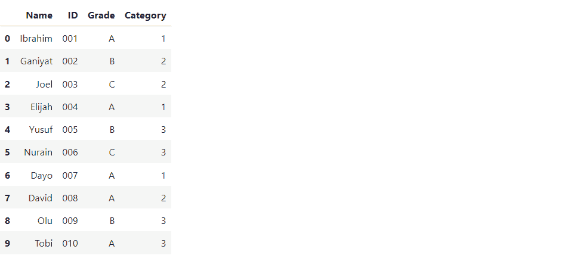
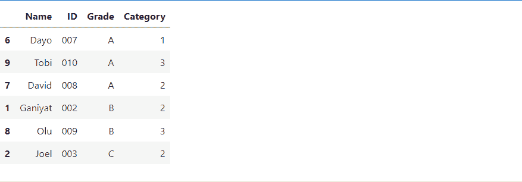
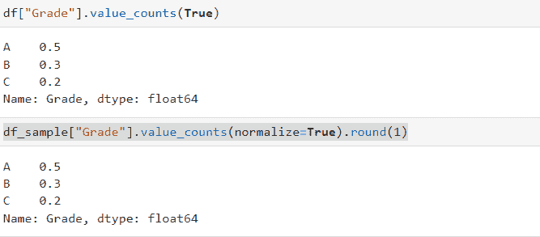
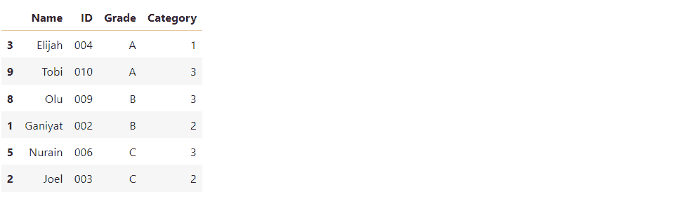
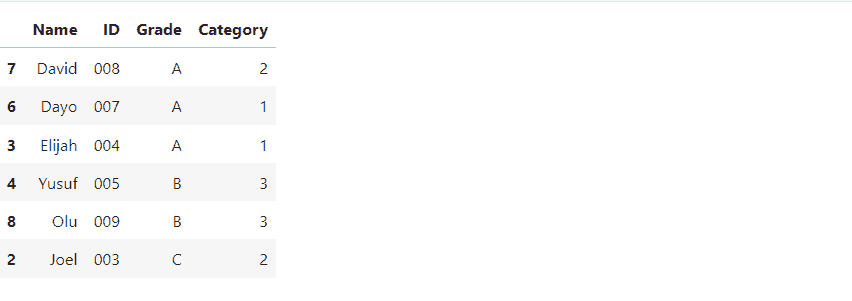
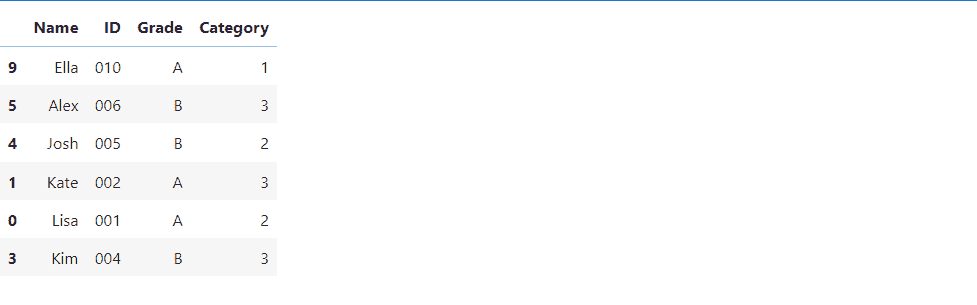
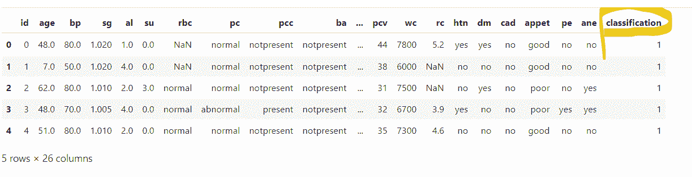
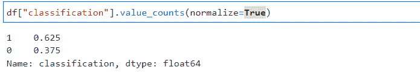
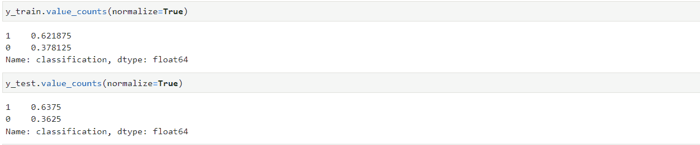
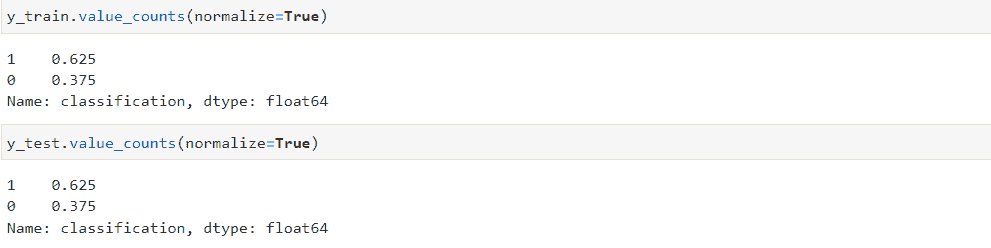

# 什么是分层随机抽样？定义和 Python 示例

> 原文：<https://www.freecodecamp.org/news/what-is-stratified-random-sampling-definition-and-python-example/>

当我们希望对一个群体进行实验时——例如，一个国家的全部人口——将每个受试者(公民)都包括在实验中并不总是实际或现实的。

相反，我们依赖于样本，样本是总体的子集，然后根据样本的结果得出关于总体的结论。

现在，从人群中抽取样本被称为抽样技术，抽取样本的方式对结果至关重要。

有很多抽样技术，但在本教程中，我们将研究其中一种叫做分层随机抽样及其工作原理。事不宜迟，我们开始吧。

## 什么是分层随机抽样？

在我们进入分层随机抽样的细节之前，让我们把这个术语分解成几个部分，这样我们可以更好地理解它。先说分层。

在抽样的背景下，**分层**是指根据某一特征将人口分成更小的群体或阶层。换句话说，你根据人群的特征将他们分成不同的组。

**随机** **抽样**需要从人群中随机选择对象(实体)。每个受试者有相等的概率从总体中被选择以形成总体的样本(亚总体)。

因此，**分层随机抽样**是一种抽样方法，其中根据特定特征将人口分成组或层。然后从每个阶层(单一阶层)中随机抽取受试者。

你根据一个特征将人群分成几组，然后从每组中随机选择一个主题或实体。

## 分层随机抽样的类型

分层抽样分为两类，即:

*   比例分层随机抽样。
*   不成比例的分层随机抽样。

**按比例分层随机抽样**是一种抽样，其中从每个阶层获得的随机样本的大小与整个阶层的人口大小成比例。

换句话说，整个阶层的比例等于样本阶层的比例。考虑下面的例子:

```
students = {

    "Name": ["Ibrahim", "Ganiyat", "Joel", "Elijah", "Yusuf", "Nurain", 
            "Dayo", "David", "Olu", "Tobi"],

    "ID":  ['001', '002', '003', '004', '005', '006','007', '008', '009', '010'],

    "Grade": ['A', 'B', 'C', 'A', 'B', 'C', 'A', 'A', 'B', 'A'],

    "Category": [1, 2, 2, 1, 3, 3, 1, 2, 3, 3]
}
df = pd.DataFrame(students)
>>
```



上面的数据帧包含学生的姓名、id、成绩和类别。假设我们希望根据学生的年级特征对他们进行分层，并从每组中抽取 60%的学生。这意味着在上面的数据框架中我们将有三个阶层，因为我们有三个不同的等级。

我们可以通过键入以下命令对其进行采样:

```
df_sample = df.groupby("Grade", group_keys=False).apply(lambda x:x.sample(frac=0.6))
```

现在，我们上面所做的是使用`groupby()`方法将数据帧分组到不同的层。然后我们传入了`Grade`特性。对于每个群体(阶层),我们从中随机抽取`0.6(60%)`进行观察。



现在，如果我们查看`df_sample`和`df`的比例，我们会发现两个数据帧的比例是相同的。



**不成比例的分层随机抽样**，另一方面，涉及随机选择阶层而不考虑比例。换句话说，采样是基于指定的数字进行的。让我们看一个例子。

```
df.groupby('Grade', group_keys=False).apply(lambda x: x.sample(n=2))
```

在这段代码中，您可以看到我们只指定了想要获得的实际样本数。



大多数情况下，你会使用比例分层抽样。不成比例需要更多的专业知识。当进行分层抽样时，你最有可能使用比例抽样。

## 分层随机抽样的应用

### 1.基于共享特征的采样:

当一个实验中的一个或多个受试者共享特征时，这表明他们是同一组的成员(一个受试者只能在一个特定的组中)。

例如，假设 50 名学生参加考试，考试的成绩范围仅为 A-E。因此，我们可以让同一年级组的学生，例如，获得 A 的学生(一个学生不可能有两个成绩)。因此，它们有一个共同的特点或特征，那就是等级。

所以当你想根据共有特征对受试者进行抽样时，你应该使用分层随机抽样。这确保了特定组的成员将被包括在内。

这是因为分层随机抽样不同于简单随机抽样，简单随机抽样也是一种抽样技术。分层随机抽样随机抽样出没有特征的总体(即总体中的每个受试者被选中的机会相等)。

因此，简单的随机抽样不能保证特定群体中的某个成员会被包括在样本中。

让我们来看一个例子，看看我们在谈论什么。假设我们想用分层随机抽样和简单随机抽样两种方法抽取 60%的学生。

我们可以在下面看到分层随机抽样的结果:

```
df.groupby('Grade', group_keys=False).apply(lambda x: x.sample(frac=0.6))
```



这是简单随机抽样的结果:

```
df.sample(frac= 0.6)
```



我们可以看到，C 级的学生不在样本之内。这是因为在简单的随机抽样中，每个观察值都有同等的机会被选中，因为我们不是根据特征进行抽样。这意味着有可能某个观察结果不会被选中。

另一方面，在分层随机抽样中，我们考虑我们想要抽样的所有组，然后从每个组中随机抽样。

### 2.不平衡的数据集:

不平衡数据集是一个机器学习分类问题，其中目标变量中的两个类别标签彼此不成比例。换句话说，一个类比另一个类有更高的计数，导致不平衡。

在机器学习中，如果数据集中存在不平衡，分层采样也用于为训练集和测试集获得相同的样本比例。

例如，一个慢性病数据集有一个不平衡标签，如下所示。你可以点击[这里](https://www.kaggle.com/datasets/mansoordaku/ckdisease/download?datasetVersionNumber=1)下载数据集。

```
df = pd.read_csv("kidney_disease.csv")
df.head()
```



如果我们检查`classification`的比例标签特征，我们可以看到它是不平衡的。



现在，假设我们想要使用简单的随机抽样来分割训练集和测试集。我们无法实现与总体比例相同的训练集和测试集比例。

```
from sklearn.model_selection import train_test_split
X = df.drop(columns = ["classification"])
y = df["classification"]
X_train, X_test, y_train, y_test = train_test_split(X, y, train_size=0.8)
```



我们可以看到，`y_train`和`y_test`的标签比例与人口比例不同。为了达到相同的比例，我们可以使用`train_test_split`中的`stratify`参数，如下所示:

```
from sklearn.model_selection import train_test_split
X = df.drop(columns = ["classification"])
y = df["classification"]
X_train, X_test, y_train, y_test = train_test_split(X, y, train_size=0.8, stratify=y)
```

上面的代码显示数据集在标签上是分层的。因此，我们将达到与人口比例相同的比例。



## 结论

在本教程中，我们研究了分层抽样以及如何在统计和机器学习中使用它。我们还研究了分层抽样的类型。

谢谢你的时间。