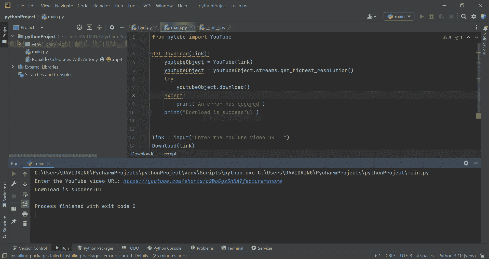

# 如何构建一个 Python 程序来下载 YouTube 视频

> 原文：<https://www.freecodecamp.org/news/python-program-to-download-youtube-videos/>

YouTube 是一个著名的互联网视频流媒体服务。教育、娱乐、旅游等类别的视频数以百万计。

点几下鼠标就可以快速观看视频，但是下载视频就比较困难了。但在最近的一次升级中，YouTube 现在允许你将视频保存在下载文件夹中，以便离线观看。但是，您无法在本地保存它们。

在本教程中，您将学习如何使用 Python 代码下载 YouTube 视频。如你所知，Python 的一大优势是它拥有大量的模块和库。我们将使用流行的 pytube 包编写 Python 脚本。

## 先决条件

以下是继续本教程的基本要求:

*   理解 Python 编程语言
*   您必须在计算机上安装 Python 3+
*   您必须已经安装了 Python 库 Pytube
*   您应该有一个 Python 代码编辑器，比如 Pycharm、Vscode 等等。

## Pytube 概述和安装

Pytube 是一个小型的、无依赖性的 Python 模块，用于从互联网上访问视频。

本机库不是 pytube——您必须首先安装它才能使用它。有了 pip，安装就简单了。

要使用 pip 安装 Pytube，您需要以管理员身份打开命令提示符 CLI，并输入以下命令:

```
pip install pytube 
```

pytube 库改善了视频下载。通过提供 URL 作为参数来构建 YouTube 模块的对象。然后，获取视频的适当扩展和分辨率。您可以随意更改文件的名称，否则将保留原来的名称。

现在让我们来看看编写和实现从 YouTube 下载我们最喜欢的视频的代码的主要方面。

```
from pytube import YouTube

def Download(link):
    youtubeObject = YouTube(link)
    youtubeObject = youtubeObject.streams.get_highest_resolution()
    try:
        youtubeObject.download()
    except:
        print("An error has occurred")
    print("Download is completed successfully")

link = input("Enter the YouTube video URL: ")
Download(link) 
```

在继续其他方面之前，使用`from pytube import YouTube`函数导入 Python Pytube 库。然后定义函数下载链接。

`youtubeObject = youtubeObject.streams.get_highest_resolution()`命令将自动下载可用的最高分辨率。然后，我实现了 Try and Except，以便在下载失败时返回一条错误消息——否则它将打印出下载成功完成。

链接功能将要求下载首选的 YouTube 视频链接，然后在您点击 enter 按钮后，视频下载将立即开始。

### 输出:



我下载的视频很成功。您可以在您正在处理的文件所在的同一个 Python 文件夹中查看视频。但是如果您愿意，您可以将视频移动到您喜欢的存储位置。在我的例子中，视频名称是“罗纳尔多与安东尼庆祝”

然而，如果你有一个可靠的互联网连接会更好。

这个库也有许多复杂的特性，但是我们已经介绍了所有主要的特性。您可以通过访问 pytube 库的官方[精心编写的文档](https://pytube.io/en/latest/)来了解更多关于 py tube 库的信息。

## 结论

我们已经成功地用 Python 编写了我们自己的 YouTube 视频下载脚本。这有助于您避免寻找外部网站或应用程序来将您喜欢的视频保存到本地存储的压力。

它还让您不必在第三方网站或钓鱼链接上暴露您的数据——所有这些都是以从 YouTube 获取视频到您的本地存储为名的。

希望在阅读完这篇文章后，你会理解从 YouTube 下载视频所需的过程，而不需要下载外部应用程序或访问任何你不信任的网站。