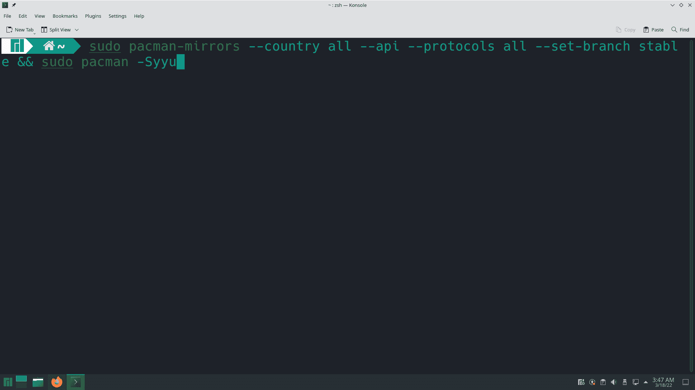
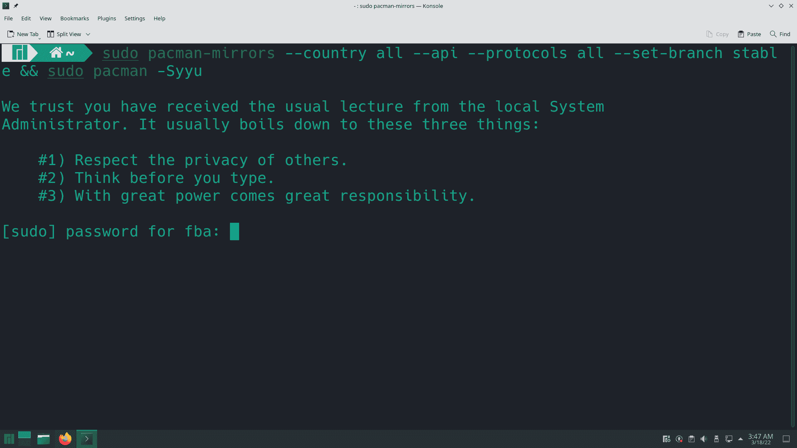
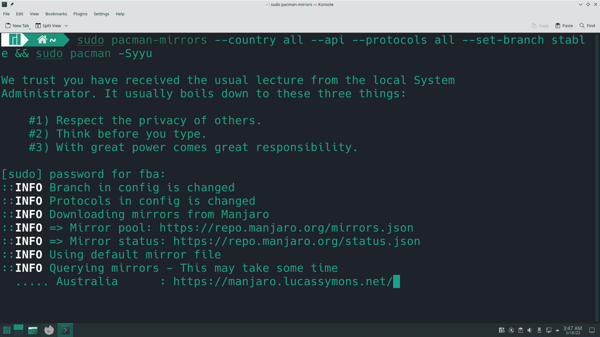

# 如何在 Manjaro Linux 上使用镜像快速下载应用程序

> 原文：<https://www.freecodecamp.org/news/how-to-download-application-fast-on-manjaro-linux/>

如果您正在运行 Linux 操作系统，您可能已经听说过镜像存储库。据 Quora 报道，

> 在 Linux 中，镜像是可供下载的程序的副本。如果您离所列的镜像站点很近(从网络的角度来说，可能是，也可能不是地理上的)，您可以选择镜像站点作为您的主要下载来源，这样您可以获得更好的响应时间。

不同的基于 Linux 的操作系统有不同的方法来帮助您选择最快的镜像。但是大部分的解决方法都是一样的。

我已经用了 [Manjaro](https://manjaro.org/) 很长时间了，它是目前最流行的基于 Linux 的操作系统之一。所以我决定写这篇关于它的文章。

由于我们中的许多人喜欢在基于 Linux 的操作系统中使用 CLI(命令行界面)来下载必要的应用程序和软件包，因此拥有合适的网速非常有用。镜像存储库/服务器可以帮助我们做到这一点。

## 为什么镜像服务器很有用

随着 Linux 越来越受欢迎，在不同的国家创建了许多服务器，这些服务器保存的数据与官方服务器中的数据相同。

我们称这些为镜像服务器，因为这些服务器只镜像(复制)来自原始源的原始数据，并将这些数据保存在它们的服务器中。这有助于离他们更近的用户以合适的速度获取数据。

此外，这些镜像服务器/存储库减轻了全球国际服务器的压力。

但是请记住，并不是所有的镜像服务器都因为包含恶意软件/未更新的数据等而享有良好的声誉。在添加任何镜像服务器之前，最佳实践是在 Google/Reddit 上进行搜索。

我总是更喜欢 Reddit 上的官方社区，因为我可以从他们庞大的用户群中获得合法的信息。

如果你只是在 Reddit 上搜索，那么你会为 Linux 用户找到无数的子编辑。官方论坛和文档对这些信息也很有帮助。

默认情况下，Linux 操作系统带有用于下载应用程序和软件包的全球服务器/存储库，因为它们拥有来自全球各地的客户。但是，如果你想切换到一个特定的服务器，从那里你可以下载必要的软件包在体面的速度，你可以手动做到这一点。

### 镜像服务器用例

如果您不太熟悉这些镜像服务器/存储库，让我也为您提供一个真实的场景。

假设，您想要下载一个文件，而该文件托管在位于不同国家的多台服务器上。

假设你在孟加拉国，你想下载一个应用程序。当您开始下载应用程序文件时，它开始从位于美国的全球国际服务器下载。当然，由于距离太远，从那个服务器下载需要更长的时间，对吗？

但是同样的应用程序文件也可能存在于印度，一个离你的国家很近的国家。如果你改为从印度服务器下载应用文件，那么它肯定会花费更少的时间。

这是因为这台服务器比美国的另一台更近，所以数据传输的距离更短。因此，您可以更快地下载和获取应用程序文件。

现在让我们看看如何启用镜像服务器。

## 如何在 Manjaro Linux 上启用最快的镜像

从打开你的终端开始。然后应用以下命令:

```
sudo pacman-mirrors --country all --api --protocols all --set-branch stable && sudo pacman -Syyu
```



输入密码并按下`Enter`键。



根据你的网速，需要一些时间。然后它会自动为你选择最快的镜像。



之后，我会建议你重新启动你的电脑/注销，并再次登录会话。

就是这样！如果你想了解更多，那么[官方维基](https://wiki.manjaro.org/index.php/Pacman-mirrors)也可以在这里找到。

## 结论

感谢阅读这篇文章。如果你对我有什么建议，你可以在 T [witter](https://twitter.com/Fahim_FBA) 和 [LinkedIn](https://www.linkedin.com/in/fahimfba/) 上联系我。

你也可以看看我的 [GitHub](https://github.com/FahimFBA) 和[个人网站](http://fahimbinamin.com/)。你可以访问[这个网站](https://blog.fahimbinamin.com/)查看我的其他博客文章。我还在我的两个 YouTube 频道上发布节目相关内容:

➡ [法希姆·本·阿明-英语](https://www.youtube.com/channel/UCG97GCUifMS2Vm28tgXQi0Q)➡[法希姆·本·阿明-孟加拉语](https://www.youtube.com/c/FahimBinAminBengali)

非常感谢！😀

*封面图片取自[此处](https://marketresearchtelecast.com/manjaro-linux-21-1-with-fresh-desktop-environments/155191/)。*