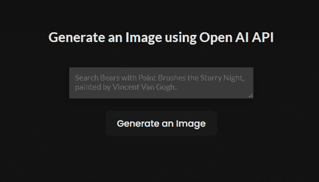
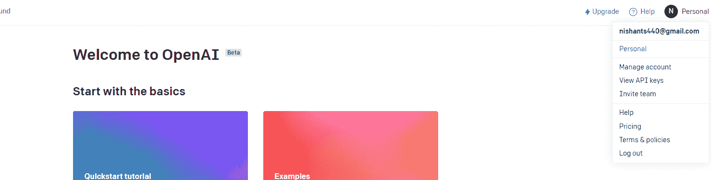
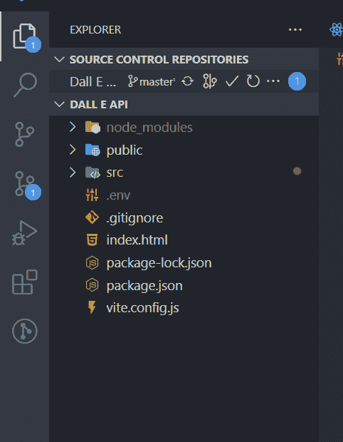
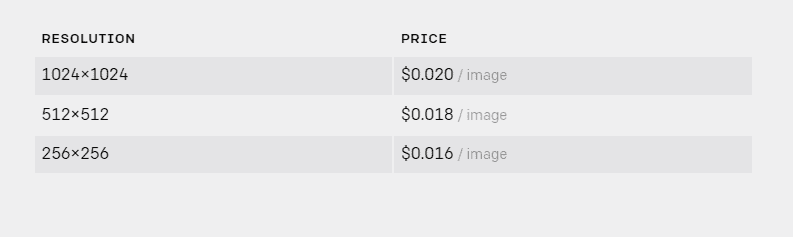
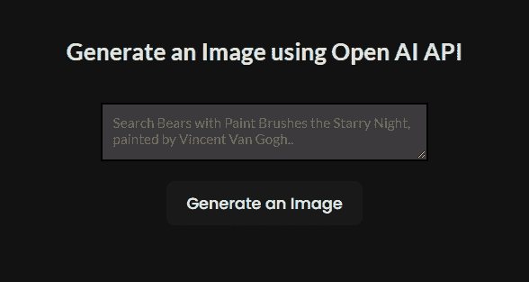
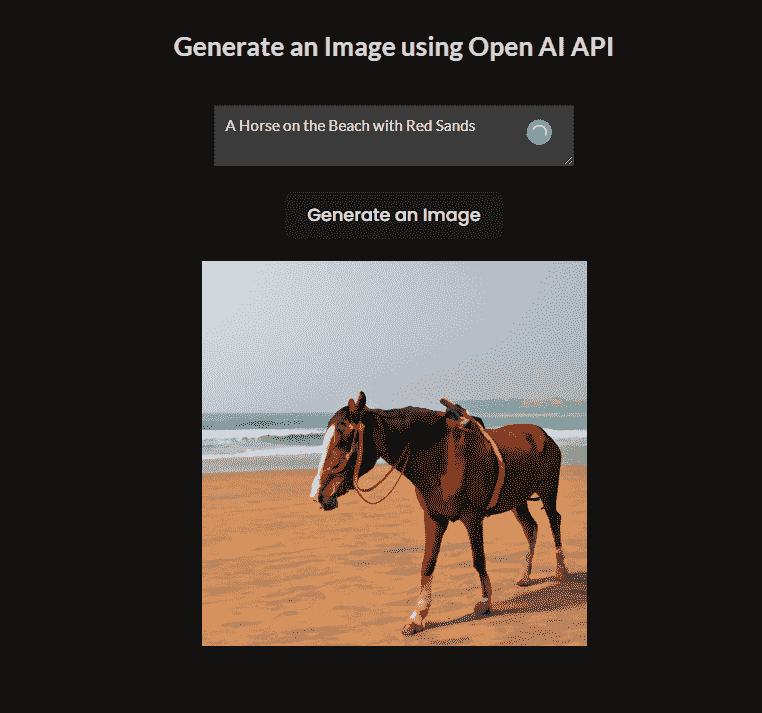
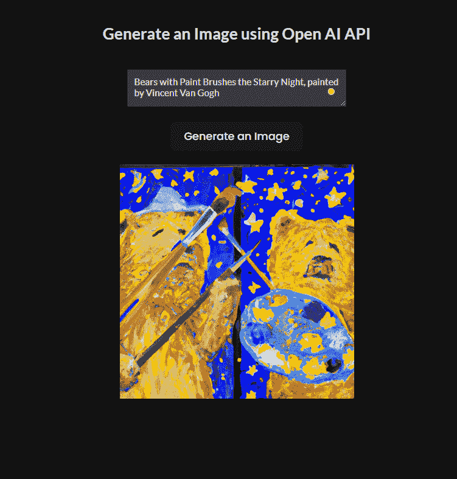

# 如何使用 React 和 Dall-E 2 API 生成图像——React 和 OpenAI API 教程

> 原文：<https://www.freecodecamp.org/news/generate-images-using-react-and-dall-e-api-react-and-openai-api-tutorial/>

嘿大家好！OpenAI 刚刚发布了 DALL-E API，用户只需输入一个查询就可以生成自定义图像。

因此，在本教程中，您将学习如何将 OpenAI DALL-E 2 API 与 React 应用程序集成。

## 但是首先，Dall-E 是如何工作的？

正如你已经知道的，你必须输入一个查询——类似文森特·梵高画的**拿着画笔的熊在星夜里。这里面包含了太多的关键词，像画笔、星夜、文森特梵高。**

Dall-E 要做的就是搜索这些与我上面提到的关键词相关的图片。然后它会用人工智能把所有的图像合并成一个，然后服务给我们。

现在让我们学习如何将它集成到您的 React 应用程序中，以创建您自己的具有这些惊人特性的应用程序。

## 如何创建 React 应用程序

因此，创建一个 React 应用程序。您可以使用 CRA (create-react-app)命令创建它，也可以使用 Vite。

我们需要一个文本字段和一个按钮作为 UI 组件。文本字段将用于从用户处获取查询，按钮用于触发 API 请求。让我们还创建一个状态来存储查询和一个函数，该函数将在单击按钮时运行。

```
import { useState } from "react";
import "./App.css";

function App() {
  const [prompt, setPrompt] = useState("");

  const generateImage = async () => {};

  return (
    <div className="app-main">
      <>
        <h2>Generate an Image using Open AI API</h2>

        <textarea
          className="app-input"
          placeholder="Search Bears with Paint Brushes the Starry Night, painted by Vincent Van Gogh.."
          onChange={(e) => setPrompt(e.target.value)}
          rows="10"
          cols="40"
        />
        <button onClick={generateImage}>Generate an Image</button>
      </>
    </div>
  );
}

export default App; 
```

我们的输出将如下所示:



### 如何将 DALL-E 2 API 与 React 应用程序集成

让我们看看如何将 DALL-E 2 API 集成到我们的应用程序中。

首先我们需要去 [OpenAI](https://beta.openai.com) 网站。您需要注册以生成 API 密钥。你的账户里还会有 18 美元可以使用。

选择在注册时创建应用程序。

因此，在您创建了您的帐户之后，请转到查看 API 密钥部分，在这里您可以创建您唯一的 API 密钥。查看下图以供参考。



现在，在 React 应用程序中，创建一个**。env** 文件。这是为了存储 API 密钥。



在那里添加您的 API 密钥。请注意，从。env 文件在 CRA 和 Vite React 应用程序中是不同的。所以请记住这一点。我使用的是 Vite，所以我们是这样做的:

```
VITE_Open_AI_Key = "Your API Key"
```

现在已经添加了 API 键，我们需要在 App.js 或 App.jsx 文件中导入一些东西。其中包括来自 **openai SDK** 的**配置**和 **OpenAIApi** 。但是首先，我们需要将 **openai SDK** 安装到 React 应用程序中。

要安装它，只需键入以下命令:

```
npm install openai
```

安装可能需要一些时间。然后，像这样导入我们之前提到的两个东西:

```
import { Configuration, OpenAIApi } from "openai";
```

我们需要创建一个配置变量，它将从。环境文件。

```
const configuration = new Configuration({
	apiKey: import.meta.env.VITE_Open_AI_Key,
});
```

现在，我们需要将这个配置实例传递给 OpenAIApi，并为 OpenAIApi 创建一个新实例。

```
const openai = new OpenAIApi(configuration);
```

以下是到目前为止的全部代码:

```
import { Configuration, OpenAIApi } from "openai";

import { useState } from "react";
import "./App.css";

function App() {
  const [prompt, setPrompt] = useState("");
  const configuration = new Configuration({
    apiKey: import.meta.env.VITE_Open_AI_Key,
  });

  const openai = new OpenAIApi(configuration);

  return (
    <div className="app-main">
      <>
        <h2>Generate an Image using Open AI API</h2>

        <textarea
          className="app-input"
          placeholder="Search Bears with Paint Brushes the Starry Night, painted by Vincent Van Gogh.."
          onChange={(e) => setPrompt(e.target.value)}
          rows="10"
          cols="40"
        />
        <button onClick={generateImage}>Generate an Image</button>
      </>
    </div>
  );
}

export default App; 
```

现在在 **generateImage** 函数中，我们需要调用之前创建的 OpenAIApi 实例。记住，函数需要是异步的。

```
const generateImage = async () => {
    await openai.createImage({
      prompt: prompt,
      n: 1,
      size: "512x512",
    });
  };
```

如你所见，我们正在使用 **openai.createImage** 。这个 API 用于使用用户查询创建图像。它还需要 **n** ，这是我们希望 API 返回的图像数量，以及图像的**大小**。

有三种不同的图像尺寸和不同的价格，如下所列。如果您使用的是 1024x1024 尺寸，每张图片将花费您 0.020 美元。



现在这个 **openai.createImage** 返回一些我们可以存储在变量中的响应。然后，我们可以从响应变量中获取生成的图像链接。

```
const generateImage = async () => {
    const res = await openai.createImage({
      prompt: prompt,
      n: 1,
      size: "512x512",
    });

    console.log(res.data.data[0].url);
  };
```

但是我们不要那样做。让我们再创建一个状态来存储这个图像链接，这样我们就可以在 UI 本身中查看图像。

```
const [result, setResult] = useState("");

const generateImage = async () => {
    const res = await openai.createImage({
      prompt: prompt,
      n: 1,
      size: "512x512",
    });

    setResult(res.data.data[0].url);
  };
```

现在图像链接将存储在**结果**状态中。让我们也在 UI 中渲染图像。但是由于结果最初是空的，我们可以创建一个支票。我们将只看到州内有链接的图像标签。

```
{result.length > 0 ? (
          
        ) : (
          <></>
        )}
```

这也是造型:

```
.result-image {
  margin-top: 20px;
  width: 350px;
}
```

用户界面现在看起来像这样:



让我们输入一些内容，看看输出结果:



在上面的例子中，我输入了**一匹在沙滩上的红色的马。**这是结果。

让我们试试更复杂的东西，比如文森特·梵高画的《星夜》中拿着画笔的熊。

结果如下:



这是你如何做它。你可以键入任何输入查询，它将通过人工智能生成图像。

## 包扎

这就是所有的人。现在您知道了如何使用 DALL-E 2 API 创建自己的 React 应用程序来使用 AI 生成图像。您可以添加更多的功能。所以，继续尝试一下吧。

如果你想看这个的视频版本，在我的 YouTube 频道 [Cybernatico](https://www.youtube.com/c/CybernaticoByNishant) 上查看我在[上的视频使用 React 和 Dall-E API 生成图像- React 和 OpenAI API 教程](https://youtu.be/oacBV4tnuYQ)。

查看 [GitHub](https://github.com/nishant-666/Dall-E-API-with-React) 上的代码以供参考。

> 快乐学习。