# 初学者如何学习 Linux 终端——技巧和例子

> 原文：<https://www.freecodecamp.org/news/how-to-learn-linux-terminal-as-a-beginner/>

2017 年买了新的笔记本电脑，换成了 Linux。我从 Ubuntu 开始(但是后来跳到了初级的，因为大多数人认为它对初学者友好)。

人们还建议我应该习惯于使用键盘和终端而不是鼠标来享受 Linux 的终极力量。

于是我开始学习各种终端命令和键盘快捷键。我打字很快，这是蛋糕上的樱桃。

在本文中，我将向您介绍我在 Linux 中学习处理文件和文件夹操作的经历。

## 先决条件

在开始使用终端之前，您需要熟悉两个命令。无论你想做什么手术，它们都会派上用场。

它们是`cd`和`ls`命令。

*   `**cd**`是一个命令，可让您在“终端”中导航到一个路径或不同的文件夹
*   `**ls**`是一个命令，让你列出一个目录中的所有文件和文件夹

## 我是如何开始学习一些基本的 Linux 命令的

我喜欢从网上下载和阅读文件和书籍。但我以前有个坏习惯，就是把所有文件都下载到`Downloads`文件夹里。

有一天我急着找一份文件，因为我要做一个演示。但是打开并搜索我的`Downloads`文件夹中的一长串文件真的让我很沮丧，因为它有 1000 多个文件。

我想找到一个快捷方式来识别文件。我唯一的线索是这是一份 PDF 文档。所以，我计划将所有的 PDF 文件复制到另一个临时文件夹。

### 如何仅将 PDF 文件从一个文件夹复制到另一个文件夹

`cp`是复制文件的命令。谢天谢地，Linux 终端几乎在任何地方都支持`regex`。所以，我的工作变得相当简单。下面是将 pdf 文件复制到另一个文件夹的代码:

```
cp <file(s)_to_copy> <destination_folder>
```

cp - Terminal command to copy files and folders

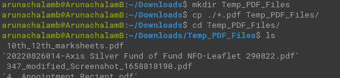

How to copy only the pdf files from one folder to another? 

从上面的截图来看，你可能对`mkdir Temp_PDF_Files`命令感到困惑。您使用`mkdir`命令创建一个新目录。

有些人可能还会把`cp`命令中的`*./**.pdf`弄混。基本上，在编程领域，我们称之为**正则表达式**。Regex 代表**正则表达式，**，我们使用它们通过匹配模式来过滤项目。在我们的例子中，它是以`.pdf`扩展名结尾的文件

运行该命令后，只有不到 50 个 PDF 文件。我能在几分钟内找到文件。

如你所见，对你下载的文件进行分类是明智的。

太好了，我完成了我的报告。但是，我希望该文件被正确命名，以便我将来可以更快地找到它。

### 如何在 Linux 中重命名文件

我在谷歌上学习如何做到这一点，但我惊讶地发现到处都是相同的答案，我觉得这是不对的。这是`mv`命令，我理想地使用它将文件/目录从一个路径移动到另一个路径。

进一步深究，发现重命名文件用的是同一个`mv`命令。

```
mv <existing_file_name> <new_file_name>
```

mv - Terminal command to rename a file

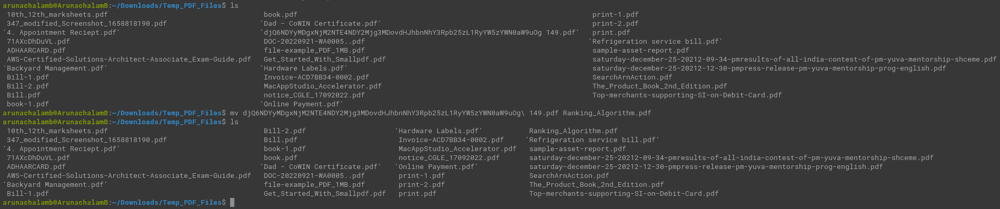

How to rename a file in Linux? 

我完成了文件的重命名。但是，我不想让我创建的临时文件夹复制所有的 PDF 文件。

### 如何在 Linux 中完全删除一个文件夹(包括它的文件和子文件夹)

在讨论这个问题之前，我将重命名后的文件复制到一个安全的地方，这样以后我就可以很容易地记住它。我有点紧张，因为我要删除整个文件夹。平时删东西都会有这种感觉。

你可以用我以前用过多次的`rm -rf`命令删除文件和文件夹。

```
rm -rf <folder_name>
```

rm -rf - Terminal command to remove a folder and all it's contents


How to delete a folder completely in Linux? 

但是要小心，因为这是一个**危险的**命令。在删除文件夹之前，它不会要求任何确认。恢复用这个命令删除的文件夹几乎是不可能的。

## 如何在 Linux 中创建和读取文件

当迟到时，人们通常会感到紧张，这对于重要的会议或在线课程来说更糟。这就发生在我身上——它让我有了一次学习通过终端处理文件操作的绝佳经历。

这是一个阳光明媚的早晨，我的网络课已经开始了——我迟到了两分钟。我想开始记笔记，但我前一天晚上把笔记本和笔放在了某个地方，记不清具体位置了。

我想到的下一件事就是打开谷歌文档。但是这个网站需要一些时间来加载。

"为什么我不在我的机器上创建一个文本文件并开始做笔记？"，这是我接下来想到的问题。

### 如何在 Linux 中创建文件

我记得我的一个朋友告诉我，你可以使用`touch`命令来立即创建一个文件。但是，我还没有尝试过。所以我做了:

```
touch notes.txt
```

touch - Terminal command to create a file

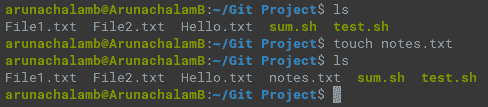

touch - Linux command to create a file

但是...但是...但是...

此命令创建一个文件，但不在编辑模式下打开该文件，因此您可以开始做笔记。在这里，您可以使用您最喜欢的文本编辑器打开文件。

vim 和 **nano** 是 Linux 中两个著名的文本编辑器。

vim 是一个高级且强大的文本编辑器，可以用来执行复杂的文件操作**，这也是许多 Linux 系统管理员所使用的。**

****nano** ，另一方面，是一个简单的文本编辑器，你可以用它来执行**简单的文件操作**。**

**我使用的是 nano，所以我运行了命令`nano notes.txt`。这将立即在编辑模式下打开文本文件。我开始在会议中做笔记。**

**终于到了下课，却不知道保存文件。在备份笔记之前，我不敢尝试任何命令。所以，我拿起我的手机，拍下了我的笔记。**

**快速谷歌搜索了一下，发现命令是“CTRL + X”保存文件(会提示是/否保存文件，打“Y”按“Enter”保存)。**

**保存文件后，我很好奇想检查一下我保存的是否正确。**

### **如何在 Linux 中读取文件内容**

**在做了一次谷歌搜索后，我发现有多种方法可以读取一个文件。`cat`、`head`和`tail`是一些可以用来读取文件的命令，它们都有自己的用例。**

*   **`**cat**`命令显示文件的全部内容**
*   **`**head**`命令在文件顶部显示几行，通常用于检查您是否要打开正确的文件**
*   **而`**tail**`命令显示通常用于从任何进程读取日志的文件的底部几行。**

**下面是一个`cat`命令的例子:**

```
`cat notes.txt`
```

**cat - Terminal command displays the entire content of the file**

**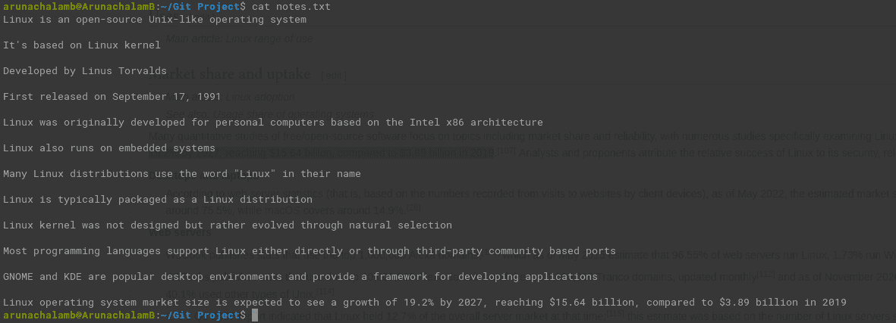

Reading contents on my notes file with **cat** command** 

**这里是`**head**`和`**tail**`命令的输出:**

**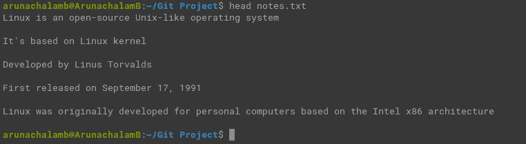

Output of **head** command displaying top few lines of notes file** **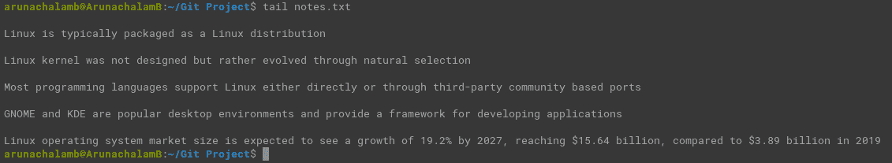

Output of **tail** command displaying last few lines of notes file** 

### **如何在 Linux 下读取带有行号的文件内容**

**有一天，我的一个同事问我:“嘿！你知道如何在终端中显示文件内容及其行号吗？”**

**我没有遇到过任何这样的命令可以明确地用于这一点。我知道我可以编写一个脚本来逐行读取文件，然后在控制台上通过每一行的预挂起行号来打印它们。**

**他想探索这个选择。**

**我们都开始解决这个问题。有趣的是，在中间，我们发现了一个简单明了的命令。**

**是的——我说的是`nl`命令。你像这样使用它:**

```
`nl notes.txt`
```

**`nl` - Terminal command to read the contents of the file with line numbers**

**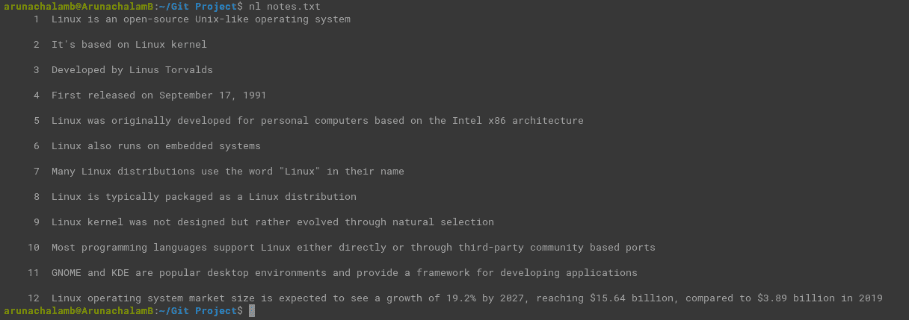

`nl` command shows contents of file with line numbers** 

**太神奇了，不是吗？从上面的代码可以看出，`nl`命令用行号显示了文件的内容。**

## **我从团队中学到的 Linux 命令**

**我和我的团队过去常常坐在一起，作为一个小组工作。我们会就任何随机的技术问题提问，并尝试探索任何出现的问题的解决方案。所以我想快速总结一下我从同事那里学到的一些东西。**

**它们中的大多数都围绕着 Linux 中许多可用的文件实用程序命令，而大多数人都不知道这些命令。在我们的开发过程中，我们遇到了许多与处理文件有关的场景。**

**我的同事 **Naras** 问了这个问题:**

### **查找文件属性的命令是什么？**

**嗯，`stat`命令显示文件的属性，如名称、大小、权限、由用户创建、创建和更新的日期和时间等等。看起来是这样的:**

**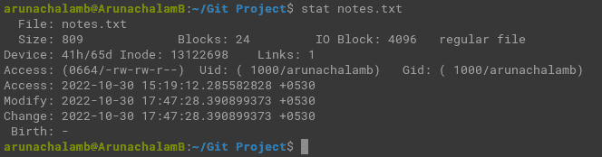

`stat` - Terminal command to display the properties of the file** 

### **有没有一个命令来查找文件中的字数？**

**这是一个来自乌达亚的很棒的问题。**

**是的。但是，不仅仅是单词——你还可以使用`wc`命令计算行数和字节数。**

**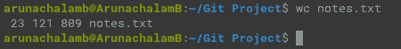

`wc` command displays number of lines, words and bytes of a file** 

**上面显示的文件有 23 行 121 个单词。它的大小是 809 字节。**

### **你能用命令找到文档的类型吗？**

**几周前，我遇到了库马尔提出的一个非常奇怪的问题:**

**“大多数文档都是用它们的扩展名创建的。但是最近我发现有些 PDF 文档不是用。pdf 扩展名。我们有找到文档类型的命令吗？”**

**是的，我们有。`file`命令显示文档的类型，如下所示:**

```
`file notes.txt`
```

**file - Terminal command to display the type of file**

**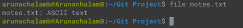

`file` command displaying the type of `notes.txt` file** 

**为了回答他的问题，以下是在删除文件名扩展名前后显示类型为 PDF 文档的证明:**

**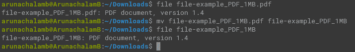

`file` command displaying file type without the extension** 

### **如何在文件中找到某个单词的出现次数？**

**我的同事 **Divad** 问我们是否能找到某个特定单词在文件中出现的所有行。**

**我意识到这可以通过`grep`命令来实现。**

**那么什么是`grep`？**

**`**grep**`代表 **G** 全局搜索 **R** 正则 **E** xpression 和 **P** rint out。它基本上是一个搜索工具，匹配正则表达式模式并打印出来。**

```
`grep -i "Linux" notes.txt`
```

**`**grep**` - Terminal command to filter out lines containing the match from the file**

**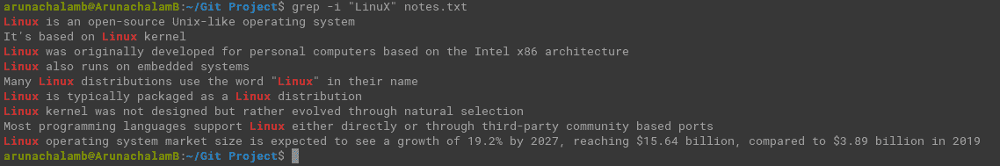

`**grep**` command displays lines containing **Linux** from **notes.txt** file** 

**`**-i**`标志表示执行**不区分大小写**搜索。为了执行**区分大小写的**搜索，**从命令中删除****`-i`**标志。**

### **如果我想找到所有不包含特定单词的行，该怎么办？**

****拉曼**提出了一个问题，“如果我想找到所有不包含给定单词的行怎么办？”**

**可以使用相同的`grep`命令，但是要应用`-v`参数，如下所示:**

```
`grep -v "Linux" notes.txt`
```

**`**grep -v**` command filters out lines that does not contain the match from the file **

**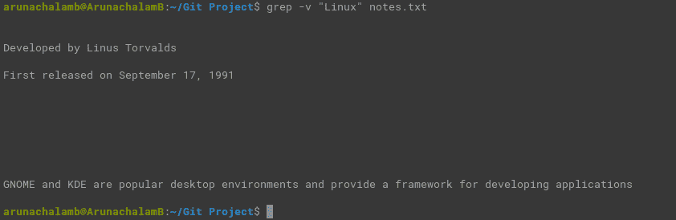

`**grep -v**` command displays lines not containing the word **Linux** from the **notes.txt** file** 

**如你所见，通过讨论我们的问题和一起解决问题，我们学到了很多。**

# **结论**

**在这篇文章中，我分享了我初学使用 Linux 的经验。我希望你喜欢阅读这篇文章。**

**你可以在这里和我[联系。](https://www.linkedin.com/in/arunachalamb/)**

**你可以在 [Instagram](https://www.instagram.com/5minslearn/) 、 [Twitter](https://twitter.com/5minslearn) 、 [LinkedIn](https://www.linkedin.com/in/5minslearn/) 和 [Medium](https://5minslearn.medium.com/) 上关注我。**