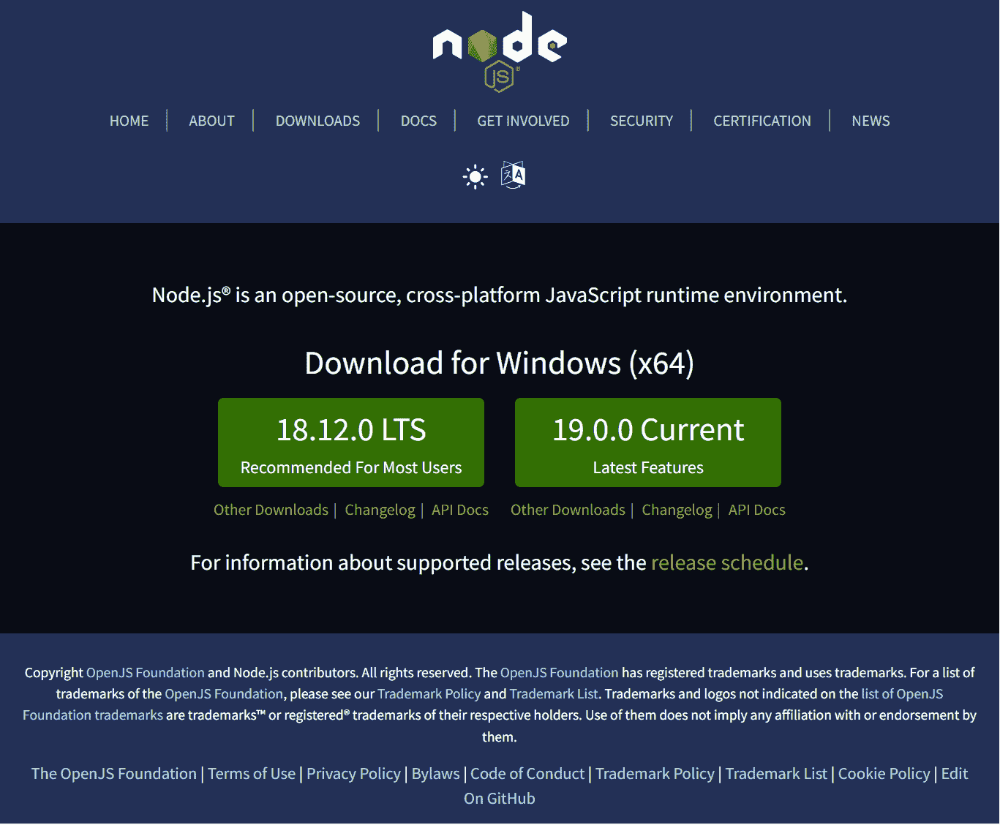
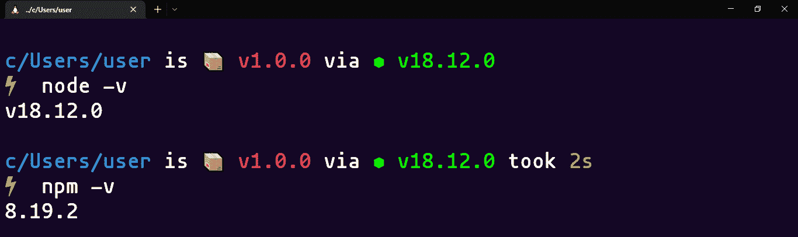
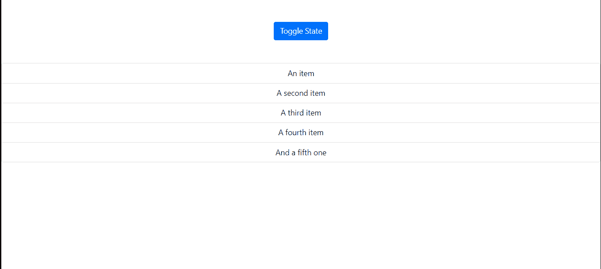
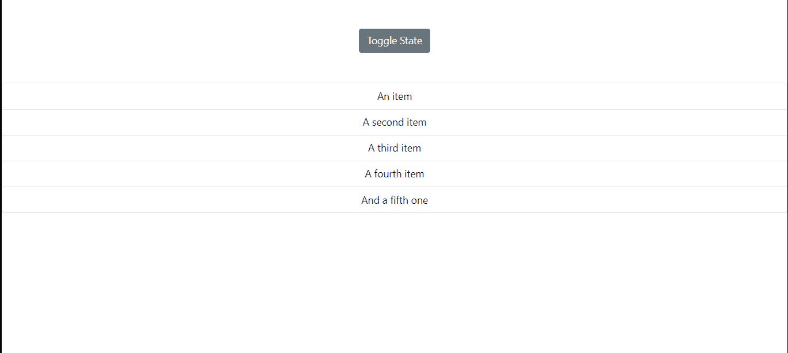
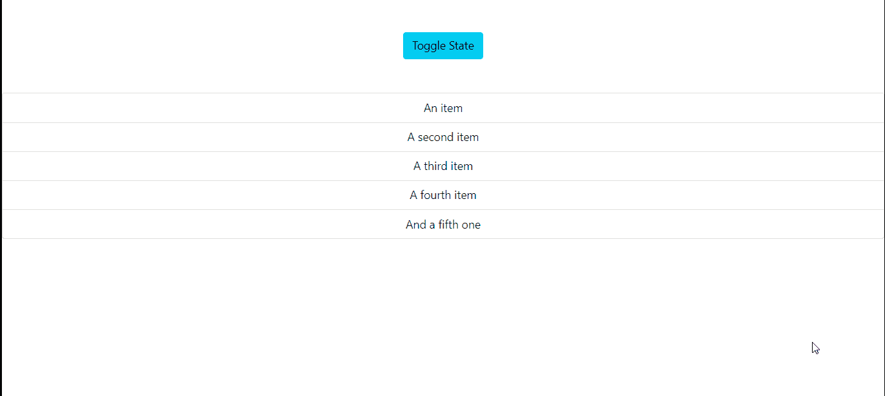
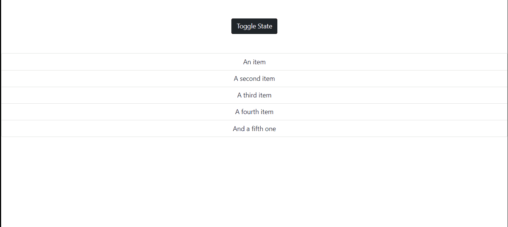
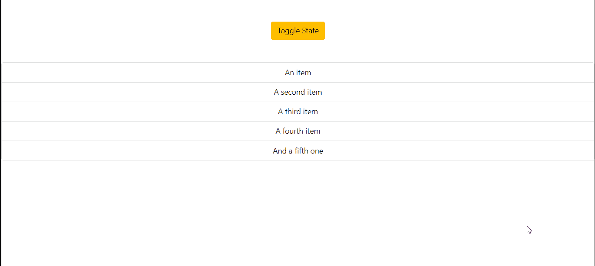

# 如何使用 React 挂钩切换 React 中的元素

> 原文：<https://www.freecodecamp.org/news/toggle-elements-in-react-using-hooks/>

构建 web 应用程序时，切换元素是您可能会遇到的关键特性之一，并且可能需要在项目中实现。

有多种方法可以切换元素。在本文中，我们将了解如何在 React 中以五种不同的方式实现切换功能。

## 目录

*   [如何安装和设置 React 项目](#how-to-install-and-setup-the-react-project)
*   [如何使用逻辑运算符切换元素](#how-to-toggle-an-element-using-logical-operators)
*   [如何使用切换钩切换元素](#how-to-toggle-an-element-using-the-usetoggle-hook)
*   [如何使用三元运算符切换元素](#how-to-toggle-an-element-using-the-ternary-operator)
*   [如何使用 If/Else 语句切换元素](#how-to-toggle-an-element-using-the-if-else-statement)
*   [如何使用 CSS 条件样式切换元素](#how-to-toggle-an-element-using-css-conditional-styling)
*   [结论](#conclusion)

你也可以在下面观看这篇文章的视频版本，或者在我的 [YouTube 频道](https://www.youtube.com/watch?v=S_mgSHCWCmA&t=15s)观看:

[https://www.youtube.com/embed/5CTFTDpHHto?feature=oembed](https://www.youtube.com/embed/5CTFTDpHHto?feature=oembed)

## 如何安装和设置 React 项目

要创建 React 项目，您需要能够访问 NPM(节点包管理器)。访问 NPM 需要安装 Node.js。前往[官方 Node.js](https://nodejs.org/en/) 网站下载 Node.js 即可安装 Node。



Node.js official documentation

我建议选择“推荐给大多数用户”的版本。一旦安装完成，您就可以打开您的终端并运行命令`node -v`和`npm -v`。这将为您提供有关您拥有的节点和 npm 版本的详细信息。



Terminal showing node and npm versions

仍然在您的终端中，您现在可以安装 [Create React App](https://create-react-app.dev/) ，这是一个允许您使用以下命令创建 React 项目的平台:

`npm i create-react-app`

下一步是通过运行命令从终端创建一个新的 React 项目:

```
npm init react-app toggle
cd toggle 
code . 
```

上面，我们创建了一个名为`toggle`的新项目。然后，我们导航到新创建的项目目录，并在代码编辑器中打开项目。我们现在可以开始实现切换元素的不同方法的过程。

## 如何使用逻辑运算符切换元素

为了确保我们的页面设计看起来结构化，我们将在 React 项目中设置 Bootstrap 5。

为此，前往 [Bootstrap 5](https://getbootstrap.com/docs/5.0/getting-started/introduction/) 网站，复制 CSS CDN 链接标签。然后转到 React 项目中的`index.html`文件，该文件可以在`public`目录中找到。将 CDN 链接粘贴在 head 部分，你可以在下面的代码中看到:

```
<!DOCTYPE html>
<html lang="en">

<head>
  <meta charset="utf-8" />
  <link rel="icon" href="%PUBLIC_URL%/favicon.ico" />
  <meta name="viewport" content="width=device-width, initial-scale=1" />
  <meta name="theme-color" content="#000000" />
  <meta name="description" content="Web site created using create-react-app" />
  <link rel="apple-touch-icon" href="%PUBLIC_URL%/logo192.png" />
  <link rel="manifest" href="%PUBLIC_URL%/manifest.json" />
  <!-- Bootstrap 5 CDN Link -->
  <link href="https://cdn.jsdelivr.net/npm/bootstrap@5.0.2/dist/css/bootstrap.min.css" rel="stylesheet"
    integrity="sha384-EVSTQN3/azprG1Anm3QDgpJLIm9Nao0Yz1ztcQTwFspd3yD65VohhpuuCOmLASjC" crossorigin="anonymous">
  <title>React App</title>
</head>

<body>
  <noscript>You need to enable JavaScript to run this app.</noscript>
  <div id="root"></div>
</body>

</html> 
```

接下来，在`src`目录中创建一个名为`components`的新文件夹。然后在`components`文件夹中创建一个名为`LogicalNot.js`的新文件。为了实现**逻辑非**运算符方法，我们将实现下面的代码:

```
import React, { useState } from 'react'

const LogicalNot = () => {

  //Using Inline Function and the The Logical Not (!) to toggle state
  const [toggle, setToggle] = useState(true)

  return (
    <>
      <button 
            onClick={() => setToggle(!toggle)} 
            class="btn btn-primary mb-5">
          Toggle State
      </button>
      {toggle && (
        <ul class="list-group">
          <li class="list-group-item">An item</li>
          <li class="list-group-item">A second item</li>
          <li class="list-group-item">A third item</li>
          <li class="list-group-item">A fourth item</li>
          <li class="list-group-item">And a fifth one</li>
        </ul>
      )}
    </>
  )
}
export default LogicalNot 
```

在`LogicalNot.js`文件中，我们从以下内容开始:

*   导入`useState`钩子。
*   然后我们创建两个变量叫做`toggle`和`setToggle`，同时设置初始状态为**真**。
*   接下来，在 *jsx* 部分中，我们创建了一个具有`onClick`事件处理程序的按钮。在这个`onClick`处理程序中，我们通过使用我们之前声明的名为`setToggle`的设置器来创建一个匿名函数。然后，我们将匿名函数中的参数设置为`!toggle`，当它被点击时会产生一个虚假的效果。
*   最后，我们通过将`ul`标签中的元素包裹在`toggle`变量周围，然后使用逻辑`&&`操作符在页面上有条件地呈现它，来切换该元素。

要在浏览器上显示`LogicalNot.js`文件，请转到`App.js`文件，并在那里导入文件，如下所示:

```
import './App.css';
import LogicalNot from './components/LogicalNot';

function App() {
  return (
    <div className="App mt-5">
      <LogicalNot />
    </div>
  );
}

export default App; 
```

这样，您应该会得到下面的结果:



Logical not operator sample

## 如何使用 useToggle 钩子切换元素

您将通过在*组件*文件夹中创建一个名为`ToggleHook.js`的新文件来开始这一步。在这个文件中，导入`useState`钩子。

```
import React, { useState } from 'react' 
```

接下来，创建一个名为`useToggle`的变量，它将保存`useToggle`钩子的逻辑，如下所示:

```
 //Using useToggle Hook

  const useToggle = (initialState) => {
    const [toggleValue, setToggleValue] = useState(initialState);

    const toggler = () => { setToggleValue(!toggleValue) };
    return [toggleValue, toggler]
  }; 
```

*   上面，我们创建了一个回调函数，然后给它一个名为`initialState`的参数。
*   接下来，我们使用`useState`钩子创建一个 getter 和一个 setter，分别叫做`toggleValue`和`setToggleValue`。`useState`钩子接受我们之前创建的`initialState`参数，该参数将初始值默认设置为 false。
*   最后，我们创建了一个名为`toggler`的变量。该变量包含一个匿名函数，该函数包含我们的`useState`变量，然后在单击时将结果设置为相反的值。然后我们在一个数组中返回了`toggleValue`和`toggler`变量。

现在我们可以使用`useToggle`钩子创建一个 getter 和 setter 变量，如下所示:

```
 const [toggle, setToggle] = useToggle(); 
```

我们现在可以在代码的`jsx`部分实现`useToggle`钩子的逻辑:

```
 return (
    <div>
      <button 
            onClick={setToggle} 
            class="btn btn-secondary mb-5">
          Toggle State
      </button>

      {toggle && (
        <ul class="list-group">
          <li class="list-group-item">An item</li>
          <li class="list-group-item">A second item</li>
          <li class="list-group-item">A third item</li>
          <li class="list-group-item">A fourth item</li>
          <li class="list-group-item">And a fifth one</li>
        </ul>
      )}

    </div>
  ) 
```

*   上面，我们使用前面声明的`setToggle` setter 创建了一个包含`onClick`事件处理程序的按钮。
*   然后，我们根据被点击的变量`toggle`的布尔条件来呈现元素。

这样，我们应该会得到下面的结果:



useToggle sample

## 如何使用三元运算符切换元素

三元运算符是一个 JavaScript 运算符，接受三种不同的运算，它们是:

*   一种状况
*   一个问号(？)在条件为真时执行条件
*   冒号(:)用于在条件为假时执行条件

要实现这个方法，首先要导入`useState`钩子:

```
import React, { useState } from 'react' 
```

然后，您需要使用`useState`钩子创建两个变量，并将默认值设置为 true:

```
 const [toggle, setToggle] = useState(true); 
```

接下来，创建一个名为`handleClick`的变量来保存回调函数。在这个函数中，调用`setToggle` setter，然后传入`!toggle`以在点击时返回一个相反的值，如下所示:

```
 const handleClick = () => {
    setToggle(!toggle);
  }; 
```

最后，您现在可以呈现您在`jsx`中创建的变量的逻辑:

```
 return (
    <div>
      <button 
      onClick={handleClick} 
      class="btn btn-info mb-5">
      Toggle State
      </button>

      {toggle ?
        <ul class="list-group">
          <li class="list-group-item">An item</li>
          <li class="list-group-item">A second item</li>
          <li class="list-group-item">A third item</li>
          <li class="list-group-item">A fourth item</li>
          <li class="list-group-item">And a fifth one</li>
        </ul>
        :
        <></>
      }
    </div>
  ) 
```

*   上面我们创建了一个按钮，它使用一个`onClick`事件处理程序来引用我们之前创建的`handleClick`变量。
*   然后我们可以通过使用`toogle`变量条件，以及问号(？)显示元素，或者如果 toggle 变量设置为 false，则使用冒号(:)显示一个空的 *jsx* 片段。

这样，我们应该会得到下面的结果:



Ternary operator sample

## 如何使用 If/Else 语句切换元素

`If/Else`语句是一个条件语句，用于根据某些参数执行不同的操作。如果某个条件为真，则`if`语句执行该条件，当条件为假时，则`else`语句执行。

要查看 if/else 语句的运行情况，让我们从导入`useState`钩子开始:

```
import React, { useState } from 'react' 
```

接下来，创建 getter 和 setter 变量，然后将默认值设置为 true:

```
 const [toggle, setToggle] = useState(true); 
```

接下来，创建一个名为`handleClick`的变量来保存回调函数。在这个函数中，调用`setToggle` setter，然后传入`!toggle`以在点击时返回一个相反的值，如下所示:

```
 const handleClick = () => {
    setToggle(!toggle)
  }; 
```

您现在可以通过使用`jsx`中的`toggle` getter 来显示元素，如下所示:

```
if (toggle) {
    return (
      <div>
        <button onClick={handleClick} class="btn btn-dark mb-5">Toggle State</button>
        <ul class="list-group">
          <li class="list-group-item">An item</li>
          <li class="list-group-item">A second item</li>
          <li class="list-group-item">A third item</li>
          <li class="list-group-item">A fourth item</li>
          <li class="list-group-item">And a fifth one</li>
        </ul>
      </div>
    )
  } else {
    return <button onClick={handleClick} class="btn btn-dark mb-5">Toggle State</button>
  } 
```

*   在`jsx`中，我们将整个元素包装在`if/else`语句中。
*   在`if`语句中，当`toggle`设置为 true 时，我们在页面上呈现包含列表项的元素。
*   但是，在 else 块中，当 toggle 设置为 false 时，只返回 button 元素。

这样，我们得到了下面的结果:



If/else statement sample

## 如何使用 CSS 条件样式切换元素

条件样式是一种基于特定条件在 React 中操作 DOM 元素的方法。正如我们之前所做的，让我们从在 React 中导入`useState`钩子开始:

```
import React, { useState } from 'react' 
```

接下来，设置您的`useState`钩子，创建所需的变量:

```
 const [toggle, setToggle] = useState(true); 
```

然后创建一个函数，在单击时帮助设置相反状态的值:

```
 const handleClick = () => {
    setToggle(!toggle);
  }; 
```

这样，您现在可以在代码的`jsx`部分配置条件样式:

```
 return (
    <div>
      <button onClick={handleClick} class="btn btn-warning mb-5">Toggle State</button>

      <ul class="list-group" style={{ display: toggle ? 'block' : 'none' }}>
        <li class="list-group-item">An item</li>
        <li class="list-group-item">A second item</li>
        <li class="list-group-item">A third item</li>
        <li class="list-group-item">A fourth item</li>
        <li class="list-group-item">And a fifth one</li>
      </ul>

    </div>
  ) 
```

*   上面，我们首先创建了一个按钮，它包含前面创建的名为`handleClick`的`onClick`事件处理程序。
*   然后，我们使用`ul`标签中的 style 属性，有条件地将显示设置为当`toggle`变量为真时阻止显示。如果`toggle`变量为假，我们将显示设置为无。这可以通过三元运算符来实现。

结果看起来像这样:



Conditional styling sample

## 结论

在本教程中，您学习了在 React 应用程序中切换元素的各种方法。如果你想访问代码库，你可以在 GitHub 的这里克隆 repo [。](https://github.com/desoga10/showandhide)

此外，如果你喜欢这篇文章，你可以通过订阅我的 YouTube 频道来表示你的支持，在那里我创建了关于 web 开发技术的很棒的教程，比如 Angular、React、JavaScript、Html、CSS 以及更多的概念。