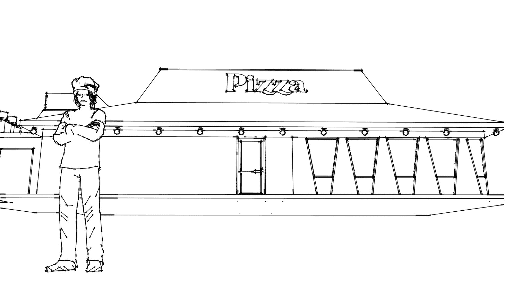
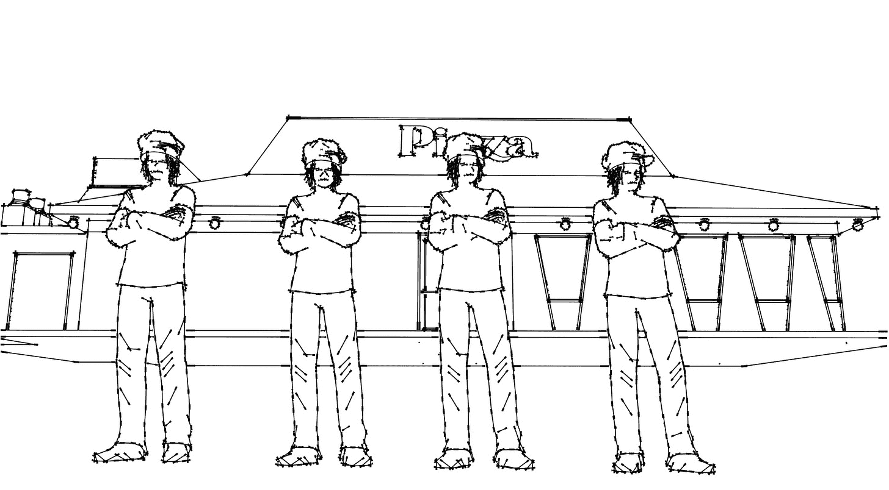
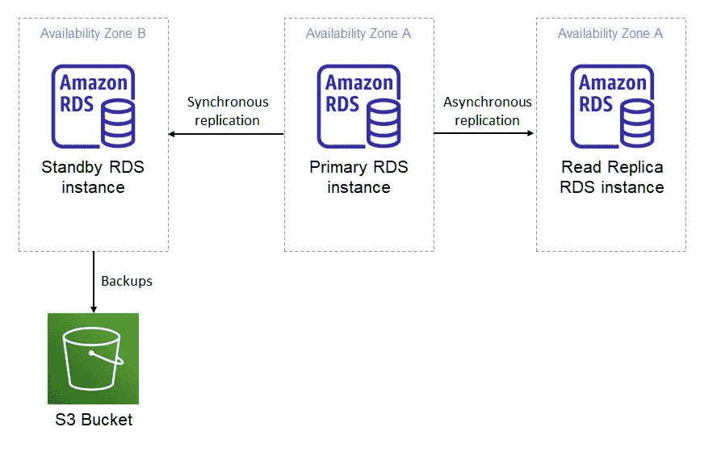
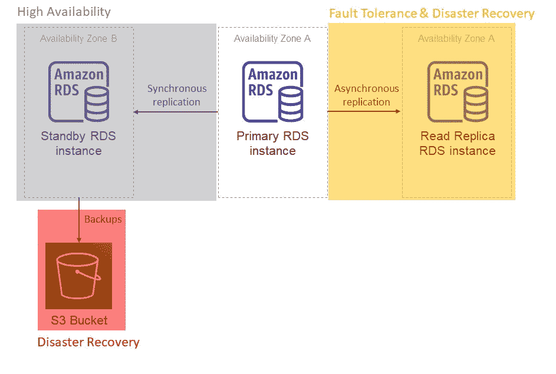

# 高可用性、容错和灾难恢复——用类比解释

> 原文：<https://www.freecodecamp.org/news/high-availability-fault-tolerance-and-disaster-recovery-explained/>

高可用性、容错和灾难恢复是设计系统时要考虑的重要因素。

这些术语有时会被架构师和开发人员互换使用。然而，它们不是一回事——理解它们的区别可以帮你省去很多麻烦，还可以节省时间和金钱。

本文将介绍这三个术语之间的区别，并解释如何在 AWS 中实现它们。

## 高可用性 vs 容错 vs 灾难恢复

高可用性系统的目标是尽可能经常在线。虽然在高可用性系统中仍然可能发生停机，但是高可用性的目的是限制停机时间，而不是完全消除停机。

容错系统是一种可以在故障中运行而不停机的系统。容错旨在完全避免停机。

然而，在一个完整的系统故障中，高可用性和容错是不够的。灾难恢复描述了当高可用性和容错缓冲在系统范围的故障中消失时，系统如何能够继续运行。

## 高可用性意味着什么？

首先，让我们描述一下什么是高可用性。高可用性并不意味着系统永远不会出现故障或经历停机。一个高度可用的系统就是一个旨在尽可能经常在线的系统。

想象一下，我们有一家 365 天每天 24 小时营业的披萨店。如果那家餐馆只有一名厨师，那么它的可用性——即处理订单的能力——就不会是 100%。这是因为一个厨师一天只能工作 8 个小时，中间休息 1 个小时，或者实际上一周 7 天，一天 7 个小时。

因此，厨师一周可能工作 168 个小时，但只能工作 49 个小时。这家餐馆有 29%的空房。

A low availability restaurant

对于一家希望全年 24 小时营业的餐馆来说，这当然不是足够高的可用性。

那么，我们如何提高餐厅的可用性呢？雇佣更多的厨师。如果我们有四个厨师一周工作七天，每天工作六个小时，那么我们的理论利用率是 100%。

A higher availability restaurant

这种 100%的可用性只是理论上的，因为它假设厨师一整年都不会错过工作。这是一个糟糕的假设，因为厨师可能会生病，他们的汽车可能会在上班的路上抛锚，或者他们可能不得不提前下班去接他们的孩子。

假设所有这些厨师停工时间一年加起来有五个小时。这将为您提供 99.94%的可用性。

你怎样才能让餐厅更有人气？雇佣随时待命的厨师，他们一接到通知就可以来餐馆。但是这样做的代价很高，因为你必须付钱给这些厨师，让他们等到需要的时候。

这些待命厨师给你的是**从没有足够厨师满足顾客订单的情况下快速恢复的能力**。由于现实的限制，你永远不可能拥有 100%的可用性。你只能以越来越高的价格接近 100%的可用性。

### 什么是系统的可用性？

可用性是系统能够响应请求的概率。

请注意，高可用性与比萨饼的质量或交付速度无关。高可用性仅仅与餐馆响应顾客比萨饼订单的能力有关。

主要的云提供商通常有描述系统可用性的 SLA。

以 blob 存储系统为例。AWS S3 标准版的可用性 SLA 为 99.99%。Azure blob 存储和谷歌云存储也是如此。

99.99%的可用性到底是什么意思？意味着在任何一年，系统都有 99.99%的概率上线。99.99%的正常运行时间等于 0.01%的停机时间。这相当于大约 53 分钟的停机时间，整整一年不到一个小时。

99.9%的可用性怎么样？这种系统的停机时间为 0.1%，即一年 8.8 小时。

虽然 99.9%的可用性看起来很高，但对于处理支付的银行、空中交通管制系统或任何其他关键系统来说，这样长的停机时间可能是无法接受的。

您应该以什么样的可用性为目标？这取决于您正在构建的系统的需求。

当然，您会受到云提供商的可用性 SLA 的限制，因此，例如，要实现 blob 存储系统 99.999%的可用性，灵活性是有限的。而且，您希望实现的可用性越高，解决方案就变得越昂贵和复杂。

## 容错是什么意思？

如果系统内部发生故障，系统能否继续运行而不出现任何中断？如果可以，那么系统是容错的。

那么高可用性和容错的区别是什么呢？对于高可用性系统，导致停机的故障会发生，但很少发生。该系统也能够从这种故障中恢复。但是当系统停机时，它无法响应请求。

在容错系统中，尽管出现故障，系统**仍可继续运行。**

让我们再次以比萨饼餐馆为例。如果餐馆停电，那么厨房里再多的厨师或待命的厨师也无法为顾客制作比萨饼，因为烤箱需要电源。

停电时立即启动的备用发电机使餐厅具有容错能力。

另一个很好的例子是喷气发动机驱动的商用飞机。这些飞机具有容错能力，因此在一个发动机出现故障的情况下，飞机可以继续飞行和着陆，而不会中断或不得不在飞行中修复故障发动机。

另一方面，直升机或单引擎飞机是不容错的。引擎故障意味着飞机不能飞行。这种故障通常是灾难性的，并且部分解释了与双引擎飞机相比，直升机和单引擎飞机更高的坠毁率。

An aircraft with two engines is fault tolerant

Helicopters and single engine aircraft are not fault tolerant

## 灾难恢复是什么意思？

如果系统故障规模大到系统的高可用性和容错性被有效中和，系统还能继续运行吗？

让我们回到餐馆的例子。如果火灾、洪水或任何其他灾难降临到你的披萨店，你如何继续为顾客制作披萨？

这是一个有点滑稽的例子，因为在发生火灾时，担心客户订单并不是主要的优先事项——但这个例子的逻辑仍然成立。

在这种情况下，高可用性没有任何帮助。在厨房里有无限多的厨师，或者在被火焰吞没的餐馆里待命=顾客没有比萨饼。

容错也无济于事。如果设备被毁坏了，备用发电机对它本来要供电的设备就没用了。

系统(餐厅)能够继续运行的唯一方法是将订单发送到附近另一家未受火灾影响的餐厅。灾难恢复是一个主动的行动计划，详细说明了在灾难发生后如何恢复。

## 将这一切结合在一起

现在，让我们来看一个同时具有高可用性、容错性和内置灾难恢复功能的单一体系结构。

All in one - high availability, fault tolerance, and disaster recovery in a single architecture

上面的架构展示了一个多可用性区域(AZ)关系数据库服务(Amazon RDS)部署。它显示了一个 RDS 数据库，在单独的 AZ 中有一个备用实例、一个只读副本和一个用于存储数据库每日备份的 S3 存储桶。

该 RDS 是 AWS 提供的完全托管的数据库即服务产品，其中 AWS 管理数据库的底层硬件、软件和应用程序。您可以在这里找到更多关于 [AWS RDS](https://aws.amazon.com/rds/) 和[可用性区域](https://aws.amazon.com/about-aws/global-infrastructure/regions_az/)的信息。

现在，让我们来分析一下这个系统是如何工作的，以及设计如何确保它具有高可用性、容错性并能从灾难中恢复。

### 如何实现高可用性

AZ A 中的主 RDS 实例将其数据同步复制到 AZ B 中的备用实例。

对于同步复制，主实例会一直等到备用实例收到最新的写操作，然后事务才会被记录为成功。这确保了两个数据库拥有相同的信息——也就是说，它们是一致的，当然这是以增加事务延迟为代价的。

主实例和备用实例采用主动-被动配置。只有主节点接收读写请求。备用实例的工作就是在主实例出现故障时接管主实例。

从主实例故障转移到备用实例所需的时间称为恢复时间目标(RTO)。RTO 只是描述了从故障中恢复需要多长时间。在这种情况下，多 AZ 配置中 RDS 的故障转移时间目前在 1-2 分钟之间。

备用实例只有一个目的:增加系统的可用性。如果主实例出现故障，或者整个 AZ A 出现故障，单独 AZ 中的备用实例将提升为主实例。此故障切换过程需要 1-2 分钟。这是 1-2 分钟的停机时间。

请记住，高可用性不是防止停机，而是简单地减少停机。如果没有备用实例，停机时间很可能会超过使用备用实例恢复所需的 1-2 分钟。

请注意，备用实例对容错没有帮助，因为主实例的故障仍然会导致停机。

### 容错是如何实现的

为了消除停机时间，您需要一种不涉及故障转移的配置。这是只读副本的工作。这些是主实例的异步复制拷贝。只对主实例进行写入。顾名思义，读取副本是只读的。

这种方法非常适合读取量大的应用程序，因为读取副本可以消除主实例的额外读取请求负担。

在异步复制中，在事务被记录为成功之前，对主实例的写入不会等待只读复制副本的响应。这意味着，在写入主复制副本后，主复制副本和读取复制副本中的数据在一段时间内可能不相同(而是不一致)。

这种最终的一致性(另一篇文章的主题)是异步复制的缺点。异步复制的好处是，在事务被记录为成功之前，它不等待读取副本响应。

这一点很重要，因为如果读取复制副本关闭或出现网络故障，主副本仍可以接受后续写入，而无需等待读取复制副本的响应，从而确认先前的写入已成功复制。

上面的架构有两个副本:一个是同步的，另一个是异步的。如果所有副本都是同步的，那么备用副本或只读副本中的一个故障，甚至是一个网络故障，都会使整个集群停止运行。这是一种脆弱的设计，如果一个组件出现故障，整个系统都有可能发生故障。一些副本是同步的，而另一些是异步的，这提高了系统的容错能力。

容错还有什么用处？就像一架飞机有两个喷气发动机提供推力一样，一个读取副本和一个主副本可以同时工作。主实例处理写入，读取复制副本响应读取请求。

主实例的故障不会影响读取复制副本响应读取请求的能力。读取没有停机时间，因为只有读取复制副本对读取做出响应。

写作怎么样？读取复制副本可以升级到主副本，尽管对于 RDS，这目前是一个手动过程。

### 如何实现灾难恢复

有了上面的体系结构，您可以用两种方式处理灾难恢复。没有将灾难恢复限制为一种方法的约束，因此您可以同时使用这两种方法。事实上，方法越多越好，因为这提供了额外的冗余。

最终，您应该权衡所有这些与成本，因为实施灾难恢复策略可能会非常昂贵。

第一种方法是通过自动备份。备份是从备用实例中获取的，这样可以防止必须为写入(以及读取，如果没有配置读取复制副本的话)提供服务的主实例的性能下降。由于主服务器和备用服务器之间存在同步复制，我们可以保证备用服务器是主服务器的最新副本，因此从主服务器获取备份是理想的。

使用 RDS，每天按照固定的时间表(由您指定)进行一次备份，并存储在 S3 存储桶中。由于这是一个完全独立的组件，任何与 RDS 相关的系统级故障都不会影响备份的持久性。

对于备份，主副本、备用副本和读取副本的丢失不等于数据的永久丢失。然后，可以使用备份将数据库恢复到新的数据库实例。

第二种方法是，如果主实例出现故障，将只读复制副本提升为独立实例。可以在另一个 [AWS 区域](https://aws.amazon.com/about-aws/global-infrastructure/regions_az/)中配置读取副本。这样，如果在一个区域范围内发生灾难，多个 az 出现故障，跨区域读取副本将确保另一个实例在不同的 AWS 区域中可用，以服务于读取和写入请求。

这类似于在发生火灾时将订单转移到另一家餐厅。

How different components improve the availability, fault tolerance and disaster recovery of a solution

## 包扎

可用性用百分比来衡量——数字越大，系统越可用(因此停机时间越少)。

很少有系统的目标是 100%的可用性，尽管起搏器是一个明显的例外。99.999%的可用性有 0.001%的停机时间=一年停机 5 分钟。这往往是大多数软件系统的上限。

在此基础上追求更高的可用性变得越来越复杂、昂贵，而且往往是不必要的。当您考虑到您正在构建的软件系统依赖于基础设施(如电网和互联网服务提供商，它们可能具有较低的可用性级别)时，尤其如此。

另一方面，容错是不可测量的。你的设计要么是容错的，要么不是。同样，灾难恢复也无法衡量。您要么有一个行动计划，精确地概述您的系统如何从灾难中恢复，要么没有。

了解高可用性、容错和灾难恢复之间的区别非常重要。它确保您基于客户需求构建正确的体系结构。

当只需要高可用性或容错时，通过提供灾难恢复来过度设计解决方案通常是一项昂贵而复杂的工作。

另一方面，通过仅在需要容错时提供高可用性来设计解决方案，可能会给一些无法承受任何停机时间的关键系统带来严重后果。