# 快速排序–c++和 Java 代码示例的算法时间复杂度

> 原文：<https://www.freecodecamp.org/news/quick-sort-algorithm-time-complexity-with-cpp-and-java-code/>

在本文中，您将了解最常用的编程算法之一——快速排序算法。

您将在视觉向导的帮助下了解算法是如何工作的。您还将看到一些代码示例，它们将帮助您用 C++和 Java 实现该算法。

最后但同样重要的是，我们将讨论快速排序算法在最坏、一般和最好情况下的时间复杂度。

我们开始吧！

## 快速排序算法是如何工作的？

快速排序算法基于分治规则。在给定的无序元素(数字)数组中，选择一个支点。枢纽很重要，因为其他元素将根据其值进行排序。

在排序操作结束时，所有低于中枢的数字将被移动到中枢的左侧，而所有高于中枢的数字将在右侧。这也称为分区。

在这个阶段，数据透视表右边和左边的数字很可能是无序的。

接下来，将透视前后的无序数字放入不同的数组中——一个数组用于左边的数字，另一个数组用于右边的数字。

然后在每个数组中选择一个支点，从头开始重复这个过程，直到每个数字都被单独排序。组合所有的数字，你将得到一个升序排列的数组。

以下是对上述解释的总结:

**步骤#1:** 给出一个无序数数组。

**步骤#2:** 选择一个数字作为支点。

**步骤#3:** 低于支点的数字移动到支点的左侧。

**步骤#4:** 高于支点的数字向支点右侧移动。

**步骤#5:** 数组被分解成两个数组——第一个数组将包含枢轴左侧的元素，而第二个数组将包含右侧的元素。

**步骤#6:** 对每个数组重复步骤#2 到#5，直到每个元素都按升序排序。

上面的步骤可能看起来令人困惑。在视觉指南的帮助下，您将在下一节中更好地理解它。

## 快速排序是如何工作的？

在上一节中，我简要总结了使用快速排序算法对数字数组进行排序时会发生什么。但这并没有解释分类操作是如何在引擎盖下工作的。

在本节中，通过使用可视化指南，您将了解如何将数字移动到透视的左侧或右侧，以及如何创建子数组(也称为分区)。这也将有助于您在我们到达该部分时轻松理解代码。

这里是我们将要使用的数组:`9,4,8,3,7,1,6,2,5`。

上面的数组有一组无序的数字。那么快速排序是如何工作的呢？

正如我在上一节中解释的，我们必须选择一个元素作为轴心。

所以我们以 5 为支点。我们还需要两个变量:`X`和`Y`。它们将用于比较和交换数字相对于轴心的位置。

看起来是这样的:

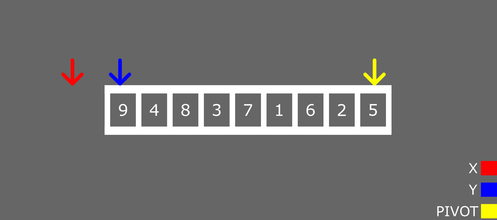

quick-sort parameters

在上图中，我们有三个箭头:红色、蓝色和黄色，分别代表`X`、`Y`和枢轴。

操作非常简单:

*   如果`y`的值大于支点，则增加`Y`。
*   如果`y`的值小于或等于支点，则增加`X`，并将`x`与`y`互换。

让我们使用上图中的数组来演示一下:`9,4,8,3,7,1,6,2,5`。

### 迭代#1

枢轴= 5。Y = 9。

Y 小于等于支点吗？号码

增量 y。

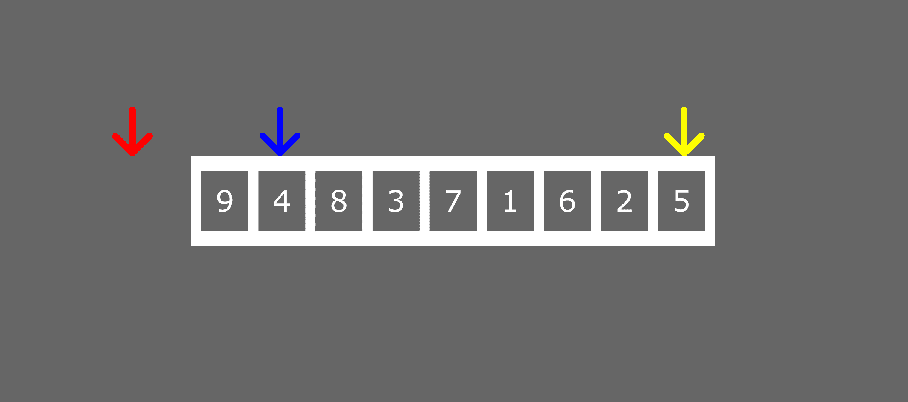

### 迭代#2

枢轴= 5。
Y = 4。

Y 小于等于支点吗？是的。

##### 步骤#1 -增加 X


##### 步骤 2 -交换 X 和 Y 的值

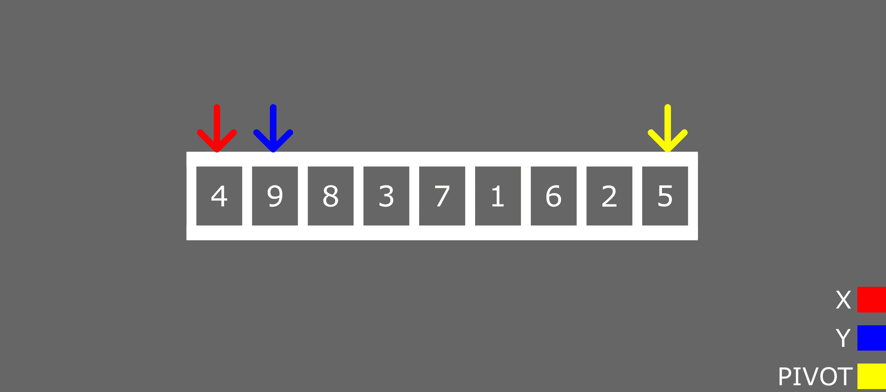

##### 第 3 步-增加 Y

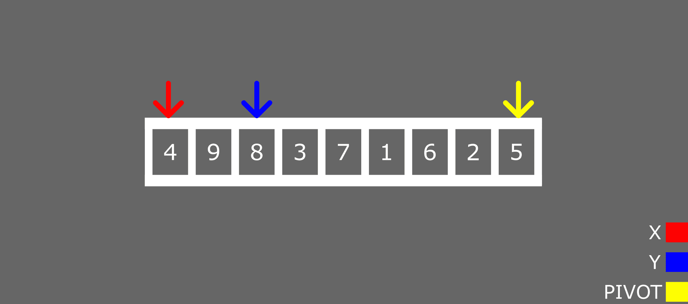

迭代#1 和#2 基本上是排序操作中发生的所有事情。

为了帮助你更好地理解，我将检查所有的迭代，直到我们得到比左边的枢轴小的数字和右边的大的数字。

### 迭代#3

枢轴= 5。
Y = 8。

Y 小于等于支点吗？号码

增量 y。

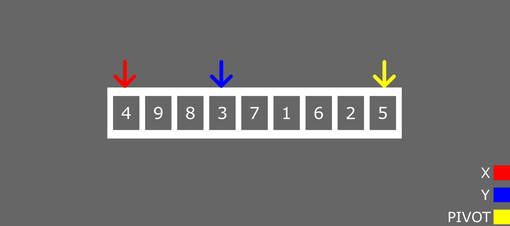

### 迭代#4

枢轴= 5。
Y = 3。

Y 小于等于支点吗？是的。

##### 步骤#1 -增加 X


##### 步骤 2 -交换 X 和 Y 的值


##### 第 3 步-增加 Y

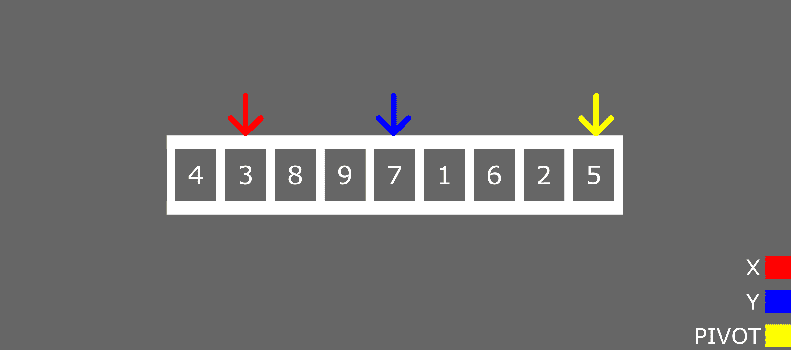

### 迭代#5

枢轴= 5。
Y = 7。

Y 小于等于支点吗？号码

增量 y。


### 迭代#6

枢轴= 5。
Y = 1。

Y 小于等于支点吗？是的。

##### 步骤#1 -增加 X


##### 步骤 2 -交换 X 和 Y 的值

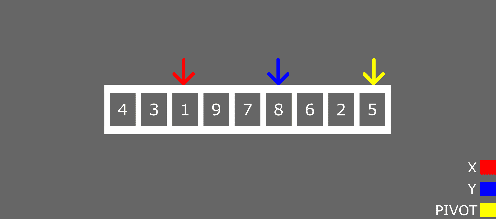

##### 第 3 步-增加 Y

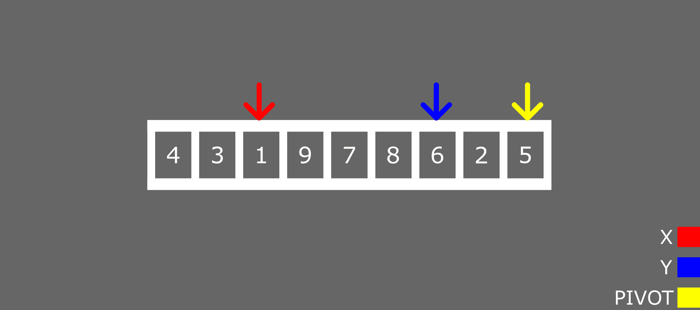

### 迭代#7

枢轴= 5。Y = 6。

Y 小于等于支点吗？号码

增量 y。

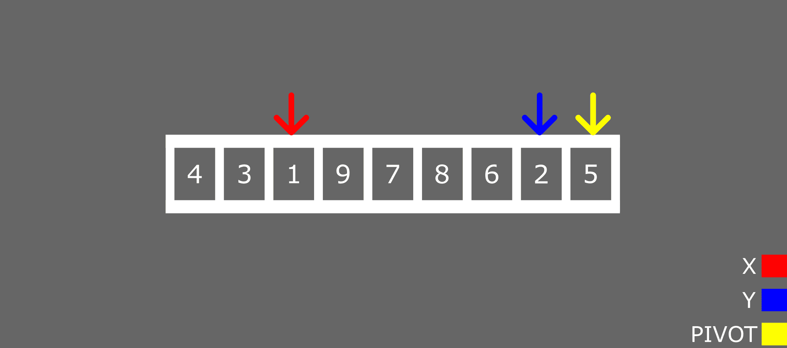

### 迭代#8

枢轴= 5。Y = 6。

Y 小于等于支点吗？是的。

##### 步骤#1 -增加 X

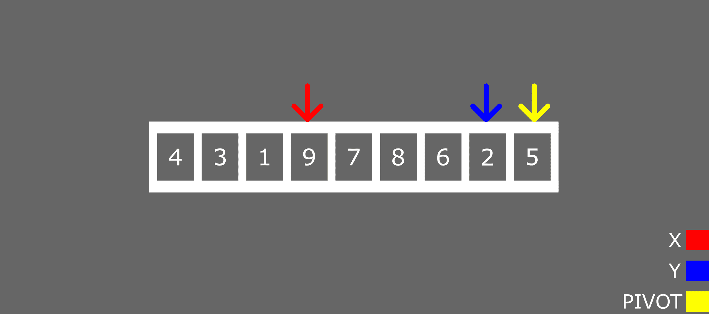

##### 步骤 2 -交换 X 和 Y 的值


##### 第 3 步-增加 Y

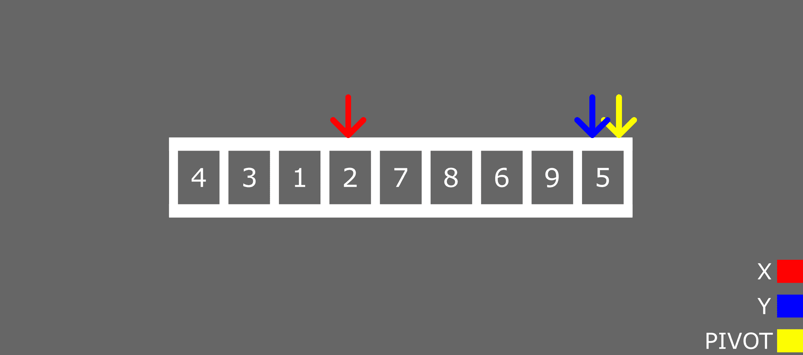

### 迭代#9

此时，`Y`现在正指向支点。您可以增加`X`并与`Y`交换 if，或者您可以使用之前迭代中的格式。我会选择后者。

枢轴= 5。Y = 5。

Y 小于等于支点吗？是的。

##### 步骤 1 -交换 X 和 Y 的值

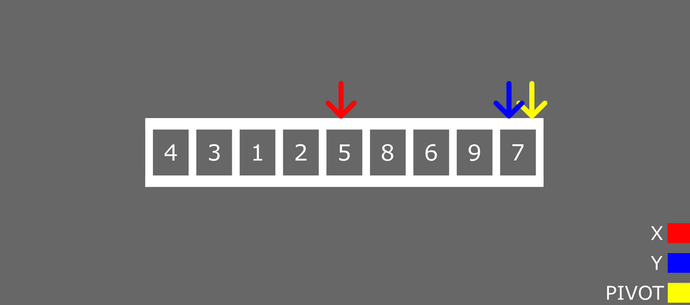

我们的数组现在看起来像这样:`4,3,1,2,5,8,6,9,7`

如果您查看阵列的当前状态，您会发现:

*   轴心现在位于中心。
*   枢轴左侧的所有数字都低于枢轴。
*   枢轴右侧的所有数字都高于枢轴。

但是我们还没有完成。数字仍然是无序的。为了对它们进行排序，我们将把数组分成两个子数组(不包括 pivot 元素)。

第一个数组将包含枢轴左侧的所有数字:`4,3,1,2`。

第二个数组将包含枢轴右侧的所有数字:`8,6,9,7`。

让我们对第一个数组进行排序。像往常一样，你需要一个支点。

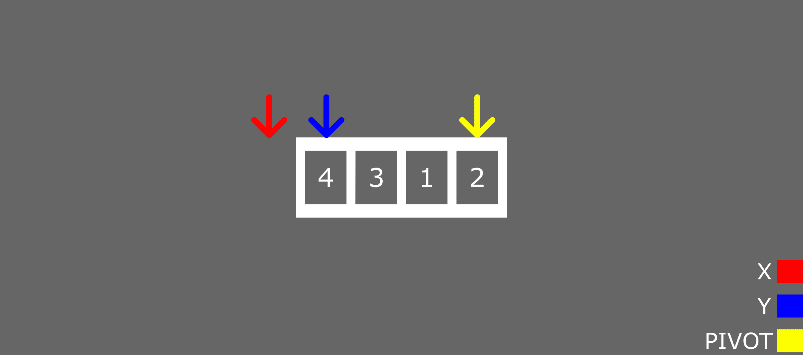

### 迭代#1

枢轴= 2。
Y = 4。

Y 小于等于支点吗？号码

增量 y。

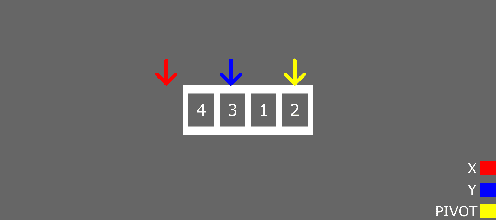

### 迭代#2

枢轴= 2。
Y = 3。

Y 小于等于支点吗？号码

增量 y。

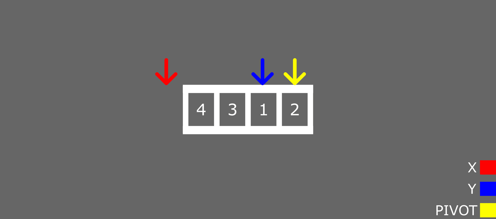

### 迭代#3

枢轴= 2。
Y = 1。

Y 小于等于支点吗？是的。

##### 步骤#1 -增加 X


##### 步骤 2 -交换 X 和 Y 的值


##### 第 3 步-增加 Y

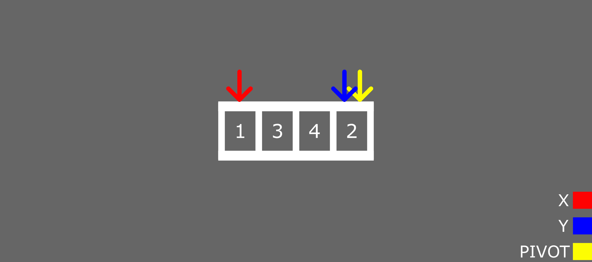

### 迭代#3

枢轴= 2。
Y = 2。

Y 小于等于支点吗？是的。

##### 步骤 1 -交换 X 和 Y 的值

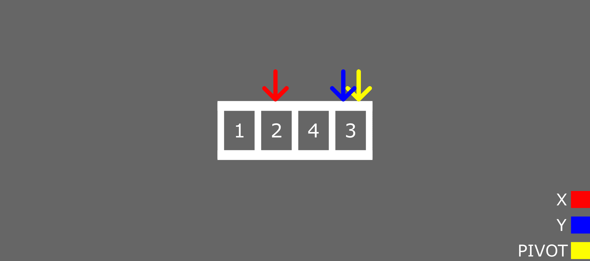

同样，我们将数组分解成子数组，不包括 pivot (2)。注意，我们仍然在处理初始数组左侧的数字。

第一个数组会有这个:`1`。

第二个数组会有这些:`4,3`。

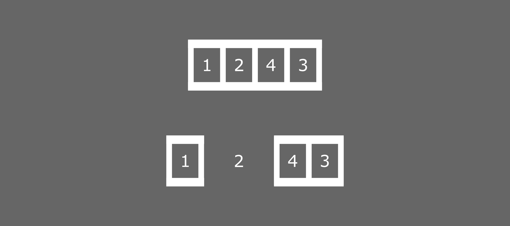

第一个数组只有一个元素，所以它已经排序了。让我们对第二个数组进行排序:

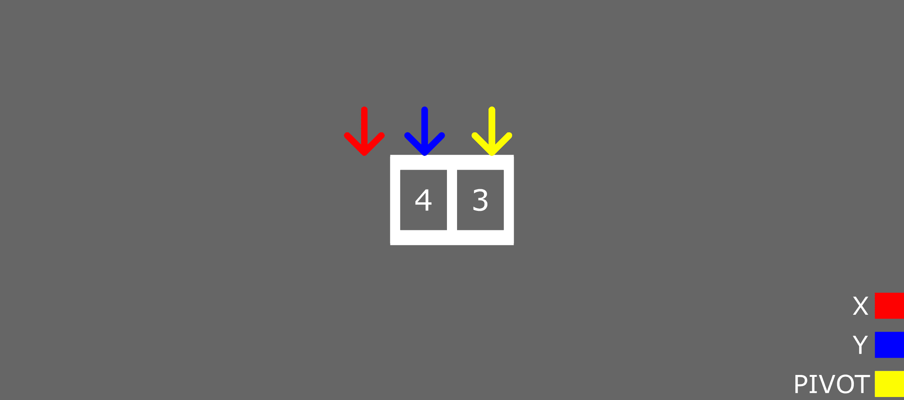

### 迭代#1

枢轴= 3。
Y = 4。

Y 小于等于支点吗？号码

增量 y。


### 迭代#2

枢轴= 3。
Y = 3。

Y 小于等于支点吗？是的。

##### 步骤 1 -交换 X 和 Y 的值

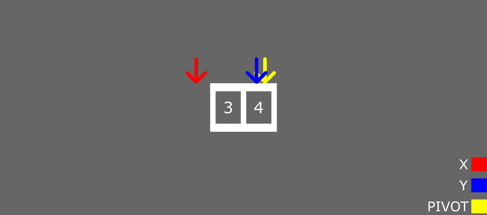

我们现在将按以下顺序排列这些数字:


第一个支点左侧的所有数字已经按升序排序:`1,2,3,4,5,8,6,9,7`。

对右边的数字进行排序的过程是相同的。是时候尝试自己做了！只需按照前面示例中的步骤操作即可。

## 快速排序算法 Java 代码示例

下面是快速排序算法的 Java 代码示例。为了让代码更容易理解，我加入了一些注释。

如果您遵循了前面的章节，那么这应该是不言自明的。

```
// Quick sort in Java

import java.util.Arrays;

class Quicksort {

    // method for swapping elements x and y
    static void swap(int[] arr, int x, int y) {
        int temp = arr[x];
        arr[x] = arr[y];
        arr[y] = temp;
    }

  // partition method
  static int partition(int array[], int low, int high) {

    //pivot
    int pivot = array[high];

    int x = (low - 1);

    // loop for comparing all elements with pivot element
    for (int y = low; y < high; y++) {
      if (array[y] <= pivot) {
        x++;

        swap(array, x, y);
      }

    }

    int temp = array[x + 1];
    array[x + 1] = array[high];
    array[high] = temp;

    return (x + 1);
  }

  static void quickSort(int array[], int low, int high) {
    if (low < high) {

      int array_partition = partition(array, low, high);

      // quick sort elements on the left recursively
      quickSort(array, low, array_partition - 1);

      // quick sort elements on the right recursively
      quickSort(array, array_partition + 1, high);
    }
  }
}

class Main {
  public static void main(String args[]) {

    int[] my_array = { 9,4,8,3,7,1,6,2,5 };

    int size = my_array.length;

    Quicksort.quickSort(my_array, 0, size - 1);

    System.out.println("Sorted Array: ");
    System.out.println(Arrays.toString(my_array));
    // Sorted Array: [1, 2, 3, 4, 5, 6, 7, 8, 9]
  }
}
```

## 快速排序算法 C++代码示例

下面是 C++中快速排序算法的一个例子:

```
#include <bits/stdc++.h>
using namespace std;

// function for swapping elements x and y
void swap(int* x, int* y)
{
	int temp = *x;
	*x = *y;
	*y = temp;
}

int partition(int arr[], int low, int high)
{
    // pivot
	int pivot = arr[high]; 
	int x = (low- 1); 

    // loop for comparing all elements with pivot element
	for (int y = low; y <= high - 1; y++) {

		if (arr[y] < pivot) {
			x++; 
			swap(&arr[x], &arr[y]);
		}
	}
	swap(&arr[x + 1], &arr[high]);
	return (x + 1);
}

void quickSort(int arr[], int low, int high)
{
	if (low < high) {

		int array_partition = partition(arr, low, high);

        // quick sort elements on the left recursively
		quickSort(arr, low, array_partition - 1);

		// quick sort elements on the right recursively
		quickSort(arr, array_partition + 1, high);
	}
}

// print array function 
void printArray(int arr[], int size)
{
	int i;
	for (i = 0; i < size; i++)
		cout << arr[i] << " ";
	cout << endl;
}

int main()
{
	int arr[] = { 9,4,8,3,7,1,6,2,5 };

	int size = sizeof(arr) / sizeof(arr[0]);

	quickSort(arr, 0, size - 1);
	cout << "Sorted array: ";
	printArray(arr, size);
    // Sorted array: 1 2 3 4 5 6 7 8 9 

	return 0;
} 
```

## 快速排序算法的时间复杂度

最坏情况=> O(n ² )

平均事例=> O(n*log(n))

最佳情况=> O(n*log(n))

## 摘要

在本文中，我们讨论了快速排序算法。

我们简单解释了算法的工作原理。在那之后，我们看到了一个例子，它解释了如何使用可视化向导对无序数组进行排序。

我们还看到了如何用 Java 和 C++实现快速排序算法。

最后，我们列出了最坏、一般和最好情况下的快速排序时间复杂度。

编码快乐！