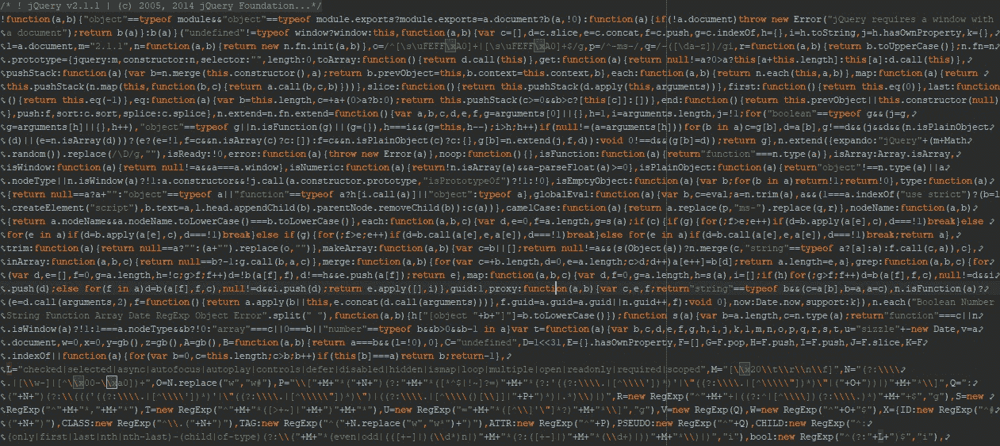

# JavaScript Minify——用 Minifier 或 jsmin 缩小 JS

> 原文：<https://www.freecodecamp.org/news/javascript-minify-minifying-js-with-a-minifier-or-jsmin/>

您可能想知道——什么是缩小，它如何改进您的 JavaScript 应用程序？你可以用什么工具来缩小你的 JS？我将在这篇文章中回答这些问题。

## 什么是缩小？

缩小是通过删除代码中不相关的部分来“最小化”代码的过程。这看起来像什么？

看看下面的 JavaScript 代码:

```
const variable = "Variable";

function print() {
  console.log(variable);
};

print(); // "Variable" 
```

这里我们有`variable`声明、`print`声明和`print()`执行。我们也有一个评论。

在 JavaScript 中，我们知道分号是用来结束语句的。这有助于解释器区分语句。

在上面的代码中，您可以在一些行的末尾看到分号，以显示语句的结束位置。

上面 JavaScript 代码的“简化”版本如下所示:

```
const variable="Variable";function print(){console.log(variable);};print(); 
```

两个版本将产生相同的结果。区别在于第一个版本易读，而第二个版本不易读。所以第一个版本适合于**开发**，而第二个版本适合于**生产**(你继续阅读就会明白这一点)。

我电脑上第一版的大小是 **100 字节**，第二版是 **75 字节**。当然，这在这里并不重要——但是在像下图这样的大型代码库中，差别是显而易见的:



Screenshot gotten from [StackOverflow](https://stackoverflow.com/questions/51766230/difference-between-the-output-of-minified-js-and-css-files)

## JavaScript 解释器不需要空格和注释

执行 JavaScript 代码的解释器不需要**空格**(空格、换行符等等)。它的执行也不需要注释。

间隔和注释掉我们的代码是我们作为开发人员为了改善我们的开发体验而做的事情。这些东西使代码更容易阅读，并帮助我们记住我们为什么做出某些决定。但它们是为我们这些开发者准备的，而不是你的浏览器。你的浏览器**不需要**这些东西。

接下来会发生的是，如果你的代码中有很多注释/空白，它会使文件变得不必要的大。

随着缩小，不必要的空白和评论被删除。缩小的代码产生与原始代码相同的执行结果，只是缩小的代码被压缩了，并且文件更小。

## 为什么文件大小很重要？

当您在浏览器上访问某个 URL 时，浏览器会为该 URL 获取存储在服务器上的资源。它获取`.html`文件，该文件又获取链接的样式表和脚本文件。

正确获取所有内容后，您会在浏览器上看到一个页面，其中包含样式化的元素和交互(使用 JavaScript 完成)。

有两件事会使接收所请求资源的过程变慢:

*   互联网连接弱
*   大量的资源

您不能控制 web 应用程序用户可能拥有的 internet 连接，但您可以控制文件的大小。

### 较小的文件大小缩短了加载时间

文件越大，完成下载(获取)的时间就越长。文件越小，下载完成得越快。

通过缩小您的 JavaScript 文件，您可以**缩短资源加载时间**，因为浏览器将需要更少的时间来完全下载这些文件。

### 文件越小，初始解析时间越短

当浏览器获取 JavaScript 文件时，JavaScript 引擎首先尝试解析该文件。解析包括逐行检查代码，明确忽略空白和注释，并检查代码的语法是否正确。

如果不是，就会出现错误。如果是，则代码被翻译成浏览器可以理解的机器代码。

文件越大，解析文件所需的时间就越长。大小越小，解析器花费的时间就越少。

因此，缩小 JavaScript 文件**可以改善初始解析时间**。

这些可以提高 web 应用程序的总体性能和响应时间。

## JS 的缩小工具

那么，如何使用空白、注释和其他您需要的东西来获得良好的开发体验，同时还能为生产交付缩小的文件呢？这个想法是让你的代码有一个**开发**和**生产**版本。

前者用于编写代码和构建应用程序，后者是存储在服务器上并交付给浏览器的内容。

你不必自己做这个缩小的过程。那几乎是不可能的。我将分享两个你可以使用的缩小工具。

### 使变小

这个工具删除空白、去除注释、合并文件，并优化一些常见的编程模式。您在设备上安装该工具，并在代码中使用您希望在生产中缩小的 JavaScript 路径对其进行配置。

你可以参考[库](https://github.com/matthiasmullie/minify)来了解更多关于这个工具的信息，并看看它是如何使用的。

### 我是 jsm

这个 NPM 库与 Minify 类似，用于删除 JavaScript 文件中的注释和空白。

作为 Node.js 模块，您可以全局安装它，并使用 CLI 命令缩小您的 JavaScript 项目。

查看 NPM 上的[库，了解更多关于它的信息、安装以及如何使用它。](https://www.npmjs.com/package/jsmin)

## 包扎

缩小是一个通过减少加载时间和从服务器获取文件的带宽来提高应用程序性能的过程。您可以对 HTML、CSS 和 JavaScript 等各种代码文件执行此过程。

在本文中，我解释了什么是缩小，为什么它是有益的，以及如何将它应用于 JavaScript 文件。你也可以在这里了解 [CSS 缩小。](https://www.freecodecamp.org/news/minify-css-css-minifying-and-compression-explained/)