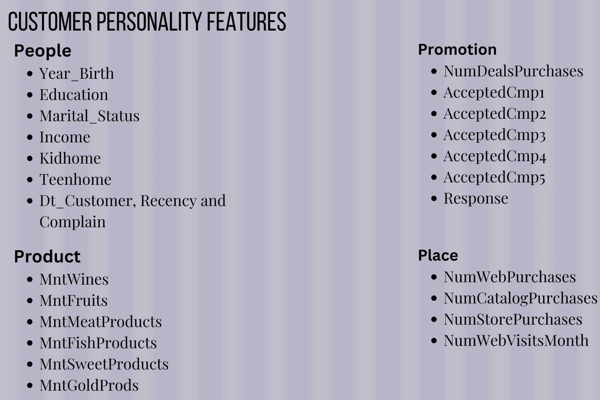
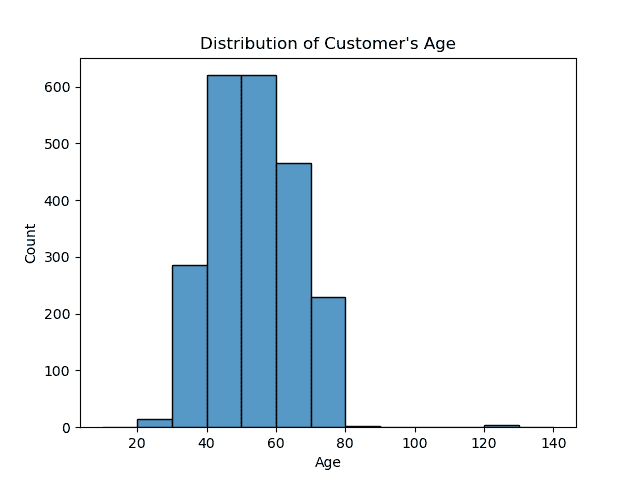
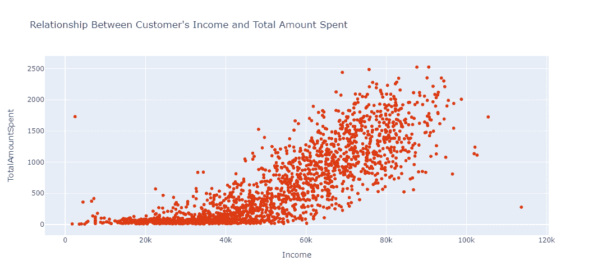
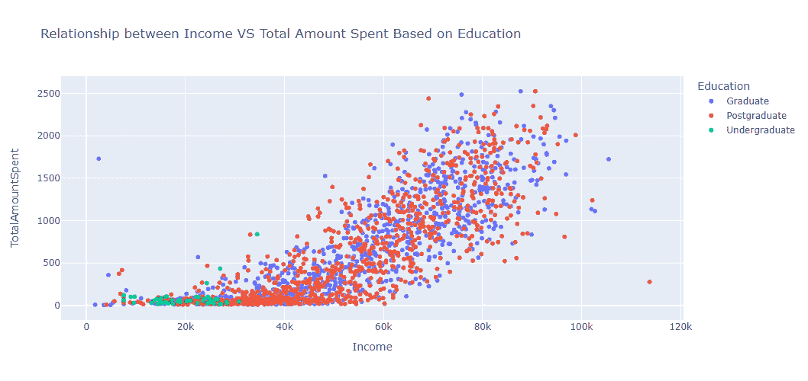
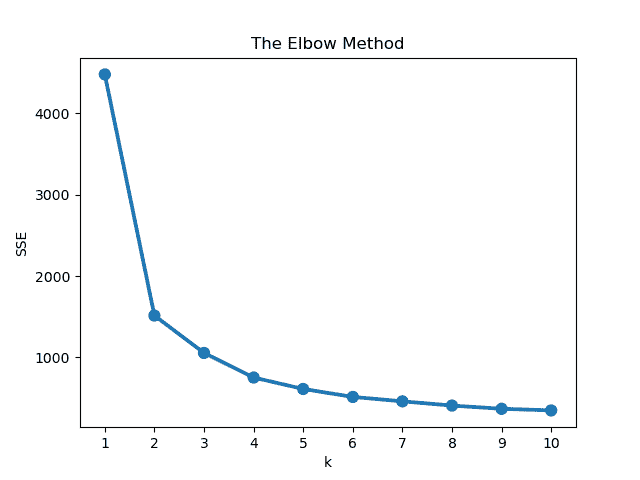
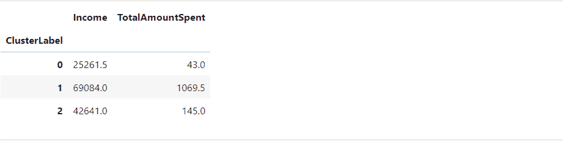
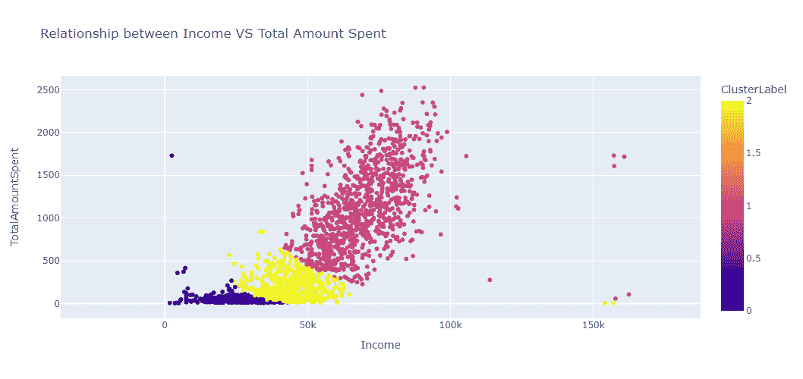
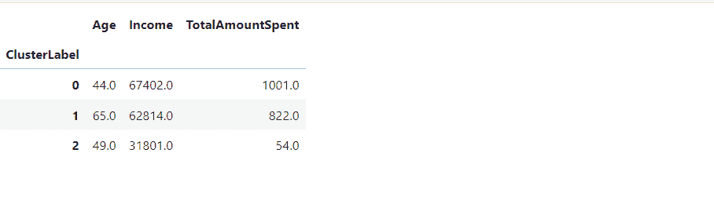
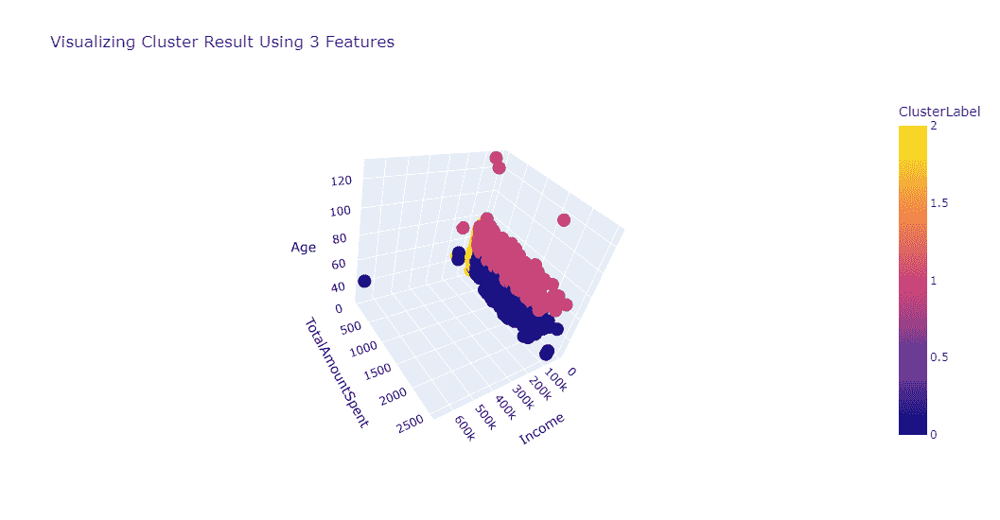
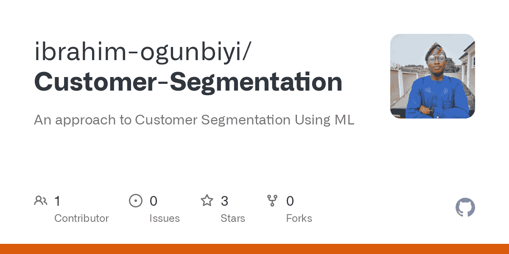

# 如何在 Python 中执行客户细分–机器学习教程

> 原文：<https://www.freecodecamp.org/news/customer-segmentation-python-machine-learning/>

在我开始写这篇文章之前，我想分享一下促使我写这篇文章的动机。

我写这篇文章是因为我想起了我第一次学习客户细分或聚类的时候。我当时并没有完全理解自己在做什么。

我所记得的是把所有的特征都放到`KMeans`和**voilà**——我已经开发了一个客户细分。我不了解每个细分市场的模型属性。

因此，我分享了我如何掌握客户细分的知识，希望你能从中受益。

在本教程中，您将学习如何建立有效的客户细分以及如何执行有效的探索性数据分析(EDA)。这些成分会让你的客户细分结果变得美味可口😋。事不宜迟，让我们开始吧。

## 什么是客户细分？

我们从文章开始就一直在谈论客户细分，但你可能不知道它的意思。

注意，在我们进入教程的编码部分之前，尝试并理解这个理论部分是很重要的。这个基础会帮助你有效的建立细分模型。

好了，回到定义什么是分段:

分割是指根据相似的属性将实体组合在一起。实体可以是客户、产品等等。

例如**客户细分**，特别是指根据相似的特征或属性将客户分组。

现在有一件事需要注意，当根据属性对客户进行分组时:您选择用来对客户进行分组的属性必须与您想要用来对客户进行分组的标准相关。

例如，假设您想根据客户购买的东西对他们进行分类。在这种情况下，客户的性别属性可能不是最佳的或者与细分不相关。

知道如何为客户细分选择合适的属性是至关重要的。

让我们看看不同类型的客户细分:

*   人口细分。
*   行为细分。
*   地理细分。
*   心理细分。
*   技术图形分割。
*   基于需求的细分。
*   基于价值的细分。

执行细分时，您将围绕人口统计和行为细分进行最典型的消费者细分。

**人口统计细分**是根据人口统计对客户进行分组的过程，即根据客户的年龄、收入、教育、婚姻状况等对客户进行分组。

**行为细分**是指根据客户的行为对其进行分组。例如他们作为一个群体购买的频率、他们在商品上花费的总金额、他们最后一次购买产品的时间等等。

要了解更多其他类型的客户细分，你可以阅读[这篇文章](https://blog.hubspot.com/service/customer-segmentation)。

## 客户细分标准

在对客户进行分组时，您应该选择根据您想要对他们进行细分的内容量身定制的相关功能。但在某些情况下，将几种类型的客户细分的特征结合起来，生成另一种类型的细分是有意义的。

例如，您可以结合人口统计和行为细分的特征来创建新的细分。这正是你将在本文中学到的——我们将使用人口统计特征和行为特征建立客户细分。

现在说得够多了，让我们言归正传吧。

## 理解业务问题。

业务问题是根据客户的个性(人口统计)和他们在产品上的花费(行为)来划分客户。这将有助于公司更好地了解客户的个性和习惯。

### 我们将用于此项目的工具

当然，我们使用 Python 来构建我们的项目——但是这些工具和库也是我们将用来帮助我们的。

1.  Jupyter 环境(Jupyter Lab 或 Jupyter notebook)——用于实验我们的项目。
2.  pandas——将数据作为数据帧加载并处理数据。
3.  Numpy 和 Scipy——用于执行一些基本的数学计算。
4.  sci kit-Learn–用于构建我们的客户细分模型。
5.  Seaborn、Matplotlib 和 Plotly Express–用于数据可视化。

如果您没有这些库，您可以在线查看它们的官方文档，看看如何安装它们。

### 我们将用于此项目的数据集

我们将在这个项目中使用的数据集来自 Kaggle。你可以去[这里](https://www.kaggle.com/datasets/imakash3011/customer-personality-analysis/download?datasetVersionNumber=1)下载。

以下是关于数据集的一些信息:

简而言之，数据集包含客户的人口统计数据及其与公司相关的行为。数据集的特征是:



### 客户个性分析特征

| 人 | 促进 | 产品 | 地方 |
| --- | --- | --- | --- |
| 出生年份 | 数字交易购买 | MntWines | NumWebPurchases |
| 标题 | AcceptedCmp1 | MntFruits | num catalog 采购 |
| 教育 | 接受的 Cmp2 | mntmeaptproducts | NumStorePurchases |
| 婚姻状况 | AcceptedCmp3 | MntFishProducts | NumWebVisitsMonth |
| 收入 | AcceptedCmp4 | MntSweetProducts |  |
| 儿童之家 | AcceptedCmp5 | MntGoldProds |  |
| 青少年之家 | 反应 |  |  |
| Dt _ 客户，最近， |  |  |  |
| 并抱怨 |  |  |  |

为了充分利用本教程，您可以提前下载整个 Jupyter 笔记本，这样您就可以轻松地跟随。你可以去[这里](https://github.com/ibrahim-ogunbiyi/Customer-Segmentation)叉回购。

## 探索性数据分析

您可能知道，EDA 是作为数据分析师或数据科学家表现出色的关键。它为您提供了有关整个数据集的第一手信息，并有助于您了解数据集中要素之间的所有关系。

在本教程中，我们将执行 EDA 的三个阶段，即:

1.  单变量分析。
2.  双变量分析。
3.  多变量分析

首先，我们需要导入我们将在这个项目中使用的所有必要的库。我们还需要将数据集加载到数据帧中，这样我们就可以看到其中存在的所有要素。

```
import pandas as pd
import seaborn as sns
import matplotlib.pyplot as plt
import plotly.express as px
import numpy as np
from scipy.stats import iqr
from sklearn.preprocessing import StandardScaler
from sklearn.cluster import KMeans

df = pd.read_csv("data/marketing_campaign.csv", sep="\t")
df.head()
```

首先，数据集中有许多特征，但是因为我们想要关注客户人口统计和行为，我们将只对与这些类别相关的特征执行 EDA。

请记住，本文中进行的 EDA 只是 Jupyter 笔记本中的一个子集。我这样做是为了不让文章变得太多错误。要在笔记本中找到整个 EDA，请通过单击此[链接](https://github.com/ibrahim-ogunbiyi/Customer-Segmentation)来分叉回购。

年龄、收入、婚姻状况、教育程度、子女总数和产品支出金额都属于这一类别。

首先，由于细分是基于客户的总消费金额，我们将添加在产品上的消费金额:

```
df["TotalAmountSpent"] = df["MntFishProducts"] + df["MntFruits"] + df["MntGoldProds"] + df["MntSweetProducts"] + df["MntMeatProducts"] + df["MntWines"]
```

完成后，我们现在可以开始我们的 EDA。正如我上面提到的，有效的 EDA 总是有三个阶段。同样，它们如下:

1.  单变量分析
2.  双变量分析。
3.  多元分析。

### 单变量分析

单变量分析需要评估单个特征，以获得关于它的见解。因此，执行 EDA 的第一步是进行单变量分析，包括评估关于特性的描述性或汇总性统计数据。

例如，您可以检查特征分布、特征比例等。

在我们的例子中，我们将检查数据集中客户年龄的分布。我们可以通过键入以下命令来实现:

```
sns.histplot(data=df, x="Age", bins = list(range(10, 150, 10)))
plt.title("Distribution of Customer's Age")
```



从上面的总结我们可以看出，大部分客户都属于`40-60`这个年龄段。

### 双变量分析

对所有感兴趣的要素执行单变量分析后，下一步是执行双变量分析。这涉及到同时比较两个属性。

例如，双变量分析需要确定两个特征之间的相关性。

在我们的案例中，我们将在项目中执行的一些双变量分析包括观察不同客户年龄组的平均总支出，确定客户收入和总支出之间的相关性，等等，如下所示。

例如，在我们的例子中，我们想要检查客户的`Income`和`TotalAmountSpent`之间的关系。我们可以通过键入以下命令来实现:

```
fig = px.scatter(data_frame=df_cut, x="Income",
                 y="TotalAmountSpent",
                 title="Relationship Between Customer's Income and Total Amount Spent",
                height=500,
                color_discrete_sequence = px.colors.qualitative.G10[1:])
fig.show()
```



Analysis of relationship between customer's income and total amount spent.

从上面的分析我们可以看出，随着`Income`的增加，`TotalAmountSpent`也增加。所以从分析中我们可以假设`Income`是决定消费者可能花费多少的一个关键因素。

### 多变量分析

完成单变量(分析单个要素)和双变量(分析两个要素)分析后，EDA 的最后一个阶段是执行多变量分析。

多元分析包括理解两个或多个变量之间的关系。

在我们的项目中，我们要做的多变量分析之一是理解`Income`、`TotalAmountSpent`和客户的`Education`之间的关系。

```
fig = px.scatter(
    data_frame=df_cut,
    x = "Income",
    y= "TotalAmountSpent",
    title = "Relationship between Income VS Total Amount Spent Based on Education",
    color = "Education",
    height=500
)
fig.show()
```



Analysis of relationship between income, total amount spent, and education.

从分析中我们可以看出，本科学历的客户一般比其他学历更高的客户消费更少。这是因为大学生客户通常比其他客户挣得少，这影响了他们的消费习惯。

## 如何建立细分模型

在我们完成分析后，下一步是创建将客户细分的模型。`KMeans`是我们将使用的模型。这是一个流行的细分模型，也相当有效。

`KMeans`模型是一种无监督的机器学习模型，它通过简单地将 N 个观察结果分成 K 个聚类来工作。根据观测值与该类的平均值(通常称为质心)的接近程度，将观测值分组到这些类中。

当将特征放入模型并指定所需的聚类或分段数时，`KMeans`将输出特征中每个观察值所属的聚类标签。

让我们来讨论一下你可能想要放入`KMeans`模型的特性。构建客户细分模型的特征数量没有限制，但在我看来，越少越好。这是因为你将能够用更少的特征更容易和清楚地掌握和解释每个部分的结果。

在我们的场景中，我们将首先构建具有两个特征的`KMeans`模型，然后构建具有三个特征的最终模型。但是，在我们开始之前，让我们回顾一下`KMeans`假设，如下所示:

*   特征必须是数字的。
*   你要放入`KMeans`的特征必须是正态分布的。这是因为`KMeans`(因为它计算平均距离)受到异常值(与其他值相差很大的值)的影响。因此，任何倾斜的特征都必须被改变，以便正态分布。幸运的是，我们可以使用 Numpy 的对数变换包`np.log()`
*   这些特征也必须具有相同的比例。为此，我们将使用 Scikit-learn `StandardScaler()`模块。

既然我们已经掌握了主要概念，我们将设计我们的`KMeans`模型。因此，对于我们的第一个模型，我们将使用`Income`和`TotalAmountSpent`特性。

首先，因为`Income`特性有缺失值，我们将用中间值填充它。

```
df["Income"].fillna(df["Income"].median(), inplace=True)
```

之后，我们将把我们想要使用的特性，`Income`和`TotalAmountSpent`，赋给一个名为`data`的变量。

```
data = df[["Income", "TotalAmountSpent"]]
```

一旦完成，我们将转换特征并将结果保存到一个名为`data_log`的变量中。

```
df_log = np.log(data)
```

然后我们将使用 Scikit-learn `StandardScaler()`缩放结果:

```
std_scaler = StandardScaler()
df_scaled = std_scaler.fit_transform(df_log)
```

一旦完成，我们就可以建立模型了。所以`KMeans`模型需要两个参数。第一个是`random_state`，第二个是`n_clusters`，其中:

*   `n_clusters`表示要从`KMeans`中导出的聚类或片段的数量。
*   `random_state`:可重复结果所必需的。

因此，在商业环境中，你可能会提前知道你想把顾客分成多少组。但是如果不是，您将需要试验不同数量的集群来找到最佳的集群。

由于我们不在业务环境中，我们将试验不同数量的集群。

肘方法是我们用来选择最佳集群的策略。它的工作原理很简单，只需绘制每个聚类的误差，并在图上寻找一个形成拐点的点。因此，理想的集群是产生弯头的集群。

以下代码将帮助我们实现这一目标:

```
errors = []
for k in range(1, 11):
    model = KMeans(n_clusters=k, random_state=42)
    model.fit(df_scaled)
    error.append(model.inertia_)

plt.title('The Elbow Method')
plt.xlabel('k'); plt.ylabel('Error of Cluster')
sns.pointplot(x=list(range(1, 11), y=errors)
plt.show()
```



让我们总结一下上面的代码做了什么。我们指定了要试验的集群数量，这在`range(1, 11)`中。然后，我们在这些集群上拟合特征，并将误差添加到我们之前创建的列表中。

接下来，我们绘制每个集群的误差。该图显示创建弯头的簇是三个。因此，三个集群是我们模型的最佳值。因此，我们将利用三个集群构建`KMeans`模型。

```
model = KMeans(n_clusters = 3, random_state=42)
model.fit(df_scaled)
```

现在我们已经建立了我们的模型。接下来的事情将是为每个观察分配集群标签。因此，我们将把标签分配给未处理的原始特征。也就是说，我们将`Income`和`TotalAmountSpent`赋给了变量`data`

```
data = data.assign(ClusterLabel = model.labels_)
```

### 如何解释聚类结果

既然我们已经建立了模型，接下来的事情就是解释每个集群的结果。

根据您想要实现的目标，有许多方法可以总结您的集群的结果。最常见的总结是使用集中趋势，包括均值、中值和众数。

对于我们的情况，我们将使用中位数。我们使用中值，因为原始要素有异常值，并且平均值对异常值非常敏感。

因此，我们将聚集聚类标签，并找到`Income`和`TotalAmountSpent`的中值。我们可以利用熊猫`groupby`的方法。

```
data.groupby("ClusterLabel")[["Income", "TotalAmountSpent"]].median()
```



我们可以看到集群中有一个趋势:

*   聚类 0 转化为收入更少、支出更少的客户。
*   聚类 1 代表挣得更多、花得更多的客户。
*   第 2 类代表收入适中、消费适中的客户。

我们还可以通过输入以下代码来可视化这种关系:

```
fig = px.scatter(
    data_frame=data,
    x = "Income",
    y= "TotalAmountSpent",
    title = "Relationship between Income VS Total Amount Spent",
    color = "ClusterLabel",
    height=500
)
fig.show()
```



Analysis of relationship between income and total amount spent

现在，以与我们构建正式模型相同的方式，我们将使用 3 个特征构建 KMeans 模型(肘方法也描述了 3 个聚类是最佳的一个)。

```
data = df[["Age", "Income", "TotalAmountSpent"]]
df_log = np.log(data)
std_scaler = StandardScaler()
df_scaled = std_scaler.fit_transform(df_log)
```

```
model = KMeans(n_clusters=3, random_state=42)
model.fit(df_scaled)

data = data.assign(ClusterLabel= model.labels_)

result = df_result.groupby("ClusterLabel").agg({"Age":"mean", "Income":"median", "TotalAmountSpent":"median"}).round() 
```



从上面的总结我们可以看出:

*   聚类 0 描述了挣得多也花得多的年轻客户。
*   第 1 类客户是收入高且消费高的老年客户。
*   聚类 2 描述了收入更低且支出更少的年轻客户。

我们也可以通过键入以下代码来可视化我们的结果:

```
fig = px.scatter_3d(data_frame=data, x="Income", 
                    y="TotalAmountSpent", z="Age", color="ClusterLabel", height=550,
                   title = "Visualizing Cluster Result Using 3 Features")
fig.show()
```



Cluster results using three features

# 结论

在本教程中，您学习了如何构建客户细分模型。有很多特性我们在这篇文章中没有涉及到。但是我建议您尝试一下，使用不同的功能创建客户细分模型。

我希望你能从中学到更多。感谢您阅读文章。编码快乐！

完整代码的链接可以在下面找到。如果你想了解更多的话，这里有一篇关于 K-Means 聚类的文章。

[GitHub - ibrahim-ogunbiyi/Customer-Segmentation: An approach to Customer Segmentation Using MLAn approach to Customer Segmentation Using ML. Contribute to ibrahim-ogunbiyi/Customer-Segmentation development by creating an account on GitHub.ibrahim-ogunbiyiGitHub](https://github.com/ibrahim-ogunbiyi/Customer-Segmentation)