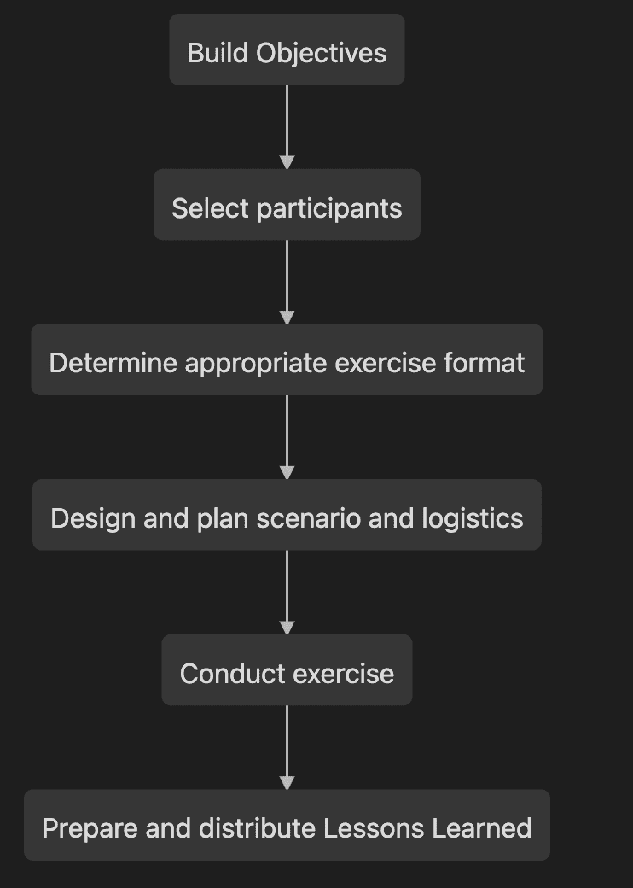

# 如何建立有效的网络桌面练习

> 原文：<https://www.freecodecamp.org/news/build-an-effective-cyber-tabletop-exercise/>

## 什么是网络安全桌面演习(TTX)？

网络安全漏洞正在导致越来越多的损失(2021 年损失 420 万美元)。因此，在亲身经历潜在事件之前，尽可能做好准备和训练是非常重要的。

网络安全桌面演习(TTX)是你可以用来演习你的事件响应计划的最好方法之一——而不是经历一次真实的事件。

简而言之，TTX 旨在帮助评估贵公司处理事故的准备情况。这个练习应该加强学习和培训的文化——在练习中没有失败，只有重复和改进过程的机会。

### 网络安全桌面演习的主要好处

*   以*经济高效的*方式更好地理解违规的影响
*   通过透明和沟通保持良好的声誉
*   巩固角色和职责，探索决策过程
*   评估现有资源的能力
*   识别并解决规划中的不足

## 什么使桌面练习有效？

鉴于此次演习是测试贵公司应对突发事件准备程度的重要组成部分，因此带着**明确的目标**参加演习非常重要。

以下内容将有助于确保您的锻炼尽可能高效。

1.  制定事故响应计划。如果没有事故响应计划，演习可能会非常混乱，因为您将在没有明确流程可循的情况下匆忙确定角色和职责。目标是测试你的计划，而不是创建一个新的计划！
2.  提前进行风险分析。除非桌面的目标是强调需要正式的风险分析，否则至少进行粗略的分析以了解业务的关键风险是很重要的。他们为什么关心安全项目的资金？他们在乎保护什么？如果不良事件发生，对公司的潜在危害是什么？
3.  有明确的目标。想一想你想通过这个练习完成什么——你想要什么样的*结果*?您可能有许多场景来测试您想要运行的业务的各种组件，但是您与高级管理人员在一起的时间也可能有限。确保你不要在练习中设置太多的目标。保持专注。*只有在你决定了你想从练习中得到什么之后，才开发场景*。
4.  **获得利益相关者/高管的认同**。要想成功，练习需要带着学习的目的自愿进行，而不仅仅是勾选合规性的复选框。执行领导需要参与并愿意从结果中学习，在适当的时候将学到的经验转化为公司内部可操作的变革。
5.  **强有力的推动者。**主持人需要让每个人都跟上进度，确保涵盖每次注射过程中的所有要点。虽然公开讨论很好，但主持人需要确保对话切中主题，而不是陷入各种各样的话题。

## TTX 一般是如何流动的？

网络安全桌面演习的一般流程将引导参与者经历一个事件从开始到结束的过程。重点将放在探索过程中出现的各种决策点，确保所有参与者都了解谁是事件中的关键决策者和利益相关者。

下图说明了练习本身的各个关键部分，从计划到执行:

### 练习流程:

Typical flow for a cybersecurity TTX

让我们看一下这个流程中的每个元素:

#### 建立有价值的目标

重要的是确定利益相关者可以从练习中获得的关键学习机会(例如，“领导层是否知道谁负责决定是否停止我们公司股票在交易所的交易活动？”或者“谁打电话拔掉一个重要的创收系统。”).

一旦确定了这些目标，就有可能为场景的设计提供信息。示例目标可能包括:

*   测试带外通信流程的功效
*   评估培训差距
*   确定事件响应计划和实施流程之间的不一致
*   评估当前的决策过程

#### 谁需要参与练习？

**参与者**应积极参与练习，参与讨论和决策过程。让各种各样的涉众参与到场景中是很重要的。

通常，下列团体的代表将出席:

*   高管层:首席执行官、首席财务官、首席运营官、首席信息官、首席技术官等等。
*   人力资源
*   法律/CLO
*   合规和隐私
*   业务部门领导

一个**促进者**是一个内部或外部的资源，他将带领参与者通过场景，各种注入，并控制对话的流程。

关键是让每个人都专注于场景，并确保参与者不会掉进兔子洞，在场景中戳洞或解决不必要的元素。

注:考虑让第三方(如事故响应取证公司)担当主要或辅助主持人的角色。他们可以就他们观察到的攻击提供更广泛的背景信息，并回答高管提出的宏观问题。

**外部机构**可以包括执法机构、外部法律顾问、安全取证公司或监管机构。

最后，你需要一个**记录员**来记录参与者的反应和决定、学到的经验教训、哪些进展顺利，哪些进展不顺利。

#### 有哪些类型的锻炼形式？

演习通常有两种主要形式:一种是讨论，一种是 T2，一种是实弹演习。格式没有对错之分。所选择的练习类型应与参与者以及练习本身的预期结果和目标相匹配。

实弹演习，有时被称为战争游戏，是指实时模拟事件，要求团队迅速行动，他们可能知道也可能不知道事件正在发生。

这种类型的练习通常为事件响应团队和“现场”响应者执行，例如网络、防火墙、应用程序和数据库团队。

该练习旨在衡量公司的人员、流程和技术在尽可能接近真实事件的环境中的运行效率。

**基于讨论的练习**通常会有一个演示，向参与者提供一般的、高层次的信息，参与者通常是公司各个业务职能部门的高级领导。

在整个演示过程中，会定期使用*注入*。这些通常意味着向参与者提供一些新的信息或其他类型的曲线球。注入的例子可以是内部备忘录、媒体报道、电话，甚至是包含更多信息的幻灯片。

每次进样后，应执行以下操作:

*   估计形势
*   重新验证假设
*   确定安全和组织影响
*   制定行动方针
*   查看资源
*   提出建议
*   采取行动实施变革
*   输出–记录讨论、经验教训等。

#### 我如何设计相关的场景？

在构建情景时，以下是一些示例问题，可以帮助您构建练习:

*   谁是威胁者？
*   威胁者的意图是什么？
*   您的行业面临哪些威胁？这可以为您的场景或各种决策点提供信息。
*   团队将如何处理和应对攻击？
*   应该涉及哪些外部实体？
*   需要通知员工、客户或监管者吗？

确保每张传达信息的幻灯片都有时间戳，让参与者知道事件之间过去了多长时间。该场景不应包含太多幻灯片或注入内容，通常 2-4 个注入内容和一些媒体内容就足够了，此外还有一般信息幻灯片。

#### 物流

以讨论为基础的练习在进行大约 3-4 小时时效果最好，大多数参与者都在同一个房间里。

在练习之前，主持人应准备好每张幻灯片应探讨的关键主题列表，并确保在整个练习过程中讨论这些主题。一定要有咖啡和小吃😊。

##### 规则

确保每个人都了解活动的“规则”。暂停怀疑，没有敌人，齐心协力。

在活动前几天以及活动期间提供规则。包括 IR 计划。**不要打场景！**

### 如何利用“热洗”和经验教训

在演习结束后，应立即进行一次简短的回顾(“热洗”)(可选择是否有任何第三方在场)，以便在信息新鲜的情况下，回顾哪些进展顺利，哪些可以改进。

在课程结束时，请每位参与者说出他们从活动中获得的一项收获。

在接下来的几周内，回顾练习中的所有笔记和观察结果，并编制一份经验教训列表。将这些提炼成几个你可以与领导分享的主题，然后你可以制定一个计划来解决这些问题。

一些示例课程包括:

*   制作一本“袖珍操作手册”,以便“现场”人员对事故期间做什么/不做什么有一套清晰简明的说明
*   建立事故指挥官的权威
*   实施一个考虑到系统、应用程序、关键供应商和关键人员的资产库存系统
*   如果电子邮件和聊天等核心系统无法访问，则配备备用通信系统，以便与员工进行通信
*   在发生事故时，保留一家危机公关公司，并确保高管接受媒体沟通培训

## 结论

嗯，那是很多信息。希望你已经了解了桌面练习是如何工作的，以及如何建立一个有价值的练习。

以下是一些关键要点，有助于确保你打造一个高效的桌面:

*   建立明确的目标——完成这项练习后,*期望的*结果是什么？利用这一点来确定在整个练习中要实现的有价值的目标。
*   引人入胜——幻灯片可能会很无聊。永远不要只是读幻灯片。尝试添加某种形式的多媒体(如关于泄露数据导致股价下跌的假新闻报道，记者的电话，等等。)来打断流量。
*   将学到的经验付诸行动——一旦对学到的经验有了共识，就为每个项目制定路线图和项目计划，并与所有者一起制定。该练习的目标是制定可操作的任务，以提高公司在响应事件时的准备程度，同时减轻任何未来事件的影响。

最后，如果你正在寻找灵感，一定要看看 CISA 的[桌面练习包](https://www.cisa.gov/cisa-tabletop-exercise-packages)中的一些现成模板！