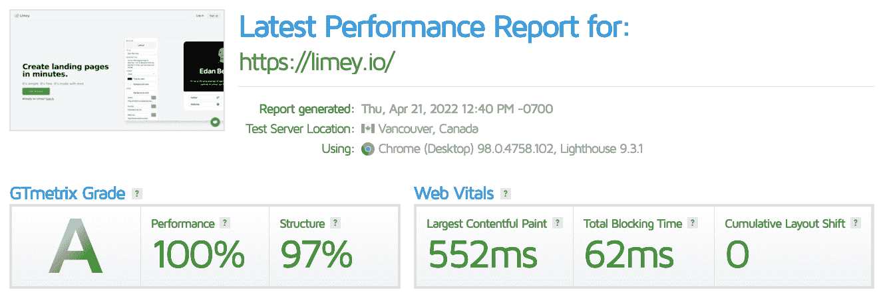
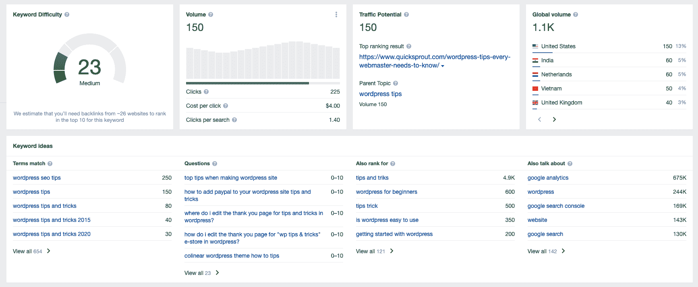

# 开发者 SEO 技巧

> 原文：<https://www.freecodecamp.org/news/tips-to-boost-your-seo/>

SEO(搜索引擎优化)对你的在线营销策略至关重要。这是优化你的网站和内容的过程，以帮助你从搜索引擎获得尽可能多的流量。

让你的网站在搜索引擎结果页面(SERPs)中排名靠前是增加网站流量和提高转化率的最快方法之一。

这篇文章将介绍 10 大技巧来提高你的搜索引擎优化和发展你的网站。

## 如何创建内容营销策略

你会想要创建一个内容营销策略来帮助你提高排名并接触到你的目标受众。

但是什么是内容营销策略呢？内容营销会让你的企业保持领先地位，并帮助你成为所在领域的专家，但这需要大量的工作。

例如，考虑到关键词和搜索者的意图，公司的内容营销经理通常每周必须发布至少一篇文章。

这听起来很多，但很值得。你发布的内容与受众相关，表明公司关心他们。它与消费者建立信任，并帮助他们与品牌保持联系。

做到这一点的最佳方式是创建针对你的业务的内容，针对你的潜在客户，为搜索引擎优化优化，并通过社交媒体分发。但是不要忘记，一致性是关键。

为你想发布的内容类型和发布频率制定一个计划。跟踪什么可行，什么不可行，这样你就可以根据需要做出调整。

以下是在您的内容策略流程中需要遵循的一些初始步骤:

1.  了解你的目标。是想获得更多的流量还是更多的转化？你是想让你的观众了解新功能，还是想教育他们？
2.  找出最适合你的业务的内容渠道。创作内容不仅仅是发布几篇文章。也是关于分配它们。在 LinkedIn、Reddit 或 Hacker News 等网站上分享您的内容。
3.  研究人们在浏览您的解决方案时搜索的关键词。在你的内容中提出这些关键词，并抓住受众的痛点。

## 如何让你的网站移动友好

你如何知道你的网站是否适合移动设备？

手机友好性并不是唯一重要的事情。拥有一个快速的网站、反应灵敏的设计、移动友好的内容和导航也很重要。

谷歌有一些工具，你可以用来检查你的网站是否是手机友好的，以及其他测试速度的工具。

如果您的网站没有针对移动设备进行优化，您应该开始这样做:

1.  确保你的网站没有过多的插件。如果你使用 WordPress，太多的插件会降低你网站的速度。
2.  为您的图片和媒体使用合适的大小和格式。太大的图片会减慢你的页面速度，并且会对客户体验产生不良影响。
3.  定期检查你的核心网络生命体征。确保你的网站在 2 秒内加载，并且你的 CWV 指标在限制范围内。

你的客户和谷歌会感谢你，它会在流量和转化率两方面都有回报。

## 如何打造常青内容

另一个提高搜索引擎优化的技巧是创建常青树内容。常青内容是具有长期相关性的任何类型的信息，这意味着它是永恒和及时的(也就是说，不会过时)。它还经过搜索引擎优化，可在移动设备上阅读，并可以多种格式重新调整用途。

常青树内容可以是一个很好的搜索引擎优化工具，因为它往往在搜索引擎中排名很好，可以帮助您的网站在发布到其他网站时获得牵引力。

如果做得正确，常青内容为你的企业提供了一个营销自己的机会，而不必依赖于时间敏感的事件或新闻项目来吸引流量到您的网站。Evergreen 的帖子经常更新，但总是专注于更新的新内容或旧内容。

常青树内容的例子包括“如何创业”、“工作中有条理的重要性”和“你可以用吃剩的意大利面做的 5 件事”。

像这样的内容永远不会失去它的价值，因为它不依赖于当前的事件或趋势来保持相关性。正因为如此，你可以建立一个常青的内容库，随着时间的推移，它将继续推动流量。

## 如何降低你的跳出率

一旦有人来到你的网站，你需要把他们留在那里。跳出率低意味着你的内容有价值，会让你在搜索结果中排名靠前。

记住，这不仅仅是给你的网站带来更多的流量，而是保持来自一个好的 SEO 策略的流量。

我们知道你在想什么:我如何降低我的跳出率？

以下是一些方法:

*   为用户减少摩擦。通过使你的内容具有足够的可读性和娱乐性，让他们更容易阅读你的内容。改善你的导航，这样读者就不会迷路或者陷入寻找他们想要的东西的困境。删除那些干扰用户阅读你的内容，甚至阻止他们访问你的内容的恼人的弹出窗口。
*   在适当的情况下，使用图像和视频等视觉元素。他们可以通过分解大块的文本和使长文章看起来更短来使阅读文本更容易和更愉快。
*   使用短段落和项目符号，这样读者可以快速浏览页面，而不会失去他们的位置或对材料的兴趣。
*   在长文章中使用标题和副标题，这样读者可以在逐字阅读之前了解每一段的内容。

GTmetrix report for [Limey](https://limey.io/)

## 如何优化页面速度

你可能知道，优化你的网页速度不是一件小事。这需要几个步骤，可能很有挑战性。如果这看起来太难接受，考虑雇佣一个 SEO 来帮助你识别你的 WordPress 或 Shopify 网站的页面速度问题。

您可以采取的一些可行措施包括:

*   减少不使用的 JavaScript。
*   消除渲染阻塞资源。
*   减少初始服务器响应时间。

## 如何开始客座博文

客座博文是保持你的网站新鲜和相关的好工具。让其他博主接受你提交的文章有助于为你的网站带来新的流量，并鼓励反向链接，提高你在搜索引擎中的排名。

这可能会为你带来更多的流量、注册和销售。

客座博文也有助于品牌推广和吸引新的受众。

最后，你会希望找到适合你的博客，这些博客接受投稿，或者有一个“为我们写作”的版块，你可以在那里提交你的内容。

被接受并不容易，所以当你以客座博主的身份推销自己时，一定要写点好东西！

客座博客不仅仅是为大企业服务的——如果你刚刚起步，有很多方法可以让你利用客座博客。

首先，如果你刚刚起步，还没有大量的追随者，客座博文是一个建立你的受众的好方法。多年来一直作为客座博客的大公司每次发布新内容都会有成千上万的新读者。

如果你在你的博客上有一些好的想法，并且你也有向其他博客和网站推销自己的动力，那么为什么不试一试呢？

此外，如果你的公司或产品背后有什么有趣的故事，这是展示你与众不同的另一个好方法。谁知道呢——你的故事可能会让你的博客脱颖而出，吸引人们。

## 如何优化页面搜索引擎优化

现在你已经有了基本的东西，让我们来看看如何优化页面搜索引擎优化。

*   内容相关性:确保你的内容是相关的和最新的。页面搜索引擎优化的一个关键要素是要有一个页面来覆盖正在讨论的查询和用户可能有的任何相关查询。
*   标题标签:确保你的标题标签是相关和准确的。在用户访问你的网站之前，你的标题标签应该让他们知道他们正在点击什么，所以确保它准确地反映了页面的主题，并且对搜索者有意义(它不需要与你搜索的内容完全相同)。
*   元描述:不要忘记元描述！虽然它不会直接影响排名，但元描述仍然很重要，因为它们出现在 SERPs 中，如果优化正确，可以鼓励用户点击。
*   标题:适当地使用标题，把内容分成标题清晰的部分，尽可能包括关键词。
*   链接:链接到其他相关网站，尽可能确保内部链接，以帮助用户浏览你的网站(包括带有上下文关键词的锚文本)。这也有助于提高页面的权威性。
*   图像和视频:有策略地使用图像和视频，让你的内容更吸引那些不想通读大段文字或者喜欢视觉效果胜过阅读文字的访问者。你也可以使用图片 alt 标签或视频字幕/抄本(不是自动的)来优化内容，因为 Google 也抓取这些类型的媒体。

Ahrefs Keyword Explorer

## 如何为你的内容机会找到合适的关键词

关键词研究可以说是 SEO 最重要的部分。正确的关键词可以决定一篇高排名的文章和一篇完全不被注意的文章。

当你开始的时候，重要的是要理解你的有机搜索流量的目标。从那里，你可以选择一个关键词策略，这将有助于你达到这些目标。

为您的内容机会选择关键词时，有几个因素需要考虑:

*   相关性:关键字与什么相关？选择一个与你的内容或产品相对应的关键词。
*   搜索量:如果你想让别人看到你的内容，选择一个搜索量高的关键词(也就是很多人搜索过的)。
*   独特的:一个独特的关键词可能比一个更普通的短语更难被你的竞争对手锁定并在有机搜索结果中排名。

## 如何利用社交媒体实现搜索引擎优化、流量和销售

在当今的 SEO 环境中，社交媒体在获得有机流量方面发挥着重要作用。原因很简单:社交媒体网站是访问量最大的网站之一。

更重要的是，谷歌和其他搜索引擎使用社交信号来确定网站与给定关键词的相关性。这就是为什么在脸书、Pinterest、Twitter 和其他社交媒体网站上分享你的内容可以帮助你在搜索结果中排名更高。

需要注意的是，并不是所有的社交信号对 SEO 都有同样的影响。一些信号给一个网站比其他的更大的权威，所以对你来说，明智的做法是确定哪些信号对你的商业目标是值得追求的。

## 如何鼓励高质量的反向链接到你的网站？

提高 SEO 最有效的方法之一是通过在社交网络上分享你的博客文章，鼓励有影响力的人分享你的内容，从而鼓励高质量的网站反向链接。

但是什么是“反向链接”呢？

反向链接只是一个从另一个网站指向你的网站的链接。

例如，如果这个页面有一个链接指向社会媒体审查员的主页，这将被认为是一个反向链接。反向链接是至关重要的，因为它们向谷歌表明，其他人或企业认为你的网站足够重要和有价值，可以包含在他们的页面中。

指向您网站的高质量(重要)链接越多，您在搜索引擎结果中的排名就越高。

获得高质量链接的一些好策略包括在行业网站上发表客座博文，采访你所在行业的有影响力的人，询问顾客/客户是否愿意在网上发布对你的服务的评论。

一旦你有一些高质量的链接进来，重要的是要跟踪他们，以确定他们在提高流量和排名方面有多有效。可以使用 Ahrefs 或 Semrush 之类的工具来实现这一点。

## 如果你希望你的网站是可搜索的，这些建议会帮助你

获得更高可见性的最好方法是确保你的网站出现在搜索结果的第一页(最好是前三个位置)。

如果你的网站没有出现在第一页，很有可能潜在客户永远也看不到它。事实上，如果你从第二页转到第一页，你可以显著增加网站的流量。要做到这一点，你需要一个强大的 SEO 策略。

SEO 可能看起来是一个令人生畏的话题，但事实并非如此。无论你是否已经熟悉 SEO，在上面的指南中可能有一些东西你可以马上开始实施，以更好地为搜索引擎优化你的网站，并改善潜在客户的用户体验。你要做的就是开始，越快越好！