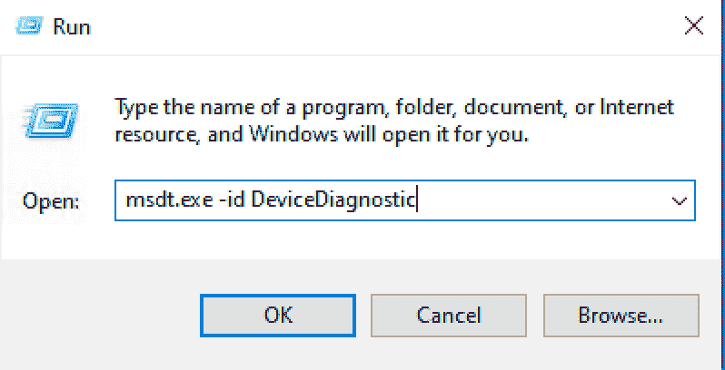
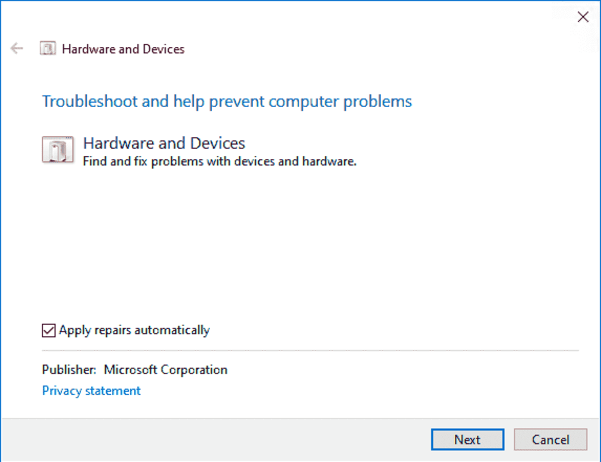
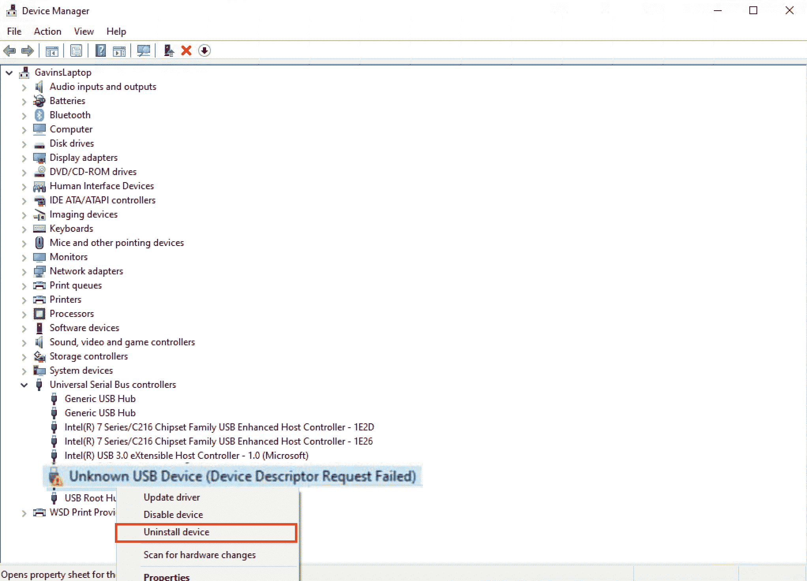
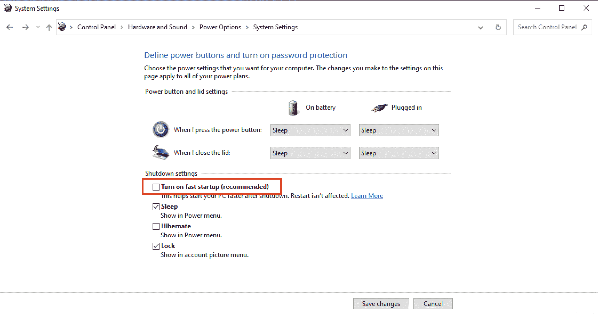
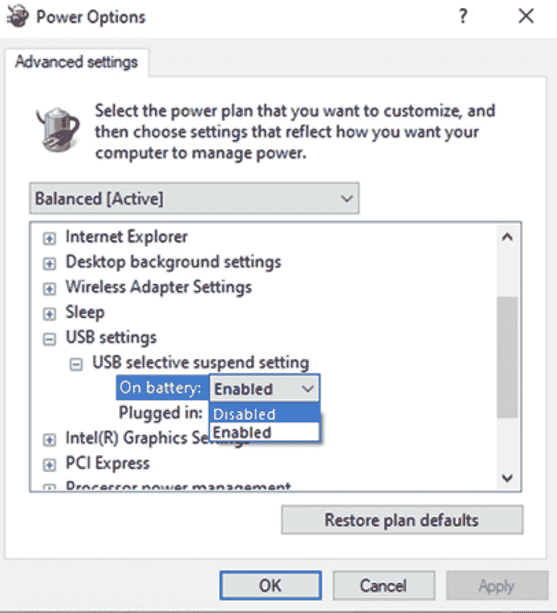
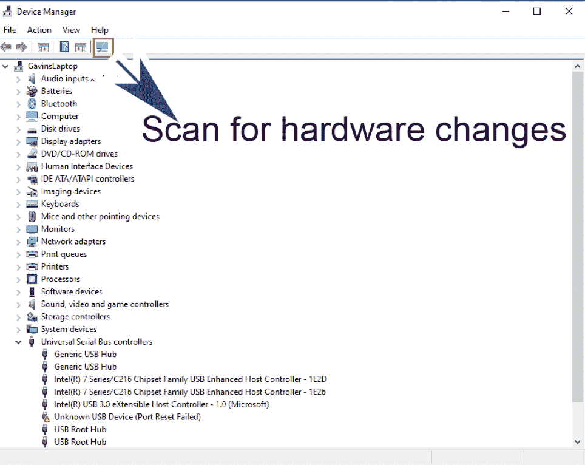
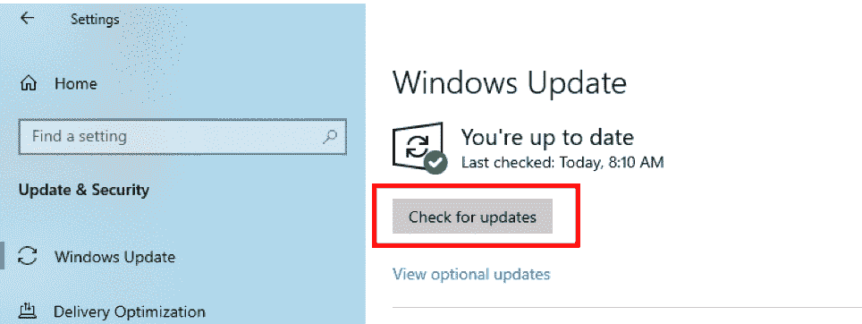

# 设备描述符请求失败–如何修复 Windows 10 中未知的 USB 设备错误

> 原文：<https://www.freecodecamp.org/news/device-descriptor-request-failed-windows-error-solved/>

最近，我住在澳大利亚的叔叔给我住在南非的父母寄了一个优盘，里面全是我们澳大利亚家庭参加各种澳大利亚活动的照片。

但当我可怜的妈妈的笔记本电脑无法识别 USB 设备(包含澳大利亚家庭照片的闪存盘)时，这让她非常沮丧。

当与计算机相关的任何事情出现问题时，我有作为 goto 家庭成员的特权，因为我是一名计算机程序员。这意味着我必须知道关于 USB 端口、打印机、扫描仪的一切，基本上所有与计算机相关的东西…对吗？

嗯，当时，我必须承认我不知道为什么 Windows 10 不能识别闪存盘。所以我做了一些调查。在这种特殊情况下，外部设备(闪存驱动器)是违规方。

然而，事实证明，这种“设备描述符请求失败”的问题可能由于许多不同的原因而发生，一些原因与硬件相关，另一些原因与软件相关。

在本文中，我将首先讨论可能的硬件相关问题，然后我们将讨论可能的软件相关问题。对于“设备描述符请求失败”错误的每个原因，我将带您完成解决该问题所需的步骤。

## “设备描述符请求失败”错误的可能原因和修复

以下七个标题列出了可能导致“设备描述符请求失败”问题的原因。在本文的后续部分，我将详细介绍如何解决这个问题。

*   **USB 硬件故障**
*   **运行硬件和设备疑难解答**
*   **更新 USB 设备驱动程序**
*   **禁用快速启动**
*   **禁用 USB 选择性暂停设置**
*   **移除 USB 设备并扫描硬件变化**
*   **更新 Windows 10**

## USB 硬件故障

“设备描述符请求失败”问题可能是由硬件问题引起的。通过执行以下检查，我们可以很容易地测试出问题是由硬件问题引起的，而不是与操作系统相关的问题:

首先，将相关设备插入同一台计算机上的不同 USB 端口。为了更好地衡量，尝试几个 USB 端口。如果相关设备在插入另一个 USB 端口时工作正常，这意味着问题的来源可能是问题出现时使用的 USB 端口。

在这种情况下，您可以简单地将导致问题的 USB 端口标记为故障，并使用正常工作的 USB 端口。您也可能希望在某个阶段更换有问题的 USB 端口。

其次，您可以将相关设备插入不同计算机上的 USB 端口。如果该设备在另一台计算机上不工作，这表明设备本身有问题。在这种情况下，您唯一的解决方案可能是维修或更换设备本身。

## 运行硬件和设备疑难解答

Windows 为我们提供了一个非常方便的工具，您可以使用它来执行故障排除。您可以使用该工具来解决可能的硬件问题。

按照以下步骤使用**故障诊断工具**:

*   首先调用“运行”框。您可以通过按 Windows 键+ R 来完成此操作。
*   在“运行”框中输入以下命令:**msdt.exe-id 设备诊断**

*   按下 **OK** 按钮。
*   选择高级–并确保选中“自动应用修复”复选框。按“下一步”按钮，并按照说明执行故障诊断任务。

## 卸载并更新 USB 设备驱动程序

要卸载 USB 设备驱动程序，我们可以使用 windows 提供的**设备管理器**工具。要运行**设备管理器**，请遵循以下步骤:

*   首先，调用“运行”框。一种方法是按下 **Windows 键+ R** 。
*   在“运行”框中输入以下命令: **devmgmt.msc** 。然后按下 **OK** 按钮。
*   在**设备管理器**对话框呈现的树形结构中，展开**通用串行总线控制器**节点**。**
*   从展开的节点列表中，选择标记为“未知 USB 设备(设备描述符请求失败)”的节点
*   右键单击该节点，并从显示的上下文菜单中选择**卸载设备**。

*   卸载操作完成后，重新启动计算机。这将导致重新安装驱动程序，也可能导致您的问题得到解决。

## 禁用快速启动

“设备描述符请求失败”问题的一个可能原因是 Windows 中旨在加速计算机启动过程的一个功能。有时，这种“快速启动”功能会阻止您的操作系统检测 USB 设备。

幸运的是，我们有能力关闭这个功能。“快速启动”功能是一个“不错”的功能，建议打开这个功能，但它不是一个必要的功能。

因此，要关闭该功能，请按照以下步骤操作:

*   按 Windows 键+ R 调用“运行”框。
*   在“运行”框中键入“控制”并单击“确定”按钮打开控制面板
*   在控制面板的搜索框中键入“电源选项”,然后单击“更改电源按钮的功能”
*   在标题“定义电源按钮并打开密码保护”下，单击标有“更改当前不可用的设置”的链接
*   确定未选中“打开快速启动(推荐)”复选框。单击“保存更改”按钮

*   重新启动计算机，看看这个可能的解决方案是否解决了您的 USB 设备问题。

## 禁用 USB 选择性暂停设置

当启用“USB 选择性暂停”设置时，USB 端口有时会进入低功耗模式。这可能会在将设备连接到 USB 端口时导致异常行为，从而导致出现“设备描述符请求失败”问题。

我们能够安全地禁用此功能，这样做有可能解决“设备描述符请求失败”的问题。

要禁用“USB 选择性暂停”设置，请按照下列步骤操作。

*   按 Windows 键+ R 调用“运行”框。
*   在“运行”框中，键入“控制”并单击“确定”按钮打开控制面板
*   在你的控制面板中找到并点击“电源选项”
*   单击“更改计划设置”链接
*   单击“更改高级电源设置”链接
*   在“高级设置”选项卡的树状结构中找到并展开“USB 设置”节点。
*   展开“USB 选择性暂停设置”子节点。
*   确保在“使用电池”和“接通电源”的相关下拉列表中选择了“禁用”。

*   单击“确定”按钮
*   重启你的电脑
*   重新启动计算机后，测试“设备描述符请求失败”问题是否已解决。

## 移除 USB 设备并扫描硬件变化

*   通过按 Windows 键+ R 启动“运行”框来启动**设备管理器**，然后在“运行”框中键入 **devmgmt.msc** 并按下“确定”按钮。
*   从相关 USB 端口拔下有问题的设备。
*   在**设备管理器**对话框中，点击工具栏上的“扫描硬件变化”按钮。您可以通过将鼠标指针悬停在按钮上来识别相关按钮，其工具提示文本将显示文本“扫描硬件更改”。

*   当系统识别到硬件变化时，插入相关的 USB 设备并测试问题是否已经解决

## 更新窗口

安装最新的 Windows 更新可能会修复“设备描述符请求失败”问题。要安装最新的 windows 更新，您可以按照下列步骤操作:

*   通过按 Windows 键+ I 打开设置应用程序
*   单击“更新和安全”选项
*   选择“Windows Update”选项
*   单击“检查更新”按钮

*   重新启动计算机并测试以查看“设备描述符请求失败”问题是否仍然存在(更改)

## 结论

“设备描述符请求失败”的问题可能会导致很多挫折，甚至在我可怜的母亲的例子中，它阻止她查看家庭照片。

不要绝望——希望这篇文章能为你提供解决这个问题的有效方法。