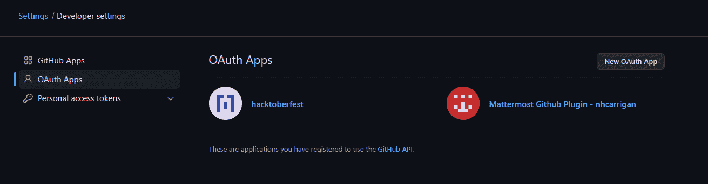
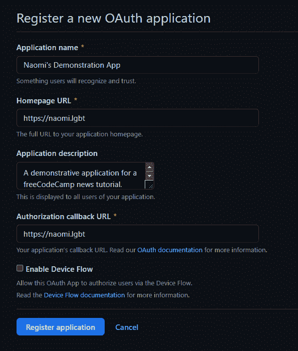
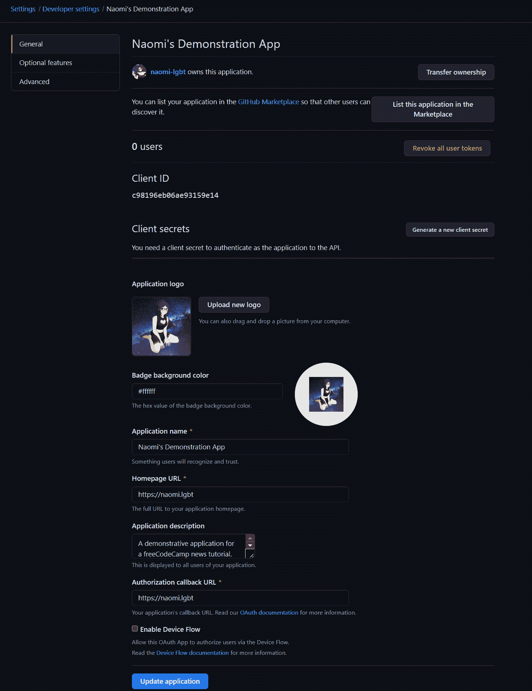
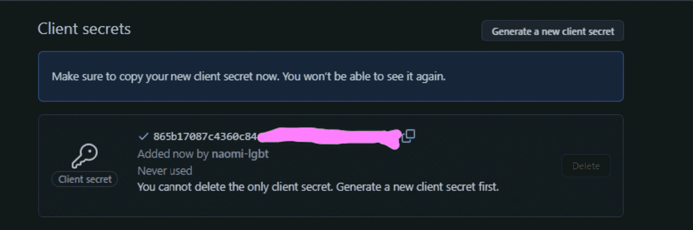

# 如何设置 GitHub OAuth 应用程序

> 原文：<https://www.freecodecamp.org/news/how-to-set-up-a-github-oauth-application/>

GitHub 是一个非常有用的 OAuth 提供者，特别是如果你正在构建一个面向开发者的应用程序。

在本文中，我们将向您简要介绍如何设置 GitHub OAuth 应用程序。

## 创建您的应用程序

首先导航到您的 GitHub 设置(确保您已经登录！).向下滚动到侧边栏的底部，点击“开发者设置”。

这将带您进入申请页面:

You may see some applications you've previously authorised.

单击“新建 OAuth 应用程序”按钮创建新的应用程序。

填写表格，点击“注册申请”。这将创建您的应用程序，并带您到设置页面。

对于 OAuth 应用程序，您将需要客户机 ID。您还需要生成一个客户端密码。单击“生成新的客户端密码”来执行此操作。

请确保将此机密保存在安全的位置，因为您将无法再次查看它。

## 使用您的新应用

现在您已经有了客户机 ID 和密码，您可以在项目中使用 OAuth 应用程序了。

如果你想学习如何这样做， [freeCodeCamp 的课程可以教你](https://www.freecodecamp.org/learn/quality-assurance/#advanced-node-and-express)。

编码快乐！