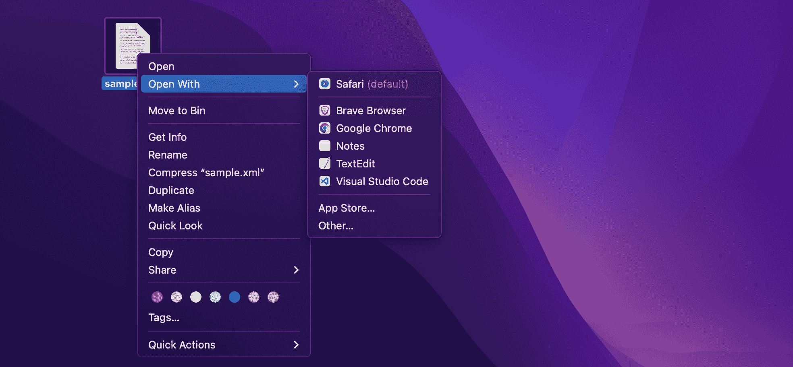
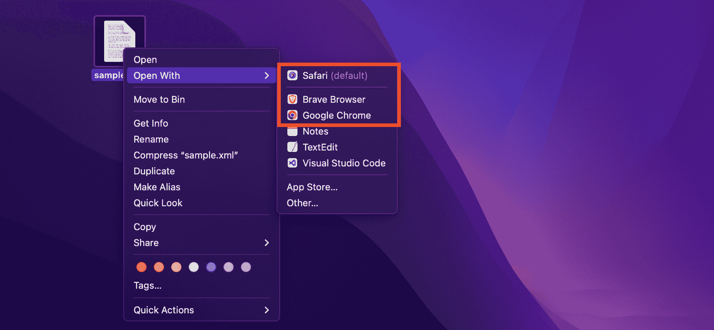
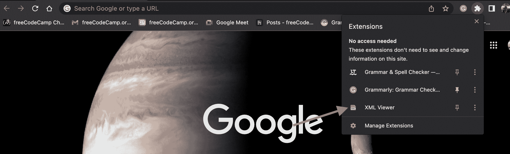
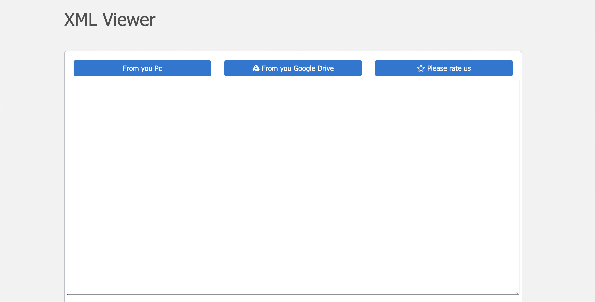
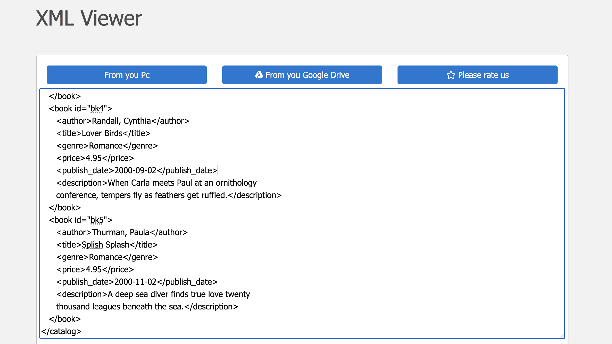

# 如何打开 XML 文件

> 原文：<https://www.freecodecamp.org/news/how-to-open-an-xml-file/>

XML 代表 e **X** 可扩展 **M** arkup **L** 语言。XML 文件是描述数据结构的可读文件。您存储扩展名为`.xml`的 XML 文件。

XML 文件包含一些标签，这些标签指定文档应该如何构造，以及应该如何存储和在互联网上传输。

它不再是组织和传输数据的首选方法，但许多遗留系统仍在使用它。另外，RSS 和 SVG 都是基于 XML 格式的。

XML 是这样显示的:

```
<?xml version="1.0" encoding="UTF-8"?>
<catalog>
   <book id="bk1">
      <author>Corets, Eva</author>
      <title>Maeve Ascendant</title>
      <genre>Fantasy</genre>
      <price>5.95</price>
   </book>
   <book id="bk2">
      <author>Corets, Eva</author>
      <title>Oberon's Legacy</title>
      <genre>Fantasy</genre>
      <price>5.95</price>
   </book>
   <book id="bk3">
      <author>Corets, Eva</author>
      <title>The Sundered Grail</title>
      <genre>Fantasy</genre>
      <price>5.95</price>
   </book>
</catalog> 
```

在本文中，您将学习在计算机上或在线打开 XML 文件的各种方法。

## 如何使用文本编辑器打开 XML 文件

您必须有一个正在尝试打开的 XML 文件，要么仅用于查看，要么用于查看和编辑。

如果您想打开一个 XML 文件并编辑它，您可以使用文本编辑器。您可以使用电脑附带的默认文本编辑器，如 Windows 上的记事本或 Mac 上的“文本编辑”。

您只需找到 XML 文件，右键单击 XML 文件，然后选择“打开方式”选项。这将显示打开文件的程序列表。



如果是 Windows 电脑，请选择记事本；如果是 Mac 电脑，请选择文本编辑，如上图所示。这两个是每个操作系统预装的文本编辑器，应该已经在列表上了。任何基本的文本编辑器都可以。

您可以使用其他文本编辑器，如 [VSCode](https://code.visualstudio.com/) (如上图所示)、 [Atom](https://atom.io/) 、 [Sublime Text](https://www.sublimetext.com/) 等。但是对于这样的基本任务，最好使用默认编辑器，因为像 VSCode、Atom 和 Sublime Text 这样的文本编辑器是相当繁重的程序。

## 如何使用浏览器打开 XML 文件

如果您只想查看文件，您可以使用任何网络浏览器，如 Safari、Chrome 等类似的程序。

第一步是找到要打开的 XML 文件，右键单击该文件，然后选择“打开方式”选项。将出现一个选项列表，包括一些浏览器。



点击你喜欢的浏览器，然后你的 XML 就会加载。

另一种方法是打开浏览器，然后将 XML 文件拖到浏览器中。这也适用于文本编辑器。

## 如何在线打开 XML 文件

在互联网上，许多 XML 查看器甚至转换器帮助将 XML 文件转换成 JSON 等其他格式。下面是一些最流行的在线 XML 查看器/编辑器:

*   [代码美化](https://codebeautify.org/xmlviewer)
*   [JSON 格式化程序](https://jsonformatter.org/xml-viewer)
*   [教程要点](https://www.tutorialspoint.com/online_xml_editor.htm)
*   [JSON 格式化程序](https://jsonformatter.org/xml-viewer)
*   [谷歌浏览器扩展](https://chrome.google.com/webstore/detail/xml-viewer/legopflakafagikcpiapgnbokgkbejlk/related?hl=en)

每一个都类似地工作，允许你从你的计算机上传 XML 文件。

Chrome 有一个 [XML Viewer](https://chrome.google.com/webstore/detail/xml-viewer/legopflakafagikcpiapgnbokgkbejlk?hl=en) 扩展，它的工作方式类似于所有这些在线 XML 查看器。你所要做的就是下载扩展。然后当你想打开一个 XML 文件的时候点击它。



一旦你点击它，一个易于导航的界面将会出现，有两个主要的选项可以用来上传你的 XML 文件:从你的 PC 或者从你的 Google Drive。



当您选择一个选项时，您可以搜索该文件，在几毫秒内，您的 XML 文件将在 plain 部分打开。



## 哒哒😂

在这篇短文中，您已经学习了如何打开 XML 文件。希望这能帮到你。

祝编码愉快！