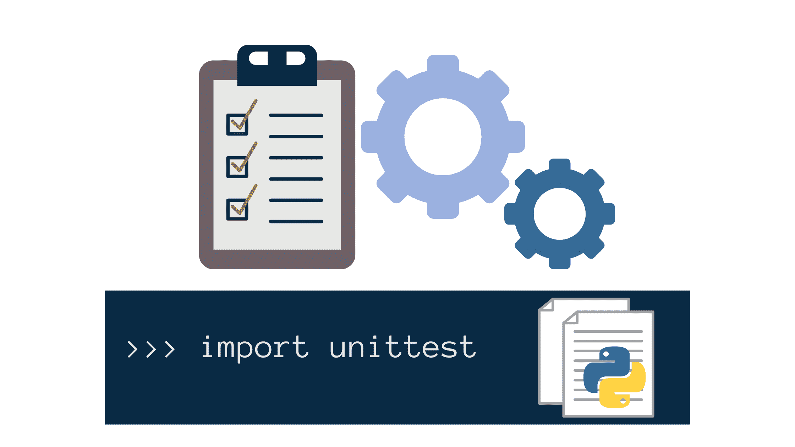
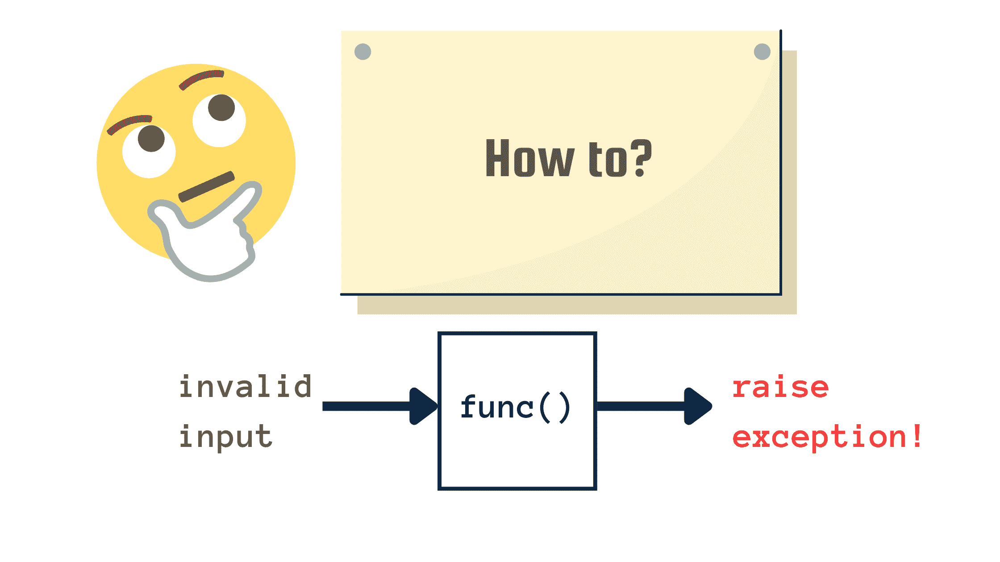

# 如何为 Python 函数编写单元测试

> 原文：<https://www.freecodecamp.org/news/how-to-write-unit-tests-for-python-functions/>

本指南将教你如何为 Python 函数编写单元测试。但是你为什么要考虑编写单元测试呢？

嗯，当在一个大项目中工作时，你经常需要更新某些模块，并根据需要重构代码。但是这种改变可能会对使用更新模块的其他模块产生意想不到的后果。这有时会破坏现有的功能。

作为开发人员，您应该测试您的代码，以确保应用程序中的所有模块都按预期工作。单元测试让您检查小的独立代码单元是否正常工作，并使您能够修复由更新和重构引起的不一致。

本指南将帮助您开始使用 Python 进行单元测试。您将学习如何使用 Python 的内置`unittest`模块来设置和运行单元测试，并编写测试用例来测试 Python 功能。您还将学习如何测试引发异常的函数。

我们开始吧！

## 用 Python 测试——第一步

我们将从定义一个 [Python 函数](https://www.freecodecamp.org/news/functions-in-python-a-beginners-guide/)开始，并编写单元测试来检查它是否按预期工作。为了关注如何建立单元测试，我们将考虑一个简单的函数`is_prime()`，它接受一个数并检查它是否是质数。

```
import math

def is_prime(num):
    '''Check if num is prime or not.'''
    for i in range(2,int(math.sqrt(num))+1):
        if num%i==0:
            return False
    return True 
```

让我们启动一个 Python REPL，用参数调用函数`is_prime()`，并验证结果。

```
>>> from prime_number import is_prime
>>> is_prime(3)
True
>>> is_prime(5)
True
>>> is_prime(12)
False
>>> is_prime(8)
False
>>> assert is_prime(7) == True
```

您还可以使用`assert`语句来验证`is_prime()`是否返回预期的布尔值，如上所示。如果函数的返回值不同于预期的布尔值，就会产生一个`AssertionError`。

这种类型的**手动测试**是*低效的*当你想要彻底检查你的函数的参数列表时。您可能希望设置自动化测试，根据测试套件中定义的测试用例来运行和验证函数的输出。

## 如何使用 Python 的`unittest`模块

Python 附带了`unittest`模块，允许您为应用程序中的函数和类配置自动化测试。在 Python 中设置单元测试的一般过程如下:

```
# <module-name>.py

import unittest
from <module> import <function_to_test>
# all entries within <> are placeholders

class TestClass(unittest.TestCase):
	def test_<name_1>(self):
		# check function_to_test

	def test_<name_2>(self):
		# check function_to_test
	:
	:
	:

	def test_<name_n>(self):
		# check function_to_test 
```

上面的代码片段`<module-name>.py`执行以下操作:

*   导入 Python 内置的`unittest`模块。
*   从定义函数的模块`<module>`中导入要测试的 Python 函数`<function_to_test>`。
*   创建一个继承自`unittest.TestCase`类的测试类(`TestClass`)。
*   应该运行的每个测试都应该被定义为测试类中的方法。
*   💡**注意**:为了让`unittest`模块将这些方法识别为测试并运行它们，这些方法的名字应该以`test_`开头。
*   `unittest`模块中的`TestCase`类提供了有用的断言方法来检查被测函数是否返回预期值。

下面列出了最常见的断言方法，我们将在本教程中使用其中的一些。

| 方法 | 描述 |
| --- | --- |
| `assertEqual(expected_value,actual_value)` | 断言`expected_value == actual_value` |
| `assertTrue(result)` | 断言`bool(result)`是`True` |
| `assertFalse(result)` | 断言`bool(result)`是`False` |
| `assertRaises(exception, function, *args, **kwargs)` | 断言`function(*args, **kwargs)`提高`exception` |

📑关于断言方法的完整列表，请参考[单元测试文档](https://docs.python.org/3/library/unittest.html)。

要运行这些测试，我们应该使用以下命令将 unittest 作为主模块运行:

```
$ python -m unittest <module-name>.py
```

我们可以添加`if __name__=='__main__'`条件来运行`unittest`作为主模块。

```
if __name__=='__main__':
	unittest.main()
```

添加上述条件将使我们能够通过直接运行包含测试的 Python 模块来运行测试。

```
$ python <module-name>.py
```

## 如何定义 Python 函数的测试用例



在本节中，我们将使用我们所学的语法为`is_prime()`函数编写单元测试。

为了测试返回布尔值的`is_prime()`函数，我们可以使用`assertTrue()`和`assertFalse()`方法。我们在继承自`unittest.TestCase`的`TestPrime`类中定义了四个测试方法。

```
import unittest
# import the is_prime function
from prime_number import is_prime
class TestPrime(unittest.TestCase):
    def test_two(self):
        self.assertTrue(is_prime(2))
    def test_five(self):
    	self.assertTrue(is_prime(5))
    def test_nine(self):
    	self.assertFalse(is_prime(9))
    def test_eleven(self):
    	self.assertTrue(is_prime(11))
if __name__=='__main__':
	unittest.main()
```

```
$ python test_prime.py
```

在以下输出中，'.'表示测试成功。

```
Output
....
----------------------------------------------------------------------
Ran 4 tests in 0.001s
OK
```

在上面的代码中，有四种测试方法，每种方法检查一个特定的输入。相反，您可以为所有四个输入定义一个测试方法来判断输出是否正确。

```
import unittest
from prime_number import is_prime
class TestPrime(unittest.TestCase):
	def test_prime_not_prime(self):
        self.assertTrue(is_prime(2))
        self.assertTrue(is_prime(5))
        self.assertFalse(is_prime(9))
        self.assertTrue(is_prime(11))
```

在运行`test_prime`模块时，我们看到一个测试已经成功运行。如果任何一个 assert 方法抛出一个`AssertionError`，那么测试就会失败。

```
$ python test_prime.py
```

```
Output
.
----------------------------------------------------------------------
Ran 1 test in 0.001s
OK
```

## 如何编写单元测试来检查异常

在上一节中，我们用质数和非质数作为输入测试了`is_prime()`函数。具体来说，输入都是正整数。

我们还没有强制要求对`is_prime()`的函数调用中的参数应该是正整数。您可以使用类型提示来强制类型或引发无效输入的异常。

在测试`is_prime()`函数时，我们没有考虑以下因素:

*   对于浮点参数，`is_prime()`函数仍然会运行并返回`True`或`False`，这是不正确的。
*   对于其他类型的参数，比如说字符串“five”而不是数字 5，该函数抛出一个 **TypeError。**
*   如果参数是负整数，那么`math.sqrt()`函数抛出一个**值错误**。所有实数(正数、负数或零)的平方总是非负数。所以平方根只为非负数定义。

让我们通过在 Python REPL 中运行一些示例来验证上述内容。

```
>>> from prime_number import is_prime

>>> is_prime('five')
Traceback (most recent call last):
File "<stdin>", line 1, in <module>
File "/home/bala/unit-test-1/prime_number.py", line 5, in is_prime
for i in range(2,int(math.sqrt(num))+1):
TypeError: must be real number, not str

>>> is_prime(-10)
Traceback (most recent call last):
File "<stdin>", line 1, in <module>
File "/home/bala/unit-test-1/prime_number.py", line 5, in is_prime
for i in range(2,int(math.sqrt(num))+1):
ValueError: math domain error

>>> is_prime(2.5)
True
```

### 如何引发无效输入的异常

为了解决上述问题，我们将验证函数调用中使用的值，并根据需要引发异常。

*   检查`num`是否为整数。如果是，进行下一项检查。否则，引发一个`TypeError`异常。
*   检查`num`是否为负整数。如果是，引发一个`ValueError`异常。

修改函数定义以验证输入并引发异常，我们有:

```
import math
def is_prime(num):
    '''Check if num is prime or not.'''
    # raise TypeError for invalid input type
    if type(num) != int:
        raise TypeError('num is of invalid type')
    # raise ValueError for invalid input value
    if num < 0:
        raise ValueError('Check the value of num; is num a non-negative integer?')
    # for valid input, proceed to check if num is prime
    for i in range(2,int(math.sqrt(num))+1):
        if num%i==0:
        return False
    return True
```

现在我们已经修改了函数，为无效输入引发 ValueError 和 TypeError，下一步是测试是否引发了这些异常。

## 如何使用`assertRaises()`方法测试异常



在`TestPrime`类的定义中，让我们添加方法来检查异常是否被引发。

我们定义了`test_typeerror_1()`和`test_typeerror_2()`方法来检查是否出现了`TypeError`异常，定义了`test_valueerror()`方法来检查是否出现了`ValueError`异常。

📌要调用`assertRaises()`方法，我们可以使用下面的通用语法:

```
def test_exception(self):
    self.assertRaises(exception-name,function-name,args)
```

我们还可以通过上下文管理器使用以下语法(我们将在本例中使用该语法):

```
def test_exception(self):
    with self.assertRaises(exception-name):
        function-name(args)
```

添加测试方法来检查异常，我们有:

```
import unittest
from prime_number import is_prime
class TestPrime(unittest.TestCase):
    def test_prime_not_prime(self):
        self.assertTrue(is_prime(2))
        self.assertTrue(is_prime(5))
        self.assertFalse(is_prime(9))
        self.assertTrue(is_prime(11))
    def test_typeerror_1(self):
        with self.assertRaises(TypeError):
        	is_prime(6.5)
    def test_typeerror_2(self):
        with self.assertRaises(TypeError):
        	is_prime('five')
    def test_valueerror(self):
        with self.assertRaises(ValueError):
        	is_prime(-4)

if __name__=='__main__':
	unittest.main()
```

让我们运行`test_prime`模块并观察输出:

```
$ python test_prime.py
```

```
Output
....
----------------------------------------------------------------------
Ran 4 tests in 0.002s
OK
```

在我们迄今为止编写的例子中，所有的测试都成功了。让我们将其中一个方法，比如说`test_typeerror_2()`，修改为如下:

```
def test_typeerror_2(self):
    with self.assertRaises(TypeError):
    	is_prime(5)
```

我们用数字 5 作为参数调用函数`is_prime()`。这里，5 是一个有效的输入，函数返回`True`。因此，该函数不引发`TypeError`。当我们再次运行测试时，我们会看到有一个失败的测试。

```
$ python test_prime.py
```

```
Output

..F.
======================================================================
FAIL: test_typeerror_2 (__main__.TestPrime)
----------------------------------------------------------------------
Traceback (most recent call last):
File "test_prime.py", line 17, in test_typeerror_2
is_prime(5)
AssertionError: TypeError not raised
----------------------------------------------------------------------
Ran 4 tests in 0.003s
FAILED (failures=1)
```

## 结论

谢谢你读到这里！😄我希望这篇教程能帮助你理解 Python 中单元测试的基础。

您已经学习了如何设置测试来检查函数是否按预期工作或引发异常——所有这些都使用 Python 的内置`unittest`模块。

继续编码，下期教程再见！👩🏽‍💻