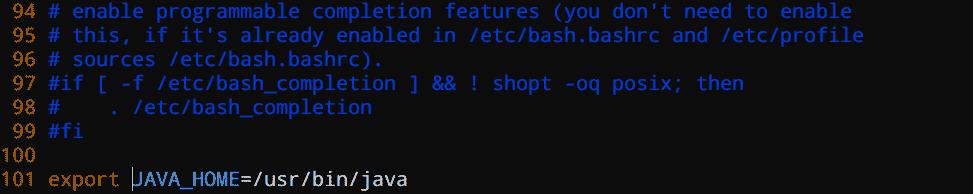
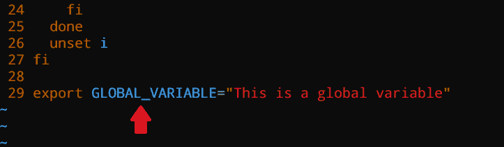

# 如何在 Linux 中设置环境变量

> 原文：<https://www.freecodecamp.org/news/how-to-set-an-environment-variable-in-linux/>

在编程中，使用变量来临时存储字符串和数字等信息。

变量可以在整个代码中重复使用，也可以被操作系统用来提供值。您可以编辑、覆盖和删除它们。

在本教程中，我将教你什么是环境变量，以及如何在 Linux 中设置它们。

## 什么是环境变量？

环境变量是特定于特定环境的变量。例如，操作系统中的每个用户都有自己的环境。例如，管理员用户拥有与其他用户不同的环境。

您可以声明一个只有您的用户需要的环境变量(例如一个 secret token ),它不需要向其他用户公开。

以下是 Linux 中环境变量的一些例子:

*   `USER`–指向当前登录的用户。
*   `HOME`–显示当前用户的主目录。
*   `SHELL`–存储当前用户 shell 的路径，比如 bash 或 zsh。
*   `LANG`–该变量指向当前语言/区域设置。
*   `MAIL`–显示当前用户邮件的存储位置。

这些环境变量因当前用户会话而异。

## 如何在 Linux 中列出环境变量

用于显示为当前会话定义的所有环境变量的命令是`env`。

以下是我的会话输出:

```
root@Zaira:~# env
SHELL=/bin/bash
PWD=/root
LOGNAME=root
HOME=/root
LANG=C.UTF-8
LESSOPEN=| /usr/bin/lesspipe %s
USER=root
SHLVL=1
XDG_DATA_DIRS=/usr/local/share:/usr/share:/var/lib/snapd/desktop
PATH=/usr/local/sbin:/usr/local/bin:/usr/sbin:/usr/bin:/sbin:/bin:/usr/games:/usr/local/games:/snap/bin
MAIL=/var/mail/root
_=/usr/bin/env
```

Output of the `env` command

## 如何在 Linux 中打印环境变量

有两种方法可以打印已经定义的环境变量:

*   `printenv VARIABLE_NAME`
*   `echo $varname`

让我们使用这两种方法打印变量`SHELL`的值。这里有一个使用`printenv`打印的例子:

```
root@Zaira:~# printenv SHELL
/bin/bash
```

Printing the environment variable value using `printenv` 

这里有一个使用`echo`的例子:

```
root@Zaira:~# echo $SHELL
/bin/bash
```

Printing the environment variable value using `echo` 

## 如何在 Linux 中设置环境变量

定义环境变量的基本语法如下:

```
export VARIABLE_NAME=value
```

让我们定义一个环境变量，列出它，并打印它的值。

*   定义变量`JAVA_HOME`:

```
root@Zaira:~# export JAVA_HOME=/usr/bin/java
```

*   通过列出来验证:

```
root@Zaira:~# env
SHELL=/bin/bash
JAVA_HOME=/usr/bin/java
PWD=/root
LOGNAME=root
HOME=/root
LANG=C.UTF-8
LESSCLOSE=/usr/bin/lesspipe %s %s
TERM=xterm-256color
global22=yolo
LESSOPEN=| /usr/bin/lesspipe %s
USER=root
SHLVL=1
XDG_DATA_DIRS=/usr/local/share:/usr/share:/var/lib/snapd/desktop
PATH=/usr/local/sbin:/usr/local/bin:/usr/sbin:/usr/bin:/sbin:/bin:/usr/games:/usr/local/games:/snap/bin
MAIL=/var/mail/root
_=/usr/bin/env
```

Our variable JAVA_HOME is defined on line#2

*   打印其值:

```
root@Zaira:~# echo $JAVA_HOME
/usr/bin/java
```

但是，使用此方法定义的变量仅为当前会话存储。他们不能参加下一次会议。

让我们通过打开一个新的会话并打印变量值来进行验证。

```
zaira@Zaira:/etc$ echo $JAVA_HOME 
```

The output is empty.

但是，我们可以让定义持久化，如下一节所示。

## 如何让环境变量在 Linux 中持久化

为了使`JAVE_HOME`变量持久化，编辑文件`.bashrc`并在其中定义它的值。

`.bashrc`是一个每当用户登录时执行的脚本文件。它是默认隐藏并位于用户的主目录中。

我编辑了我的`.bashrc`文件如下:

```
vi ~/.bashrc
```



Add the definition of the environment variable at the end of the `.bashrc` file

为了使更改生效，使用`source`命令更新`.bashrc`文件:

```
source .bashrc
```

让我们打开一个新的会话进行验证。

```
root@Zaira:~# echo $JAVA_HOME
/usr/bin/java
```

Here we have our variable!

## 如何在 Linux 中创建一个持久的全局变量

有时，您可能需要定义一个所有用户都可以访问的全局环境变量。

为此，我们需要首先声明一个变量，并在读取环境变量的相关文件中进行更改。

我们一步一步来。

1.  我以用户`Zaira`的身份登录。我正在创建这样一个全局变量`GLOBAL_VARIABLE`:

```
zaira@Zaira:~$ export GLOBAL_VARIABLE="This is a global variable"
```

2.编辑以下文件:

*   `/etc/environment`–该文件用于设置系统范围的环境变量。


Update the ``/etc/environment`` file

为使更改生效，使用命令`source /etc/environment`。

*   `/etc/profile`–每当 bash shell 登录时，都会读取该文件中设置的变量。编辑该文件并使用`export`命令:



Update the `/etc/profile`

考验的时候到了！

现在，我将用户切换到根用户，并验证我是否可以访问变量`GLOBAL_VARIABLE`。

```
root@Zaira:~# echo $GLOBAL_VARIABLE
This is a global variable
```

Accessing the global variable via root user

成功了！我已经能够通过用户`root`访问由用户`Zaira`定义的全局变量。这同样适用于其他用户。现在你也知道如何定义全局环境变量了。

## 结论

在本教程中，您学习了如何在 Linux 中创建和定义环境变量。您还了解了如何使它们持久化，以便可以在多个会话中使用它们。

你在这里学到的最喜欢的东西是什么？在 [Twitter](https://twitter.com/hira_zaira) 上告诉我！

你可以在这里阅读我的其他帖子[。](https://www.freecodecamp.org/news/author/zaira/)

Freepik 上的 catalyststuff 图片。