# 如何用 ReactJS、TailwindCSS、PlanetScale 和 Stripe 建立一个生产就绪的电子商务网站

> 原文：<https://www.freecodecamp.org/news/how-to-build-a-ecommerce-website-using-next-js-and-planetscale/>

你好，欢迎来到本教程。今天，我们将使用 ReactJS、TailwindCSS、PlanetScale 和 Stripe 构建一个生产就绪的电子商务网站。

在我们开始之前，您应该熟悉 React.js 和 Next.js 的基础知识，以便充分利用本指南。

如果你没有并且需要复习，我建议你浏览一下 [ReactJS](https://reactjs.org/docs/getting-started.html) 和 [NextJS 文档](https://nextjs.org/docs/getting-started)。

## 我们将使用的堆栈:

1.  ReactJS 是一个用于构建用户界面的 JavaScript 库。它是声明性的和基于组件的。
2.  NextJS 是一个基于 React 的框架，让我们在服务器端呈现数据。它有助于谷歌抓取应用程序，从而带来搜索引擎优化的好处。
3.  [PlanetScale](https://planetscale.com/docs) 是基于 Vitess 开发的数据库即服务，Vitess 是一种开源技术，为 YouTube 提供支持，并在内部使用 MySQL。
4.  TailwindCSS 是一个实用的 CSS 框架，它包含了可以直接在我们的标记中构建任何设计的类。
5.  Prisma 是为 NodeJS 和 TypeScript 构建的 ORM，它处理自动迁移、类型安全和自动完成。
6.  Vercel 将托管我们的应用程序。它的扩展性很好，完全不需要任何配置，而且部署是即时的。
7.  [Stripe](https://stripe.com) 是一个支付网关，我们将使用它来接受网站上的在线支付。

## 目录

1.  [如何配置 PlanetScale、Stripe、NextJS、Prisma 等库](#how-to-configure-planetscale-prisma-nextjs-and-stripe-)
2.  [如何实现模拟数据、品类-产品 API 和所有品类-单一品类 UI](#how-to-implement-mock-data-category-products-api-and-all-category-single-category-ui-)
3.  [如何实现单品 UI 和条纹检出](#how-to-implement-single-product-ui-and-stripe-checkout-)
4.  [如何将网站投入生产](#how-to-deploy-the-website-to-production)

我将把这个教程分成四个独立的部分。

在每一节的开始，您会发现一个 Git commit，其中包含了在该节中开发的代码。此外，如果您想查看完整的代码，那么它可以在这个[存储库](https://github.com/Sharvin26/Ecommerce-Website-ReactJS-TailwindCSS-PlanetScale-Stripe)中找到。

## 如何配置 PlanetScale、Stripe、NextJS、TailwindCSS 和 Prisma？

在本节中，我们将实现以下功能:

1.  创建一个 PlanetScale 帐户和数据库。
2.  创建一个条带帐户。
3.  配置 NextJS、TailwindCSS 和 Prisma。

你可以在这个[提交](https://github.com/Sharvin26/Ecommerce-Website-ReactJS-TailwindCSS-PlanetScale-Stripe/tree/afa389dc07f565a39eacac5e3801fcc4e8d9041f)中找到本节实现的**电子商务网站**代码**** 。

### 如何配置 PlanetScale:

要创建 PlanetScale 帐户，请访问此 [URL](https://planetscale.com/) 。点击右上角的开始按钮。

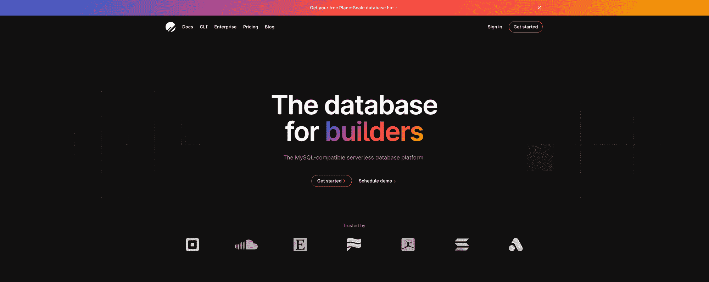

PlanetScale Landing Page

你可以使用 GitHub 或者传统的电子邮件密码创建一个账户。创建帐户后，点击“创建”链接。

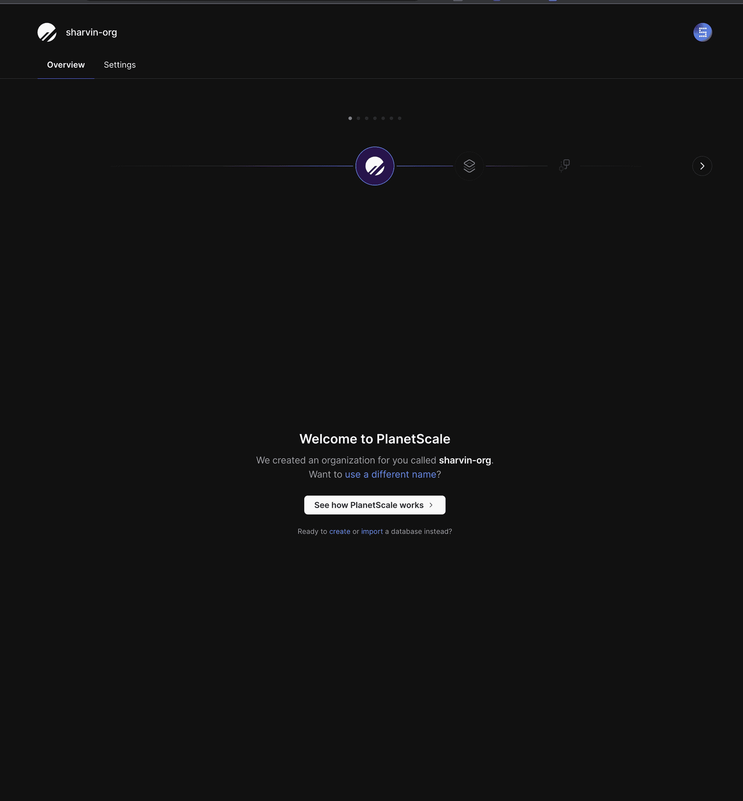

PlanetScale Dashboard Page

您将收到以下模式:

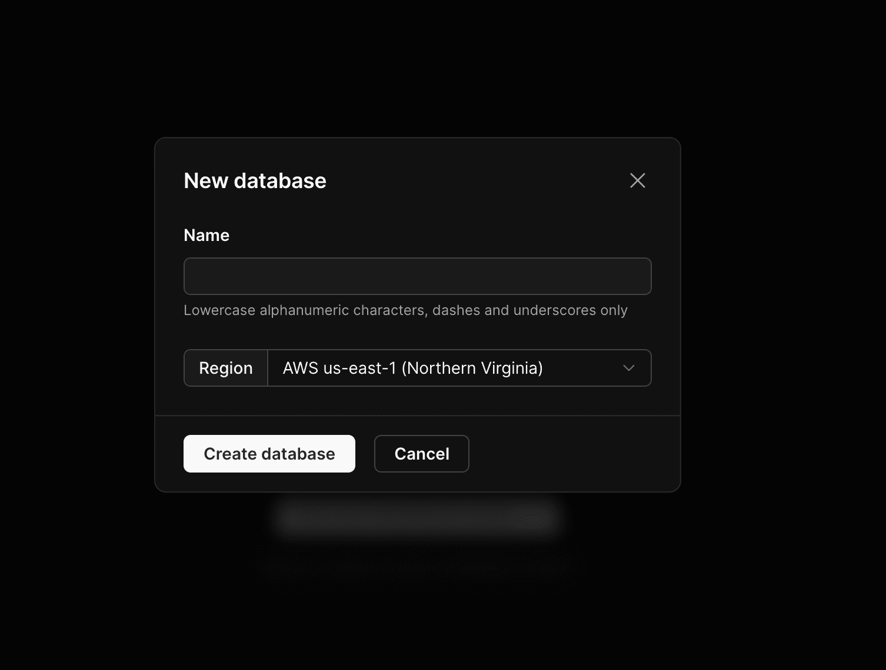

PlanetScale New Database Modal

填写详细信息，然后单击“创建数据库”按钮。创建数据库后，您将被重定向到以下页面:

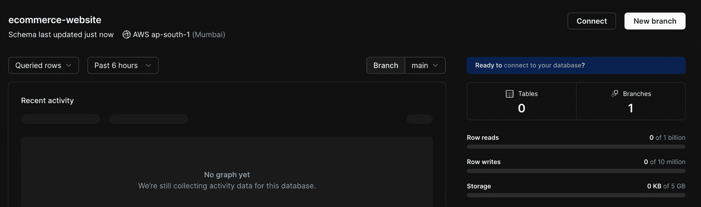

PlanetScale Ecommerce Website Database Page

点击连接，一个模态将打开。该模式将包含一个数据库 URL，并且不能再次生成该密码。所以复制并粘贴到一个安全的位置。


PlanetScale Database Username and Password Modal

### 如何配置条带:

要创建条带帐户，请转到此 [URL](https://dashboard.stripe.com/register) 。一旦你创建了账户，点击导航菜单中的开发者按钮。你会在左边看到 API 密匙，你会在标准密匙下找到公开密匙和秘密密匙。

可发布密钥:这些密钥可以在 web 或移动应用程序的客户端代码中公开访问。

秘密密钥:这是一个秘密凭证，应该安全地存储在服务器代码中。该键用于调用条带 API。

### 如何配置 NextJS、TailwindCSS 和 Prisma？

首先，我们将使用以下命令创建一个 NextJS 应用程序:

```
npx create-next-app ecommerce-tut --ts --use-npm
```

项目创建完成后，用你最喜欢的编辑器打开它。您将获得以下结构:

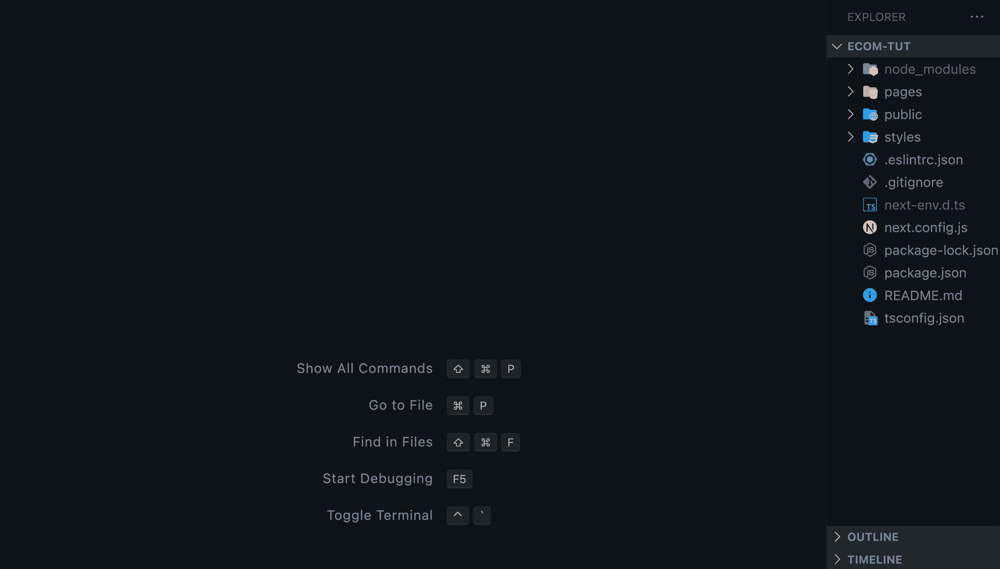

Project Structure

让我们创建一个名为`src`的目录。我们将把`pages`和`styles`目录移动到那个`src`文件夹中。您将获得以下结构:

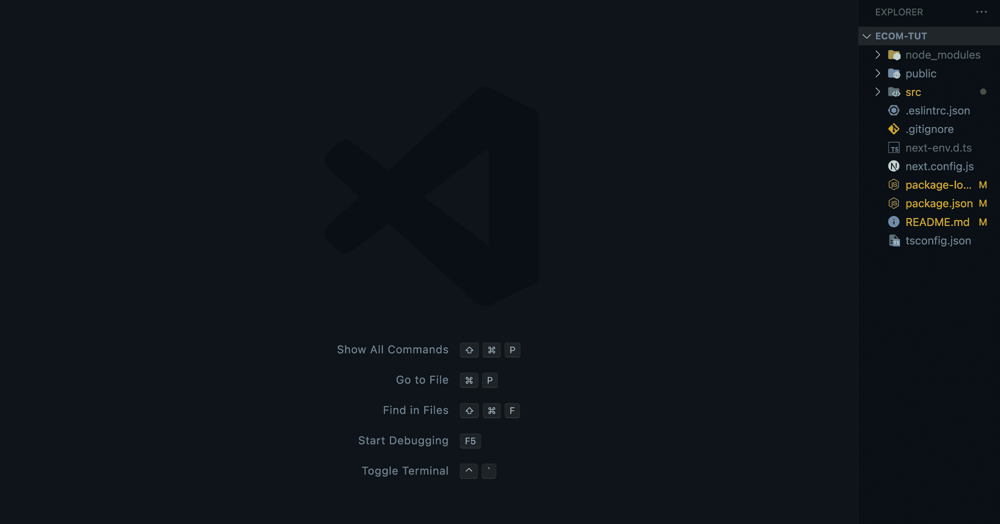

Project Structure after moving Pages and Styles.

安装以下软件包:

```
npm i @ngneat/falso @prisma/client @stripe/stripe-js @tanstack/react-query currency.js next-connect react-icons react-intersection-observer stripe
```

我们还需要安装开发依赖项:

```
npm i --save-dev @tanstack/react-query-devtools autoprefixer postcss tailwindcss
```

让我们了解一下每个产品包:

1.  我们将使用这个库为我们的电子商务网站创建模拟数据。在理想情况下，您应该有一个管理面板来添加产品，但这不在本教程的范围之内。
2.  [@prisma/client](https://www.prisma.io/docs/concepts/components/prisma-client) :我们将使用这个库连接到我们的数据库，运行迁移，并在数据库上执行所有 CRUD 操作。
3.  [@stripe/stripe-js](https://stripe.com/docs/js) :我们将使用这个库将用户重定向到 stripe 结账页面并处理支付。
4.  [@tanstack/react-query](https://tanstack.com/query/v4/) :我们将使用这个库来管理我们的异步状态，也就是缓存 API 响应。
5.  [currency.js](https://currency.js.org/) :我们将使用这个库将我们的价格转换成两位十进制格式。
6.  [next-connect](https://www.npmjs.com/package/next-connect) :我们将在下一个 API 层使用这个库进行路由。
7.  我们将使用这个库为我们的按钮和链接添加图标。
8.  [react-intersection-observer](https://www.npmjs.com/package/react-intersection-observer):你有没有在很多网站上看到过无限滚动，想知道它是怎么实现的？我们将使用这个库来实现基于视口的功能。
9.  [stripe:](https://www.npmjs.com/package/stripe) 我们将使用 stripe 库从下一个 API 层连接 Stripe API。
10.  [@ tan stack/react-query-dev tools](https://tanstack.com/query/v4/docs/devtools):我们将使用这个库作为开发期间查看和管理缓存的唯一开发依赖项。
11.  我们将使用它作为我们的 CSS 库，它也需要 PostCSS 和 AutoPrefixer。

让我们使用以下命令将 TailwindCSS 配置到我们的项目中:

```
npx tailwindcss init -p
```

您将得到以下响应:

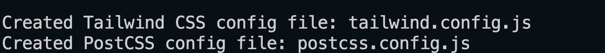

TailwindCSS Config Success

现在转到`tailwind.config.js`，用以下代码更新它:

```
/** @type {import('tailwindcss').Config} */
module.exports = {
    content: [
        "./src/pages/**/*.{js,ts,jsx,tsx}",
        "./src/components/**/*.{js,ts,jsx,tsx}",
    ],
    theme: {
        extend: {},
    },
    plugins: [],
};
```

tailwind.config.js

为了生成 CSS，Tailwind 需要访问所有的 HTML 元素。我们将只在页面和组件下编写 UI 组件，所以我们在内容下传递它。

如果你需要使用任何插件，例如，排版，那么你需要将它们添加到插件数组下。如果你需要扩展 Tailwind 提供的默认主题，那么你需要把它添加到`theme.extend`部分。

现在转到`/src/styles/globals.css`，用以下代码替换现有代码:

```
@tailwind base;
@tailwind components;
@tailwind utilities;
```

src/styles/globals.css

我们将在我们的`globals.css`文件中添加这三个指令。每个指令的含义如下:

1.  @tailwind base:这个注入了一个由 tailwind 提供的基础样式。
2.  @tailwind components:这将注入插件添加的类和任何其他类。
3.  @tailwind utilities:这将注入悬停、聚焦、响应、黑暗模式和插件添加的任何其他实用程序。

从`src/styles`目录中删除`Home.module.css`并转到`src/pages/index.ts`，用以下代码替换现有代码:

```
import type { NextPage } from "next";
import Head from "next/head";

const Home: NextPage = () => {
    return (
        <div>
            <Head>
                <title>All Products</title>
                <meta name="description" content="All Products" />
                <link rel="icon" href="/favicon.ico" />
            </Head>

            <main className="container mx-auto">
                <h1 className="h-1">Hello</h1>
            </main>
        </div>
    );
};

export default Home;
```

src/pages/index.ts

当我们运行`create-next-app`命令来创建项目时，它会添加一些样板代码。在这里，我们删除了一些情况下，而用一个`h1`和文本来代替`index.ts`说“你好”。

是时候使用以下命令运行网站了:

```
npm run dev
```

您将得到以下响应:

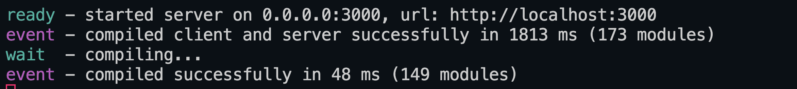

在您的浏览器上打开 [http://localhost:3000](http://localhost:3000/) ，您将看到以下带有 hello 消息的屏幕:


Screen with Hello Message

让我们使用以下命令将 Prisma 配置到我们的项目中:

```
npx prisma init
```

您将得到以下响应:


Prisma Successfully Configured Message

在`prisma/schema.prisma`下，用以下代码替换现有代码:

```
// This is your Prisma schema file,
// learn more about it in the docs: https://pris.ly/d/prisma-schema

generator client {
  provider        = "prisma-client-js"
  previewFeatures = ["referentialIntegrity"]
}

datasource db {
  provider             = "mysql"
  url                  = env("DATABASE_URL")
  referentialIntegrity = "prisma"
}

model Category {
  id        String    @id @default(cuid())
  name      String    @unique
  createdAt DateTime  @default(now())
  products  Product[]
}

model Product {
  id          String    @id @default(cuid())
  title       String    @unique
  description String
  price       String
  quantity    Int
  image       String
  createdAt   DateTime  @default(now())
  category    Category? @relation(fields: [categoryId], references: [id])
  categoryId  String?
} 
```

prisma/schema.prisma

这个文件由我们的数据库源 MySQL 组成。我们使用 MySQL 是因为 PlanetScale 只支持 MySQL。

此外，我们还创建了两个模型:

### 类别:

1.  名称:每个类别都有一个独特的标题。
2.  createdAt:添加类别的日期。
3.  产品:与产品模型的对外关系。

### 产品:

1.  标题:每个产品都有一个独特的标题。
2.  描述:这只是关于产品的信息。
3.  price:它属于`String`类型，因为它将保存一个小数值。
4.  quantity:它属于`Int`类型，因为它将保存一个数值。
5.  图像:产品外观的展示。出于本教程的目的，我们将使用 placeimg。
6.  创建日期:添加产品的日期。
7.  类别:与类别模型的外部关系。

我们使用`cuid()`而不是`uuid()`作为 id，因为它们对于水平缩放和顺序查找性能更好。Prisma 对 CUID 有内在的支持。你可以在这里了解更多关于[的信息。](https://github.com/paralleldrive/cuid)

现在该用下面的内容更新我们的`.env`文件了:

```
DATABASE_URL=

STRIPE_SECRET_KEY=

NEXT_PUBLIC_STRIPE_PUBLISHABLE_KEY=
```

.env

您可以在仪表板下找到 Stripe 秘密密钥和可发布密钥。数据库 URL 是我们之前复制粘贴并保存在安全位置的那个。用这些凭证更新这个`.env`。

另外，注意由 NextJS 创建的`.gitignore`文件不会忽略`.env`文件。它被配置为忽略`.env.local`文件。但是 Prisma 需要`.env`，所以我们将把`.gitignore`文件内容替换为以下内容:

```
# See https://help.github.com/articles/ignoring-files/ for more about ignoring files.

# dependencies
/node_modules
/.pnp
.pnp.js

# testing
/coverage

# next.js
/.next/
/out/

# production
/build

# misc
.DS_Store
*.pem

# debug
npm-debug.log*
yarn-debug.log*
yarn-error.log*
.pnpm-debug.log*

# local env files
.env
.env*.local

# vercel
.vercel

# typescript
*.tsbuildinfo
next-env.d.ts
```

.gitignore

理想情况下，Prisma 使用`prisma migrate`命令管理模式迁移。但是由于 PlanetScale 内置了模式迁移机制，我们将使用它。使用以下命令将迁移推到我们当前的主分支。

请注意，我们的主要分支尚未升级为生产分支。

```
npx prisma db push
```

现在让我们使用以下命令生成 Prisma 客户端:

```
npx prisma generate
```

转到 PlanetScale 仪表板，您会发现创建了两个表:

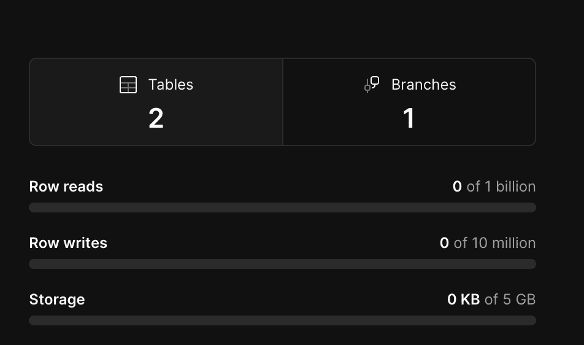

PlanetScale Two Tables Created

点击这些表格，您将被重定向到以下页面:

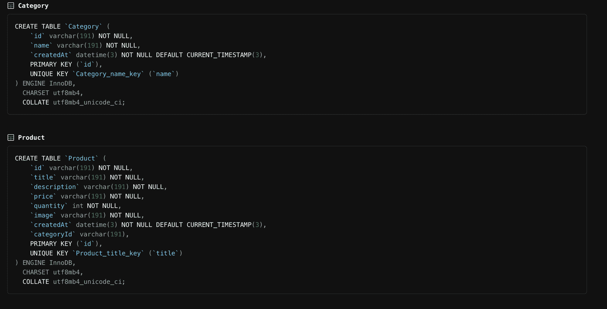

PlanetScale Database Schema

## 如何实现模拟数据、类别-产品 API 和所有类别-单一类别 UI。

在本节中，我们将实现以下功能:

1.  创建模拟数据
2.  创建类别和产品 API。
3.  创建所有类别和单个类别的用户界面。

你可以在这个[提交](https://github.com/Sharvin26/Ecommerce-Website-ReactJS-TailwindCSS-PlanetScale-Stripe/tree/18bfb1152cfdeb14ba1a554d88d2b766a319d66a)中找到本节实现的**电子商务网站代码**。

### 如何创建模拟数据:

在`prisma`目录下，创建一个名为`seed.ts`的文件，并复制粘贴以下代码:

```
import {
    randBetweenDate,
    randNumber,
    randProduct,
    randProductAdjective,
} from "@ngneat/falso";
import { PrismaClient } from "@prisma/client";

const primsa = new PrismaClient();

const main = async () => {
    try {
        await primsa.category.deleteMany();
        await primsa.product.deleteMany();
        const fakeProducts = randProduct({
            length: 1000,
        });
        for (let index = 0; index < fakeProducts.length; index++) {
            const product = fakeProducts[index];
            const productAdjective = randProductAdjective();
            await primsa.product.upsert({
                where: {
                    title: `${productAdjective} ${product.title}`,
                },
                create: {
                    title: `${productAdjective} ${product.title}`,
                    description: product.description,
                    price: product.price,
                    image: `${product.image}/tech`,
                    quantity: randNumber({ min: 10, max: 100 }),
                    category: {
                        connectOrCreate: {
                            where: {
                                name: product.category,
                            },
                            create: {
                                name: product.category,
                                createdAt: randBetweenDate({
                                    from: new Date("10/06/2020"),
                                    to: new Date(),
                                }),
                            },
                        },
                    },
                    createdAt: randBetweenDate({
                        from: new Date("10/07/2020"),
                        to: new Date(),
                    }),
                },
                update: {},
            });
        }
    } catch (error) {
        throw error;
    }
};

main().catch((err) => {
    console.warn("Error While generating Seed: \n", err);
});
```

prisma/seed.ts

在这里，我们正在创建 1000 个假冒产品，并将它们添加到数据库中。

我们按照以下步骤添加产品:

1.  使用`deleteMany()`功能删除所有类别。
2.  使用`deleteMany()`功能删除所有产品。
3.  以上是可选的步骤，但是用一个干净的表重新运行种子脚本总是一个好主意。
4.  由于来自`product`表的`title`属性具有与之相关联的唯一属性，我们将它与`randProductAdjective`函数输出绑定，以减少重复的可能性。
5.  但是，由`falso`创建的标题属性仍然有可能重复。所以我们使用`@prisma/client`中的 upsert 方法。
6.  当我们创建产品时，我们也在创建/关联类别。

现在转到`package.json`，更新`scripts`下面的代码:

```
"prisma": {
    "seed": "ts-node --compiler-options {\"module\":\"CommonJS\" prisma/seed.ts"
},
```

package.json

我们将使用`ts-node`包运行我们的种子脚本命令。种子脚本是用 TypeScript 编写的，而`ts-node`将 TypeScript 代码转换成 JavaScript。

使用以下命令安装软件包:

```
npm i --save-dev ts-node
```

因为`ts-node`会将代码转换成 JavaScript，所以我们可以执行下面的命令来用模拟数据播种表格:

```
npx prisma db seed
```

您将获得以下输出，显示它已经开始运行。将模拟数据植入表中需要一些时间。

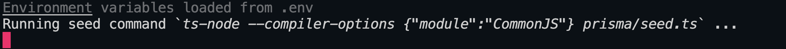

一旦 seed 命令成功，您将得到以下响应:


Prisma 的好处是它还有一个 studio，可以用来在本地开发环境中查看数据库。使用以下命令运行这个工作室:

```
npx prisma studio
```

在您的浏览器上打开 [http://localhost:5555](http://localhost:5555) ，您将看到以下屏幕，其中包含所有表格:

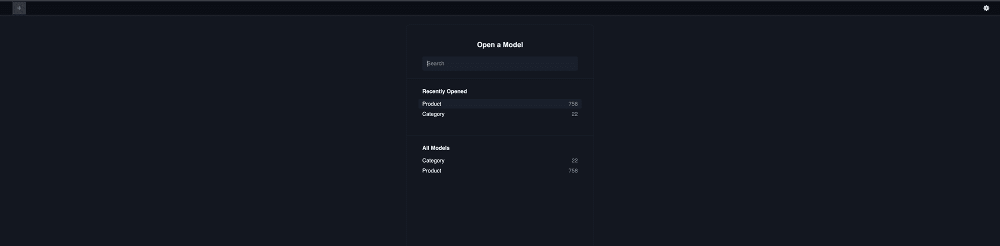

Prisma Studio

产品和类别的数量可能会因您的不同而有所不同，也可能相似，因为这是随机数据。

### 如何创建类别和产品 API:

在`src/pages/api`类别下，你会发现一个名为`hello.ts`的文件。删除这个文件并创建两个名为`categories`和`products`的目录。

在这些类别中，创建一个名为`index.ts`的文件，并复制粘贴以下代码:

```
import type { NextApiRequest, NextApiResponse } from "next";
import nc from "next-connect";
import { prisma } from "../../../lib/prisma";
import { TApiAllCategoriesResp, TApiErrorResp } from "../../../types";

const getCategories = async (
    _req: NextApiRequest,
    res: NextApiResponse<TApiAllCategoriesResp | TApiErrorResp>
) => {
    try {
        const categories = await prisma.category.findMany({
            select: {
                id: true,
                name: true,
                products: {
                    orderBy: {
                        createdAt: "desc",
                    },
                    take: 8,
                    select: {
                        title: true,
                        description: true,
                        image: true,
                        price: true,
                    },
                },
            },
            orderBy: {
                createdAt: "desc",
            },
        });
        return res.status(200).json({ categories });
    } catch (error) {
        return res.status(500).json({
            message: "Something went wrong!! Please try again after sometime",
        });
    }
};

const handler = nc({ attachParams: true }).get(getCategories);

export default handler;
```

src/pages/api/index.ts

在上面的代码片段中，我们执行了以下操作:

1.  当我们在`pages>api`目录下创建一个文件时，NextJS 将其视为一个无服务器 API。因此，通过创建一个名为`categories/index.ts`的文件，我们通知 Next 它需要将其转换为`/api/categories` API。
2.  使用`next-connect`库，我们确保对于`getCategories`函数，只允许`get`操作。
3.  在此函数下，我们使用订单为`desc`的数据库查询`createdAt`属性，并且我们只为每个类别行获取最新的八个产品行。我们还从前端所需的产品和类别中选择特定的属性。

我们不会在这个 API 中查询每个类别的所有产品，因为这会降低我们的响应时间。

你会发现我们已经导入了`prisma`和`types`文件。让我们在`src`下创建两个目录，分别命名为`lib`和`types`。

在`lib`目录下，创建一个名为`prisma.ts`的文件，在类型目录下创建一个名为`index.ts`的文件。

让我们在`prisma.ts`下创建我们的全局 Prisma 常数。复制粘贴以下代码:

```
import { PrismaClient } from "@prisma/client";

declare global {
    var prisma: PrismaClient;
}

export const prisma =
    global.prisma ||
    new PrismaClient({
        log: [],
    });

if (process.env.NODE_ENV !== "production") global.prisma = prisma;
```

src/lib/prisma.ts

这里我们创建了一个全局 prisma 变量，可以在整个项目中使用。

让我们在`src/types/index.ts`下添加我们将在应用程序范围内使用的类型。

复制粘贴以下代码:

```
export type TApiAllCategoriesResp = {
    categories: {
        id: string;
        name: string;
        products: {
            title: string;
            description: string;
            image: string;
            price: string;
        }[];
    }[];
};

export type TApiSingleCategoryWithProductResp = {
    category: {
        id: string;
        name: string;
        products: {
            id: string;
            title: string;
            description: string;
            image: string;
            price: string;
            quantity: number;
        }[];
        hasMore: boolean;
    };
};

export type TApiSingleProductResp = {
    product: {
        title: string;
        description: string;
        price: string;
        quantity: number;
        image: string;
    };
};

export type TApiErrorResp = {
    message: string;
};
```

src/types/index.ts

这里我们创建了四种类型，将在整个项目中使用。

我将使用 Postman 来测试这个 API。Postman 是一个开发 API 的实用程序。您可以调用 API，Postman 将根据您的结构显示响应。

只需将 Postman 中的 URL 更新为:

```
http://localhost:3000/api/categories
```

您将得到以下响应:

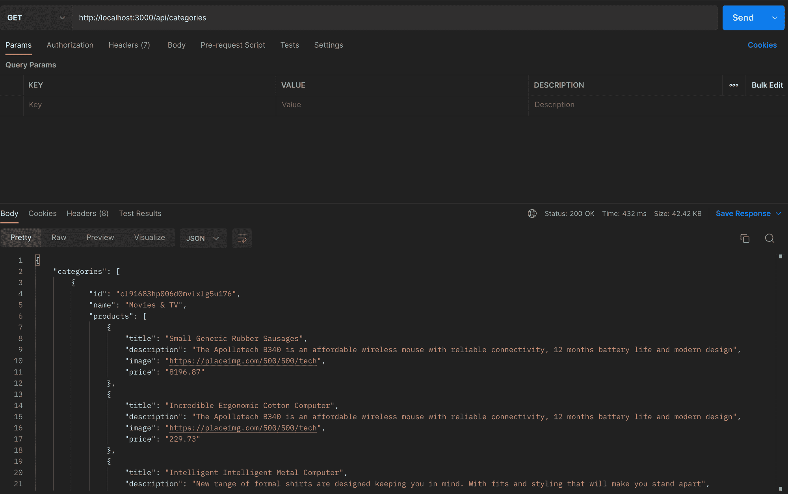

All Categories Resp

现在让我们创建一个 API 来获取单个类别的产品信息。

在`src/pages/api/categories`目录下创建一个名为`[id].ts`的文件，并复制粘贴以下代码:

```
import type { NextApiRequest, NextApiResponse } from "next";
import nc from "next-connect";
import { prisma } from "../../../lib/prisma";
import {
    TApiErrorResp,
    TApiSingleCategoryWithProductResp
} from "../../../types";

const getSingleCategory = async (
    req: NextApiRequest,
    res: NextApiResponse<TApiSingleCategoryWithProductResp | TApiErrorResp>
) => {
    try {
        const id = req.query.id as string;
        const cursorId = req.query.cursorId;
        if (cursorId) {
            const categoriesData = await prisma.category.findUnique({
                where: {
                    id,
                },
                select: {
                    id: true,
                    name: true,
                    products: {
                        orderBy: {
                            createdAt: "desc",
                        },
                        take: 12,
                        skip: 1,
                        cursor: {
                            id: cursorId as string,
                        },
                        select: {
                            id: true,
                            title: true,
                            description: true,
                            image: true,
                            price: true,
                            quantity: true,
                        },
                    },
                },
            });

            if (!categoriesData) {
                return res.status(404).json({ message: `Category not found` });
            }

            let hasMore = true;
            if (categoriesData.products.length === 0) {
                hasMore = false;
            }

            return res
                .status(200)
                .json({ category: { ...categoriesData, hasMore } });
        }

        const categoriesData = await prisma.category.findUnique({
            where: {
                id,
            },
            select: {
                id: true,
                name: true,
                products: {
                    orderBy: {
                        createdAt: "desc",
                    },
                    take: 12,
                    select: {
                        id: true,
                        title: true,
                        description: true,
                        image: true,
                        price: true,
                        quantity: true,
                    },
                },
            },
        });
        if (!categoriesData) {
            return res.status(404).json({ message: `Category not found` });
        }

        let hasMore = true;
        if (categoriesData.products.length === 0) {
            hasMore = false;
        }

        return res
            .status(200)
            .json({ category: { ...categoriesData, hasMore } });
    } catch (error) {
        return res.status(500).json({
            message: "Something went wrong!! Please try again after sometime",
        });
    }
};

const handler = nc({ attachParams: true }).get(getSingleCategory);

export default handler;
```

src/pages/api/categories/[id].ts

在上面的代码片段中，我们执行了以下操作:

1.  通过在`src/pages/api/categories`下创建一个名为`[id].ts`的文件，我们告诉 NextJS 将其转换为`/api/categories/[id]` API。
2.  `[id]`是类别表中的类别 id。
3.  使用`next-connect`库，我们确保对于`getSingleCategory`函数，只允许`get`操作。
4.  在这个函数下，我们使用 order 作为`desc`查询数据库中的`createdAt`属性，并且我们只取最近的 12 个产品行。我们还从产品中选择前端所需的特定属性。

在这个 API 中，您会发现我们也实现了分页。这有助于我们在一个类别下获得更多产品。

有两种分页方式。一种是基于光标的分页，另一种是基于偏移量的分页。

那么我们为什么选择基于光标的分页而不是基于偏移量的分页呢？

[根据 Prisma 文件](https://www.prisma.io/docs/concepts/components/prisma-client/pagination)，

> 偏移分页在数据库级别上不可伸缩。例如，如果您跳过 200，000 条记录，取前 10 条，数据库仍然必须遍历前 200，000 条记录，然后才返回您要求的 10 条记录，这会对性能产生负面影响。”

欲了解更多信息，请阅读本[实用指南](https://www.prisma.io/docs/concepts/components/prisma-client/pagination)。

将 Postman 中的 URL 更新为:

```
http://localhost:3000/api/categories/cl91683hp006d0mvlxlg5u176?cursorId=cl91685ht00b00mvllxjwzkqk
```

我们的 URL 由两个 id 组成，您需要从之前的所有类别响应中添加`cl91683hp006d0mvlxlg5u176`。此`cl91685ht00b00mvllxjwzkqk` id 只是产品的光标，您可以将其添加为您想要的最后一个 id。

您将得到以下响应:

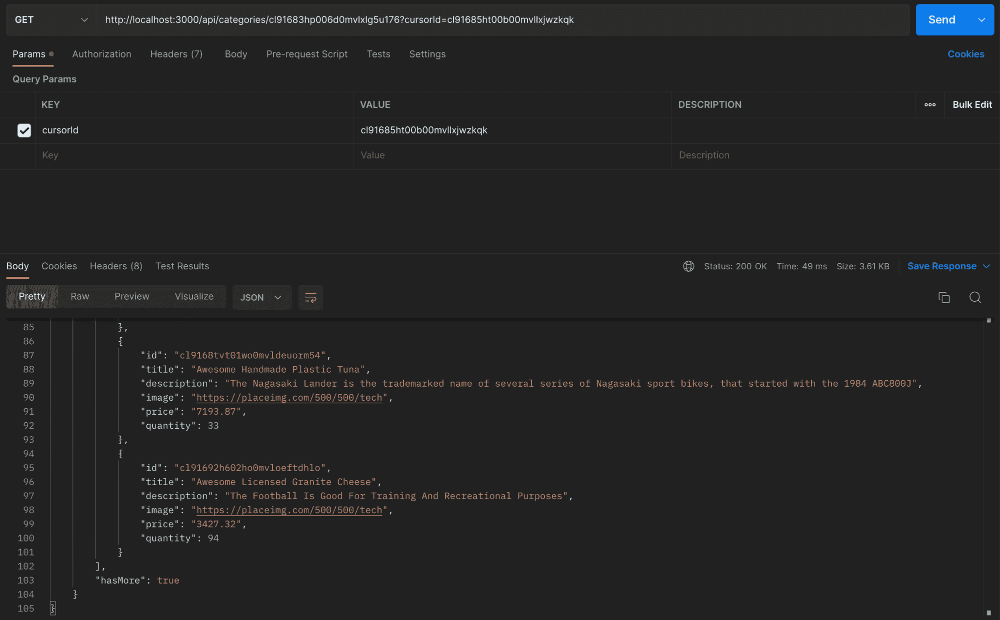

Single Category Resp

现在让我们创建一个 API 来获取单一产品信息。

在`src/pages/api/products`目录下创建一个名为`[title].ts`的文件，并复制粘贴以下代码:

```
import type { NextApiRequest, NextApiResponse } from "next";
import nc from "next-connect";
import { prisma } from "../../../lib/prisma";
import { TApiErrorResp, TApiSingleProductResp } from "../../../types";

const getSingleProduct = async (
    req: NextApiRequest,
    res: NextApiResponse<TApiSingleProductResp | TApiErrorResp>
) => {
    try {
        const title = req.query.title as string;
        const product = await prisma.product.findUnique({
            where: {
                title,
            },
            select: {
                title: true,
                description: true,
                price: true,
                quantity: true,
                image: true,
            },
        });
        if (!product) {
            return res.status(404).json({ message: `Product not found` });
        }
        return res.status(200).json({ product });
    } catch (error) {
        return res.status(500).json({
            message: "Something went wrong!! Please try again after sometime",
        });
    }
};

const handler = nc({ attachParams: true }).get(getSingleProduct);

export default handler;
```

src/pages/api/products/title.ts

在上面的代码片段中，我们执行了以下操作:

1.  通过在`src/pages/api/products`下创建一个名为`[title].ts`的文件，我们通知 NextJS 将其转换为`/api/products/[title]` API。
2.  `[title]`是产品表中的产品标题。
3.  使用`next-connect`库，我们确保对于`getSingleProduct`函数，只允许`get`操作。
4.  在这个函数下，我们使用基于标题的`findUnique`查询来查询数据库。

将 Postman 中的 URL 更新为:

```
http://localhost:3000/api/products/Practical Gorgeous Fresh Shoes
```

这里`Practical Gorgeous Fresh Shoes`是我们想要得到的产品的标题。您可以用数据库中的任何产品标题来替换它。

您将得到以下响应:

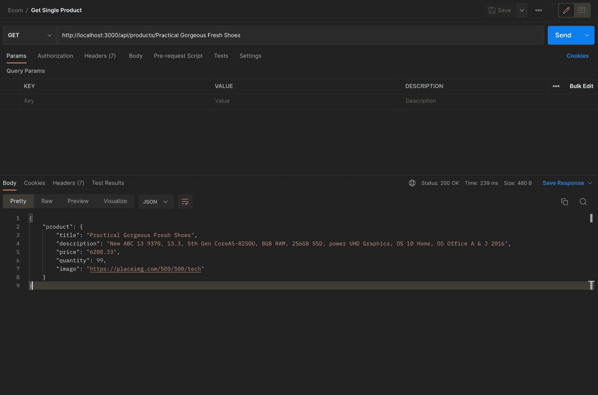

Single Product Resp

### 如何创建所有类别和单个类别用户界面:

在`src/pages/_app.tsx`下，用以下代码替换现有代码:

```
import { QueryClientProvider } from "@tanstack/react-query";
import { ReactQueryDevtools } from "@tanstack/react-query-devtools";
import type { AppProps } from "next/app";
import queryClient from "../lib/query";
import "../styles/globals.css";

function MyApp({ Component, pageProps }: AppProps) {
    return (
        <QueryClientProvider client={queryClient}>
            <ReactQueryDevtools initialIsOpen={false} />
            <Component {...pageProps} />
        </QueryClientProvider>
    );
}

export default MyApp;
```

src/pages/_app.tsx

这里我们用 React QueryClient Provider 包装所有组件。但是我们还需要传入客户端上下文。

在`src/lib`目录下创建一个名为`query.ts`的新文件，并复制粘贴以下代码:

```
import { QueryClient } from "@tanstack/react-query";

const queryClient = new QueryClient();

export default queryClient;
```

src/lib/query.ts

我们正在初始化一个新的`QueryClient`对象，并将其分配给`queryClient`变量，并将其导出为默认值。我们这样做的原因是，通过这种方式，我们可以将`queryClient`对象作为一个全局上下文。

在`src/pages/index.tsx`下，用以下代码替换现有代码:

```
import { useQuery } from "@tanstack/react-query";
import type { NextPage } from "next";
import Head from "next/head";
import Navbar from "../components/Navbar";
import ProductGrid from "../components/ProductGrid";
import Skelton from "../components/Skelton";

const Home: NextPage = () => {
    const getAllCategories = async () => {
        try {
            const respJSON = await fetch("/api/categories");
            const resp = await respJSON.json();
            return resp;
        } catch (error) {
            throw error;
        }
    };

    const { isLoading, data } = useQuery(
        ["AllCategoreiesWithProducts"],
        getAllCategories
    );

    const categories = data?.categories;

    return (
        <div>
            <Head>
                <title>All Products</title>
                <meta name="description" content="All Products" />
                <link rel="icon" href="/favicon.ico" />
            </Head>

            <main className="container mx-auto">
                <Navbar />
                {isLoading ? (
                    <Skelton />
                ) : (
                    <>
                        {categories && categories?.length > 0 && (
                            <ProductGrid
                                showLink={true}
                                categories={categories}
                            />
                        )}
                    </>
                )}
            </main>
        </div>
    );
};

export default Home;
```

src/pages/index.tsx

让我们来理解我们的代码。

在这里，我们从之前编写的`/api/categories`端点获取数据。我们用关键字`AllCategoreiesWithProducts`使用`useQuery`来缓存这些数据。

但是有三个组件我们还没有创建。让我们创建它们并理解每一个。

在`src`目录下，创建一个`components`目录。在新创建的`components`目录下，创建三个文件，分别命名为`Navbar.tsx`、`ProductGrid.tsx`和`Skelton.tsx`。

在`Navbar.tsx`下复制粘贴以下代码:

```
import NextLink from "next/link";

const Navbar = () => {
    return (
        <div className="relative bg-white mx-6">
            <div className="flex items-center justify-between pt-6 md:justify-start md:space-x-10">
                <div className="flex justify-start lg:w-0 lg:flex-1">
                    <h1 className="text-2xl">
                        <NextLink href="/" className="cursor-pointer">
                            Ecomm App
                        </NextLink>
                    </h1>
                </div>
            </div>
        </div>
    );
};

export default Navbar;
```

src/components/Navbar.tsx

这里我们创建了一个文本为 Ecomm App 的`h1`。我们将这个文本放在了`NextLink`周围，并将位置设置为`/`。因此，当用户点击这个，他们将被重定向到主页。

在`ProductGrid.tsx`下复制粘贴以下代码:

```
import NextImage from "next/image";
import NextLink from "next/link";
import { useEffect } from "react";
import { AiOutlineRight } from "react-icons/ai";
import { useInView } from "react-intersection-observer";
import { TApiAllCategoriesResp } from "../types";

interface IProductGrid extends TApiAllCategoriesResp {
    showLink: boolean;
    hasMore?: boolean;
    loadMoreFun?: Function;
}

const ProductGrid = (props: IProductGrid) => {
    const { categories, showLink, loadMoreFun, hasMore } = props;
    const { ref, inView } = useInView();

    useEffect(() => {
        if (inView) {
            if (loadMoreFun) loadMoreFun();
        }
    }, [inView, loadMoreFun]);

    return (
        <div className="bg-white">
            {categories.map((category) => (
                <div className="mt-12  p-6" key={category.name}>
                    <div className="flex flex-row justify-between">
                        <span className="inline-flex items-center rounded-md bg-sky-800 px-8 py-2 text-md font-medium text-white">
                            {category.name}
                        </span>
                        {showLink && (
                            <NextLink href={`/category/${category.id}`}>
                                <p className="flex flex-row gap-2 underline hover:cursor-pointer items-center">
                                    View More
                                    <AiOutlineRight />
                                </p>
                            </NextLink>
                        )}
                    </div>
                    <div className="mt-6  grid grid-cols-1 gap-y-10 gap-x-6 xl:gap-x-8 sm:grid-cols-2 lg:grid-cols-4">
                        {category?.products.map((product) => (
                            <div
                                className="p-6 group rounded-lg border border-gray-200 bg-neutral-200"
                                key={product.title}
                            >
                                <div className="min-h-80 w-full overflow-hidden rounded-md group-hover:opacity-75 lg:aspect-none lg:h-80">
                                    <NextImage
                                        priority={true}
                                        layout="responsive"
                                        width="25"
                                        height="25"
                                        src={`${product.image}`}
                                        alt={product.title}
                                        className="h-full w-full object-cover object-center lg:h-full lg:w-full"
                                    />
                                </div>
                                <div className="relative mt-2">
                                    <h3 className="text-sm font-medium text-gray-900">
                                        {product.title}
                                    </h3>
                                    <p className="mt-1 text-sm text-gray-500">
                                        {product.price}
                                    </p>
                                </div>
                                <div className="mt-6">
                                    <NextLink
                                        href={`/product/${product.title}`}
                                    >
                                        <p className="relative flex items-center justify-center rounded-md border border-transparent bg-sky-800 py-2 px-8 text-sm font-medium text-white hover:bg-sky-900 hover:cursor-pointer">
                                            View More Details
                                        </p>
                                    </NextLink>
                                </div>
                            </div>
                        ))}
                    </div>
                    {!showLink && (
                        <div className="flex items-center justify-center mt-8">
                            {hasMore ? (
                                <button
                                    ref={ref}
                                    type="button"
                                    className="inline-flex items-center rounded-md border border-transparent bg-sky-800 px-4 py-2 text-sm font-medium text-white shadow-sm hover:bg-sky-900"
                                >
                                    Loading...
                                </button>
                            ) : (
                                <div className="border-l-4 border-yellow-400 bg-yellow-50 p-4 w-full">
                                    <div className="flex">
                                        <div className="ml-3">
                                            <p className="text-sm text-yellow-700">
                                                You have viewed all the Products
                                                under this category.
                                            </p>
                                        </div>
                                    </div>
                                </div>
                            )}
                        </div>
                    )}
                    {showLink && (
                        <div className="w-full border-b border-gray-300 mt-24" />
                    )}
                </div>
            ))}
        </div>
    );
};

export default ProductGrid;
```

src/components/ProductGrid.tsx

在这里，我们创建了一个网格，它将为基本屏幕显示 1 列。对于 sm 屏幕，它将显示 2 列，对于 lg 屏幕，它将显示 4 列。

在这下面，我们有一张卡片，上面有标题、价格和查看更多细节按钮。“查看更多详细信息”按钮将用户重定向到稍后创建的单个产品页面。

除此之外，我们使用来自`react-intersection-observer`库的`useInView`钩子来寻找用户在屏幕上的光标。这个 ref 附加到一个`Loading...`按钮上，一旦用户靠近它，我们就执行`loadMoreFn`功能。

它对服务器进行 API 调用，从最后一个游标开始获取接下来的 12 行。

在`Skelton.tsx`下复制粘贴以下代码:

```
const Skelton = () => {
    return (
        <>
            <div className="mt-12 h-8 w-40 rounded-lg bg-gray-200" />
            <div className="mt-6 grid grid-cols-1 gap-y-10 gap-x-6 sm:grid-cols-2 lg:grid-cols-4 xl:gap-x-8">
                {Array(16)
                    .fill(0)
                    .map((_val, index) => (
                        <div className="rounded-2xl bg-black/5 p-4" key={index}>
                            <div className="h-60 rounded-lg bg-gray-200" />
                            <div className="space-y-4 mt-6 mb-4">
                                <div className="h-3 w-3/5 rounded-lg bg-gray-200" />
                                <div className="h-3 w-4/5 rounded-lg bg-gray-200" />
                            </div>
                        </div>
                    ))}
            </div>
        </>
    );
};

export default Skelton;
```

src/components/Skelton.tsx

我们正在使用`placeimg`为我们的产品获取假图像，并且我们正在使用下一个图像组件，该组件需要在`next.config.js`下提及。

用以下代码替换`next.config.js`中的现有代码:

```
/** @type {import('next').NextConfig} */
const nextConfig = {
    reactStrictMode: true,
    swcMinify: true,
    images: {
        domains: ["placeimg.com"],
    },
};

module.exports = nextConfig
```

next.config.js

我们需要重启我们的服务器。使用以下命令再次启动开发服务器:

```
npm run dev
```

打开 [http://localhost:3000/](http://localhost:3000/) 会看到如下界面:

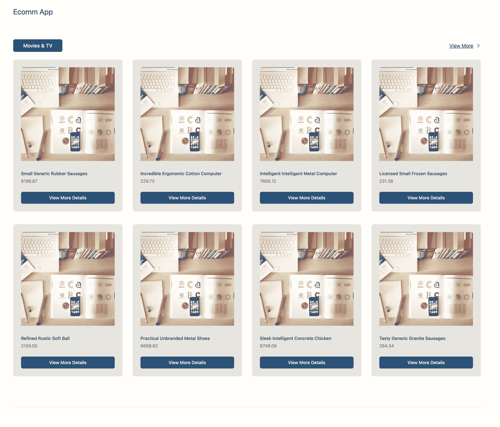

All Products Page

现在让我们创建一个单一的类别页面，用户可以使用一个`View More`链接进入该页面。

在`src/pages`下创建一个名为`category`的目录。在这个目录下创建一个名为`[id].tsx`的文件，并复制粘贴下面的代码:

```
import { useInfiniteQuery } from "@tanstack/react-query";
import Head from "next/head";
import { useRouter } from "next/router";
import Navbar from "../../components/Navbar";
import ProductGrid from "../../components/ProductGrid";
import Skelton from "../../components/Skelton";

const SingleCategory = () => {
    const router = useRouter();

    const getSingleCategory = async ({ pageParam = null }) => {
        try {
            let url = `/api/categories/${router.query.id}`;
            if (pageParam) {
                url += `?cursorId=${pageParam}`;
            }
            const respJSON = await fetch(url);
            const resp = await respJSON.json();
            return resp;
        } catch (error) {
            throw error;
        }
    };

    const { isLoading, data, fetchNextPage, isError } = useInfiniteQuery(
        [`singleCategory ${router.query.id as string}`],
        getSingleCategory,
        {
            enabled: !!router.query.id,
            getNextPageParam: (lastPage) => {
                const nextCursor =
                    lastPage?.category?.products[
                        lastPage?.category?.products?.length - 1
                    ]?.id;
                return nextCursor;
            },
        }
    );

    const allProductsWithCategory: any = {
        name: "",
        products: [],
        hasMore: true,
    };

    data?.pages.map((page) => {
        if (page?.category) {
            if (page.category?.name) {
                allProductsWithCategory.name = page.category?.name;
            }
            if (page.category?.products && page.category?.products.length > 0) {
                allProductsWithCategory.products.push(
                    ...page.category?.products
                );
            }
        }
        return page?.category;
    });

    if (data?.pages[data?.pages.length - 1]?.category?.products.length === 0) {
        allProductsWithCategory.hasMore = false;
    }

    return (
        <div>
            <Head>
                <title>
                    {isLoading
                        ? "Loading..."
                        : `All ${allProductsWithCategory?.name} Product`}
                </title>
                <meta
                    name="description"
                    content="Generated by create next app"
                />
                <link rel="icon" href="/favicon.ico" />
            </Head>
            <main className="container mx-auto">
                <Navbar />
                {isLoading ? (
                    <Skelton />
                ) : (
                    <>
                        {allProductsWithCategory &&
                            allProductsWithCategory.products.length > 0 && (
                                <ProductGrid
                                    hasMore={allProductsWithCategory.hasMore}
                                    showLink={false}
                                    categories={[allProductsWithCategory]}
                                    loadMoreFun={fetchNextPage}
                                />
                            )}
                    </>
                )}
            </main>
        </div>
    );
};

export default SingleCategory;
```

src/pages/category/[id]/tsx

这里我们调用`/api/categories/[id]` API 来获取该类别 id 的最新的 12 个产品。

我们使用来自`react query`的`useInfiniteQuery`钩子来获取数据。这个钩子对于基于光标的分页很有用。我们将使用我们之前创建的`ProductGrid`组件。

打开 [http://localhost:3000/](http://localhost:3000/) ，点击任一类别的查看更多链接，会看到如下界面:

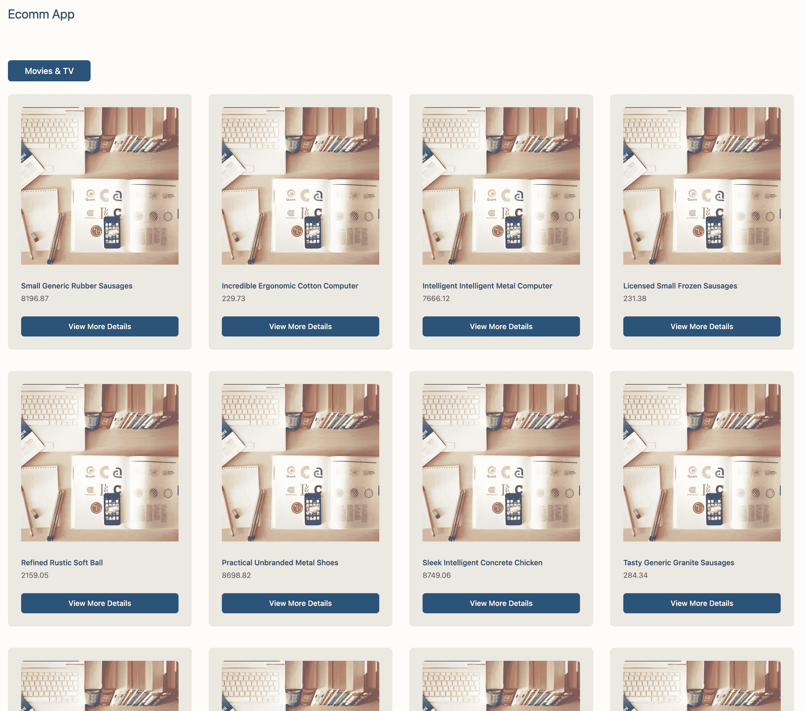

Single Category Page

以前的用户界面和现在的用户界面的区别是，我们现在在右上角没有“查看更多”链接。此外，当你向下滚动时，你会看到该类别的更多产品。

当我们滚动浏览该类别中的所有产品时，我们会看到以下警告提示:


## 如何实现单品 UI 和条纹结账？

在本节中，我们将实现以下功能:

1.  创建单一产品用户界面
2.  创建条带签出

你可以在这个[提交](https://github.com/Sharvin26/Ecommerce-Website-ReactJS-TailwindCSS-PlanetScale-Stripe/tree/e4b5426423358479a5bbe91ba17b3febacd5e4a3)中找到本节实现的**电子商务网站**代码**** 。

### 如何创建单一产品用户界面:

在`src/pages`目录下创建一个名为`product`的目录。

在此目录下创建一个名为`[title].tsx`的文件，并复制粘贴以下代码:

```
import { loadStripe, Stripe } from "@stripe/stripe-js";
import { useMutation, useQuery } from "@tanstack/react-query";
import Head from "next/head";
import NextImage from "next/image";
import { useRouter } from "next/router";
import Navbar from "../../components/Navbar";
import Skelton from "../../components/Skelton";

const stripePromiseclientSide = loadStripe(
    process.env.NEXT_PUBLIC_STRIPE_PUBLISHABLE_KEY!
);

const SingleProduct = () => {
    const router = useRouter();

    const getSingleProduct = async () => {
        try {
            const title = router?.query?.title;

            const respJSON = await fetch(`/api/products/${title}`);
            const resp = await respJSON.json();
            return resp;
        } catch (error) {
            throw error;
        }
    };

    const { mutate, isLoading: mutationIsLoading } = useMutation(
        async (body: any) => {
            try {
                const respJSON = await fetch("/api/create-checkout-session", {
                    method: "POST",
                    body: JSON.stringify(body),
                });
                const resp = await respJSON.json();
                const stripe = (await stripePromiseclientSide) as Stripe;
                const result = await stripe.redirectToCheckout({
                    sessionId: resp.id,
                });
                return result;
            } catch (error) {
                throw error;
            }
        }
    );

    const { data, isLoading } = useQuery(
        [`singleProduct, ${router?.query?.title}`],
        getSingleProduct,
        {
            enabled: !!router?.query?.title,
        }
    );

    const product = data?.product;

    return (
        <div>
            <Head>
                <title>{isLoading ? "Loading..." : `${product?.title}`}</title>
                <meta
                    name="description"
                    content="Generated by create next app"
                />
                <link rel="icon" href="/favicon.ico" />
            </Head>
            <main className="container mx-6 md:mx-auto">
                <Navbar />
                {isLoading ? (
                    <Skelton />
                ) : (
                    <div className="bg-white">
                        <div className="pt-6 pb-16 sm:pb-24">
                            <div className="mx-auto mt-8">
                                <div className="flex flex-col md:flex-row gap-x-8">
                                    <div className="min-h-80 w-full overflow-hidden rounded-md group-hover:opacity-75 lg:aspect-none lg:h-80">
                                        <NextImage
                                            layout="responsive"
                                            width="25"
                                            height="25"
                                            src={`${product.image}`}
                                            alt={product.title}
                                            className="h-full w-full object-cover object-center lg:h-full lg:w-full"
                                        />
                                    </div>
                                    <div className="lg:col-span-5 lg:col-start-8 mt-8 md:mt-0">
                                        <h1 className="text-xl font-medium text-gray-900 ">
                                            {product.title}
                                        </h1>
                                        <p className="text-xl font-light text-gray-700 mt-4">
                                            {product.description}
                                        </p>
                                        <p className="text-xl font-normal text-gray-500 mt-4">
                                            USD {product.price}
                                        </p>
                                        <button
                                            onClick={() =>
                                                mutate({
                                                    title: product.title,
                                                    image: product.image,
                                                    description:
                                                        product.description,
                                                    price: product.price,
                                                })
                                            }
                                            disabled={mutationIsLoading}
                                            type="button"
                                            className="inline-flex items-center rounded-md border border-transparent bg-sky-800 px-4 py-2 text-sm font-medium text-white shadow-sm hover:bg-sky-900  mt-4"
                                        >
                                            Buy Now
                                        </button>
                                    </div>
                                </div>
                            </div>
                        </div>
                    </div>
                )}
            </main>
        </div>
    );
};

export default SingleProduct;
```

src/pages/product/[title].tsx

这里我们调用`/api/products/title` API 来获取最新的产品。我们还创建了一个 Stripe 界面，用于在用户单击 Buy Now 按钮时创建一个结帐方法。

一旦用户点击 Buy Now 按钮，我们使用`useMutation`钩子对`/api/create-checkout-session`进行 API 调用。如果响应成功，我们会将用户重定向到 Stripe 默认结帐页面。

打开 [http://localhost:3000/](http://localhost:3000/) 并点击查看任何产品的更多详情按钮。

您将看到以下用户界面:

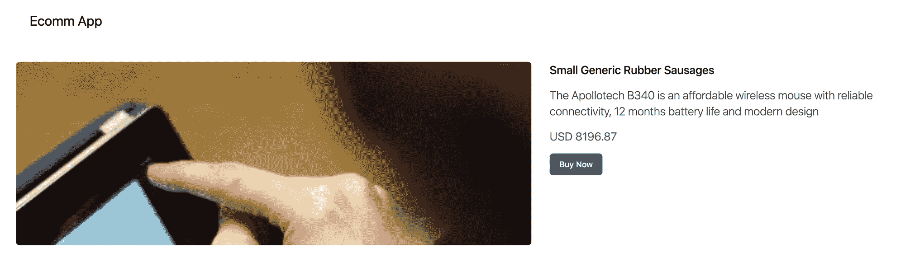

Single Product Page

您也可以通过单击查看更多链接，然后单击任何产品的查看更多详细信息按钮来访问此页面。

### 如何设置条带检出:

要设置条带检出，我们需要在 lib 目录下添加一个新文件。

在 lib 目录下创建一个名为`stripe.ts`的新文件，并复制粘贴以下代码:

```
import Stripe from "stripe";

const stripeServerSide = new Stripe(process.env.STRIPE_SECRET_KEY!, {
    apiVersion: "2022-08-01",
});

export { stripeServerSide };
```

src/lib/stripe.ts

这里，我们正在创建 Stripe 的服务器端实例。现在在`pages/api`目录下，创建一个名为`create-checkout-session.ts`的新文件，并复制粘贴以下代码:

```
import currency from "currency.js";
import type { NextApiRequest, NextApiResponse } from "next";
import nc from "next-connect";
import { stripeServerSide } from "../../lib/stripe";
import { TApiErrorResp } from "../../types";

const checkoutSession = async (
    req: NextApiRequest,
    res: NextApiResponse<any | TApiErrorResp>
) => {
    try {
        const host = req.headers.origin;
        const referer = req.headers.referer;
        const body = JSON.parse(req.body);
        const formatedPrice = currency(body.price, {
            precision: 2,
            symbol: "",
        }).multiply(100);
        const session = await stripeServerSide.checkout.sessions.create({
            mode: "payment",
            payment_method_types: ["card"],
            line_items: [
                {
                    price_data: {
                        currency: "usd",
                        product_data: {
                            name: body?.title,
                            images: [body.image],
                            description: body?.description,
                        },
                        unit_amount_decimal: formatedPrice.toString(),
                    },
                    quantity: 1,
                },
            ],
            success_url: `${host}/thank-you`,
            cancel_url: `${referer}?status=cancel`,
        });
        return res.status(200).json({ id: session.id });
    } catch (error) {
        return res.status(500).json({
            message: "Something went wrong!! Please try again after sometime",
        });
    }
};

const handler = nc({ attachParams: true }).post(checkoutSession);

export default handler;
```

src/pages/api/create-checkout-session.ts

在上面的代码片段中，我们执行了以下操作:

1.  默认情况下，Stripe 将价格的精度格式化为 2 并乘以 100，因为它需要以美分为单位的 unit_amount。
2.  我们创建会话，并将 id 作为响应传递。

现在我们需要在`src/pages`目录下创建另一个名为`thank-you.tsx`的页面。一旦产品购买成功，Stripe Checkout 将重定向到此页面。

将以下代码复制粘贴到该文件下:

```
import Head from "next/head";
import { useRouter } from "next/router";
import { HiCheckCircle } from "react-icons/hi";
import Navbar from "../components/Navbar";

const ThankYou = () => {
    const router = useRouter();
    return (
        <div>
            <Head>
                <title>Thank You</title>
                <meta name="description" content="All Products" />
                <link rel="icon" href="/favicon.ico" />
            </Head>

            <main className="container mx-auto">
                <Navbar />
                <div className="rounded-md bg-green-50 p-4 mt-8">
                    <div className="flex">
                        <div className="flex-shrink-0">
                            <HiCheckCircle
                                className="h-5 w-5 text-green-400"
                                aria-hidden="true"
                            />
                        </div>
                        <div className="ml-3">
                            <h3 className="text-sm font-medium text-green-800">
                                Order Placed
                            </h3>
                            <div className="mt-2 text-sm text-green-700">
                                <p>
                                    Thank you for your Order. We have placed the
                                    order and your email will recieve further
                                    details.
                                </p>
                            </div>
                            <button
                                onClick={() => router.push("/")}
                                type="button"
                                className="inline-flex items-center rounded-md border border-transparent bg-sky-800 px-4 py-2 text-sm font-medium text-white shadow-sm hover:bg-sky-900 mt-4"
                            >
                                Continue Shopping
                            </button>
                        </div>
                    </div>
                </div>
            </main>
        </div>
    );
};

export default ThankYou;
```

src/pages/thank-you.tsx

打开 [http://localhost:3000/](http://localhost:3000/) ，点击任意产品的查看更多详情按钮。

点击立即购买按钮，您将被重定向到以下页面:

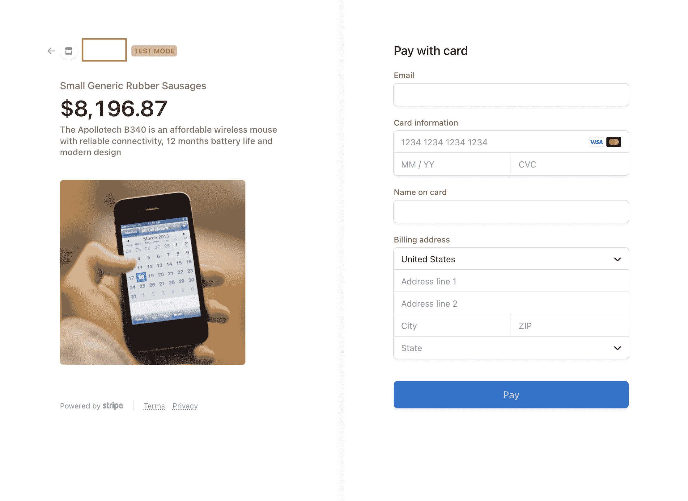

添加测试卡的所有详细信息。你可以使用这个[环节](https://stripe.com/docs/testing?numbers-or-method-or-token=card-numbers#cards)中的任何一张牌。Stripe 提供了仅在测试模式下工作的各种测试卡。一旦你点击支付和付款处理发生，条纹将重定向到成功页面。

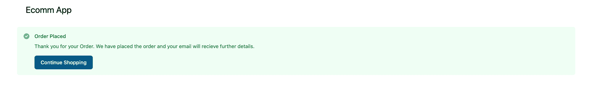

Thank You Page

## 如何将网站部署到生产中

在本节中，我们将实现以下功能:

1.  将我们的星球级分支提升为主分支。
2.  在 Vercel 上部署应用程序。

### 如何将 PlanetScale 分支提升到 Main:

要将分支提升为主分支，我们可以通过终端或仪表板来完成。在本教程中，我将使用仪表板。

转到 PlanetScale 上您的项目，您会在仪表盘上找到以下消息:

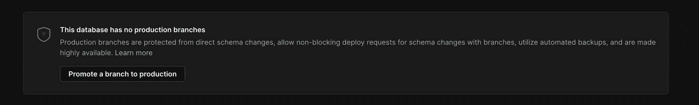

PlanetScale Database Promotion

让我们单击 Promote a branch to production 按钮，您将看到一个确认模型。单击提升分支按钮。一旦完成，你会得到一个成功的祝酒辞。

### 如何部署到 Vercel:

如果您在 Vercel 上没有帐户，您可以在这里创建一个[。](https://vercel.com/signup)

可以在 GitHub 上创建一个项目，推送到主分支。如果你不知道怎么做，可以看看[这篇教程](https://docs.github.com/en/get-started/importing-your-projects-to-github/importing-source-code-to-github/adding-locally-hosted-code-to-github#adding-a-local-repository-to-github-using-git)。

在 GitHub 上推送项目后，转到 Vercel 并创建一个 Add New 按钮，然后从下拉列表中选择 project。

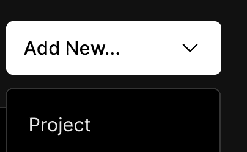

Add New Project Vercel

你会得到如下的用户界面:

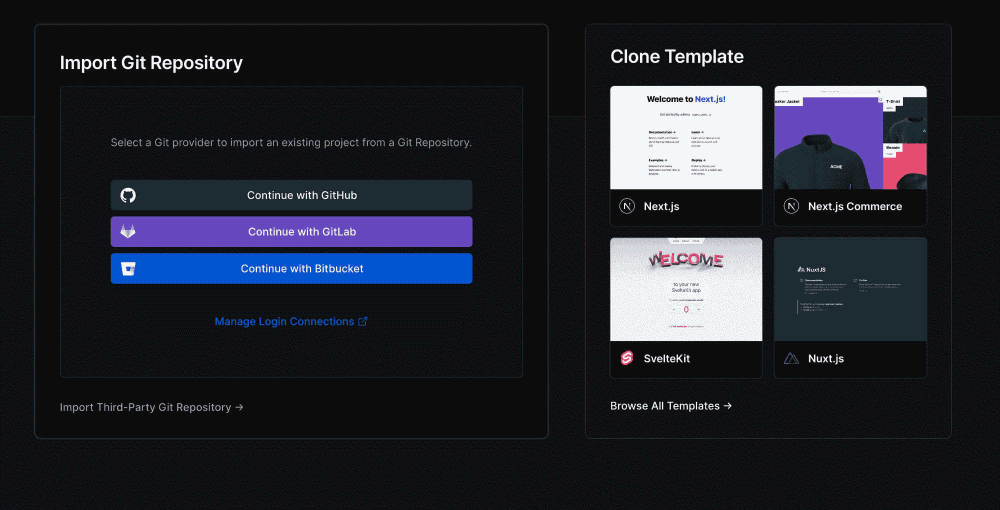

Select Git Provider Vercel

因为我们已经在 GitHub 上推送了代码，所以让我们点击继续 GitHub 按钮。您将获得以下用户界面:

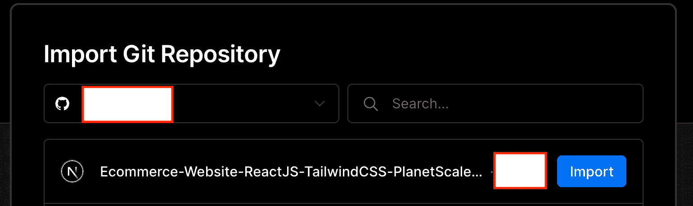

Select Git Repository Vercel

点击导入，你会看到如下界面:

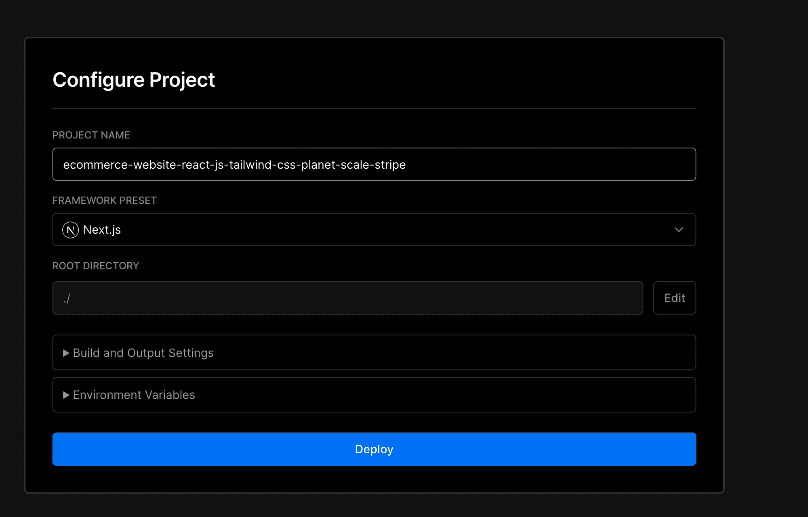

Configure Project Vercel

单击环境变量，在那里添加这三个变量:

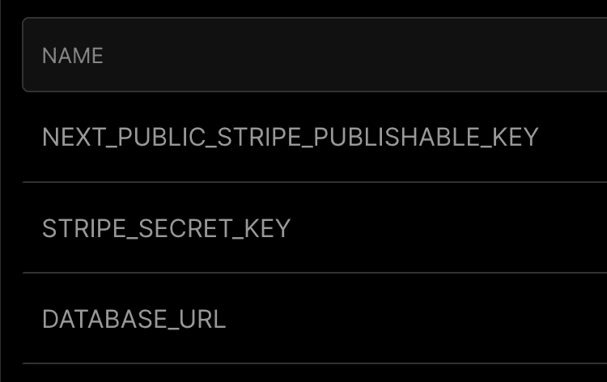

Add NEXT_PUBLIC_STRIPE_PUBLISHABLE_KEY, STRIPE_SECRET_KEY, and DATABASE_URL

完成后，单击部署按钮。一旦部署开始，您将获得以下 UI:

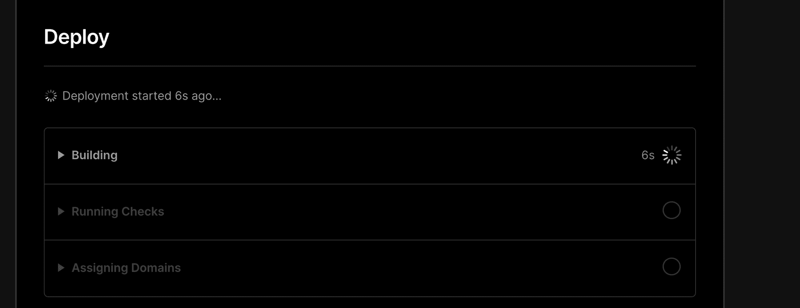

Deploying Vercel

一旦部署完毕，Vercel 会给你一个唯一的 URL。

访问这个网址，你会发现它的失败。让我们转到 deployment > functions，您将看到以下错误:


Prisma generate Fails

我们需要更新`package.json`中的构建命令，如下所示:

```
"build": "npx prisma generate && next build",
```

再次将代码推送到 Git 存储库，您会发现 Vercel 开始重新部署您的项目。

部署完成后，您可以访问您的应用程序 URL，您会发现它显示了您的所有产品。

这样，我们就创建了生产就绪的电子商务应用程序。如果你已经建立了网站和教程，那么恭喜你取得了这个成就。

## **感谢您的阅读！**

请随时在 [Twitter](https://twitter.com/sharvinshah26) 和 [Github](https://github.com/Sharvin26) 上联系我。

如果你想开发什么项目，或者想找我咨询，可以在我的 Twitter 上 DM 我( [@sharvinshah26](https://twitter.com/sharvinshah26) )。