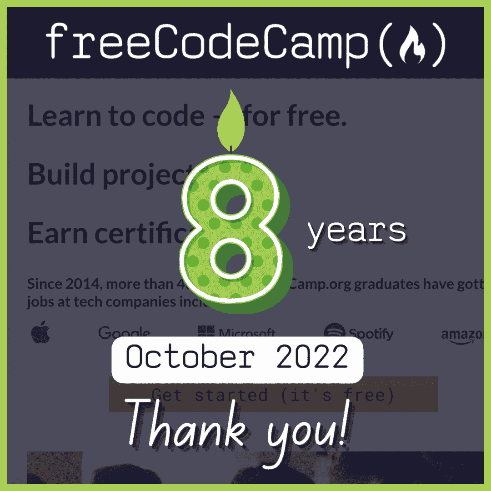

# freeCodeCamp 岁了:数据科学课程+大学学位更新

> 原文：<https://www.freecodecamp.org/news/freecodecamp-math-computer-science-degree-update/>

祝全球免费代码营社区生日快乐。

8 年前，我们建立了这个基层学习者社区。那时候，freeCodeCamp 听起来像是一个不可能实现的梦想。但是我们都卷起袖子开始努力实现它。

今天，每天有超过一百万人使用 freeCodeCamp。我们一起学习数学、计算机科学和编程。来自多种文化和各行各业的人们互相帮助，拓展他们的技能。

Thanks to Estefania for creating this celebratory 8-year anniversary GIF.

和每个冬天一样，我将很快分享大量关于 freeCodeCamp 社区增长的数据。在这次更新中，我将重点关注数据科学课程和我们免费的认证大学学位计划。

## 数据科学课程更新

去年，freeCodeCamp 社区举办了一次募捐活动来支持数据科学课程的开发。我们总共筹集了 30 多万美元用于研发。

> 嘿各位，我们成功了！🎊freeCodeCamp 数据科学承诺活动超出了我们的目标。募集总额:306，667 美元
> 
> 感谢所有的 2，519 位捐助者。感谢 [@darrellsilver](https://twitter.com/darrellsilver?ref_src=twsrc%5Etfw) 捐赠的 15 万美元。https://t.co/kClO5ND4lg[pic.twitter.com/bD9mffFjsO](https://t.co/bD9mffFjsO)
> 
> — Quincy Larson (@ossia) [July 15, 2021](https://twitter.com/ossia/status/1415658657950232580?ref_src=twsrc%5Etfw)