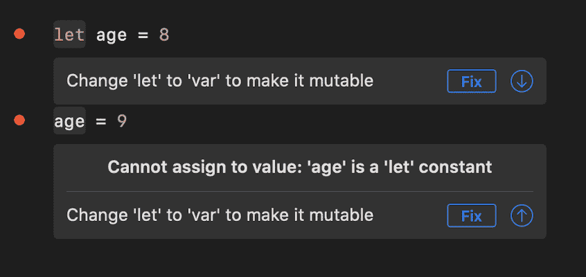
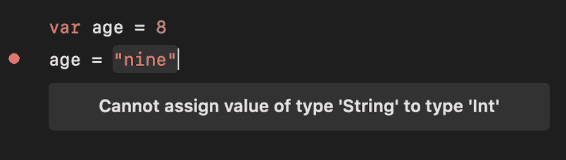
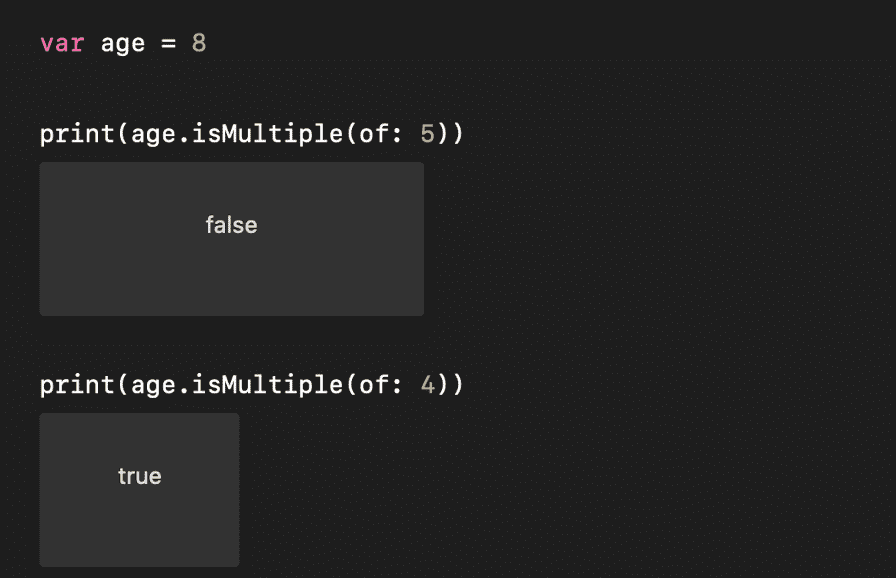
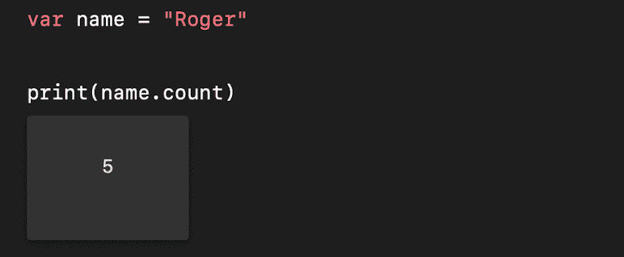
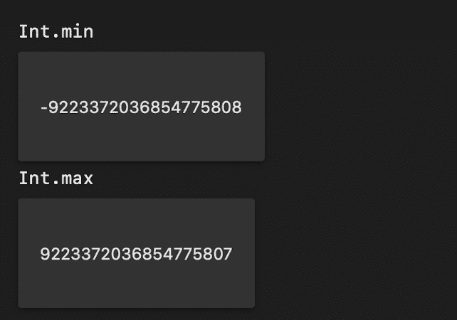
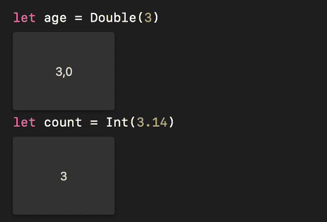
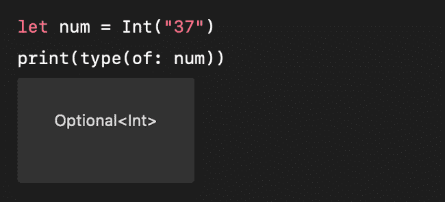
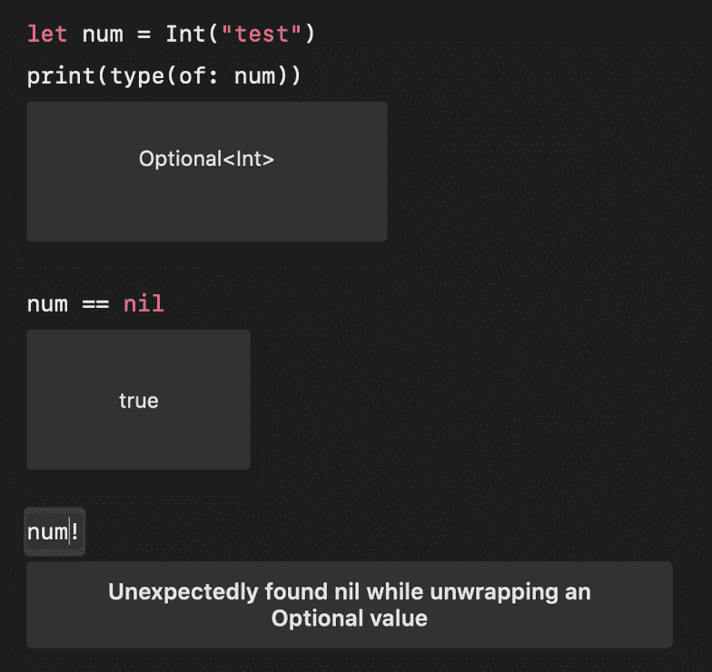
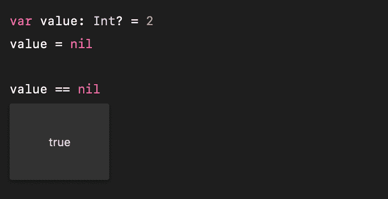
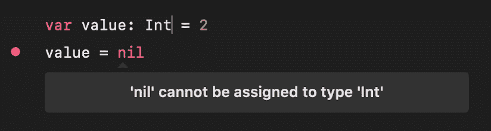

# Swift 手册——初学者学习 Swift

> 原文：<https://www.freecodecamp.org/news/the-swift-handbook/>

## Swift 简介

Swift 编程语言是苹果在 2014 年创造的。它是适用于整个苹果操作系统系列的官方语言:iOS、iPadOS、watchOS、macOS 和 tvOS。

Swift 是一种开源、通用、静态类型的编译编程语言。

每个值都有一个指定的类型。在编译时，当作为参数使用或返回时，总是检查值的类型。如果不匹配，程序将无法编译。

Swift 的编译器是 LLVM，它包含在 Xcode 中，Xcode 是您用于苹果软件开发的标准 IDE。

Swift 是一种现代编程语言，旨在“适应”一种生态系统，这种生态系统以前是为一种称为 Objective-C 的不同编程语言设计的。

如今，在 iPhone 和 Mac 上运行的大多数软件都是基于 Objective-C 代码的，即使是苹果官方应用也是如此。但是 Swift 的使用逐年增加。虽然 Objective-C 将用于多年来维护和改进现有的应用程序，但新的应用程序很可能将由 Swift 创建。

在苹果推出 Swift 之前，Objective-C 经过了大量开发，以引入新的功能和特性。但近年来，这种努力有所减少，取而代之的是快速发展。

这并不意味着 Objective-C 已死或不值得学习:Objective-C 仍然是任何苹果开发者的必备工具。

也就是说，我不打算在这里讨论 Objective-C，因为我们关注的是 Swift——苹果平台的现在和未来。

在短短 6 年内，Swift 已经经历了 5 个主要版本，我们现在(在撰写本文时)处于第 5 版。

Swift 是著名的苹果产品语言，但它不是苹果独有的语言。您可以在其他几个平台上使用它。

它是开源的，因此将该语言移植到其他平台不需要任何许可或授权，您可以找到 Swift 项目来创建 Web 服务器和 API([https://github.com/vapor/vapor](https://github.com/vapor/vapor))以及与微控制器交互的项目。

Swift 是一种通用语言，用现代概念构建，前途光明。

## 我们将在这里讨论的内容

本书的目标是让您从零开始使用 Swift。

如果你有 Mac 或者 iPad，我推荐你从 App Store 下载苹果制作的 Playgrounds 应用。

该应用程序允许您运行 Swift 代码片段，而无需首先创建完整的应用程序。这是一种非常方便的测试代码的方法，不仅仅是在你开始学习的时候，而是在你需要尝试一些代码的时候。

它还包含一系列精彩的示例和教程，以扩展您的 Swift 和 iOS 知识。

注意:[您可以获得本 Swift 初学者手册的 PDF 和 ePub 版本](https://thevalleyofcode.com/download/swift/)

*   [Swift 简介](#introduction-to-swift)
*   [Swift 中的变量](#variables-in-swift)
*   [Swift 中的对象](#objects-in-swift)
*   [Swift 中的操作员](#operators-in-swift)
*   [Swift 中的条件句](#conditionals-in-swift)
*   [Swift 中的循环](#loops-in-swift)
*   [如何在 Swift 中写评论](#how-to-write-comments-in-swift)
*   [Swift 中的分号](#semicolons-in-swift)
*   [Swift 中的数字](#numbers-in-swift)
*   [Swift 中的字符串](#strings-in-swift)
*   [Swift 中的布尔函数](#booleans-in-swift)
*   [Swift 中的数组](#arrays-in-swift)
*   [快速设定](#sets-in-swift)
*   [Swift 中的字典](#dictionaries-in-swift)
*   [Swift 中的元组](#tuples-in-swift)
*   Swift 中的[选项和`nil`](#optionals-and-nil-in-swift)
*   [Swift 中的枚举](#enumerations-in-swift)
*   [Swift 中的结构](#structures-in-swift)
*   [Swift 中的类](#classes-in-swift)
*   [Swift 中的功能](#functions-in-swift)
*   [Swift 中的协议](#protocols-in-swift)
*   [何去何从](#where-to-go-from-here)

## Swift 中的变量

变量让我们给标签赋值。我们使用关键字`var`来定义它们:

```
var name = "Roger"
var age = 8 
```

一旦定义了一个变量，我们就可以改变它的值:

```
age = 9 
```

您不想更改的变量可以定义为常量，使用`let`关键字:

```
let name = "Roger"
let age = 8 
```

禁止更改常量的值。



You can't change the value of a constant or you'll get this error

当您定义一个变量并为其赋值时，Swift 会隐式地推断出它的类型。

`8`是一个`Int`值。

`"Roger"`是一个`String`值。

像`3.14`这样的十进制数就是一个`Double`值。

您也可以在初始化时指定类型:

```
let age: Int = 8 
```

但是典型的是让 Swift 来推断，而且大多是在声明变量而没有初始化的情况下完成的。

您可以声明一个常数，并在以后初始化它:

```
let age : Int

age = 8 
```

一旦变量被定义，它就被绑定到该类型。除非显式转换它，否则不能为它分配不同的类型。

你不能这样做:

```
var age = 8
age = "nine" 
```



Cannot assign value of type 'String' to type 'Int' error

`Int`和`String`只是 Swift 提供的两种内置数据类型。

## Swift 中的对象

在 Swift 中，一切都是对象。甚至我们赋给`age`变量的`8`值也是一个对象。

在某些语言中，对象是一种特殊的类型。但是在 Swift 中，一切都是对象，这导致了一个特殊的特性:每个值都可以*接收消息*。

每种类型可以有多个关联的函数，我们称之为**方法**。

例如，谈到`8`的数值，我们可以调用它的`isMultiple`方法，来检查这个数是否是另一个数的倍数:



`isMultiple` method

字符串值有另一组方法。

类型也有实例变量。例如，字符串类型有实例变量`count`，它给出了字符串中的字符数:



instance variable `count`

Swift 有 3 种不同的**对象类型**，稍后我们会看到更多细节:**类**、**结构**和**枚举**。

这些非常不同，但是它们有一个共同点:对于对象类型，我们可以**添加方法**，对于任何对象类型的任何值，我们可以**发送消息**。

## Swift 中的操作员

我们可以使用多种运算符来运算值。

我们可以将运算符分为许多类别。首先是目标的数量:一元运算符为 1，二元运算符**为 2，唯一的三元运算符**为 3。****

然后，我们可以根据操作员执行的操作类型来划分操作员:

*   赋值运算符
*   算术运算符
*   复合赋值运算符
*   比较运算符
*   范围运算符
*   逻辑运算符

加上一些更高级的，包括零合并，三元条件，溢出，按位和逐点操作符。

注意:Swift 允许您创建自己的运算符，并定义运算符如何处理您定义的类型。

### Swift 中的赋值运算符

使用赋值运算符为变量赋值:

```
var age = 8 
```

或将一个变量值赋给另一个变量:

```
var age = 8
var another = age 
```

### Swift 中的算术运算符

Swift 有多个二进制算术运算符:`+`、`-`、`*`、`/`(除法)、`%`(余数):

```
1 + 1 //2
2 - 1 //1
2 * 2 //4
4 / 2 //2
4 % 3 //1
4 % 2 //0 
```

`-`也用作一元减运算符:

```
let hotTemperature = 20
let freezingTemperature = -20 
```

您也可以使用`+`来连接字符串值:

```
"Roger" + " is a good dog" 
```

### Swift 中的复合赋值运算符

复合赋值运算符将赋值运算符与算术运算符结合在一起:

*   `+=`
*   `-=`
*   `*=`
*   `/=`
*   `%=`

示例:

```
var age = 8
age += 1 
```

### Swift 中的比较运算符

Swift 定义了一些比较运算符:

*   `==`
*   `!=`
*   `>`
*   `<`
*   `>=`
*   `<=`

根据结果，您可以使用这些运算符来获得一个布尔值(`true`或`false`):

```
let a = 1
let b = 2

a == b //false
a != b //true
a > b // false
a <= b //true 
```

### Swift 中的范围运算符

范围运算符在循环中使用。它们允许我们定义一个范围:

```
0...3 //4 times
0..<3 //3 times

0...count //"count" times
0..<count //"count-1" times 
```

下面是一个用法示例:

```
let count = 3
for i in 0...count {
  //loop body
} 
```

### Swift 中的逻辑运算符

Swift 为我们提供了以下逻辑运算符:

*   `!`、一元运算符 NOT
*   `&&`、二元运算符 AND
*   `||`、二元运算符 or

示例用法:

```
let condition1 = true
let condition2 = false

!condition1 //false

condition1 && condition2 //false
condition1 || condition2 //true 
```

这些最常用于`if`条件表达式评估:

```
if condition1 && condition2 {
  //if body
} 
```

## Swift 中的条件句

### `if`Swift 中的声明

语句是执行条件检查最常用的方式。我们使用`if`关键字，后跟一个布尔表达式，再跟一个包含条件为真时运行的代码的块:

```
let condition = true
if condition == true {
    // code executed if the condition is true
} 
```

如果条件为假，则执行`else`块:

```
let condition = true
if condition == true {
    // code executed if the condition is true
} else {
    // code executed if the condition is false
} 
```

如果您愿意，可以选择将条件验证括在括号中:

```
if (condition == true) {
    // ...
} 
```

你也可以写:

```
if condition {
    // runs if `condition` is `true`
} 
```

或者

```
if !condition {
    // runs if `condition` is `false`
} 
```

Swift 区别于许多其他语言的一点是，它防止了错误地进行赋值而不是比较所导致的错误。这意味着您不能这样做:

```
if condition = true {
    // The program does not compile
} 
```

原因是赋值操作符不返回任何东西，但是`if`条件必须是布尔表达式。

### `switch`Swift 中的声明

Switch 语句是创建具有多个选项的条件的一种简便方法:

```
var name = "Roger"

switch name {
case "Roger":
    print("Hello, mr. Roger!")
default: 
    print("Hello, \(name)")
} 
```

当一个案例的代码结束时，开关自动退出。

Swift 中的交换机需要覆盖所有情况。如果*标签*，`name`是一个可以有任何值的字符串，我们需要添加一个`default` case，强制的。

否则，通过枚举，您可以简单地列出所有选项:

```
enum Animal {
    case dog
    case cat
}

var animal: Animal = .dog

switch animal {
case .dog:
    print("Hello, dog!")
case .cat:
    print("Hello, cat!")
} 
```

案例可以是一个范围:

```
var age = 20

switch age {
case 0..<18:
    print("You can't drive!!")
default: 
    print("You can drive")
} 
```

### Swift 中的三元条件运算符

三元条件运算符是一个`if`表达式的较短版本。它允许我们在条件为真时执行一个表达式，在条件为假时执行另一个表达式。

下面是语法:

```
`condition` ? `value if true` : `value if false` 
```

示例:

```
let num1 = 1
let num2 = 2

let smallerNumber = num1 < num2 ? num1 : num2 

// smallerNumber == 1 
```

该语法比`if`语句更短，有时使用它可能更有意义。

## Swift 中的循环

### `for-in`Swift 中的循环

您可以使用范围运算符，使用`for-in`循环迭代特定的次数:

```
for index in 0...3 {
  //iterate 4 times, `index` is: 0, 1, 2, 3
} 
```

您可以迭代数组或集合的元素:

```
let list = ["a", "b", "c"]
for item in list {
  // `item` contains the element value
} 
```

和字典的元素:

```
let list = ["a": 1, "b": 2, "c": 2]
for (key, value) in list {
  // `key` contains the item key
  // `value` contains the item value
} 
```

### `while`Swift 中的循环

一个`while`循环可以用来迭代任何东西，并且在条件为`true`时运行:

```
while [condition] {
    //statements...
} 
```

在开始执行循环块之前，检查条件。

示例:

```
var item = 0
while item <= 3 { //repeats 3 times
    print(item)
    item += 1
} 
```

### `repeat-while`Swift 中的循环

Swift 中的`repeat-while`循环类似于`while`循环。但是在这种情况下，条件是在循环块结束后检查的，所以循环块至少执行一次。然后检查条件，如果评估为`true`，则重复循环块:

```
repeat {
    //statements...
} while [condition] 
```

示例:

```
var item = 0
repeat { //repeats 3 times
    print(item)
    item += 1
} while item < 3 
```

### Swift 中的`continue`和`break`语句

Swift 为您提供了两条语句，您可以使用它们来控制循环内部的流程:`continue`和`break`。

您使用`continue`来停止当前的迭代，并运行循环的下一次迭代。

`break`结束循环，不执行任何其他迭代。

示例:

```
let list = ["a", "b", "c"]
for item in list {
  if (item == "b") {
    break
  }
  //do something
} 
```

## 如何在 Swift 中撰写评论

Swift 中的注释有两种形式:单行注释和多行注释。

单行注释如下所示:

```
//this is a comment 
```

你可以把它放在一行代码的末尾:

```
let a = 1 //this is a comment 
```

使用以下语法编写多行注释:

```
/* this
 is
    a multi-line
 comment
*/ 
```

Swift 允许您嵌套多行注释:

```
/* this
 is
    a /* nested */ multi-line
 comment
*/ 
```

这非常方便，尤其是在注释掉已经包含多行注释的大部分代码时。

## Swift 中的分号

在 Swift 中，分号通常是可选的。

您可以在单独的行上编写语句，并且不需要添加分号:

```
let list = ["a", "b", "c"]
var a = 2 
```

您*可以*添加一个分号，但是在这种情况下它没有添加任何有意义的内容:

```
let list = ["a", "b", "c"];
var a = 2; 
```

但是如果你想在同一行写多条语句，那么你需要加一个分号:

```
var a = 2; let b = 3 
```

## Swift 中的数字

在 Swift 中，数字有两种主要类型:`Int`和`Double`。

一个`Int`是一个没有小数点的数字。A `Double`是带小数点的数字。

在使用 64 位的现代计算机上，两者都使用 64 位，在 32 位平台上使用 32 位。

它们可以存储的值的范围取决于所使用的平台，并且可以使用每种类型的`int`属性进行检索:



Range of int values

然后，除了`Int`和`Double`，我们还有很多其他的数字类型。这些主要用于与过去构建的 API 进行交互，并且需要与 C 或 Objective-C 进行交互，您必须知道我们拥有它们:

*   `Int8`是一个 8 位整数
*   `Int16`是一个 16 位整数
*   `Int32`是一个 32 位整数
*   `Int64`为 64 位整数
*   `UInt8`是一个 8 位无符号整数
*   `UInt16`是一个 16 位无符号整数
*   `UInt32`是一个 32 位无符号整数
*   `UInt64`是一个 64 位无符号整数
*   `UInt`类似于`Int`，但无符号，范围从 0 到`Int.max * 2`。
*   `Float`是 32 位的十进制数。

然后使用 Cocoa APIs，您可能会使用其他数值类型，如 CLong、CGFloat 等等。

您将在代码中始终使用`Int`或`Double`，并且只在特定的情况下使用那些特定的类型。

请记住，您总是可以将这些类型中的任何一种转换为`Int`和`Double`类型，实例化一个数字，将括号内的值传递给`Double()`或`Int()`:

```
let age : UInt8 = 3
let intAge = Int(age) 
```

您也可以将数字从`Double`转换为`Int`:

```
let age = Double(3)
let count = Int(3.14) 
```



How to convert a number from `Double` to `Int`

## Swift 中的字符串

字符串是编程中最流行的工具之一。

在 Swift 中，您可以使用字符串文字语法定义字符串:

```
let name = "Roger" 
```

我们使用双引号。单引号不是有效的字符串分隔符。

一个字符串可以使用 3 个双引号跨越多行:

```
let description = """
	a long
  	long 
      	long description
	""" 
```

您可以使用字符串插值在字符串中嵌入表达式:

```
let age = 8

let name = """
	Roger, age \(age)
	Next year he will be \(age + 1)
	""" 
```

您可以用`+`操作符连接两个字符串:

```
var name = "Roger"
name = name + " The Dog" 
```

您可以使用`+=`操作符将文本添加到字符串中:

```
var name = "Roger"
name += " The Dog" 
```

或者使用`append(_:)`方法:

```
var name = "Roger"
name.append(" The Dog") 
```

您可以使用`count`字符串属性计算字符串中的字符数:

```
let name = "Roger"
name.count //5 
```

任何字符串都有一组有用的方法，例如:

*   `removeFirst()`删除第一个字符
*   `removeLast()`删除最后一个字符
*   `lowercased()`获取一个新字符串，小写
*   `uppercased()`获取一个新字符串，大写
*   如果字符串以特定的子字符串开头，则返回 true
*   如果字符串包含特定字符，则返回 true

还有很多很多。

当你需要引用字符串中的一个条目时，由于 Swift 中的字符串是 unicode，我们不能简单地用`name[1]`引用`let name = "Roger"`中的字母`o`。您需要使用索引。

任何字符串都提供带有`startIndex`属性的起始索引:

```
let name = "Roger"
name.startIndex //0 
```

要计算字符串中的特定索引，可以使用`index(i:offsetBy:)`方法进行计算:

```
let name = "Roger"
let i = name.index(name.startIndex, offsetBy: 2)
name[i] //"g" 
```

您还可以使用索引来获取子字符串:

```
let name = "Roger"
let i = name.index(name.startIndex, offsetBy: 2)
name.suffix(from: i) //"ger"

//Or using the subscript:

name[i...] //"ger" 
```

当你从一个字符串中获取一个子串时，结果的类型是`Substring`，而不是`String`。

```
let name = "Roger"
let i = name.index(name.startIndex, offsetBy: 2)
print(type(of: name.suffix(from: i))) 
//Substring 
```

子字符串的内存效率更高，因为您不会获得新的字符串，但是在后台使用了相同的内存结构。但是，当您大量处理字符串时，您需要小心，因为您可以实现一些优化。

字符串是集合，可以在循环中迭代。

## Swift 中的布尔值

Swift 提供了`Bool`类型，可以有两个值:`true`和`false`。

```
var done = false
done = true 
```

布尔对于像`if`语句或三元条件运算符这样的条件控制结构特别有用:

```
var done = true

if done == true {
    //code
} 
```

## Swift 中的阵列

我们使用数组来创建项目集合。

在本例中，我们创建了一个包含 3 个整数的数组:

```
var list = [1, 2, 3] 
```

我们可以使用语法`list[0]`访问第一项，使用`list[1]`访问第二项，以此类推。

Swift 中数组中的元素必须具有相同的类型。

如果在声明时初始化数组，就可以推断出类型，就像上面的例子一样。

否则，必须声明数组可以包含的值类型，如下所示:

```
var list: [Int] = [] 
```

另一种速记语法是:

```
var list = [Int]() 
```

也可以在初始化时显式声明类型，如下所示:

```
var list: [Int] = [1, 2, 3] 
```

初始化数组的一个快速方法是使用范围运算符:

```
var list = Array(1...4) //[1, 2, 3, 4] 
```

要获得数组中的项数，使用`count`属性:

```
var list = [1, 2, 3]
list.count //3 
```

如果数组为空，则其`isEmpty`属性为`true`。

```
var list = [1, 2, 3]
list.isEmpty //false 
```

您可以使用`append()`方法在数组末尾追加一个项目:

```
var list: [Int] = [1, 2, 3]
list.append(4) 
```

或者您可以使用`insert(newElement: <Type> at: Int)`在数组的任何位置插入一个项目:

```
var list: [Int] = [1, 2, 3]
list.insert(17, at: 2)
//list is [1, 2, 17, 3] 
```

数组必须声明为`var`才能被修改。如果它是用`let`声明的，就不能通过添加或删除元素来修改它。

要从数组中删除一个项目，使用`remove(at:)`传递要删除的元素的索引:

```
var list: [Int] = [1, 2, 3]
list.remove(1)
//list is [1, 3] 
```

`removeLast()`和`removeFirst()`是删除最后一个和第一个元素的两种简便方法。

要从数组中移除所有项目，您可以使用`removeAll()`或者分配一个空数组:

```
var list: [Int] = [1, 2, 3]
list.removeAll()
//or
list = [] 
```

`sort()`方法对数组排序:

```
var list = [3, 1, 2]
list.sort()
//list is [1, 2, 3] 
```

还有很多方法，但这些都是基本的。

当数组包含相同类型的相同元素时，它们是相等的:

```
[1, 2, 3] == [1, 2, 3] //true 
```

数组是通过值传递的，这意味着如果你将数组传递给一个函数，或者从一个函数返回它，数组就会被复制。

数组是集合，可以在循环中迭代。

## 迅速落下

您可以使用集合来创建不重复项目的集合。

虽然一个数组可以多次包含相同的项，但是一个集合中只有唯一的项。

您可以这样声明一组`Int`值:

```
let set: Set<Int> = [1, 2, 3] 
```

或者您可以从数组中初始化它:

```
let set = Set([1, 2, 3]) 
```

您可以使用`insert()`向器械包添加物品:

```
var set = Set([1, 2, 3])
set.insert(17) 
```

与数组不同，集合中没有顺序或位置。项目是随机检索和插入的。

打印一个集合的内容使其有序的方法是使用`sorted()`方法将其转换成一个数组:

```
var set = Set([2, 1, 3])
let orderedList = set.sorted() 
```

要检查集合是否包含元素，请使用`contains()`方法:

```
var set = Set([1, 2, 3])
set.contains(2) //true 
```

要获得集合中的项目数，请使用`count`属性:

```
let set = Set([1, 2, 3])
set.count //3 
```

如果集合为空，则其`isEmpty`属性为`true`。

```
let set = Set([1, 2, 3])
set.isEmpty //false 
```

要从数组中删除一项，使用`remove()`传递元素的值:

```
var set = Set([1, 2, 3])
set.remove(1)
//set is [2, 3] 
```

要从集合中移除所有项目，您可以使用`removeAll()`:

```
set.removeAll() 
```

与数组一样，集合也是通过值传递的。这意味着如果你把它传递给一个函数，或者从一个函数返回它，集合就被复制了。

集合非常适合执行集合数学运算，如交集、并集、减法等。

这些方法对此有所帮助:

*   `intersection(_:)`
*   `symmetricDifference(_:)`
*   `union(_:)`
*   `subtracting(_:)`
*   `isSubset(of:)`
*   `isSuperset(of:)`
*   `isStrictSubset(of:)`
*   `isStrictSuperset(of:)`
*   `isDisjoint(with:)`

集合是集合，可以在循环中迭代。

## Swift 词典

我们使用字典来创建键值对的集合。

下面是如何创建一个具有 1 个键-值对的字典，其中键是一个字符串，值是一个 Int:

```
var dict = ["Roger": 8, "Syd": 7] 
```

在这种情况下，类型是推断出来的。您也可以在声明时显式设置类型:

```
var dict: [String: Int] = ["Roger": 8, "Syd": 7] 
```

在本例中，我们创建了一个 Int 键和字符串值的空字典:

```
var dict = [String: Int]()

//or

var dict: [String: Int] = [:] 
```

您可以使用以下语法访问分配给键的值:

```
var dict = ["Roger": 8, "Syd": 7]

dict["Roger"] //8
dict["Syd"] //7 
```

您可以通过以下方式更改分配给键的值:

```
dict["Roger"] = 9 
```

字典必须声明为`var`才能被修改。如果它是用`let`声明的，就不能通过添加或删除元素来修改它。

使用相同的语法添加新的键/值对:

```
dict["Tina"] = 4 
```

要删除一个键/值对，将值分配给`nil`:

```
dict["Tina"] = nil 
```

或者调用`removeValue(forKey:)`方法:

```
dict.removeValue(forKey: "Tina") 
```

要获得字典中的条目数，请使用`count`属性:

```
var dict = ["Roger": 8, "Syd": 7]
dict.count //2 
```

如果字典为空，则其`isEmpty`属性为`true`。

```
var dict = [String: Int]()
dict.isEmpty //true 
```

与词典相关的方法有很多，但那些都是基本的。

字典是通过值传递的，这意味着如果你把它传递给一个函数，或者从一个函数返回，字典就会被复制。

字典是集合，可以在循环中迭代。

## Swift 中的元组

使用元组将多个值分组到一个集合中。例如，您可以声明一个包含字符串和 Int 值的变量`dog`:

```
let dog : (String, Int) 
```

你可以用名字和年龄来初始化它们

```
let dog : (String, Int) = ("Roger", 8) 
```

但是与任何其他变量一样，类型可以在初始化期间推断出来:

```
let dog = ("Roger", 8) 
```

您可以使用命名元素:

```
let dog = (name: "Roger", age: 8)

dog.name //"Roger"
dog.age //8 
```

一旦定义了元组，就可以用这种方式将它分解成单个变量:

```
let dog = ("Roger", 8)
let (name, age) = dog 
```

如果您只需要获取其中一个值，可以使用特殊的下划线关键字来忽略其他值:

```
let dog = ("Roger", 8)
let (name, _) = dog 
```

元组是满足各种需求的绝佳工具。

最明显的一点是，它们是对相似数据进行分组的一种捷径。

另一个需求是从一个函数中返回多个项目。一个函数只能返回一个条目，所以元组是一个方便的结构。

元组允许的另一个方便的功能是交换元素:

```
var a = 1
var b = 2

(a, b) = (b, a)

//a == 2
//b == 1 
```

## Swift 中的选项和`nil`

可选功能是 Swift 的一个主要特点。

当您不知道某个值是否存在时，您可以将该类型声明为可选类型。

可选的用自己的类型包装另一个值。也可能不是。

我们通过在类型后添加一个问号来声明可选的，如下所示:

```
var value: Int? = 10 
```

现在`value`不是一个 Int 值。这是一个可选的包装 Int 值。

为了确定可选的是否包装了一个值，你必须**打开**它。

您可以使用感叹号:

```
var value: Int? = 10
print(value!) //10 
```

Swift 方法通常返回一个可选的。例如，`Int`类型初始化器接受一个字符串，并返回一个 Int 可选值:



Int type initializer takes in a string and returns an int optional

这是因为它不知道字符串是否可以转换为数字。

如果可选内容不包含值，则它的计算结果为`nil`，并且您无法展开它:



Evaluating to `nil`

`nil`是不能赋给变量的特殊值。只给一个可选:



You can only assign `nil` to an optional (not an int)

您通常使用`if`语句来解开代码中的值，如下所示:

```
var value: Int? = 2

if let age = value {
    print(age)
} 
```

## Swift 中的枚举

枚举是将一组不同的选项分组到一个公共名称下的一种方式。

示例:

```
enum Animal {
    case dog
    case cat
    case mouse
    case horse
} 
```

这个`Animal`枚举现在是一个**类型的**。

其值只能是所列情况之一的类型。

如果您定义了一个类型为`Animal`的变量:

```
var animal: Animal 
```

您可以稍后使用以下语法决定将哪个值分配给它:

```
var animal: Animal
animal = .dog 
```

我们可以在像开关这样的控制结构中使用枚举:

```
enum Animal {
    case dog
    case cat
    case mouse
    case horse
}

let animal = Animal.dog

switch animal {
case .dog: print("dog")
case .cat: print("cat")
default: print("another animal")
} 
```

枚举值可以是字符串、字符或数字。

您也可以在单行上定义枚举:

```
enum Animal {
    case dog, cat, mouse, horse
} 
```

您还可以将类型声明添加到枚举中，并且每种情况都有一个该类型的赋值:

```
enum Animal: Int {
    case dog = 1
    case cat = 2
    case mouse = 3
    case horse = 4
} 
```

一旦有了变量，就可以使用它的`rawValue`属性获得这个值:

```
enum Animal: Int {
    case dog = 1
    case cat = 2
    case mouse = 3
    case horse = 4
}

var animal: Animal
animal = .dog

animal.rawValue //1 
```

枚举是一种值类型。这意味着当它们被传递给一个函数或者从一个函数返回时，它们被复制。当我们将一个指向枚举的变量赋给另一个变量时。

## Swift 中的结构

结构是一个重要的 Swift 概念。

在 Swift 中，结构随处可见。甚至内置类型也是结构。

我们可以创建结构的实例，我们称之为**对象**。

在大多数语言中，对象只能从类中创建。Swift 也有类，但是你也可以从结构中创建对象。官方文档实际上建议您应该更喜欢结构，因为它们更容易使用。

结构是类的简化版本。

结构可以:

*   有属性
*   拥有方法(功能)
*   定义下标
*   定义初始化器
*   符合协议
*   被延长

类允许的一件重要的事情是继承，所以如果你需要，你有类。

使用以下语法定义结构:

```
struct Dog {

} 
```

在一个结构中，你可以定义**存储属性**:

```
struct Dog {
    var age = 8
    var name = "Roger"
} 
```

这个结构定义定义了一个**类型**。要创建此类型的新实例，我们使用以下语法:

```
let roger = Dog() 
```

一旦有了实例，就可以使用点语法来访问其属性:

```
let roger = Dog()
roger.age
roger.name 
```

相同的点语法用于更新属性值:

```
roger.age = 9 
```

您也可以通过传递属性值来创建结构实例:

```
let syd = Dog(age: 7, name: "Syd")
syd.age
syd.name 
```

为此，属性必须是用`var`定义的变量，而不是常量(用`let`)。尊重这些属性的定义顺序也很重要。

结构可以有**实例方法**:属于结构实例的函数。

```
struct Dog {
    var age = 8
    var name = "Roger"
    func bark() {
        print("\(name): wof!")
    }
} 
```

我们还有**类型的方法**:

```
struct Dog {
    var age = 8
    var name = "Roger"
    func bark() {
        print("\(name): wof!")
    }
    static func hello() {
        print("Hello I am the Dog struct")
    }
} 
```

这被调用为`Dog.hello()`。

结构是一种值类型。这意味着当它们被传递给一个函数或者从一个函数返回时，它们被复制。当我们将一个指向结构的变量赋给另一个变量时。

这也意味着如果我们想要更新一个结构的属性，我们必须使用`var`而不是`let`来定义它。

Swift 中的所有类型都定义为结构:Int、Double、String、arrays 和 dictionaries，更多的是结构。

## Swift 中的类别

类有点类似于结构，但是它们有一些关键的区别。

使用以下语法定义类:

```
class Dog {

} 
```

在类内部，您可以定义存储的属性:

```
class Dog {
    var age = 0
} 
```

类定义定义了一个**类型**。要创建此类型的新实例，我们使用以下语法:

```
let roger = Dog() 
```

一旦有了实例，就可以使用点语法来访问其属性:

```
let roger = Dog()
roger.age 
```

您可以使用相同的点语法来更新属性值:

```
roger.age = 9 
```

一个很大的区别是类是引用类型。结构(和枚举)是值类型。

这意味着将一个类实例赋给另一个变量不会复制该实例。两个变量指向同一个实例:

```
class Dog {
    var age = 0
}

let roger = Dog()
let syd = roger

roger.age = 9
//syd.age == 9 
```

这也意味着我们可以使用`let`定义一个类的引用，并且我们可以改变它的属性，正如你在上面的例子中看到的。

我们可以创建类的实例，我们称它们为**对象**。

与结构一样，类可以有属性、方法等等。

与 structs 相反，我们**必须**定义一个初始化器，以便在创建实例时初始化值:

```
class Dog {
    var age : Int

    init(age: Int) {
        self.age = age
    }
}

let roger = Dog(age: 9) 
```

如果你有一个初始化器，你只能声明属性而不初始化它们。

见`self`的用法。我们需要它，因为`age`既是实例属性，也是`init(age:)`方法参数。`self.age`引用了`age`实例属性。

类可以有**实例方法**:属于一个类实例的函数。

```
class Dog {
    var age = 8
    var name = "Roger"

    func bark() {
      print("\(name): wof!")
    }
} 
```

我们还有**类型的方法**:

```
class Dog {
    var age = 8
    var name = "Roger"

    func bark() {
        print("\(name): wof!")
    }
    static func hello() {
        print("Hello I am the Dog struct")
    }
} 
```

作为`Dog.hello()`调用。

类允许的一件重要的事情是继承。

一个类可以继承另一个类的所有属性和方法。

说我们有课`Animal`。每种动物都有年龄:

```
class Animal {
    var age: Int
} 
```

不是每种动物都有名字。狗有名字。所以我们创建了一个从`Animal`扩展而来的`Dog`类:

```
class Dog: Animal {
    var name: String
} 
```

现在我们必须为这两个类添加一个初始化器。在 Dog 的例子中，在我们完成特定于类的初始化之后，我们可以使用`super.init()`调用父类初始化器:

```
class Animal {
    var age: Int

    init(age: Int) {
        self.age = age
    }
}

class Dog: Animal {
    var name: String

    init(age: Int, name: String) {
        self.name = name
        super.init(age: age)
    }
}

var horse = Animal(age: 8)
var roger = Dog(age: 8, name: "Roger") 
```

`Animal`现在是**超类**，而`Dog`是**子类**。

关于类还有更多要说的，但这是一个很好的介绍。

## Swift 中的功能

你的程序代码被组织成函数。

您可以使用`func`关键字声明一个函数:

```
func bark() {
    print("woof!")
} 
```

函数可以分配给结构、类和枚举，在这种情况下我们称之为方法。

使用函数名调用函数:

```
bark() 
```

函数可以返回值:

```
func bark() -> String {
    print("woof!")
	  return "barked successfully"
} 
```

你可以把它赋给一个变量:

```
let result = bark() 
```

函数可以接受参数。每个参数都有名称和类型:

```
func bark(times: Int) {
    for index in 0..<times {
        print("woof!")
    }
} 
```

参数的名称是函数的内部名称。

当我们调用函数来传递它的值时，我们使用参数的名称:

```
bark(times: 3) 
```

当我们调用函数时，我们必须传递所有定义的参数。

下面是一个接受多个参数的函数:

```
func bark(times: Int, repeatBark: Bool) {
    for index in 0..<times {
        if repeatBark == true {
            print("woof woof!")
        } else {
            print("woof!")
        }            
    }
} 
```

在这种情况下，您可以这样调用它:

```
bark(times: 3, repeat: true) 
```

当我们谈到这个函数时，我们不叫它`bark()`。我们称之为`bark(times:repeat:)`。

这是因为我们可以有多个同名的函数，但是有不同的参数集。

您可以通过使用`_`关键字来避免使用标签:

```
func bark(_ times: Int, repeatBark: Bool) {
    //...the function body
} 
```

所以你可以这样调用它:

```
bark(3, repeat: true) 
```

在 Swift 和 iOS APIs 中，第一个参数不带标签，其他参数带标签是很常见的。

当您很好地设计函数名和参数时，它会成为一个很好的、富有表现力的 API。

一个函数只能返回一个值。如果需要返回多个值，通常会返回一个元组:

```
func bark() -> (String, Int) {
    print("woof!")
	  return ("barked successfully", 1)
} 
```

您可以将结果赋给一个元组:

```
let (result, num) = bark()

print(result) //"barked successfully"
print(num) //1 
```

您可以将函数嵌套在其他函数中。当这种情况发生时，内部函数对于外部函数是不可见的。

## Swift 中的协议

协议是一种让不同类型的不同对象拥有一组公共功能的方式。

您可以像这样定义一个协议:

```
protocol Mammal {

} 
```

struts 和类可以**以这种方式采用协议**:

```
struct Dog: Mammal {

}

class Cat: Mammal {

} 
```

协议可以定义属性和方法，而不提供值和实现，并且结构/类必须实现它们:

```
protocol Mammal {
    var age: Int { get set }
    func walk()
} 
```

属性可以定义为`get`或`get set`。如果是`get`，这个属性必须用一个 getter 实现为只读。

任何采用该协议的类型都必须通过实现那些方法或提供那些属性来使**符合**协议:

```
struct Dog: Mammal {
    var age: Int = 0
    func walk() {
        print("The dog is walking")
    }
}

class Cat: Mammal {
    var age: Int = 0
    func walk() {
        print("The cat is walking")
    }
} 
```

结构和类可以采用多种协议:

```
struct Dog: Mammal, Animal {

}

class Cat: Mammal, Animal {

} 
```

注意，对于类来说，这是用于定义超类的相同语法。如果有超类，将它列为列表中的第一项，在冒号之后。

## 从这里去哪里

我希望这本小手册对如何开始使用 Swift 有所帮助。我希望你现在有兴趣了解更多！

我现在可以向您介绍几个地方，让您了解更多信息:

*   [官方 Swift 语言指南](https://docs.swift.org/swift-book/LanguageGuide/TheBasics.html)
*   [Swift 标准库](https://developer.apple.com/documentation/swift/swift-standard-library/)
*   [WWDC·斯威夫特视频](https://developer.apple.com/videos/swift)

[您可以点击这里](https://thevalleyofcode.com/download/swift/)获取该 Swift 初学者手册的 PDF 和 ePub 版本。