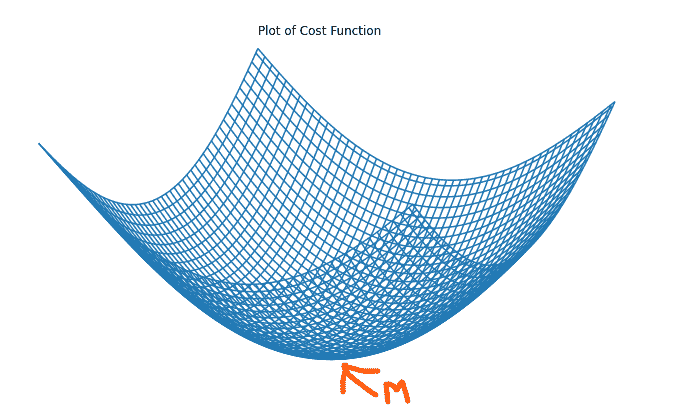
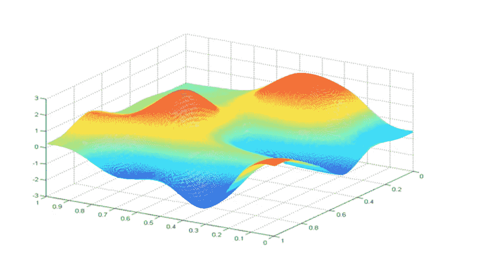
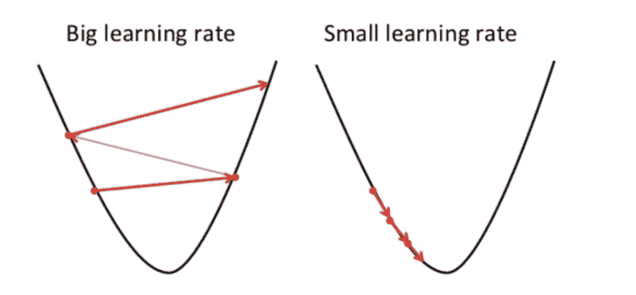
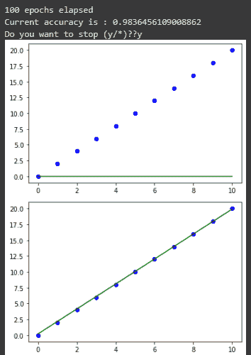
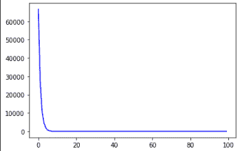

# 梯度下降–机器学习算法示例

> 原文：<https://www.freecodecamp.org/news/gradient-descent-machine-learning-algorithm-example/>

## 什么是梯度下降算法？

梯度下降可能是最流行的机器学习算法。该算法的核心是尽可能减少错误。

梯度下降算法的目标是最小化模型的成本函数。我们可以从单词'*梯度*'和'*下降*'的含义中看出这一点。

虽然梯度意味着两个定义的点之间的间隙(在此上下文中是成本函数)，但是下降通常指向下运动(在此上下文中是最小化成本函数)。

因此，在机器学习的背景下，梯度下降指的是通过调整机器学习模型的参数以产生最小可能误差来最小化机器学习模型的预测误差的迭代尝试。

这种误差被称为成本函数。成本函数是问题“*的答案的图，预测值与实际值相差多少？”*。虽然评估成本函数的方法通常因不同的机器学习模型而异，但在简单的线性回归模型中，通常是模型的均方根误差。



A 3D plot of the cost function of a simple linear regression model with M representing the minimum point

值得注意的是，对于线性回归这样的简单模型，成本函数的曲线通常是弓形的，这使得确定最小点更容易。然而，情况并非总是如此。对于更复杂的模型(例如神经网络)，图形可能不是弓形的。成本函数可能有多个最小值点，如下图所示。



A 3D plot of the cost function of a neural network. Source: [Coursera](https://www.coursera.org/lecture/machine-learning/gradient-descent-2f2PA)

## 梯度下降是如何工作的？

首先，重要的是要注意，像大多数机器学习过程一样，梯度下降算法是一个迭代过程。

假设简单线性回归模型的成本函数为 *j(w，b)* 其中 *j 为*是 *w* 和 *b、*的函数，梯度下降算法以对 *w* 和 *b* 的一些初始随机猜测开始工作。该算法将不断调整参数 *w* 和 *b* ，试图优化成本函数 *j.*

在线性回归中，初始值的选择并不重要。常见的选择是零。

通过调整参数 *w* 和 *b* 来最小化成本函数 *j* ( *w* ， *b* )并达到其局部最小值的梯度下降算法的完美类比是徒步走到山或小山的底部(如前面所示的简单线性回归模型的成本函数的 3D 图所示)。或者，试图到达高尔夫球场的最低点。在这两种情况下，他们都会重复小步前进，直到到达山脚。

## 梯度下降公式

下面是梯度下降的公式:b = a-γδf(a)

上面的等式描述了梯度下降算法的作用。

即 *b* 是徒步旅行者的下一个位置，而 *a* 代表当前位置。负号表示梯度下降算法的最小化部分，因为目标是尽可能地最小化误差。中间的γ是一个被称为学习率的因子，项δf(a)是一个梯度项，定义了极小点的方向。

因此，这个公式告诉徒步旅行者/高尔夫球场上的人的下一个位置(这是最陡下降的方向)。需要注意的是，术语*γδf(a)**是从 *a* 中减去的，因为目标是逆着梯度向局部最小值移动。*

## *学习率是多少？*

*学习率是梯度下降在局部最小值方向上的步长的决定因素。它决定了算法向成本函数的最优值移动的速度。*

*正因为如此，学习率γ的选择是重要的，并且对算法的有效性具有显著的影响。*

**

*如果学习率如上所示太大，为了找到最佳点，它会从左边的点一直移动到右边的点。在这种情况下，你会看到成本函数变得更差。*

*另一方面，如果学习率太小，那么梯度下降会起作用，尽管非常慢。*

*仔细选择学习速度是很重要的。*

## *线性回归中如何实现梯度下降*

```
*`import numpy as np
import matplotlib.pyplot as plt

class Linear_Regression:
	def __init__(self, X, Y):
		self.X = X
		self.Y = Y
		self.b = [0, 0]

	def update_coeffs(self, learning_rate):
		Y_pred = self.predict()
		Y = self.Y
		m = len(Y)
		self.b[0] = self.b[0] - (learning_rate * ((1/m) * np.sum(Y_pred - Y)))
		self.b[1] = self.b[1] - (learning_rate * ((1/m) * np.sum((Y_pred - Y) * self.X)))

	def predict(self, X=[]):
		Y_pred = np.array([])
		if not X: X = self.X
		b = self.b
		for x in X:
			Y_pred = np.append(Y_pred, b[0] + (b[1] * x))

		return Y_pred

	def get_current_accuracy(self, Y_pred):
		p, e = Y_pred, self.Y
		n = len(Y_pred)
		return 1-sum(
			[
				abs(p[i]-e[i])/e[i]
				for i in range(n)
				if e[i] != 0]
		)/n
	#def predict(self, b, yi):

	def compute_cost(self, Y_pred):
		m = len(self.Y)
		J = (1 / 2*m) * (np.sum(Y_pred - self.Y)**2)
		return J

	def plot_best_fit(self, Y_pred, fig):
				f = plt.figure(fig)
				plt.scatter(self.X, self.Y, color='b')
				plt.plot(self.X, Y_pred, color='g')
				f.show()

def main():
	X = np.array([i for i in range(11)])
	Y = np.array([2*i for i in range(11)])

	regressor = Linear_Regression(X, Y)

	iterations = 0
	steps = 100
	learning_rate = 0.01
	costs = []

	#original best-fit line
	Y_pred = regressor.predict()
	regressor.plot_best_fit(Y_pred, 'Initial Best Fit Line')

	while 1:
		Y_pred = regressor.predict()
		cost = regressor.compute_cost(Y_pred)
		costs.append(cost)
		regressor.update_coeffs(learning_rate)

		iterations += 1
		if iterations % steps == 0:
			print(iterations, "epochs elapsed")
			print("Current accuracy is :",
				regressor.get_current_accuracy(Y_pred))

			stop = input("Do you want to stop (y/*)??")
			if stop == "y":
				break

	#final best-fit line
	regressor.plot_best_fit(Y_pred, 'Final Best Fit Line')

	#plot to verify cost function decreases
	h = plt.figure('Verification')
	plt.plot(range(iterations), costs, color='b')
	h.show()

	# if user wants to predict using the regressor:
	regressor.predict([i for i in range(10)])

if __name__ == '__main__':
	main()`* 
```

*在其核心，您可以看到代码块使用`0.01`作为其在`100`步骤上的学习速率，为线性回归机器学习模型训练梯度下降算法。*

*运行上面的代码后，显示的输出如下:*

****

## *结论*

*总之，值得注意的是，梯度下降算法在人工智能和机器学习领域中尤其重要，因为模型必须针对准确性进行优化。*

*在本文中，您学习了什么是梯度下降算法，它是如何工作的，它的公式，什么是学习率，以及选择正确的学习率的重要性。您还看到了梯度下降如何工作的代码说明。*

*最后，如果你喜欢这篇文章并想看更多，我在 [Twitter](https://twitter.com/SalimOpines) 上分享我关于人工智能、机器学习和微软 Azure 的文章。*