# 如何通过 MySQL 使用 NestJS 和 typeORM 上传文件到 Azure

> 原文：<https://www.freecodecamp.org/news/upload-files-to-azure-using-nestjs-and-typeorm-with-mysql/>

图像和视频是可能存储在数据库中的大型文件的例子。这可能会影响应用程序的性能，因为这些文件会占用大量空间。

此外，它会扩展数据库，从而使备份变得更大、更慢。因此，它不被视为最佳实践。相反，使用分布式系统来保存文件并向我们的数据库添加对这些文件的引用是一个不错的选择。

在本文中，您将了解如何将这些文件上传到 Azure 云分布式服务，并使用流行的节点框架 NestJS 从 Azure 中删除它们。

## 目录

*   [什么是云分布式系统](#what-is-a-cloud-distributed-system)？
*   [什么是 Azure](#what-is-azure) ？
*   [入门](#getting-started)
*   [如何连接到 Azure](#how-to-connect-to-azure)
*   [如何设置 NestJS 和 MySQL DB](#how-to-set-up-nestjs-and-mysql-db)
*   [如何通过 SDK 连接到 Azure Blob】](#how-to-connect-to-azure-blob-through-sdk)
*   [如何通过 API 上传图片](#how-to-upload-the-image-through-the-api)
*   [如何创建上传图像的端点](#how-to-create-an-endpoint-for-uploading-images)
*   [如何删除文件](#how-to-delete-files)
*   [总结](#summary)

## 什么是云分布式系统？

分布式系统由分布在几个设备上的许多独立部分组成。他们通过消息相互交流以实现共同的目标。

因此，对最终用户来说，分布式系统看起来就像一个单一的界面或计算机。总的来说，系统应该最大限度地利用信息和资源，同时防止错误，因为即使一个系统出现故障，服务仍然可用。

## Azure 是什么？

Azure 是一个公共云计算平台，为分析、虚拟计算、存储、网络等提供解决方案。

这些解决方案包括基础设施即服务(IaaS)、平台即服务(PaaS)和软件即服务(SaaS)。您可以用它来补充或替换您的本地服务器。

Blobs、表和队列是 Azure 提供的三种主要数据服务。这些服务都是广泛分布的、高度可伸缩的和可靠的。在本文中，我们将使用其中一个服务。

## 入门指南

在开始学习本教程之前，请确保您已经准备好了以下事项:

*   Azure 订阅——如果你还没有一个免费的 Azure 帐户，你可以注册一个。
*   NestJS 和 MySQL 服务器数据库的基础知识和安装。从 [NestJS 文档](https://docs.nestjs.com/)中了解更多信息。

## 如何连接到 Azure

微软云存储的一个基于云的对象存储解决方案叫做 Blob。大规模非结构化数据存储最适合 blob 存储。非结构化数据，如文本或二进制数据，是不遵循特定数据模型或描述的数据。

### 如何创建 blob 存储

**第一步**:一旦你创建了一个账户并登录到 Azure 网站，Azure 仪表盘就可见了。从菜单中选择`Storage Accounts`或使用搜索栏。‌

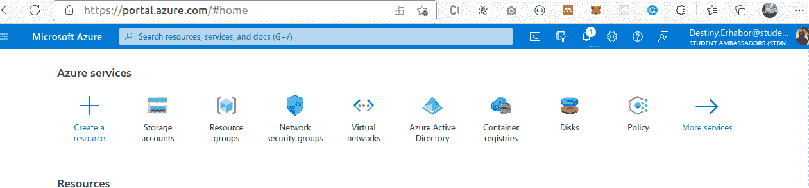

Creating blob storage step 1‌

**第 2 步:**如果您没有现有的存储帐户，请从以下框中的菜单中选择`create`或`Create storage account`。

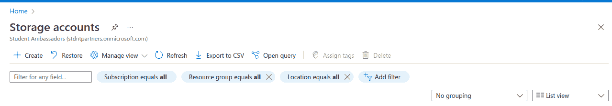

Creating blob storage step 2

**步骤 3:** 在此窗口中，我们需要填写订阅、资源组、存储帐户名、区域、性能和冗余。

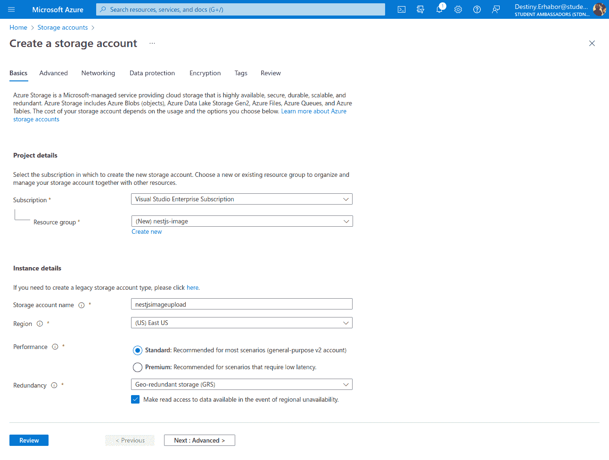

Creating blob storage step 3

*   `Subscription`允许 Azure 跟踪在哪里对使用的资源收费。你可以在这里免费订阅。
*   `resource group`是您的资源的中央分组。它可以根据你的需求帮助你构建和组织你的 Azure 资源。
*   `Storage account name`必须是全球唯一的名称。
*   `Performance`提供不同的存储类型，如硬盘和固态硬盘。这里，我们使用标准。
*   `Redundancy`通过将您的资源复制到其他区域，帮助保护您的存储免受数据中心或区域故障的影响。

****第四步**** :然后点击`review`确认你的选项。完成验证后，您可以点击`Create`按钮创建存储帐户。(请注意，我们将所有其他选项都保留为默认值。)

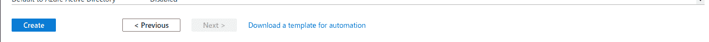

Creating blob storage step 4

成功创建‌When 后，应该会显示以下窗口:

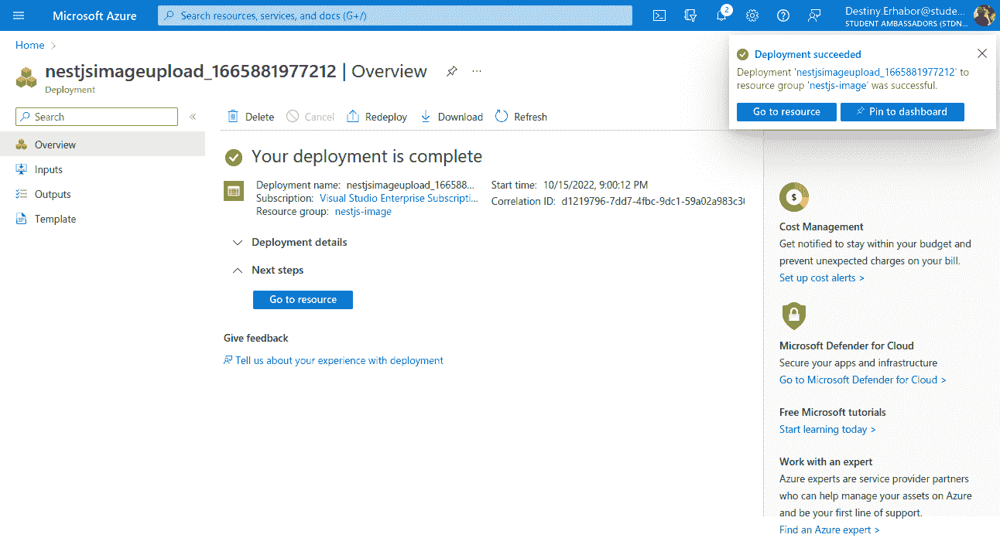

Creating blob storage step 5

**第五步:**接下来，选择`Go to resource`发送到存储账户仪表板。左侧边栏是可见的，有许多选项。在那里选择`containers`选项，它在数据存储部分。

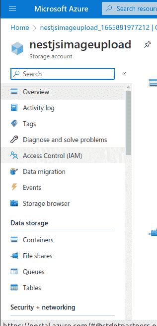

Creating blob storage step 5

‌ **第六步:**在 Containers 仪表盘中，现在点击`+ Container`，右边会出现一个表单。填写表单，给出容器的 ****名称**** 和 ****公共访问级别**** (可以根据需要使用任何选项)。您可以在一个存储帐户下创建任意数量的容器

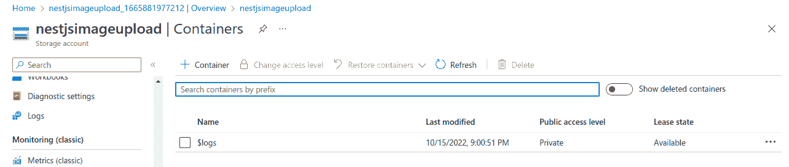

Creating blob storage step 6

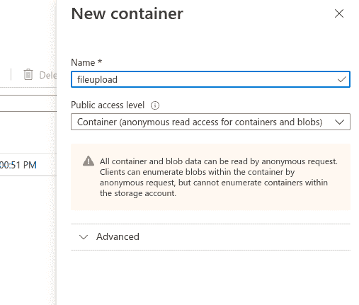

Creating blob storage step 6

填写完表单后，单击“创建”按钮。

**步骤 7:** 从 Azure 门户复制凭证。

您应该在向 Azure 存储发送请求之前获得授权。Azure 为此提供了两个密钥，每个都包含一个连接字符串。因此，您将需要这些凭证作为 NestJS 应用程序的连接字符串。

在左侧`Security + networking`菜单的访问键区域，有一个连接字符串可供复制。(我们将把这些添加到我们的 NestJS 中。环境文件。)

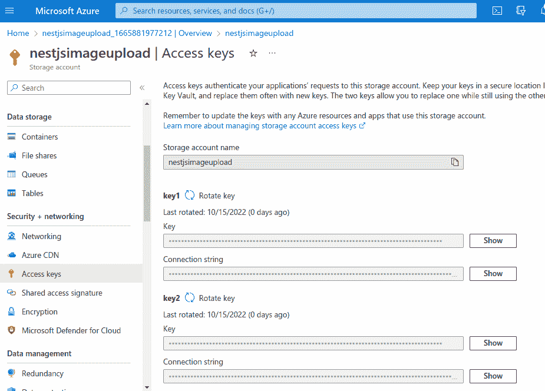

Creating blob storage step 7

酷！您已经配置了 Azure blob 存储。下一步是设置并链接您的 NestJS 应用程序和 blob 存储。

## 如何设置 NestJS 和 MySQL DB

如前所述，我们将使用 NestJS 作为我们的服务器，并使用 MySQL 数据库来保存对保存在 Azure 分布式系统上的文件的引用。

首先，您需要在系统上安装 NestJS 和 MySQL 服务器。然后运行下面的 NestJS 命令来启动一个新项目。让我们称我们的项目为`nestjs-file-upload-azure`:

```
nest new nestjs-file-upload-azure
```

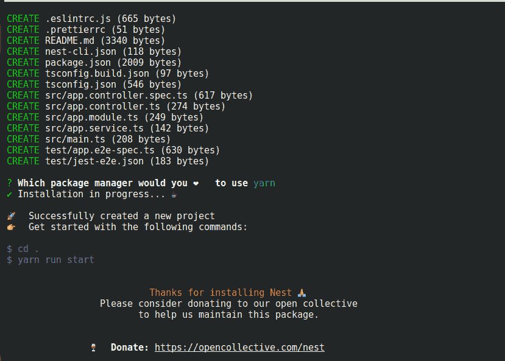

How to create a new project in Nestjs‌

在我们开始创建资源之前，让我们安装必要的依赖项:

```
yarn add mysql2 @nestjs/typeorm @nestjs/config typeorm
```

要用 NestJS 设置 MySQL 数据库，打开`src`文件夹中的`app.module.ts`,添加以下代码:

```
 import { Module } from '@nestjs/common'; 
import { ConfigModule, ConfigService } from '@nestjs/config'; 
import { TypeOrmModule } from '@nestjs/typeorm'; 
import { FileModule } from './modules/files/file.module'; 
import { UserModule } from './modules/users/user.module'; 

@Module({ 
    imports: [ 
        ConfigModule.forRoot({ 
            envFilePath: '.env', 
            isGlobal: true, 
        }), 
        TypeOrmModule.forRootAsync({ 
            imports: [ConfigModule], 
            inject: [ConfigService], 
            useFactory: (config: ConfigService) => ({ 
                type: 'mysql', 
                host: 'localhost', 
                port: 3306, 
                username: config.get('DB_USERNAME'), 
                password: config.get('DB_PASSWORD'), 
                database: 'azure_upload', 
                entities: [__dirname + '/**/*.entity{.ts,.js}'], 
                synchronize: true, 
            }), 
        }), 
        UserModule, 
        FileModule, 
    ], 
    controllers: [], 
    providers: [], 
}) 

export class AppModule {} 
```

App module

在`imports`中，用本地的`TypeOrmModule.forRootAsync()`配置一个简单的 MySQL 数据库，名为`azure_upload`。它注入`ConfigService`来允许我们使用环境变量(在本例中是您的数据库名称和密码)。

对于基于生产的应用程序，您应该将`synchronize`设置为 false 并使用`migration`来保证数据库数据的安全。

现在数据库连接成功了，这要感谢我们安装的 TypeORM 包。您可以通过在您的终端上运行`yarn start:dev`或者`npm run start:dev`来检查，如果您使用 npm 作为您的包管理器的话。

## 如何通过 SDK 连接到 Azure Blob

使用`@azure/storage-blob`存储，我们可以连接到 Azure。我们仍然需要 Multer 包来管理文件处理操作，我们将使用 UUID 为每个 blob 生成一个唯一的名称。

让我们先安装它们。

*   `yarn add @azure/storage-blob uuidv4 @types/multer`或者
*   `npm install  @azure/storage-blob uuidv4 @types/multer`

现在，让我们将之前保存的连接字符串添加到我们的**中。环境**文件

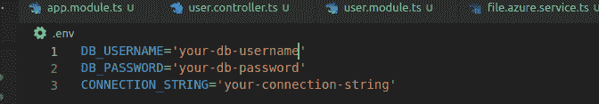

## 如何通过 API 上传图片

既然我们已经建立了 Azure 连接，我们就可以继续上传文件了。首先，让我们创建一个文件实体和服务。

### 如何创建 Azure 服务

Azure 服务将帮助我们制定从我们创建的 Azure 存储帐户上传、下载和删除文件的逻辑。

为了生成服务，我们将使用 NestJS CLI。打开`terminal`并运行`nest g service files modules/files --no-spec --flat`。

将以下内容添加到生成的服务文件中:

###### src/modules/files/files . service . ts

```
 import { BlobServiceClient, BlockBlobClient } from '@azure/storage-blob'; 
import { Injectable } from '@nestjs/common'; 
import { ConfigService } from '@nestjs/config'; 
import { uuid } from 'uuidv4'; 

@Injectable() export class FilesAzureService { 
    constructor(private readonly configService: ConfigService) {} 
    private containerName: string; 

	private async getBlobServiceInstance() { 
        const connectionString = this.configService.get('CONNECTION_STRING'); 
        const blobClientService = await BlobServiceClient.fromConnectionString( connectionString, ); 
        return blobClientService; 
    } 

	private async getBlobClient(imageName: string): Promise<BlockBlobClient> {
        const blobService = await this.getBlobServiceInstance(); 
		const containerName = this.containerName; 
		const containerClient = blobService.getContainerClient(containerName); 
		const blockBlobClient = containerClient.getBlockBlobClient(imageName); 

		return blockBlobClient; 
	} 

    public async uploadFile(file: Express.Multer.File, containerName: string) { 
        this.containerName = containerName; 
        const extension = file.originalname.split('.').pop(); 
        const file_name = uuid() + '.' + extension; 
        const blockBlobClient = await this.getBlobClient(file_name);
        const fileUrl = blockBlobClient.url; 
        await blockBlobClient.uploadData(file.buffer); 

        return fileUrl; 
    } 
} 
```

Creating file service

私有函数使用 azure-sdk 方法`BlobServiceClient.fromConnectionString()`创建带有连接字符串的 Azure blob 存储实例。它还期望我们之前在 azure 存储创建期间使用`getContainerClient`和`getBlockBlobClient()`给 blob 容器的`container name`。

`uploadFile()`是一个公共函数，用户服务可以调用它将图片上传到 azure。这个函数使用 azure 实例和私有函数来上传文件并返回文件 url。

## 如何创建上传图像的端点

是时候创建我们的用户资源了，它为我们创建(上传)图片到 Azure、查看图片和删除图片提供了一个端点。

### 如何创建用户资源

NestJS CLI 是一个强大工具，它通过创建您所知道的基本组件来帮助搭建我们的资源。要轻松创建资源，请在终端上键入以下命令，并按照 REST APIs 的提示进行操作:

```
nest generate resource users modules/users --no-spec --flat
```

`--no-spec`忽略测试文件，而`--flat`直接在`modules/users`文件夹中创建资源。

上述命令在`src`文件中添加了文件夹`dto`和`entities`以及文件`user.controller.ts`、`user.module.ts`和`user.service.ts`。它还执行了所有必要的更新以与`app.module.ts`同步。

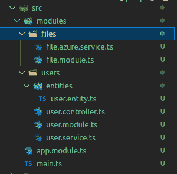

User resources created

### 如何创建用户实体

通过将图像 URL 直接保存在数据库中，我们可以非常快速地访问公共文件。

###### src/模块/用户/用户.实体. ts

```
 import { Column, Entity, PrimaryGeneratedColumn } from 'typeorm'; 

@Entity() export class User { 
	@PrimaryGeneratedColumn() 
    id: number; 

    @Column() 
    image_url: string; 
 }
```

### 如何创建用户服务

用户服务帮助连接数据库并保存上传的 image_url，因此有了`saveUrl()`函数。

###### src/模块/用户/用户.服务. ts

```
import { Injectable } from '@nestjs/common'; 
import { InjectRepository } from '@nestjs/typeorm'; 
import { Repository } from 'typeorm'; 
import { User } from './entities/user.entity'; 

@Injectable() export class UserService { 
    constructor( 
    	@InjectRepository(User) private readonly userRepository: Repository<User>, 
    ) {} 

    async saveUrl(file_url: string) { 
        await this.userRepository.save({ image_url: file_url }); 
    } 
}
```

Creating user service

### 如何创建用户控制器

这为公共用户定义了进行文件上传的端点。为此，我们遵循 [NestJS 文档](https://docs.nestjs.com/techniques/file-upload)，并使用利用了 [`multer`](https://www.npmjs.com/package/multer) 的`FileInterceptor`。

###### src/模块/用户/用户.控制器. ts

```
 import { Controller, Post, UseInterceptors, UploadedFile, } from '@nestjs/common'; 
import { UserService } from './user.service'; 
import { FilesAzureService } from '../files/file.azure.service'; 
import { FileInterceptor } from '@nestjs/platform-express';

@Controller('user') export class UserController { 
	constructor( 
    	private readonly userService: UserService, 
        private readonly fileService: FilesAzureService 
    ) {} 

    @Post('upload') 
    @UseInterceptors(FileInterceptor('image')) 
    async create(@UploadedFile() file: Express.Multer.File) { 
    	const containerName = 'fileupload'; 
        const upload = await this.fileService.uploadFile(file, containerName) 
        this.userService.saveUrl(upload); 
        return { upload, message: 'uploaded successfully' } 
    } 
} 
```

Creating users controller‌

我们可以用邮递员来测试:

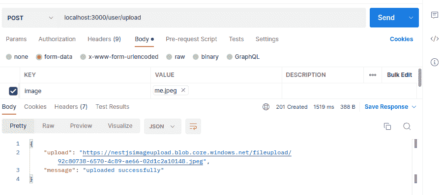

Test upload endpoint from Postman

并在 Azure 上确认:

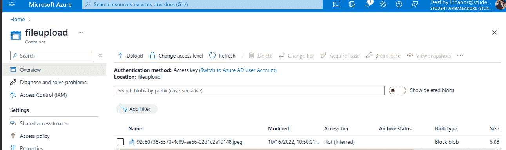

Confirm image on the Azure portal

## 如何删除文件

我们还需要一种方法来删除提交后的文件。我们将从这两个位置删除文件，以保持数据库和 Azure 存储之间的一致性。首先将方法添加到文件服务:

**src/modules/files/files . service . ts**

```
async deleteFile(file_name: string, containerName: string) { 
	try { 
    	this.containerName = containerName; 
        const blockBlobClient = await this.getBlobClient(file_name);
        await blockBlobClient.deleteIfExists(); 
    } catch (error) { 
    	console.log(error); 
    } 
} 
```

Create deleteFile service

我们现在必须将它应用到我们的用户服务中。一个重要的补充是，当用户上传一个文件时，我们删除以前的文件，同时已经有一个文件，并通过用户 id 创建上传端点。

**src/modules/users/users . service . ts**

```
import { Injectable } from '@nestjs/common';
import { InjectRepository } from '@nestjs/typeorm';
import { Repository } from 'typeorm';
import { FilesAzureService } from '../files/file.azure.service';
import { User } from './entities/user.entity';

@Injectable()
export class UserService {
  constructor(
    @InjectRepository(User) private readonly userRepository: Repository<User>,
    private readonly fileService: FilesAzureService,
  ) {}

  async saveUrl(id, file_url: string, containerName: string): Promise<void> {
    const user = await this.userRepository.findOne({
      where: { id },
    });
    const file_image = user?.image_url;
    let getfile = '';

    if (file_image) {
      getfile = file_image.split('/').pop();
    }
    await this.userRepository.save({
      ...user,
      image_url: file_url,
    });
    await this.fileService.deleteFile(getfile, containerName);
  }

  async getimage(id: number): Promise<any> {
    const user = await this.userRepository.findOne({
      where: { id },
    });

    return user;
  }

  async remove(id: number, containerName: string): Promise<User> {
    try {
      const user = await this.userRepository.findOne({
        where: { id },
      });
      const file_url = user?.image_url;
      if (file_url) {
        await this.userRepository.update(id, {
          ...user,
          image_url: '',
        });

        const file_ = file_url.split('/').pop();

        await this.fileService.deleteFile(file_, containerName);
      }

      return user;
    } catch (error) {
      console.log(error);
      return error;
    }
  }
} 
```

Creating user remove method and update saveUrl method

包含一个用户可以发送图像的端点是最后一个组件。为了实现这一点，我们使用了`FileInterceptor`，根据 NestJS 文档，它在内部使用了`multer`。

**src/modules/users/users . controller . ts**

```
Controller('user')
export class UserController {
  constructor(
    private readonly userService: UserService,
    private readonly fileService: FilesAzureService
  ) {}

  @Post('/:id/upload')
  @UseInterceptors(FileInterceptor('image'))
  async create(@UploadedFile() file: Express.Multer.File, @Param('id') id) {
    const containerName = 'fileupload';
    const upload = await this.fileService.uploadFile(file, containerName)
    this.userService.saveUrl(id, upload, containerName);
    return {
      upload,
      message: 'uploaded successfully'
    }
  }

  @Get('/:id')
  async getimage(@Param('id') id) {
    const image = await this.userService.getimage(id);
    return {
      image,
      message: 'get image successfully'
    }
  }

  @Delete('remove/:id')
  @UseInterceptors(FileInterceptor('image'))
  async remove(@UploadedFile() file: Express.Multer.File , @Param('id') id) {
    const containerName = 'fileupload';
    const user = await this.userService.remove(id, containerName);
    return {
      user,
      message: 'deleted successfully'
    }
  }
} 
```

这些与你的 Azure 存储同步，以删除未使用的文件上传。

你可以在 **GitHub** **上找到[完整代码库链接。](https://github.com/Caesarsage/nest-file-upload-azure)**

## 清理

为了避免支付底层 Azure 存储成本，如果资源没有被使用，你应该清理它们。

若要清理您的 Azure 资源，请在 Azure 门户中转到或搜索资源组，找到您刚刚创建的资源，然后将其删除。这将删除资源组中的所有资源。

## 摘要

在本文中，我们学习了 Azure Blob 存储的基础知识，以及如何在我们的 NestJS API 中使用它。

为了实现这一点，我们已经向 Azure SDK 提供了所需的凭证，因此，我们能够向 Azure 上传和移除文件。

为了跟踪我们的文件，我们还让 MySQL 数据库与 Azure blob 容器保持同步。我们使用由 Multer 支持的 FileInterceptor，通过 API 上传文件。

一如既往，我希望你喜欢这篇文章，并学到一些新东西。如果你愿意，你也可以在 [LinkedIn](https://www.linkedin.com/in/destiny-erhabor) 或 [Twitter](https://twitter.com/caesar_sage) 上关注我。