# 网页布局——如何使用 CSS Grid 和 Flex 创建响应性网页

> 原文：<https://www.freecodecamp.org/news/web-layouts-use-css-grid-and-flex-to-create-responsive-webpages/>

你的网页布局对于你的网站就像平面图对于一栋建筑一样。没有他们，你只是在建造空中楼阁。

当你要建立或设计一个网站或应用程序时，要做的第一件事就是决定布局。这一点很重要，因为正是在这种布局中，您指定了元素的排列方式，以便您可以按照它们的预期方式和层次结构来评估它们。

基本上，每个网页布局的目的都是为了减少混乱，提高可用性，并最终给你的用户一个愉快的体验。布局的一些主要元素是导航、菜单和内容。

在 web 和前端开发中，在构建之前考虑好布局可以帮助您决定使用哪个 CSS 布局模块:Flexbox 还是 Grid。

在本文中，我们将通过构建一个简单而漂亮的登录页面来了解这些工具是什么，以及使用它们的最佳方式。

## 我们将要建造的

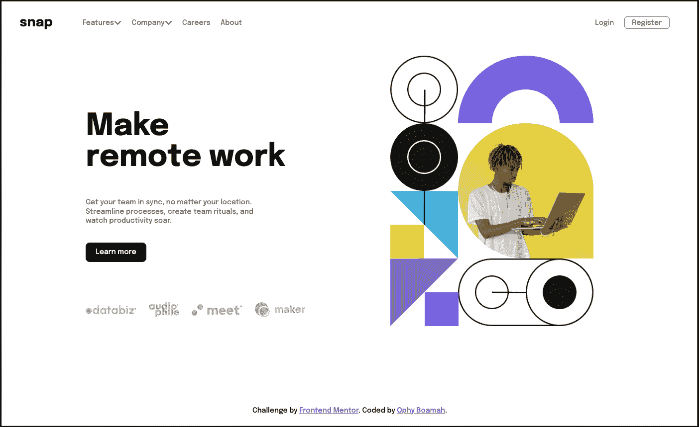

landing page design

在 Codepen [上查看此处](https://codepen.io/ophyboamah/pen/KKRLoJr)。

## 项目功能

1.  网页布局:创建一个漂亮的登陆页面
2.  移动响应能力

## 先决条件

*   HTML 和 CSS 的基础知识。
*   像 VS 代码一样的 IDE(文本编辑器)
*   网络浏览器

## 设置

1.  为项目创建一个文件夹，并在 IDE 中打开。
2.  在你的项目文件夹中，创建 index.html 和 style.css 文件。
3.  创建资产文件夹来存储图像。
4.  在 index.html 文件中，创建 HTML 样板文件，并在`<head>`标签中链接 CSS 文件和字体 URL。

## 资源

1.  **字体:**【https://fonts.googleapis.com/css2? family = Epilogue:wght @ 500；700&family = Poppins:wght @ 400；500;700 &显示=交换
2.  **桌面图片:**【https://i.postimg.cc/0Nt97Bhf/image-hero-desktop.png】T2
3.  **手机图像:**【https://i.postimg.cc/ZnYfhwwW/image-hero-mobile.png 
4.  **客户端徽标(databiz):**[https://I . postmg . cc/gj 9 和 84m6/client-databiz.png](https://i.postimg.cc/gJ9Y84m6/client-databiz.png)
5.  **客户标识(发烧友):**【https://i.postimg.cc/15DDqYSD/client-audiophile.png 
6.  **客户标识(满足):**【https://i.postimg.cc/5ybQqfbv/client-meet.png 
7.  **客户标识(制作者):**【https://i.postimg.cc/g2NsxByN/client-maker.png 

# 如何使用 Flexbox

通常，HTML 元素根据它们的默认显示样式对齐。这意味着，如果没有 CSS 的外部样式，像`p`和`div`这样的块元素将在新的一行开始。另一方面，像`input`和`span`这样的行内元素在同一行上相邻排列。

然而，Flexbox 的概念允许您轻松地将这些元素水平或垂直地放置在通常被称为一维的空间中。为了实现这一点，至少需要两个元素:**柔性容器**和**柔性项目**。它们分别引用父元素和子元素。

在响应式设计中，Flexbox 的目的是允许容器及其子元素根据设备的尺寸填充定义的空间或收缩。

## 弯曲方向和轴

Flex-direction 是 CSS Flexbox 的一个重要属性，因为它决定了 Flex 项目的排列方向。这是通过指出 flex 容器的主轴来实现的。

主轴有两个，分别是**主轴**和**横轴**。主轴是 flex 项目在 flex 容器中放置的定义方向，而横轴始终是主轴另一侧的轴。

试图用数学中 x 轴和 y 轴的概念来理解这一点是很危险的。这主要是因为在 Flexbox 中，主轴可以是垂直的或水平的，这总是取决于 flex-direction 的值。

flex-direction 属性接受的值包括 row(默认值)、row-reverse、column 和 column-reverse。为了这个项目的目的，我们将看看行和列。

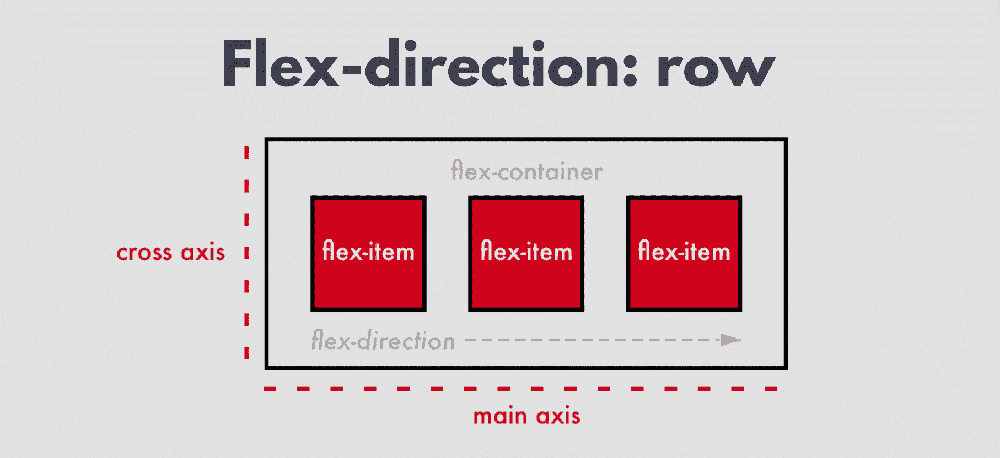

flex-direction: row

当“伸缩方向”属性的值为 row 时，主轴是水平的，横轴是垂直的，如上图所示。这意味着 flex 项目将水平排列。

由于 row 是默认值，如果将容器显示为 flex，但没有指定 flex 方向，则 flex 项目将自动位于一行中。

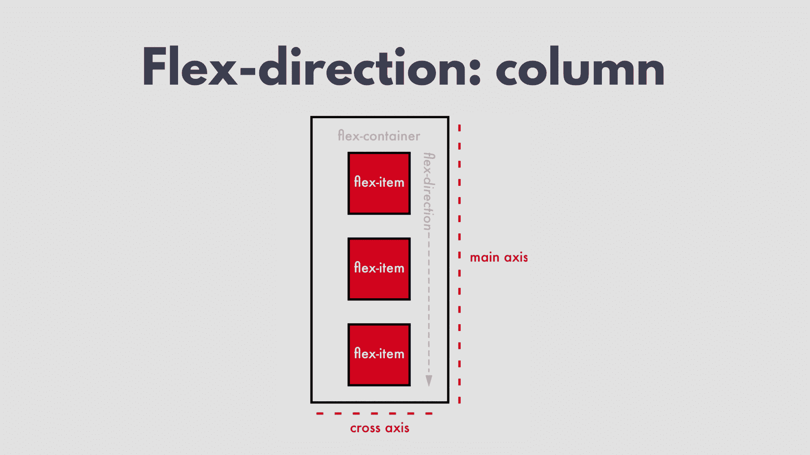

flex-direction: column

当“伸缩方向”属性的值为“列”时，主轴是垂直的，横轴是水平的，如上图所示。这意味着 flex 项目将垂直排列。

## 如何构建导航栏

现在我们知道了 Flexbox 是如何工作的，让我们开始构建我们的 navbar。我们将首先提供其中的内容，即菜单项和徽标。我们将为它们提供描述性的类，以便我们可以在 CSS 文件中轻松引用它们。

```
<nav>
      <h2 class="logo">snap</h2>
      <ul class="menu-items">
        <li>Features</li>
        <li>Company</li>
        <li>Careers</li>
        <li>About</li>
      </ul>
      <ul class="cta-btns">
        <li>Login</li>
        <li>Register</li>
      </ul>
</nav>
```

下图是上面代码的输出。因为`<ul>`和`<li>`都是块元素，所以我们在其中指定的每一项都将显示在新的一行上。

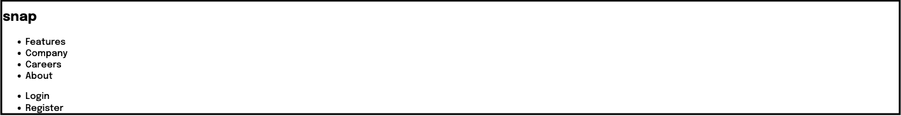

Navbar content output

Flexbox 布局显示在父容器上声明，并影响子元素。这意味着，如果您有一个无序列表中的杂货列表，display flex 不能应用于`<li>` s，在这种情况下它是子元素。相反，要将它们显示为 flex，您必须首先创建一个父容器并将其应用于该容器。

在下面的 CSS 代码中，我们定义了项目的字体样式和大小以及 navbar 徽标。我们还将导航元素和其中的一些元素显示为 flex。

```
* {
  font-family: "Epilogue", sans-serif;
  font-size: 0.85rem;
}

.logo {
  font-size: 1.3rem;
}

nav,
.cta-btns,
.menu-items {
  display: flex;
}
```

Navbar initial styling

下图是上面代码的输出。这些元素已显示为 flex。然而，因为我们没有指定伸缩方向，它们会自动排列成一行。

但是正如您在下面使用标尺(红线)所看到的，伸缩项没有按照它们应该的方式对齐。让我们通过学习另一个重要的 flex 元素来解决这个问题。

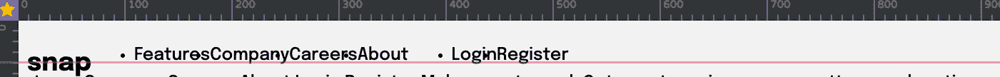

Flex without alignment

### 如何使用`align-items`属性

这是一个 Flexbox 属性，控制交叉轴上 flex 项目的排列。根据元素的对齐需要，它采用的值有 flex-start、flex-end 和 center。下图显示了它们各自的工作原理。

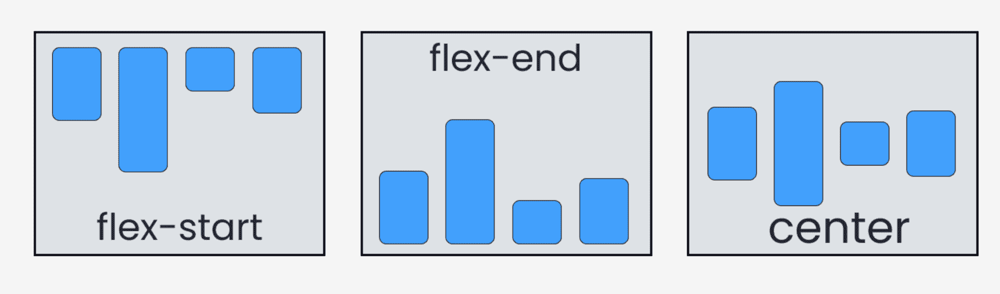

Image credit: freeCodeCamp

从上面的图片中，我们可以看到，如果我们想要确保我们的`<nav>`中的 flex 项正确对齐，我们必须在该元素上给 align-items 属性一个值 center。因此，我们必须向 flex 容器添加一个属性 *align-items* 和一个值 *center* ，如下面的 CSS 代码所示:

```
nav,
.cta-btns,
.menu-items {
  display: flex;
  align-items: center;
}
```

Navbar align-items

正如您在下图中看到的，flex 项目现在已经按照它们应该的样子对齐了。

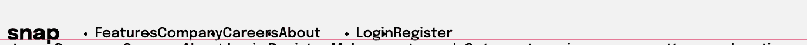

Flex with center alignment

但是又一次缺少了一些东西。我们希望我们的项目在导航栏上适当地展开:徽标在最左边，登录和注册在最右边，其余的在中间。

我们可以用`justify-content`属性来实现这一点。接下来我们来了解一下，然后实施。

### 如何使用`justify-content`属性

这是 Flexbox 属性，控制主轴上 flex 项目的排列。它还定义了浏览器如何在 flex 容器内的 flex 项目之间和周围分配空间。

为了实现快速响应，它有助于分配弹性项目排列后剩余的多余空间。

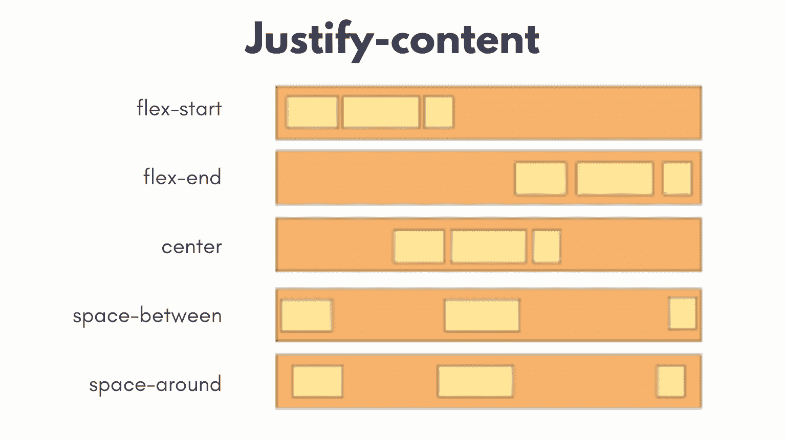

justify-content styles

从与 justify-content 属性的各种值相关联的样式中，我们可以看到底部的两个更类似于我们试图实现的目标。

我们可以选择周围的空间或中间的空间，并在侧面提供一些填充物，以将物品从边缘推到最末端。我们还将 list-syle 属性的值设为 none，以删除列表项前面的点。

```
li {
  list-style: none;
}

nav {
  justify-content: space-between;
}
```

Navbar justify-content

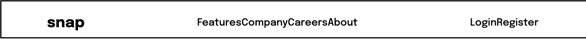

justify-content navbar output

现在我们已经将物品放置在了它们想要的位置，我们需要在它们之间创造一点空间。在这种情况下，我们将给每个列表项一个 1 的右边距。我们还为注册项设置了其他样式，如字体大小、颜色和边框。

```
nav {
  margin: 0 1.5rem 1.5rem 1.5rem;
  justify-content: space-between;
}

.logos-section {
  display: flex;
}

.menu-items li,
.cta-btns li {
  font-size: 0.7rem;
  margin-right: 1rem;
  color: hsl(0, 0%, 41%);
}

.cta-btns li:nth-last-child(1) {
  border: 1px solid gray;
  padding: 0.2rem 0.7rem;
  border-radius: 0.3rem;
} 
```

Navbar complete design

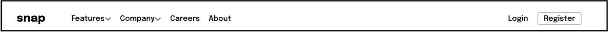

Navbar with styles

实现了上面的代码之后，这就是我们 navbar 的最终外观。这标志着我们 Flexbox 部分的结束。接下来，我们将使用 CSS Grid 构建登录页面的最后一部分。

# 如何使用 CSS 网格

CSS 网格是一个改变生活的工具，用于创建网页布局。它可以帮助你设计简单和复杂的布局。主要区别在于 Flexbox 有助于元素的一维排列，而 CSS grid 能够进行二维排列。

我们在 Flexbox 中学到的轴的概念在这里仍然适用。可以使用 CSS Grid 同时在主轴和横轴上排列元素。

总之，Flexbox 允许你水平(在一行中)或垂直(在一列中)排列元素。但是使用 CSS Grid 你可以垂直和水平对齐元素。

CSS 网格布局仅在父元素或容器上声明。实际上，它的所有子元素都变成了网格项。一旦有了目标容器，就给它一个 display 属性和 grid 值。网格的行和列的大小可以分别用`grid-template-rows`和`grid-template-columns`来确定。

## 如何建立主页

就像我们对 navbar 所做的一样，让我们从在 HTML 文件的`<main>`部分中定义内容开始。

看看我们的目标图像，我们有两个主要部分:左边部分将有文字和标志，而右边部分有一个英雄形象。这是我们项目的网络视图。

让我们从定义我们的内容开始。类文本侧的部分包含:标题、段落文本、按钮和徽标。带有 img-side 类的部分只包含一个图像。

```
<main>
      <section id="text-side">
        <h1>Make <br />remote work</h1>
        <p>
          Get your team in sync, no matter your location. Streamline processes,
          create team rituals, and watch productivity soar.
        </p>
        <button>Learn more</button>
        <div class="clients-logos">
          
          
          
          
        </div>
      </section>
      <section class="img-side">
        
      </section>
    </main>
```

Homepage content HTML code

在主部分中，我们创建了我们需要的两个部分，并给了它们描述性的 id:text-side 和 img-side。

在文本侧，我们添加了一个标题、段落文本、按钮和一个 div 来显示客户的徽标。对于 img 端，我们唯一需要的是显示图像。

```
/* Client Logos */
.clients-logos img {
  width: 5rem;
  margin-right: 1rem;
}

.clients-logos {
  margin-top: 4rem;
}

.clients-logos img:nth-child(2) {
  width: 3rem;
}

/* Main */
main h1 {
  font-size: 3rem;
}

main p {
  font-size: 0.7rem;
  width: 18rem;
  color: hsl(0, 0%, 41%);
  line-height: 0.9rem;
}

main button {
  background-color: hsl(0, 0%, 8%);
  color: #fff;
  border: none;
  font-size: 0.7rem;
  padding: 0.6rem 1rem;
  border-radius: 0.4rem;
  margin-top: 1rem;
}

#text-side {
  margin-top: 3rem;
}
/* Hero Image */
.img-side img {
  width: 20rem;
}
```

Homepage content CSS code

在我们的 CSS 文件中，我们需要设计客户端 logos div 以及子元素的样式。我们还为标题和段落设置了字体大小。接下来，我们设计按钮的样式，并为图像指定宽度。

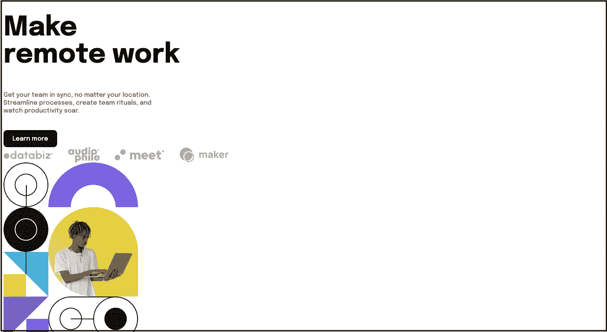

pre-grid homepage display

上面的图像显示了我们的网页在定义了内容和样式，仅仅是标题、按钮和徽标之后的样子——也就是说，我们还没有将我们的容器声明为网格。因为这里几乎所有的元素都是块元素，所以我们看到它们一个接一个地排列。

## 网格模板行和列

属性指定网格中列的数量和宽度，通过指定网格容器的轨道大小和行名来定义网格容器的列。

`grid-template-rows`属性正好相反。它指定网格中的行数和高度，还通过指定网格容器的轨道大小和行名来定义网格容器的行。

如下图所示，`grid-template-rows`从设备屏幕的顶部到底部排列元素。`grid-template-columns`从设备屏幕的左侧到右侧排列元素。

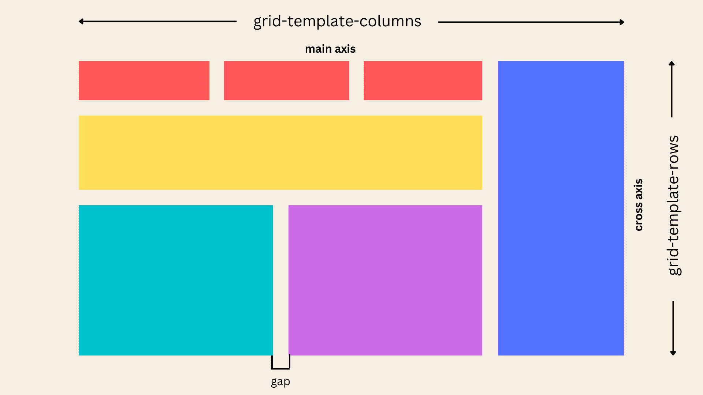

对于我们的项目，我们将利用`grid-template-columns`,因为我们想并排安排我们的两个部分，让每个部分占据整个项目宽度的相等部分。我们通过在指定显示网格的同一个容器上将它指定为一个属性来做到这一点。

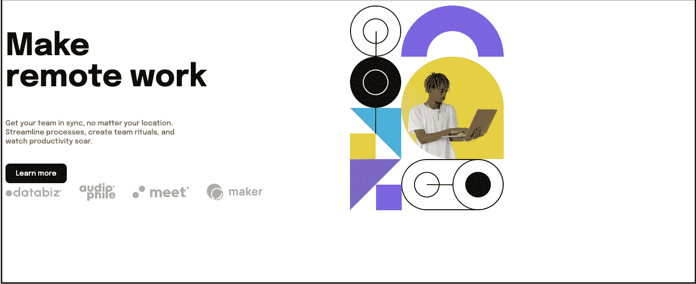

display: grid

既然已经使用 grid-template-columns 相等地放置了我们的`<main>`标记中的两个部分，我们还有最后两件事要做。

我们需要将它们水平对齐，将两个元素放在页面的中央，额外的空间放在图像的左边，均匀地分布在两边。我们还需要将它们垂直对齐，将它们放在页面的中央，底部留有额外的空间，上下均匀分布。

## 在 CSS 网格中对齐和两端对齐

好消息——我们不需要学习任何新概念来实现我们想要的 CSS 网格布局对齐。因为幸运的是，`align-items`和`justify-content`正如我们之前了解到的，并不是 Flebox 的专属。您还可以使用它们来水平和垂直定位项目。

```
main {
  display: grid;
  grid-template-columns: repeat(2, 1fr);
  height: 70vh;
  align-items: center;
  justify-content: center;
  margin-left: 8rem;
}
```

align and center CSS code

正如您在上面的代码中看到的，我们只需要给父标签(网格容器)上的 align-items 和 justify-content 属性赋予 center 值。

为了确保我们看到完美中心位置的效果，我们还必须指定截面的高度。下图是我们项目的最终输出。


Landing page final look

## 如何使其响应迅速

到目前为止，我们建立的一切都是为了网络。但是为了那些想在手机上访问登陆页面的用户，我们必须让我们的项目在更小的屏幕上也能访问。在我们的例子中，我们看到的是大于 300 像素但小于 480 像素的屏幕。

正如你在下面的代码中看到的，我们隐藏了导航项目，显示了一个带有 mobile-nav 类的表情符号。除此之外，我们隐藏桌面标题图像，显示移动标题图像。

```
/* Responsive */
@media (min-width: 300px) and (max-width: 480px) {
  * {
    font-size: 1rem;
  }

  body {
    height: 100vh;
    width: 100vw;
    overflow-y: hidden;
    overflow-x: hidden;
  }

  nav {
    margin: 0 1.5rem 0 1.5rem;
  }

  nav ul {
    display: none;
  }

  .mobile-nav {
    display: block;
    margin-right: 2rem;
  }

  main {
    display: grid;
    grid-template-columns: 100%;
    margin: 0 auto;
  }

  /* Clients logos */
  .clients-logos {
    margin-top: 2rem;
  }

  .desktop-logos {
    display: none;
  }

  .mobile-logos {
    display: block;
  }

  /* Images */
  .desktop-img {
    display: none;
  }
  .mobile-img {
    display: block;
    margin-top: 3rem;
  }

  .cta-btns,
  .menu-items {
    display: none;
  }

  main h1 {
    font-size: 2.5rem;
  }

  /* Client Logos */
  .clients-logos img {
    width: 4.5rem;
    margin-right: 0.8rem;
  }

  .attribution {
    width: 13rem;
    margin: 8rem auto 0 auto;
    text-align: center;
  }
}
```

Project Responsiveness Code

## 完整的项目代码

这是我们在本文中共同构建的项目:


以下是完整的 HTML 代码:

```
<!DOCTYPE html>
<html lang="en">
  <head>
    <meta charset="UTF-8" />
    <meta name="viewport" content="width=device-width, initial-scale=1.0" />
    <!-- displays site properly based on user's device -->
    <link rel="preconnect" href="https://fonts.googleapis.com" />
    <link rel="preconnect" href="https://fonts.gstatic.com" crossorigin />
    <link
      href="https://fonts.googleapis.com/css2?family=Epilogue:wght@500;700&family=Poppins:wght@400;500;700&display=swap"
      rel="stylesheet"
    />
    <link rel="stylesheet" href="style.css" />
    <link
      rel="icon"
      type="image/png"
      sizes="32x32"
      href="./images/favicon-32x32.png"
    />

    <title>Web Layout | Landing Page</title>

    <!-- Feel free to remove these styles or customise in your own stylesheet 👍 -->
  </head>
  <body>
    <nav>
      <div class="logos-section">
        <h2 class="logo">snap</h2>
        <ul class="menu-items">
          <li>
            Features<svg
              width="10"
              height="6"

            >
              <path
                stroke="#686868"
                stroke-width="1.5"
                fill="none"
                d="m1 1 4 4 4-4"
              />
            </svg>
          </li>
          <li>
            Company<svg
              width="10"
              height="6"

            >
              <path
                stroke="#686868"
                stroke-width="1.5"
                fill="none"
                d="m1 1 4 4 4-4"
              />
            </svg>
          </li>
          <li>Careers</li>
          <li>About</li>
        </ul>
      </div>
      <ul class="cta-btns">
        <li>Login</li>
        <li>Register</li>
      </ul>
      <p class="mobile-nav">🌚</p>
    </nav>
    <main>
      <section id="text-side">
        <h1>Make <br />remote work</h1>
        <p>
          Get your team in sync, no matter your location. Streamline processes,
          create team rituals, and watch productivity soar.
        </p>
        <button>Learn more</button>
        <div class="clients-logos">
          
          
          
          
        </div>
      </section>
      <section id="img-side">
        
        
      </section>
    </main>
    <div class="attribution">
      Challenge by
      <a href="https://www.frontendmentor.io?ref=challenge" target="_blank"
        >Frontend Mentor</a
      >. Coded by <a href="https://codehemaa.com">Ophy Boamah</a>.
    </div>
  </body>
</html>
```

Project HTML code

下面是完整的 CSS 代码:

```
* {
  font-family: "Epilogue", sans-serif;
  font-size: 1.3rem;
}

.logo {
  font-size: 1.3rem;
}

li {
  list-style: none;
}

nav,
.cta-btns,
.menu-items {
  display: flex;
  align-items: center;
}

nav {
  margin: 0 1.5rem 1.5rem 1.5rem;
  justify-content: space-between;
}

.mobile-nav {
    display: none;
}

.logos-section {
  display: flex;
}

.menu-items li,
.cta-btns li {
  font-size: 0.7rem;
  margin-right: 1rem;
  color: hsl(0, 0%, 41%);
}

.cta-btns li:nth-last-child(1) {
  border: 1px solid gray;
  padding: 0.2rem 0.7rem;
  border-radius: 0.3rem;
}

/* Client Logos */

.clients-logos img {
  width: 8rem;
  margin-right: -3rem;
}

.clients-logos {
  margin-top: 1rem;
  margin-left: -2rem;
  display: flex;
  width: 10rem;
}

.clients-logos img:nth-child(2) {
  width: 7rem;
}

/* Main */
main {
  display: grid;
  grid-template-columns: repeat(2, 1fr);
  height: 70vh;
  align-items: center;
  justify-content: center;
  margin-left: 8rem;
}
/* Images */
.desktop-img {
  display: block;
}
.mobile-img {
  display: none;
}

main h1 {
  font-size: 3rem;
}

main p {
  font-size: 0.7rem;
  width: 18rem;
  color: hsl(0, 0%, 41%);
  line-height: 0.9rem;
}

main button {
  background-color: hsl(0, 0%, 8%);
  color: #fff;
  border: none;
  font-size: 0.7rem;
  padding: 0.6rem 1rem;
  border-radius: 0.4rem;
  margin-top: 1rem;
}

#text-side {
  margin-top: 3rem;
}
/* Hero Image */
#img-side img {
  width: 20rem;
}

.attribution {
  font-size: 0.7rem;
  text-align: center;
  margin-top: 5.5rem;
}

.attribution a {
  color: hsl(228, 45%, 44%);
  font-size: 0.7rem;
}

/* Responsive */
@media (min-width: 300px) and (max-width: 480px) {
  * {
    font-size: 1rem;
  }

  body {
    height: 100vh;
    width: 100vw;
    overflow-y: hidden;
    overflow-x: hidden;
  }

  nav {
    margin: 0 1.5rem 0 1.5rem;
  }

  nav ul {
    display: none;
  }

  .mobile-nav {
    display: block;
    margin-right: 2rem;
  }

  main {
    display: grid;
    grid-template-columns: 100%;
    margin: -3rem auto 0 auto;
  }

  /* Clients logos */
  .clients-logos {
    margin-top: 2rem;
  }

  .clients-logos img {
  width: 30rem;
}

.clients-logos {
  margin-top: 1rem;
  display: flex;
}

.clients-logos img:nth-child(2) {
  width: 7rem;
}

  /* Images */
  .desktop-img {
    display: none;
  }
  .mobile-img {
    display: block;
    margin-top: 3rem;
  }

  .cta-btns,
  .menu-items {
    display: none;
  }

  main h1 {
    font-size: 2.5rem;
  }

  /* Client Logos */
  .clients-logos img {
    width: 4.5rem;
    margin-right: 0.8rem;
  }

  .attribution {
    width: 13rem;
    margin: 10rem auto 0 auto;
    text-align: center;
  }
} 
```

Project CSS code

## 结论

作为一名 web 开发人员，在编写代码之前，布局应该是您首先考虑的事情。谢天谢地，CSS Grid 和 Flexbox 彻底改变了我们构建网站和 web 应用程序布局的方式。

这使得这些概念成为你必须知道的，这样你就可以在网页上指定元素的排列。我们已经讨论了基础知识，所以你可以很容易地建立知识，并创建美丽的网页和应用程序。

感谢阅读👋🏾。我希望这能对你有所帮助。