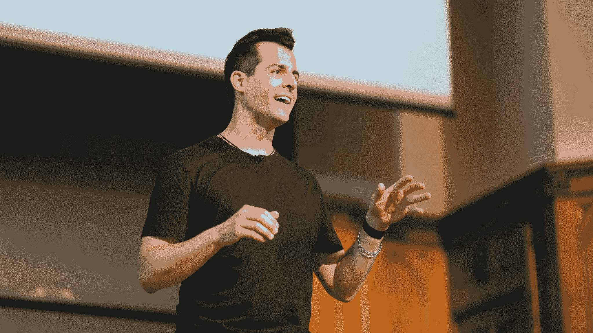

# 哈佛 CS50 免费计算机科学大学课程

> 原文：<https://www.freecodecamp.org/news/harvard-cs50/>

哈佛大学的 CS50 是世界上最受欢迎的初级计算机科学课程之一。

我们刚刚在 freeCodeCamp.org YouTube 频道上发布了整个 CS50 课程，共 25 小时。

David J. Malan 被广泛认为是最好的计算机科学讲师之一。他教这门课。

本课程介绍了计算机科学的智能企业和编程艺术。这门课程教学生如何用算法思考和有效地解决问题。

主题包括抽象、算法、数据结构、封装、资源管理、安全、软件工程和网络编程。语言包括 C、Python 和 SQL 加上 HTML、CSS 和 JavaScript。

本课程的首要目标是激励学生探索陌生的水域，不怕失败，创造一个所有学生都可以获得的密集、共享的体验，并在学生中建立社区。

David J. Malan teaching CS50.

以下是本课程的授课内容:

*   第 0 讲-刮擦
*   讲座 1 - C
*   第 2 讲-阵列
*   第 3 讲-算法
*   第 4 讲-记忆
*   第 5 讲-数据结构
*   第 6 讲- Python
*   第 7 讲- SQL
*   第 8 讲- HTML，CSS，JavaScript
*   第 9 讲-烧瓶
*   阅读 10-e momji
*   网络安全

在 freeCodeCamp.org YouTube 频道观看完整的课程(25 小时观看)。

[https://www.youtube.com/embed/8mAITcNt710?feature=oembed](https://www.youtube.com/embed/8mAITcNt710?feature=oembed)