# 如何用 Next.js 和 Tauri 构建跨平台应用

> 原文：<https://www.freecodecamp.org/news/build-a-cross-platform-app-with-next-and-tauri/>

Tauri 是一个新的基于 Rust 的框架，它为 Windows、macOS 和 Linux 构建了一个 x86_64 跨平台应用程序。

在本教程中，我们将使用 Tauri 和 Next.js 构建一个基于桌面的跨平台应用程序，并将其发布到 Snap store 和 AppImage。

那么，为什么构建一个能在 Windows、Mac 和 Linux 上运行的跨平台应用程序如今如此重要呢？嗯，它可以帮助公司瞄准更多的受众，增加收入，而不必构建三个独立的应用程序。

很多公司和开发者在建网站的时候都是用 Next.js 作为前端。在本教程中，我们将使用 Next 和 Tauri 来构建一个基于桌面的跨平台应用程序，该应用程序可以在 Windows、macOS 和 Linux 上使用。

### 项目演示

为了构建这个跨平台的应用程序，你需要 [Tauri](https://tauri.app/) 、 [markdown](https://en.wikipedia.org/wiki/Markdown) 、 [Contentlayer](https://www.npmjs.com/package/contentlayer) 、 [pnpm](http://pnpm.io/) 和 [Next.js](https://nextjs.org/) 。如果您检查我的应用程序的外观，您可以使用 [snap-cli](https://snapcraft.io/docs/snap-tutorials) 、 [AppImage](https://appimage.org/) 安装应用程序，或者通过链接下载应用程序并安装。

让我们看看这些工具能做什么:

*   我们将使用 Next.js 来构建网站的前端部分
*   markdown npm 包有助于将 markdown 文件转换为 HTML
*   Contentlayer npm 包帮助我们管理项目中的 markdown 文件。
*   我们将使用 Tauri 来构建跨平台的应用程序二进制文件
*   最后，我们将使用 pnpm 作为我们的节点包管理器。

```
// Install with snap
snap install static-blog-app

or

// install with AppImage
https://github.com/officialrajdeepsingh/static-blog-app/releases/download/v0.0.2/static-blog-app_0.0.2_amd64.AppImage

or

// Install on macOS
https://github.com/officialrajdeepsingh/static-blog-app/releases/download/v0.0.2/static-blog-app_0.0.2_x64.dmg

or

// Install on Windows
https://github.com/officialrajdeepsingh/static-blog-app/releases/download/v0.0.2/static-blog-app_0.0.2_x64_en-US.msi 
```

Install static-blog-app in the different operating systems

## 目录:

*   [next . js 是什么？](#what-is-next-js)
*   [什么是 Tauri？](#what-is-tauri)
*   [计算机架构](#computer-architecture)
*   [如何用 Next.js 和 Tauri 创建新项目](#how-to-create-a-new-project-with-next-js-and-tauri)
*   [如何用 Tauri 构建应用](#how-to-build-an-application-with-tauri)
*   [如何为 Snap Store 或 Snapcraft 构建应用](#how-to-build-an-application-for-the-snap-store-or-snapcraft)
*   [如何用 GitHub Actions 构建跨平台应用](#how-to-build-a-cross-platform-application-with-github-actions)
*   [如何发布 App](#how-to-publish-the-app)
*   [常见问题解答](#faq)
*   [结论](#conclusion)

## Next.js 是什么？

接下来的是一个基于 React 的框架。它有许多功能，让你建立一个网站，并提高用户体验。

要了解更多关于 Next 的内容，你可以[阅读我在 Reed Barger 写的 freeCodeCamp 上找到的这个有用的教程](https://www.freecodecamp.org/news/nextjs-tutorial/)。

## Tauri 是什么？

Tauri 是一个新的框架，可以帮助你构建跨平台的桌面应用。Tauri 是基于 Rust 语言构建的。Rust 比其他语言更快，更安全，内存问题更少。

Tauri 有许多特性，但我将提到一些对前端开发人员来说很重要的特性。

1.  Tauri 支持 HTML、CSS 和 JavaScript。
2.  Tauri 支持很多前端框架和库，比如 React.js，Next.js，Vite，Svelte kit。
3.  有了 Tauri，你不需要学习 GTK、GJS 和应用构建命令或应用图像构建器。
4.  Tauri 提供了 JavaScript API 支持。你可以在 JS 里面轻松使用。例如，窗口 API 帮助所有与窗口相关的任务。
5.  您可以使用一个命令快速构建跨应用程序捆绑器大小。
6.  Tauri 提供了一个更新处理程序来将旧的 Tauri 版本更新到最新的版本。您不需要使用其他服务和库来实现自我更新功能。
7.  在 Tauri 中，您在 JavaScript 中调用 Rust 函数。

Tauri 通过提供内置的 JavaScript、npm 和 Rust CLI 工具、插件和 tauri-action GitHub 工作流来改善开发体验。

所有这些工具都有助于您更快地编写代码，并在更短的时间内创建一个生产就绪的应用程序。但是 Tauri 提供的最重要的东西是初学者容易理解的文档。

GTK 是一个免费开源的跨平台小工具工具包，用于为应用程序创建图形用户界面。

[GJS](https://gjs.guide/) 是一个 JavaScript 库，用于 Gnome 构建应用程序接口。GJS 是建立在[蜘蛛猴](https://spidermonkey.dev/) JavaScript 引擎之上的。

## 计算机体系结构

每个操作系统都有不同的架构。构建跨平台应用程序或执行[交叉编译](https://rust-lang.github.io/rustup/cross-compilation.html#cross-compilation)并不容易。根据架构，您可以了解应用程序在哪里运行。换句话说，哪种架构需要运行我们的应用程序，如 i386、ARM 或 x86_64？

计算机科学界最常见的架构有 [ARM](https://en.wikipedia.org/wiki/ARM_architecture_family) 、 [i386](https://en.wikipedia.org/wiki/I386) 、 [AMD (x86_64)](https://en.wikipedia.org/wiki/X86-64) 。不太懂技术的用户可能知道它是 64 或 32 位架构。

Rust 使用不同类型的架构来安装自己。在我的例子中，我的笔记本电脑硬件支持 x86_64，我安装了 Ubuntu。在 Ubuntu x86_64 上，默认的`stable-x86_64-unknown-linux-gnu` Rust 工具链用于构建 Tauri 应用。

Rust 工具链构建 [AMD (x86_64)](https://en.wikipedia.org/wiki/X86-64) 应用。这就是为什么 Tauri 构建跨平台应用程序(针对 Windows、macOs 和 Linux 发行版)但不构建跨架构的应用程序(针对所有 ARM、i386 和 x86_67 架构构建应用程序)。

### 如何在 Linux 中通过命令检查您的架构:

```
cat /etc/debian_version

	or 

dpkg --print-architecture

	or

uname -m

	or

arch
```

detect 386, amd64, arm, or arm64 OS architecture via terminal

### 如何检查 Tauri 使用的工具链:

工具链是 Rust 自己提供的一个实用工具。您可以使用`rustup`命令安装不同的刀具链。

根据您的计算机架构，您可以使用不同类型的 Rust 工具链。您可以使用`tauri npm`、`yarn`或`pnpm`命令轻松检查操作系统中安装了哪个工具链。

在我的项目中，我使用 pnpm 创建一个新项目，所以我使用了`pnpm`命令。同样，基于工具链，我们为不同的架构构建应用。

默认的 Ubuntu (x86_64)基于`stable-x86_64-unknown-linux-gnu`工具链。Rust `stable-x86_64-unknown-linux-gnu`工具链只构建基于 AMD 的应用。

Rust 工具链根据您使用的操作系统和发行版而有所不同。在计算机上安装 Rust 时，会安装默认的 Rust 工具链。

以下是检查您的架构的命令:

```
pnpm tauri info

or

yarn tauri info

or

npm run tauri info
```

Check that your architecture comes with Rust in your system by default.

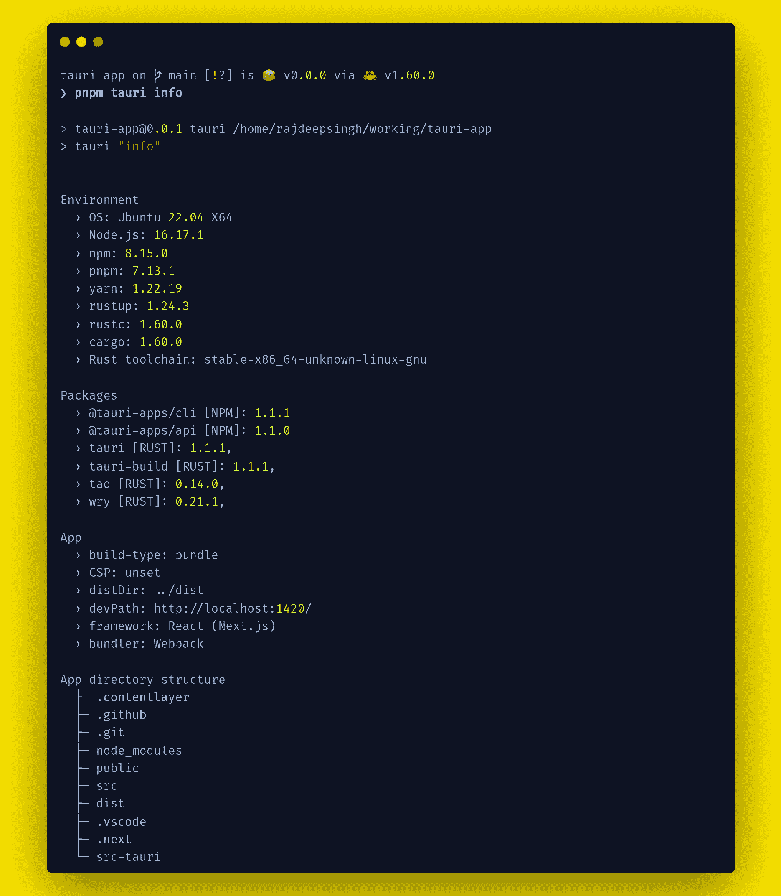

pnpm tauri info command output

Tauri 官方支持 macOS、Windows 和 Linux 发行版，你不能用 Tauri 构建移动应用程序(你将面临许多问题，在解决所有问题后，你将直接构建你的移动应用程序)。

我找到了一个关于 Rust 工具链和交叉编译的很棒的教程。本教程将为您提供指导，并让您更深入地了解 Rust 工具链。

如果你愿意，可以使用`rustup`命令安装不同类型的工具链。要了解更多关于 Rust 工具链和`rustup`命令的信息，我建议从 [Rust 工具链文档](https://rust-lang.github.io/rustup/concepts/toolchains.html)开始。

## 如何用 Next.js 和 Tauri 创建新项目

您可以使用 bash、cargo、PowerShell npm、yarn 或 pnpm 创建 Tauri 应用程序。在本教程中，我们将使用 pnpm 创建一个新的 Tauri 设置。pnpm 是 Node.js 的新包管理器。

### 在 Tauri 中创建 UI 模板

你可以为 Tauri 应用程序使用不同类型的前端框架，例如，Vue、React、Svelte、Solid、Next.js、Preact、Angular 和 Svelte。在本教程中，我选择使用 Nextjs 作为我们 Tauri 应用程序的前端模板。

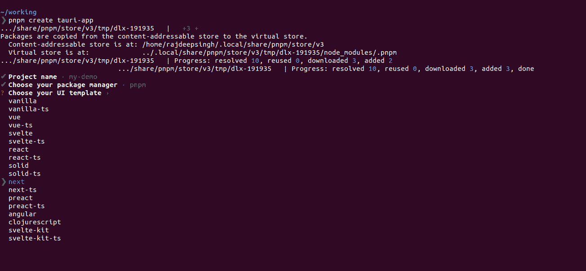

pnpm - choose your UI template

### 使用 pnpm 创建新的应用程序

您可以使用任何其他节点包管理器来创建一个新的应用程序，如 yarn 或 npm。我选择 pnpm 节点包管理器，因为 pnpm 比 yarn 和 npm 快。

```
pnpm create tauri-app
```

set-up new tauri-app with pnpm

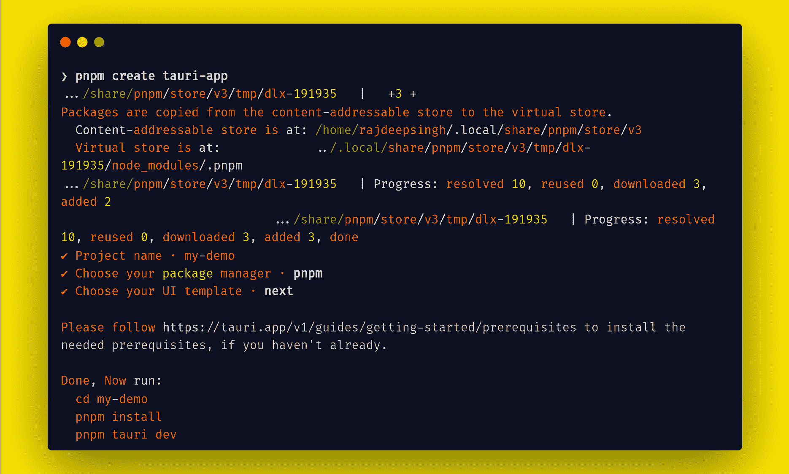

Create tauri-app with nextjs

现在 Tauri 已经成功创建了 my-demo 应用程序。您可以使用更改目录(cd)命令直接更改目录(文件夹)`cd my-demo`。然后您可以运行`pnpm install`命令来安装项目所需的所有依赖项。最后，运行`tauri dev`命令来运行一个新的 Tauri 应用程序窗口。

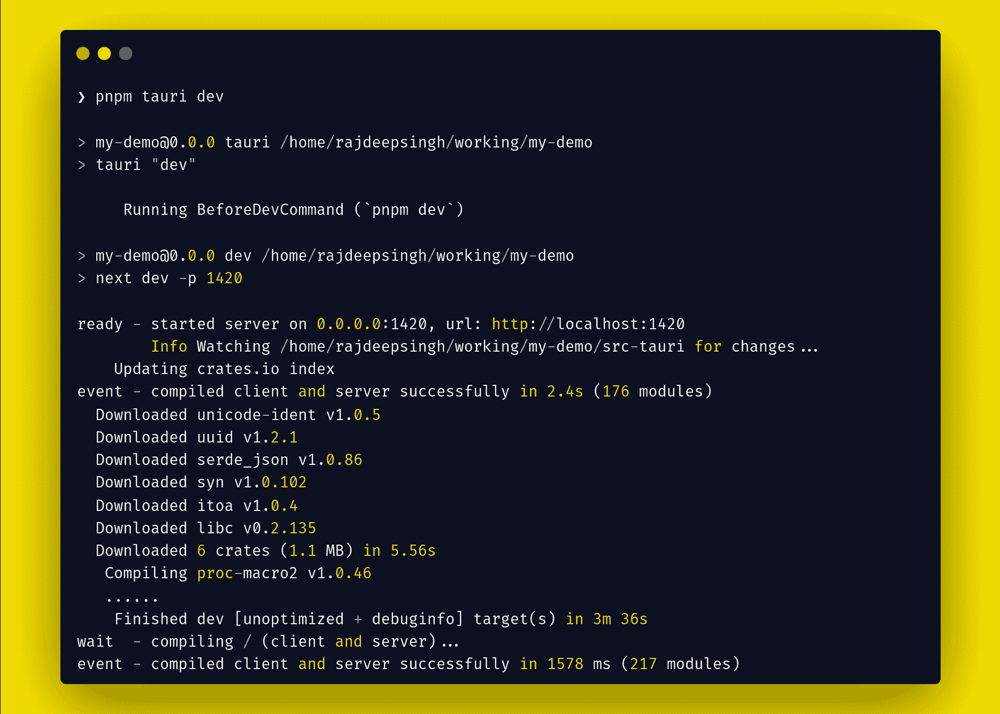

Run local development server in tauri

下载并编译代码后，您可以使用`pnpm tauri dev`命令看到系统中打开了一个新窗口。


Open a new window by tauri

默认的 Tauri 文件夹结构带有`pnpm create tauri-app`:

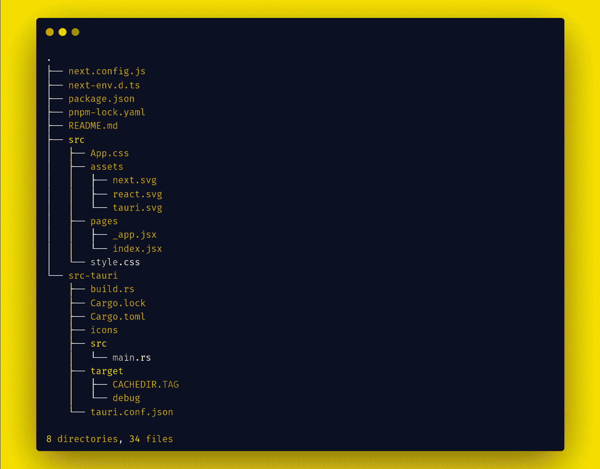

Tauri default folder structure

1.  您使用`next.config.js`文件进行 Next.js 配置。
2.  为 TypeScript 自动生成的`next-env.d.ts`文件
3.  `package.json`文件包含 npm、yarn 和 pnpm 的所有信息。
4.  pnpm 创建了`pnpm-lock.yaml`文件来存储所有的包信息和版本。
5.  `README.MD`文件包含了项目的所有信息。
6.  `src`文件夹包含所有的 Next.js 代码以及页面、组件和 CSS 文件。
7.  您使用`src-tauri`文件夹进行 Rust 和 Rust 配置。
8.  `src-tauri/icons`包含应用程序的所有图标。
9.  `src-tauri/Cargo.lock`由货物生成，用于存储所有包装信息。
10.  `src-tauri/Cargo.toml`由货物生成并储存所有包裹并确认为项目。
11.  `src-tauri/src`用来写铁锈代码。
12.  `src-tauri/target`由`pnpm tauri dev`命令生成。它包含项目的所有二进制文件。
13.  用于 Tauri 配置的文件。

### 用 Next.js 创建应用程序的 UI

我正在使用我的旧的 Next.js 静态网站，我将把它转换成一个桌面应用程序。下一个静态网站代码可以在 [GitHub 上找到，所以你可以很容易地下载它](https://github.com/officialrajdeepsingh/contentlayer)。

首先，我需要复制我的旧帖子以及 public、components 和 pages 文件夹，并将它们粘贴到新的 Tauri 项目中。然后，我将删除引导 CSS，并使用 Tailwind CSS 来设计应用程序的布局。

在本文中，我已经在[中解释了如何使用 Next 安装 TailwindCSS 的过程。如果你还没有安装 Tailwind，你可以阅读并按照相同的设置来安装它。](https://medium.com/nextjs/install-tailwind-css-in-next-js-37a56bd64fa7)

### 为应用程序生成图标

图标对应用程序很重要。用户将点击图标，在 Windows、macOS 和 Linux 中打开您的应用程序。

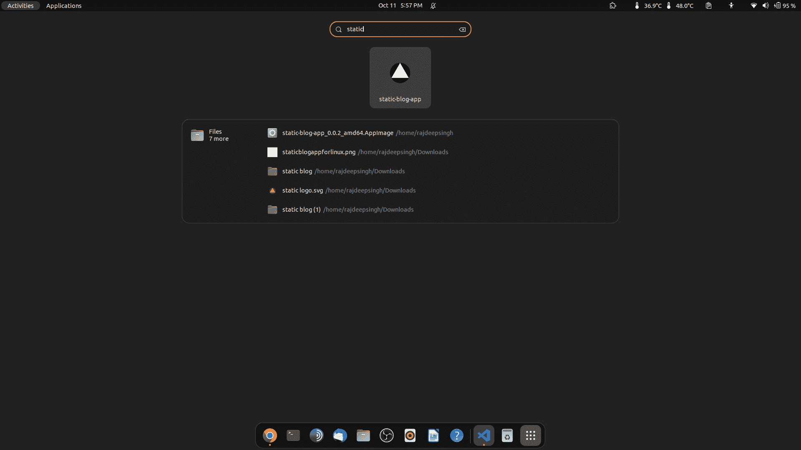

Ubuntu static-blog-app icon

为各种类型和大小的应用程序生成图标可能很复杂。你需要 Windows、macOS 和 Linux 的图标。每个操作系统都有自己的图标指南。

Tauri 附带了一个 CLI 工具，可以根据 Tauri 中的图标配置为应用程序生成跨操作系统的图标。下面是生成图标的命令:

```
pnpm tauri icon path-of-image
```

Genrating icons for tauri

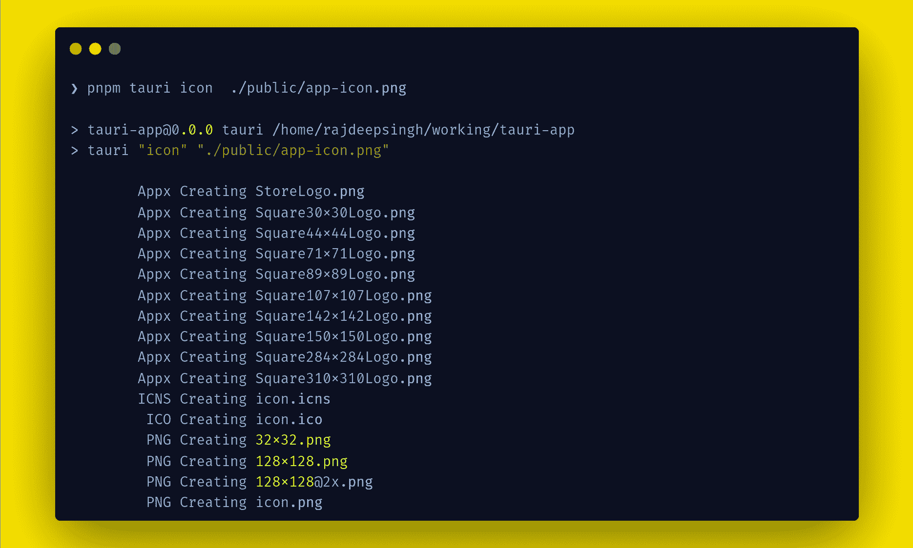

Generating icons

你可以使用在线网站为 Tauri 生成图标，然后将所有图标添加到`tauri-app/src-tauri/icons`文件夹中。

您可以更改`tauri-app/src-tauri/tauri.conf.json`文件中的图标配置:

```
"icon": [
        "icons/32x32.png",
        "icons/128x128.png",
        "icons/128x128@2x.png",
        "icons/icon.icns",
        "icons/icon.ico"
],
```

default icons configuration comes with tauri

## 如何用 Tauri 构建应用程序

要在 Tauri 中构建应用程序，您只需要在终端中运行一个命令。Tauri 自动生成构建应用程序。

第一个应用程序是基于 Debian 的发行版，第二个应用程序是 appImage。应用程序构建文件因操作系统而异。

AppImage 是一个跨 Linux 发行版的通用应用程序发行版。因此，您创建一个 AppImage 并在任何发行版上运行您的应用程序。

```
pnpm tauri build
```

Build tauri app

第一次运行`tauri build`命令时，您可能会在终端中遇到一个包标识符错误。

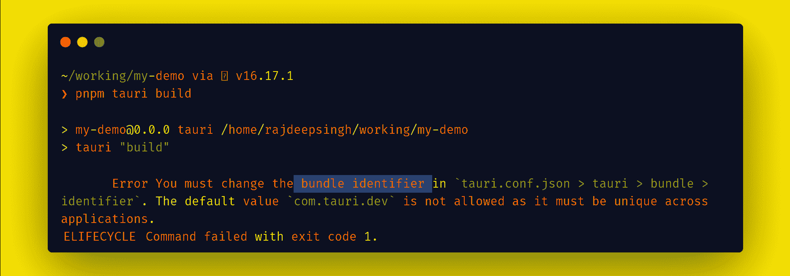

Bundle identifier error

要解决包标识符错误，首先打开`my-demo/src-tauri/tauri.conf.json`文件并找到`identifier`。然后根据您的应用程序更改`"identifier": "com.tauri.dev"`值。确保`identifier`值在整个应用程序中是唯一的。

```
"identifier": "com.officialrajdeepsingh.blog", 
```

change Identifier value

在修改了`tauri.conf.json`文件中的`identifier`后，**重新运行**的`pnpm tauri build`命令。

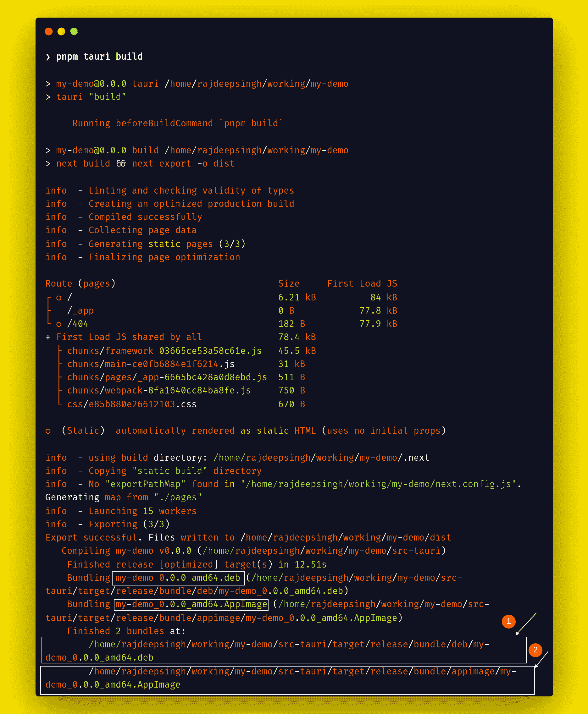

Run tauri build command 

成功运行`tauri build`命令后，Tauri 生成两个文件:

1.  my-demo_0.0.0_amd64.deb
2.  my-demo_0.0.0_amd64.AppImage

bot 文件二进制只对 **amd64** 架构有效，对 **arm** 和 **i386** 架构无效。

文件扩展名告诉我们在哪里使用它。

1.  `.deb`文件扩展名用于 Debian。
2.  `.AppImage`文件扩展名用于所有 Linux 发行版安装 app。
3.  `.dmg`文件扩展名用于 macOS。
4.  `.msi`文件扩展名用于 Windows。
5.  文件扩展名用于 Linux 发行版。

### 就地安装`.deb`和`.AppImage`

要测试二进制文件`my-demo_0.0.0_amd64.deb`和`my-demo_0.0.0_amd64.AppImage`，首先在本地安装它们，并检查一切是否正常。

**`.deb`文件**

```
❯ dpkg -i static-blog-app_0.0.2_amd64
```

**`.AppImage`文件**

首先添加执行文件的权限，然后运行文件。

**第一步**:运行`chmod +x my-demo_0.0.0_amd64.AppImage`

**第二步**:运行`./my-demo_0.0.0_amd64.AppImage`回车运行`AppImage`基本二进制。

Tauri 自动生成带有自己文件名的`.deb`和`.AppImage`文件。

这两个文件在全球范围内使用相同的命名转换语法。此文件名转换不适用于 Tauri。Flatpak builder 和 Snapcraft 也使用相同的文件命名语法。

```
Syntax

<name-of-appliciation> <version> <architecture> <File extension>

Example
1\. my-demo_0.0.0_amd64.deb
2\. my-demo_0.0.0_amd64.AppImage
```

Syntax

## 如何为 Snap Store 或 Snapcraft 构建应用程序

Snapcraft 或 Snap store 是一个 Linux 应用程序发行版。它有助于跨 Linux 发行版分发您的应用程序。用户可以通过一次点击和使用命令行(终端)来安装您的应用程序。

Snapcraft 由 Canonical (Ubuntu)维护和构建。Canonical 提供所有 Linux 应用程序发行版，不适用于 macOS 和 Windows。

在构建 snap 之前，首先你需要安装 [Snapcraft](https://snapcraft.io/docs/snapcraft-overview) 。

```
sudo apt-get update
sudo snap install snapcraft --classic
```

Install snapcraft

### 如何为快照存储构建应用程序

我将用一种简单的方法来指导您为 Snapcraft 生成快照文件。快照文件是一个二进制文件，类似于`.deb`文件。快照存储对文件使用特殊的`.snap`扩展名。这表明它是安装在 linux 发行版上的一个 snap 应用程序。

如果您是初学者，也可以快速开发您的第一个 snap 应用程序，只需遵循以下步骤(我们将逐一介绍):

1.  安装 [tauri-snap-packager](https://www.npmjs.com/package/tauri-snap-packager) npm 软件包
2.  在`package.json`文件中添加配置
3.  构建快照
4.  处理任何错误
5.  如何修复 tauri-snap-packager 花费太多时间的错误

### 安装 tauri-snap-packager npm 软件包

首先在您的项目中安装 [tauri-snap-packager](https://www.npmjs.com/package/tauri-snap-packager) npm 包。 [tauri-snap-packager](https://www.npmjs.com/package/tauri-snap-packager) npm 包帮助您创建 snapcraft 配置文件。

```
npm install --save-dev tauri-snap-packager

# Or with yarn

yarn add --dev tauri-snap-packager

# Or with pnpm

pnpm add tauri-snap-packager
```

install npm package

### 在 package.json 文件中添加配置

安装后，完成 tauri-snap-package npm 软件包。现在在`package.json`文件中配置`"tauri-snap": "tauri-snap-packager"` tauri-snap-package 脚本。

```
"scripts": {
    "dev": "next dev -p 1420",
    "build": "next build && next export -o dist",
    "tauri": "tauri",
    "lint": "next lint",

    "tauri-snap": "tauri-snap-packager"

  },
```

config the script in package.json

### 构建快照

现在您运行项目文件夹中的`pnpm tauri-snap`命令。`tauri-snap`自动在`src-tauri/target`中创建快照文件夹。在快照文件夹`pnpm tauri-snap`中创建一个包含所有配置的新`snapcraft.yaml`文件。所有的配置都是基于你的 Tauri 配置。

```
name: static-blog-app
base: core18
version: 0.0.2
summary: Tauri app.
description: Awesome Tauri app.
grade: devel
confinement: strict
source-code: https://github.com/officialrajdeepsingh/static-blog-app
apps:
  static-blog-app:
    command: static-blog-app
    extensions:
      - gnome-3-34
    desktop: static-blog-app.desktop
parts:
  dump-binary:
    plugin: dump
    source: ./target/release
    source-type: local
    stage:
      - lib
      - icons
      - static-blog-app
      - static-blog-app.desktop
    prime:
      - lib
      - icons
      - static-blog-app
      - static-blog-app.desktop
    stage-packages:
      - libc6 
```

Create a file src-tauri/target/snap/snapcraft.yaml

### 如何修复错误

用`pnpm tauri-snap`命令验证`snapcraft.yaml`时会出错。

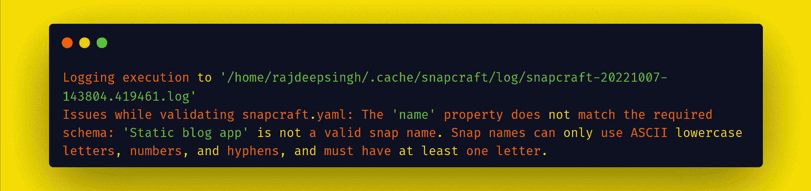

Issues while validating snapcraft.yaml

您的应用程序名称可能包含一些不允许使用的单词，如空格、数字、大写字母等。例如，静态博客网站不允许你使用大写字母的名字。简单地用一个小写的单词作为静态博客网站的名字。

当运行`pnpm tauri-snap --trace-warnings`命令时，您可能还会看到一个错误`you need 'multipass' set-up to build snaps`。

`--trace-warnings` Node.js 标志有助于调试或跟踪错误。

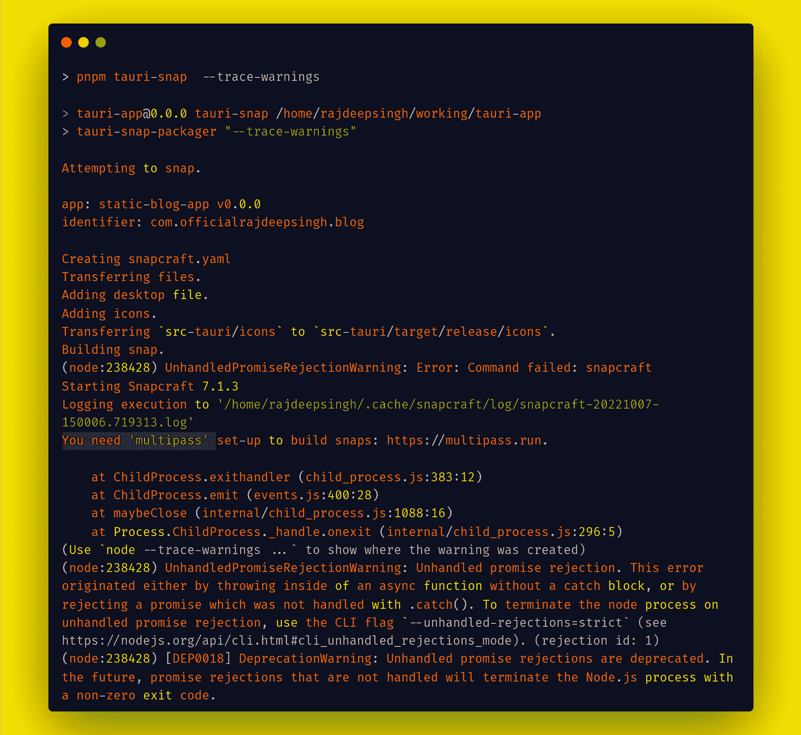

You need a multipass set-up to build snaps error.

要解决这个错误，你必须在 Ubuntu 中安装 [multipass 包](https://multipass.run/)。tauri-snap-package 使用 Snapcraft 命令作为背景来构建快照文件。所以 Snapcraft 需要 multipass 来构建 snap 包。

```
sudo snap install multipass
```

Install multipass

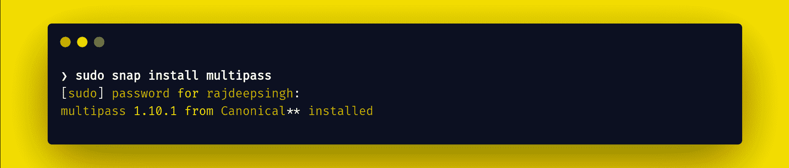

Install multipass in ubuntu

### Tauri-snap-packager 花费太多时间。

如果 [tauri-snap-packager](https://www.npmjs.com/package/tauri-snap-packager) 花了太多时间来构建 snap 二进制文件，或者你觉得你的应用程序被卡住了，在终端没有显示任何输出，那么就停止这个命令。tauri-snap-packager 没有为您工作，所以您可以使用`snapcraft`命令。

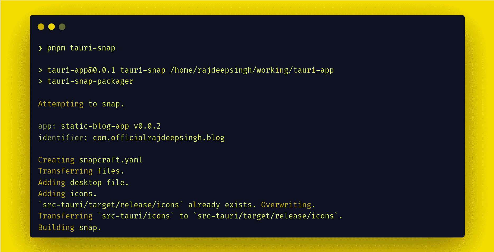

Create a snap configuration with Tauri-snap-packager 

这个错误意味着`pnpm tauri-snap`命令不起作用并且花费太多时间。这可能是因为 tauri-snap-package npm 包工作不正常。

要解决这个问题，**在创建快照文件夹的同一文件夹中运行 snapcraft 命令**。在运行 snapcraft 命令之前，首先安装 snapd 命令工具。Snapd 是一个用于管理 snap 包的 REST API 守护进程。为了更多地了解 snapd，我[找到了一篇由欧耶托克·鸢·艾曼纽写的很棒的文章](https://codeburst.io/how-to-install-and-use-snap-on-ubuntu-18-04-9fcb6e3b34f9)。

```
snap install --channel stable snapd
```

Install snapd (Optional)

安装完成后，运行`tauri-app/src-tauri/target`文件夹中的`snapcraft`命令。`target`文件夹由`pnpm tauri dev`命令生成。


Face common error with snapcraft command 

您可能会收到 Snapcraft 的快照“core18 没有可用更新”错误。**但是 core18 不是大问题。**只需用`sudo apt-get update && sudo apt-get upgrade`命令更新你的发行包，然后重启你的终端或笔记本电脑。[这里有一个 youtube 教程](https://www.youtube.com/watch?v=PNii2y97D0s&ab_channel=BassoniaTv)，可以帮助你解决 core18 错误问题。

“Snapd 未登录”意味着首先，你需要登录你的 [snapcraft 账户](https://snapcraft.io/)。对于登录运行`snapcraft login`。

解决 core 18 问题后，现在再次运行`snapcraft`命令并构建您的 snap 二进制文件。

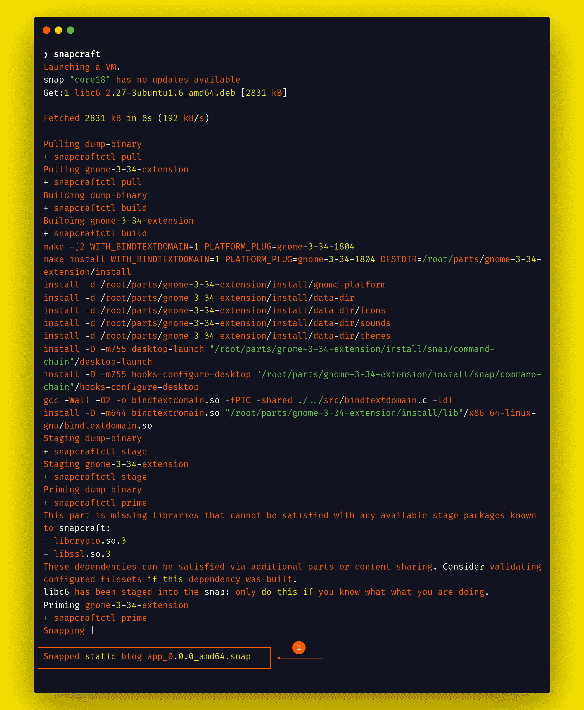

Create a binary with snapcraft

Snapcraft 创建一个新的二进制文件`static-blog-app_0.0.0_amd64.snap`。现在`static-blog-app_0.0.0_amd64.snap`文件已经准备好发布在 Snapcraft 网站或 snap store 上了。

### 如何在系统本地安装 static-blog-app _ 0 . 0 . 0 _ amd64 . snap

如果使用以下命令在本地安装`static-blog-app_0.0.0_amd64.snap`文件，您可能会发现签名元数据错误。

```
sudo snap install ./static-blog-app_0.0.0_amd64.snap 
```

install local snap 

**错误如下:**

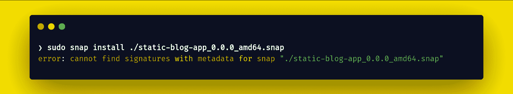

cannot find signatures metadata error for snap

要解决这个错误，您需要运行带有`--dangerous`标志的 snap 命令。

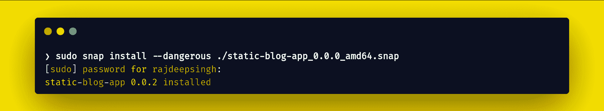

Install snap locally package

## 如何用 GitHub Actions 构建跨平台应用

GitHub Actions 是一个**持续集成和持续交付(CI/CD)** 平台或管道，它允许您自动化诸如构建、测试和部署之类的任务。

您可以对某些事件的 GitHub 操作进行分类，比如有人将新代码推送到 GitHub 存储库并对代码进行测试。如果测试通过，那么代码被添加到主分支。

如果您想为 Windows、macOS 和 Linux 构建跨平台的应用程序，最简单的方法是使用 GitHub actions 工作流。此工作流在特定事件上运行，如推、拉等。

要尝试这一点，您需要在项目中创建一个新的动作。首先，创建一个新的`.github/workflows`文件夹。在`workflows`之后，创建一个带有`.yml`扩展名的任意文件名的文件。

Tauri app 提供了一个 [GitHub 动作配置](https://github.com/tauri-apps/tauri-action)。通过 Tauri actions，您可以使用 GitHub 工作流快速构建 Windows、macOS 和 Linux 发行版的跨平台应用程序。

```
name: Build application
on:
  push:
    branches:
      - 'main'
  workflow_dispatch:

jobs:
  release:
    strategy:
      fail-fast: false
      matrix:
        platform: [macos-latest, ubuntu-latest, windows-latest]
    runs-on: ${{ matrix.platform }}
    steps:
      - name: Checkout repository
        uses: actions/checkout@v2

      - name: Install Node.js
        uses: actions/setup-node@v3
        with:
          node-version: 16

      - uses: pnpm/action-setup@v2.0.1
        name: Install pnpm
        id: pnpm-install
        with:
          version: 7.13.1
          run_install: false

      - name: Get pnpm store directory
        id: pnpm-cache
        run: |
          echo "::set-output name=pnpm_cache_dir::$(pnpm store path)"

      - uses: actions/cache@v3
        name: Setup pnpm cache
        with:
          path: ${{ steps.pnpm-cache.outputs.pnpm_cache_dir }}
          key: ${{ runner.os }}-pnpm-store-${{ hashFiles('**/pnpm-lock.yaml') }}
          restore-keys: |
            ${{ runner.os }}-pnpm-store-

      - name: Rust setup
        uses: actions-rs/toolchain@v1
        with:
          toolchain: stable

      - name: Install dependencies (ubuntu only)
        if: matrix.platform == 'ubuntu-latest'
        run: |
          sudo apt-get update
          sudo apt-get install -y libgtk-3-dev webkit2gtk-4.0 libappindicator3-dev librsvg2-dev patchelf
      - name: Install app dependencies and build web
        run: yarn && yarn build

      - name: Build the app
        uses: tauri-apps/tauri-action@v0
        env:
          GITHUB_TOKEN: ${{ secrets.STATIC_BLOG_APP }}
        with:
          tagName: v__VERSION__ # tauri-action replaces \_\_VERSION\_\_ with the app version
          releaseName: 'v__VERSION__'
          releaseBody: 'See the assets to download this version and install.'
          releaseDraft: true
          prerelease: false
```

create an action in a `my-demo/.github/workflows/build.yml` folder.

遵循 GitHub 操作，在成功构建应用程序后，您可以在每次推送时构建应用程序，并在 GitHub release assets 部分显示所有文件。

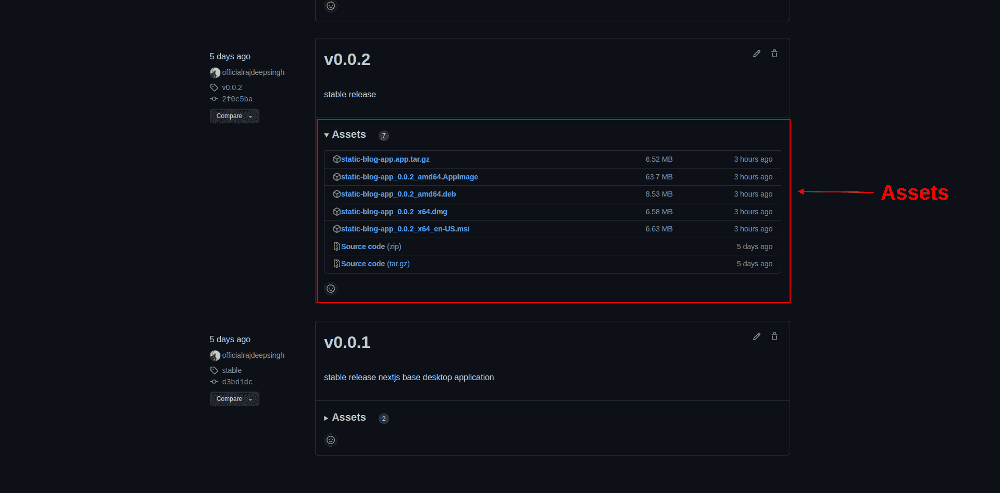

Show all applications in the assets section.

## 如何发布应用程序

发布包是本文的核心。很多人构建自己的 Linux 应用程序。但他们不知道如何在各种发行版上提交应用程序，如 Snapcraft、AppImage 和 Homebrew。

所以现在我将展示如何向 Snapcraft 和 AppImage 提交一个静态博客应用程序。

### 如何将应用程序发布到 snap store 或 snapcraft

要在 snap store 上发布新的包，请确保您有一个可用的`.snap`二进制文件。否则，首先，为应用程序构建`.snap`二进制文件(我们已经在上面讨论过了)。

转到`target`或创建了`.snp`二进制文件的文件夹。然后运行`snapcraft`命令。确保您首先使用 Snapcraft 帐户登录。登录时，运行`snapcraft login`。然后使用我提到的参数运行以下命令:

语法:

```
snapcraft upload <Opation> name-of-file
```

Publish a new package to snap

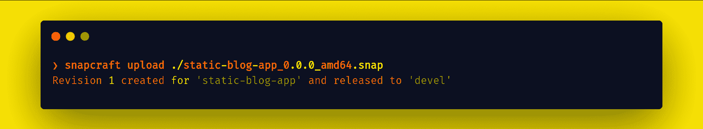

Publish a new package to snap in devel release

成功进入您的帐户后，您可以添加或更改有关您的包图标、名称等信息。

```
snapcraft upload --release=stable ./static-blog-app_0.0.0_amd64.snap
```

--release tag is not working because we add `grade : devel`in 

在`devel`模式下，您会在应用程序安装页面上看到一条消息。`devel`表示开发模式。

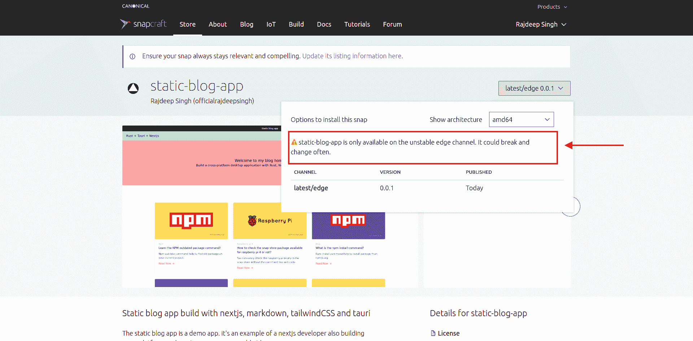

Application in development mode

默认情况下，您的包在 edge 版本中发布由`src-tauri/target/snap/snapcraft.yaml`收集的所有信息。要了解更多关于 Snapcraft 发布系统的信息，你可以阅读[发布文档](https://snapcraft.io/docs/release-management)。

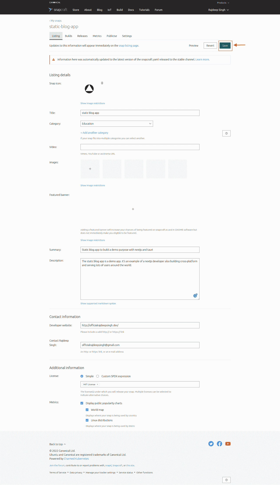

Go to the dashboard and add or update all the information regarding the app.

确保使用尺寸为 720 x 240 的横幅图像拍摄快照。

### 如何在 Snapcraft 上发布应用

当您将应用程序上传到您的 Snapcraft 帐户时，您的应用程序是私有的。要更改其发布方式，请将您的可用版本拖到其中一个发布频道。

转到“dashboard”>“my snap”>“select your snap”>“releases ”,根据您的要求，将您的应用程序添加到所提供的版本之一。默认为边缘释放。

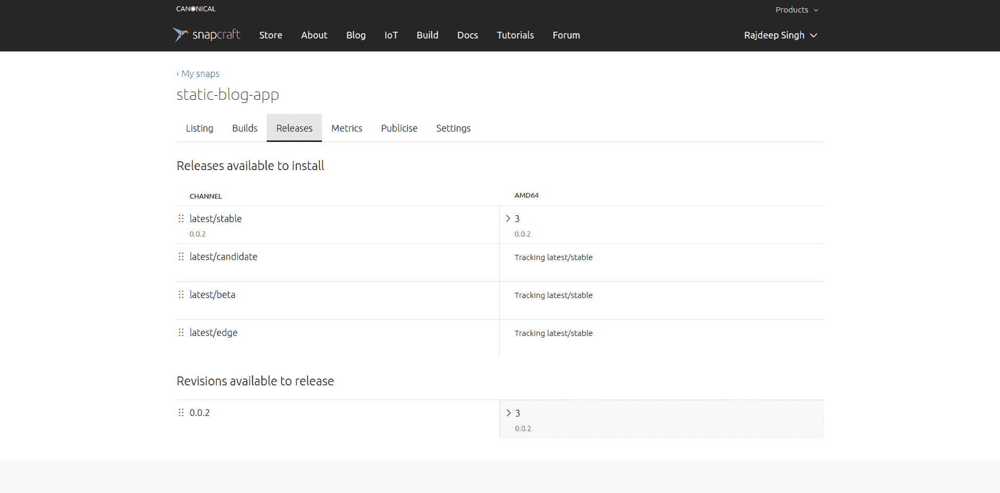

### 如何将应用程序添加到稳定版本中

要将应用程序更改为稳定版本，请转到快照配置`src-tauri/target/snap/snapcraft.yaml`文件，并将您的`grade: devel`更新为`grade: stable`:

```
....

grade: stable

.... 
```

Only change `grade:devel` to `grade: stable` in `snapcraft.yaml`

现在，您的应用程序进入稳定版本或渠道，并重新上传您的应用程序。

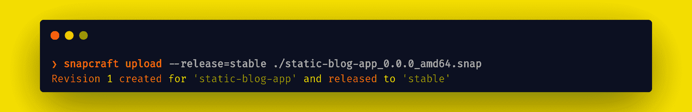

**The** application automatically goes to a stable release **if you do not mention- release tags**.

现在您已经成功地在一个稳定的版本中发布了您的应用程序。

### 如何更新您的快照应用程序

为了更新 snap 应用程序，您需要在版本部分的`tauri/target/snap/snapcraft.yaml`文件中进行更改。

```
...

version: 0.0.1

or 
version: 1.0.0

or

version: 0.1.0

... 
```

Simple change the version value according to you

现在用`snapcraft`命令重新构建您的应用程序。

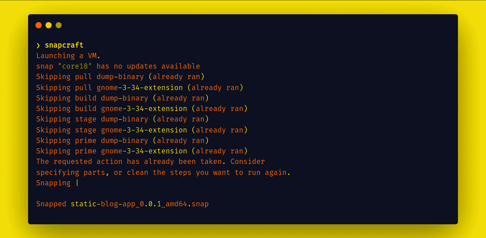

Rebuild your application

成功构建您的应用程序后，重新上传您的最新构建，您的应用程序将在 snap store 网站上更新。


Update your application in snapcraft

### 如何在 AppImage 中发布应用程序

AppImage 帮助你在 Linux 发行版中分发你的应用程序。你不需要安装 AppImage 就可以在你的系统中工作。

在 AppImage 上发布应用程序是一个简单的过程。首先，您需要一个 AppImage URL 和一个 GitHub 帐户。

首先，转到 [appImage GitHub 存储库](https://github.com/AppImage/appimage.github.io)并点击这个链接。

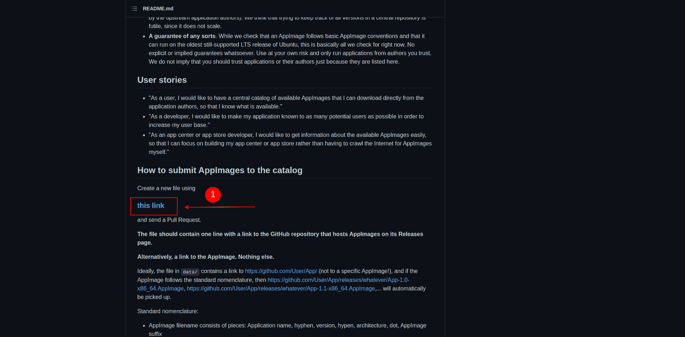

Click this link

之后，浏览器中会打开一个新页面:

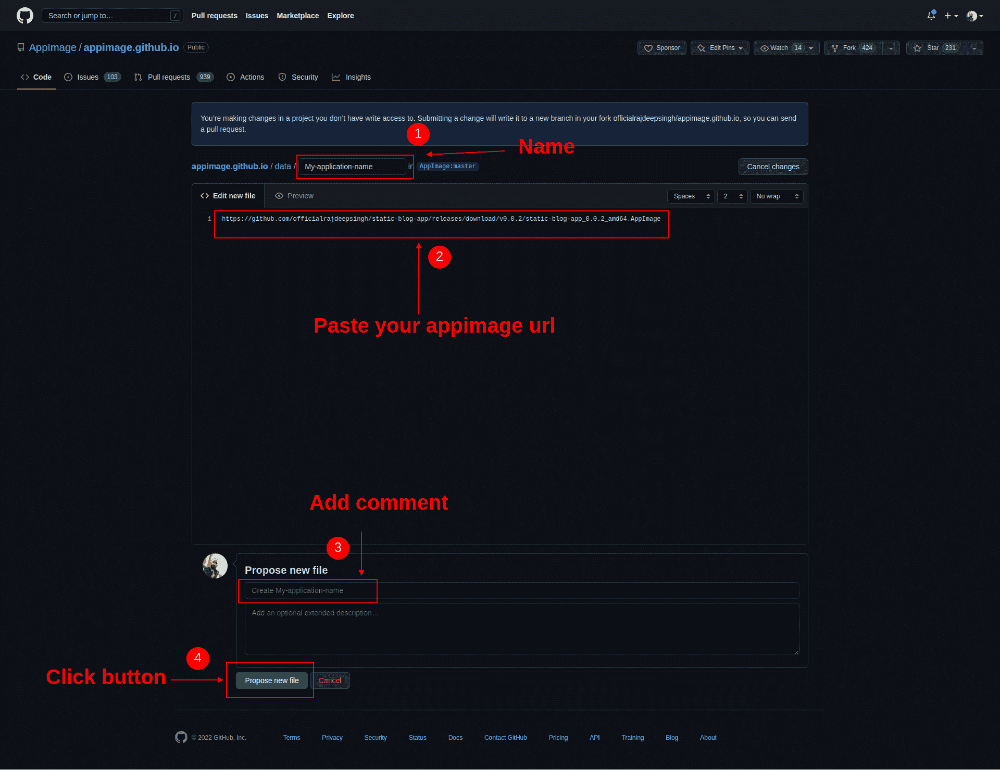

Submit pull request in AppImage

1.  添加您的应用程序名称。
2.  粘贴您的图像 URL
3.  添加评论
4.  单击新建建议文件按钮。
5.  在您的 github 帐户中下载 appimage.github.io repo
6.  在 appimage.github.io 存储库中创建一个新的 pull 请求。


Create a pull request into appimage.github.io

7.添加注释，然后单击“创建拉式请求”按钮。

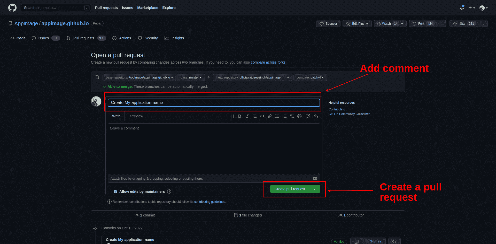

Add comment and Create a pull request into appimage.github.io

现在，您的应用程序已成功提交到 appimage.github.io 存储库。appimage.github.io 基于您的应用程序运行 github 操作。您的应用程序应该通过运行 AppImage 的所有测试。之后，你的图像应该成功地列在 AppImage 上，这样每个人都可以下载你的应用程序。

如果您在 AppImage 上提交一个带有 pull 请求的应用程序，您的 GitHub 动作测试将会失败。您将看到 GLIBC_2.29 '找不到错误。

我尝试了很多方法来解决这个问题，但我找不到解决方案。如果我这么做了，我会更新我的知识库和这篇文章。

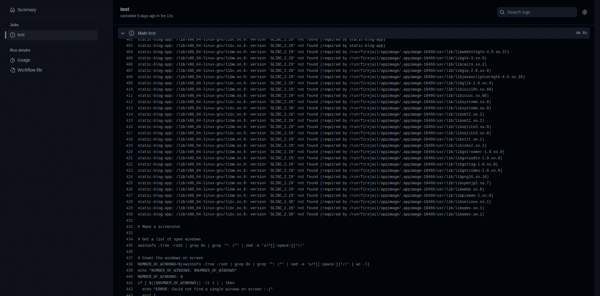

GLIBC_2.29 is not found

## 常见问题解答

### 如果你用 Tauri 构建应用程序，你必须用 Rust 编码吗？

不，你可以不用 Rust 写一行代码就能构建一个应用。相反，Tauri 为前端开发提供了 JavaScript 和 TypeScript API 支持，以处理许多东西，如剪贴板、对话框、事件、HTTP、通知等。

### 如何用 Tauri 构建跨平台架构(交叉编译)？

你可以用 Rust 构建一个跨架构(交叉编译)的应用。Rust Toolchain 帮助你构建[交叉编译应用](https://rust-lang.github.io/rustup/cross-compilation.html)。

### Tauri 中的工具链是什么？

Rust 工具链帮助您在不同的架构上构建应用程序。在 rust 中，有 86 个工具链可用于不同的架构。

```
❯ rustup target list
```

check the available toolchain in rust

### 你能用 Tauri 构建一个 Android 或 IOS 应用吗？

不可以，你不能用 Tauri 来构建 Android 和 iOS 的应用。但是有一个库可以帮助你为手机构建应用程序——只是我还没有测试过。您可以使用工具链构建应用程序。我很快会在我的网站上写一篇关于这个的文章。

### 什么是 Tauri JavaScript 和 TypeScript API？

Tauri 提供了不同类型的 API，有助于增强用户和开发人员的体验。您可以使用 API 来处理通知、对话、事件、HTTP 等等。

## 结论

用 Tauri 构建跨平台应用程序相对容易。您可以为应用程序使用任何前端框架。

但是其他框架不允许您构建各种跨架构和跨操作系统的应用程序，例如，Windows、macOS 和 Linux 发行版。

Tauri 提供了强大的后端语言支持。有了 Rust，你可以用低级语言做任何你能做的事情。另外，Rust 提供了内存安全，没有垃圾收集器，等等。

当用 Flatpak 构建 Tauri 应用程序时，我找不到开发和发布解决方案。不过，以后我会把它添加到 GitHub 自述文件中。

我还没有介绍如何在 Windows 和 macOS 上分发应用程序。我是 Linux 用户，不在 Windows 和 macOS 上测试应用程序。但是网上有很多文章和视频，你可以去看看，学习如何去做。

MacOS 有一个流行的分发平台，叫做 homebrew。[家酿分销](https://docs.brew.sh/How-to-Build-Software-Outside-Homebrew-with-Homebrew-keg-only-Dependencies)系统类似于 appimage.org[的](https://appimage.org/)。如果你为你的应用程序提交了一个新的 pull 请求并通过了所有测试，你的应用程序就会显示在 homebrew 上。

如果您有任何关于开发和发布 Tauri 应用程序的问题或建议，您可以在 [Tauri GitHub 讨论](https://github.com/tauri-apps/tauri/discussions/)上寻求帮助。