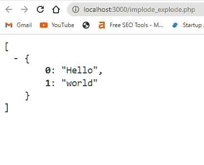
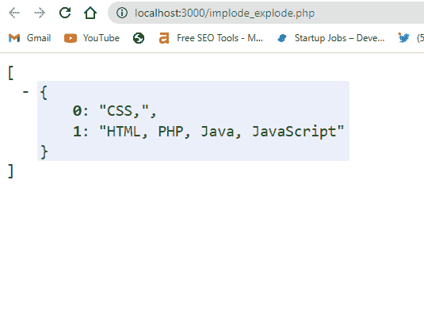
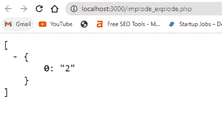
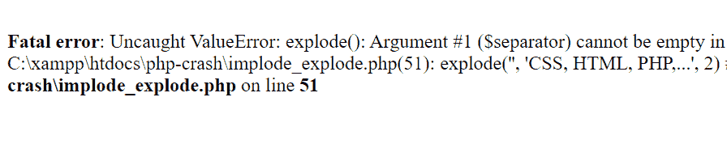

# PHP Explode——如何将一个字符串拆分成一个数组

> 原文：<https://www.freecodecamp.org/news/php-explode-how-to-split-a-string-into-an-array/>

函数将一个字符串转换成一个数组。字符串中的每个字符都有一个从 0 开始的索引。和内置的`imlode()`函数一样，explode 函数不修改数据(字符串)。

### `explode()`函数的语法

`explode()`函数接受三个参数:

*   分离器
*   要转换为数组的字符串
*   和极限

完整的语法如下所示:

```
explode(separator, string, limit) 
```

与即使没有分隔符也能工作的`implode()`不同，`explode()`功能没有分隔符也不能工作。所以，就像把字符串拆分成数组一样，分隔符是必需的。您可以使用 limit 参数来指定预期的数组数量。它是可选的。

## `implode()`的例子

假设我有一个字符串“Hello World”。如果字符串被传递到一个`explode()`函数中，`Hello`在数组中取索引 0，`World`取索引 1。请记住，数组使用从零开始的索引。

```
$str = "Hello world";
$newStr = explode(" ", $str);

// We are printing an array, so we can use print_r()
print_r($newStr); 
```



如果您在`explode()`函数中指定了一个限制，索引将不会超过该数字。例如，如果指定 2，将显示所有字符串，但索引不会超过 2。

```
$str = "CSS, HTML, PHP, Java, JavaScript";
$newStr = explode(" ", $str, 2);

// We are printing an array, so we can use print_r()
print_r($newStr); 
```



您可以看到，第一个元素的索引为 0，其余以逗号分隔的元素的索引为 1。该索引不超过指定的 2 的限制。

`explode()`函数查看字符串中的空格，将字符串拆分成一个数组。如果您同时键入两个不同的单词，它们将被视为一个单词:

```
$str = "CSS HTMLPHP Java JavaScript";
$newStr = explode( " ", $str);

// We are printing an array, so we can use print_r()
print_r($newStr); 
```


你可以看到 HTML 和 PHP 被放在了一起，因为它们之间没有空格。

## 结论

本文向您展示了如何在 PHP 中使用`explode()`函数。

注意，与没有分隔符的`implode()`不同，分隔符在`explode()`中非常重要。如果你不指定一个分隔符，`explode()`不会像预期的那样工作。

```
$str = "CSS, HTML, PHP, Java, JavaScript";
$newStr = explode($str, 2);

// We are printing an array, so we can use print_r()
print_r($newStr); 
```



如果您将分隔符保留为空字符串，您会得到一个错误:



感谢您的阅读。