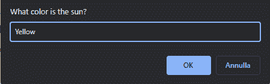
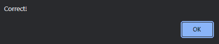

# 如何将 JavaScript 中的字符串小写–JS 中的 to Lowercase()

> 原文：<https://www.freecodecamp.org/news/how-to-lowercase-a-string-in-javascript-tolowercase-in-js/>

字符串是使用 JavaScript 的基本部分。而`toLowerCase()`方法是众多可以用来处理字符串的集成方法之一。

在本文中，我们将看到如何用 Python 中的`toLowerCase()`方法使字符串小写。

## ****什么是** S **tring？****

字符串是一种可以包含许多不同字符的数据类型。字符串由单引号或双引号之间的一系列字符组成。

```
const exampleString = 'I am a String!'
console.log(exampleString); // I am a String!
```

## ****什么是** M **方法？****

方法是可以在特定数据类型上使用的函数。方法可以接受也可以不接受参数。

## **T2**D**如何进行**M**方法** W **ork？**

`toLowerCase()`方法是一个字符串方法，它返回一个完全小写的新字符串。如果原始字符串有大写字母，那么在新字符串中，这些字母将是小写的。任何小写字母或任何非字母字符不受影响。

```
console.log(exampleString.toLowerCase()); // i am a string!

console.log('FREECODECAMP'.toLowerCase()); // freecodecamp 
```

## ****做什么去** K **保持在**M**ind**W**hen**U**唱** toLowerCase M **方法****

`toLowerCase()`方法做了一件非常简单的事情:它创建了一个新的字符串，其中所有的大写字母都变成了小写字母。但是在使用它的时候，有一些事情需要记住。让我们来看看它们。

### ****字符串是不可变的****

字符串是不可变的数据类型，这意味着它们不能被改变。使用`toLowerCase()`方法后，原始字符串将保持不变。

在上面的例子中，`toLowerCase()`方法作用于`exampleString`,但从未改变它。检查`exampleString`的值仍显示原始值:

```
console.log(exampleString); // I am a string!

console.log(exampleString.toLowerCase()); // i am a string!

console.log(exampleString); // I am a string! 
```

### ****`toLowerCase()`**方法返回一个新字符串******

**这意味着`toLowerCase()`方法返回一个新的字符串。如果您想在代码中再次使用它，您需要将它保存在一个变量中。**

```
`const newString = exampleString.toLowerCase()

console.log(newString); // i am a string!`
```

### ******字符串区分大小写******

**字符串区分大小写，因此小写字符串不同于大写字符串。**

```
`console.log('freecodecamp' === 'FREECODECAMP'); // false` 
```

**当考虑到`toLowerCase()`方法的用途时，这是很有用的。在这个例子中，您将看到这个特性如何使`toLowerCase()`方法在构建处理字符串的脚本或程序时变得有用和必要。**

## ****`toLowerCase()`**M**方法** E **示例**–H**如何到** C **检查**U**ser**I**nput**M**匹配********

我们来写一个小 app，问用户一个问题，获取输入，反馈用户的答案。

有多种方法可以做到这一点:您可以在 web 应用程序中使用它，用`type="text"`从`input`元素中获取值。为了简单起见，在这个例子中你将看到`prompt` JavaScript 函数的用法。

`prompt`功能将显示一个浏览器消息弹出窗口，带有一个输入字段，用户可以在其中写下答案。

```
const answer = prompt("What color is the sun?")
if (answer.toLowerCase() === "yellow") {
  alert("Correct!")
} else {
  alert("That is not the correct color!")
}
```

这段代码问用户一个问题，“太阳是什么颜色？”，并等待回答。然后它检查答案是否是“黄色”，如果是，它打印“正确！”如果不是，它会打印“这不是正确的颜色！”。

但是这段代码有一个问题。

运行此代码时，您将在弹出窗口中询问以下问题:



如果你回答“黄色”，它会说“这不是正确的颜色！”

为什么会这样？

记住字符串是区分大小写的。该脚本检查用户输入的带有大写字母“Y”的字符串`yellow`–`Yellow`是否是不同的字符串。

您可以通过使用`toLowerCase()`方法，并对代码做如下小小的修改来轻松解决这个问题:

现在，如果你再试一次...



什么变了？书写`answer.toLowerCase()`在与正确答案字符串“yellow”进行比较之前，你要确保被检查的字符串是完全小写的。通过这种方式，用户写“黄色”或“黄色”或“黄色”都没关系——都被转换成小写。

感谢阅读！现在您知道了如何在 JavaScript 中使用`toLowerCase()`方法。