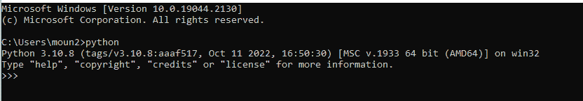
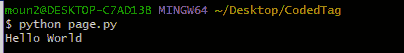

# Python 是什么？解释器如何工作，如何用 Python 写“Hello World”

> 原文：<https://www.freecodecamp.org/news/what-is-python-beginners-guide/>

在这篇文章中，我将解释什么是 Python 以及 Python 解释器是如何工作的。然后你将编写你的第一个“Hello World”程序。

## Python 是什么？

Python 是一种高级编程语言，旨在完成许多任务。它基于 CPython 解释器，该解释器将 Python 代码翻译成机器可读的东西。

Python 让我们能够在代码中使用许多模块和包，它们是解释器内置的标准库。

您可以使用 Python 完成许多任务，例如:

*   机器学习
*   人工智能
*   数据可视化
*   编程应用
*   网络应用
*   语言和游戏开发
*   数据分析

还有更多。

此外，Python 的语法非常简单易学——通常看起来你只是在给别人写消息。只要确保你知道缩进规则:)。

我们可以将 Python 与其他解释型编程语言进行比较，比如 Java、JavaScript、PHP 等等。但是你可能想知道——什么是 CPython？

在接下来的部分中，我将深入关注 Python 解释器的历史，然后回答这个问题。

## Python 历史概述

Python 编程语言的第一次出现是在 20 世纪 80 年代末。它是由吉多·范·罗苏姆创造的。

Python 被设计用来取代与 Amoeba 操作系统一起工作的 ABC 编程语言。

Rossum 于 1989 年开始实施，他独自研究 Python，直到 2018 年。

他把它命名为 Python，因为它的第一个版本能够读懂 BBC 喜剧剧本《巨蟒剧团的飞行马戏团》。

第一个版本是 1994 年的 1.0 版本(Python 1.0)，第二个版本是 2000 年的 2.0 版本。

在 2.0 版本中，van Rossum 增加了一些小功能，如收集系统和理解。

第三个版本于 2008 年发布，修复了该语言的一个基本缺陷。他们将这个版本命名为“Py3K”，即 Python 3.0。

## Python 解释器是如何工作的？

Python 解释器叫做“CPython ”,它是用 C 编程语言编写的。这是 Python 的默认实现。

在接下来的小节中，您将理解 Python 解释器是如何在幕后工作的。

### 源代码分析

实际上，任何翻译都是从源代码分析开始的。在这里，Python 解释器接收源代码，并初始化一些指令来做以下事情:

它遵循缩进规则并检查 Python 语法。可能有一些不正确的行，所以它会停止程序的执行来显示错误信息。

这个阶段被称为[词法分析](https://codedtag.com/php/what-is-php-how-to-write-php-program/#the-lexical-analysis)，这意味着将源代码文件分成一系列标记

在接下来的步骤中，解释器将生成字节码。让我们看看它是如何工作的。

### 字节码生成

一旦 Python 解释器的解析器接收到标记，它就开始操纵词汇标记。它生成一个叫做 AST(抽象语法树)的大结构。

解释器将这个 AST 转换成字节码，也就是机器语言。在 Python 中，字节码可以保存在以“.”结尾的文件中。pyc”扩展。

在下一节中，您将看到 python 解释器如何执行这些字节码。

### Python 虚拟机(PVM)

Python 解释器初始化它的运行时引擎 PVM，它是 Python 虚拟机。

解释器加载带有库模块的机器语言，并将其输入 PVM。这将字节代码转换成可执行代码，如 0 和 1(二进制)。

然后打印出结果。

注意，如果在 PVM 过程中发生错误，执行器将立即终止操作以显示错误。

现在您将学习如何在您的操作系统上安装 Python。

如果你没有 Python 软件或者你正在使用移动设备，你可以使用任何在线 Python 编译器。

## 如何安装 Python

要在 Ubuntu Linux 操作系统上安装 Python，请遵循以下说明:

打开您的终端并运行以下命令来更新 Ubuntu 本地系统库:

```
sudo apt update
```

Update Ubuntu Local System Repository

使用以下命令安装最新版本的 Python:

```
sudo apt install python3
```

Install Python 3 on Ubuntu Operating System

如果您使用的是 Windows 操作系统，您必须按照以下步骤在您的机器上安装 Python。

1.  导航到 [python 官方页面](https://www.python.org/downloads/windows/)并下载最新的安装程序。
2.  一旦您通过以上链接选择了最新版本，您必须根据您的 Windows 操作系统选择位系统。
3.  运行安装程序，并遵循安装程序上的书面说明。

安装程序后，您必须根据您的操作系统，通过终端或 CMD 使用以下命令来验证您的操作系统上 Python 的当前版本。

只需键入`python`并按下回车键——它将向您显示如下图所示的结果:



Verifying Python Version Via CMD

在下一节中，您将学习如何用 Python 编写您的第一个程序。

## 如何编写你的第一个 Python 程序

在这个程序中，您将使用 Python 编程语言打印经典的“Hello World”消息。

首先，创建一个文件夹并将其命名为“CodedTag”，然后在其中创建一个文件并将其命名为“page.py”。

然后复制并粘贴以下 Python 代码:

```
# output: Hello World
print( "Hello World" )
```

Print Hello World With Python

然后打开终端，导航到项目目录并运行以下命令:

```
python page.py
```

Execute Python File

输出如下图所示:



Execute Python Message

祝贺你——你刚刚编写了你的第一个 Python 程序。

## 包扎

在本文中，您了解了什么是 Python 以及它的一些历史。您还了解了 Python 解释器的工作原理。

我们总结成几点:

1.  解释器检查和搜索语法错误，并验证缩进规则。然后，它通过标记化来转换源代码。
2.  解析器接收词汇标记并生成抽象语法树。
3.  解释器将 AST 转换为字节码，并初始化 Python 虚拟机以执行字节码并发回最终结果。

感谢您的阅读，如果您想阅读更多我的文章，您可以在 [CodedTag](https://codedtag.com) 上找到它们。请继续关注我的下一篇文章。