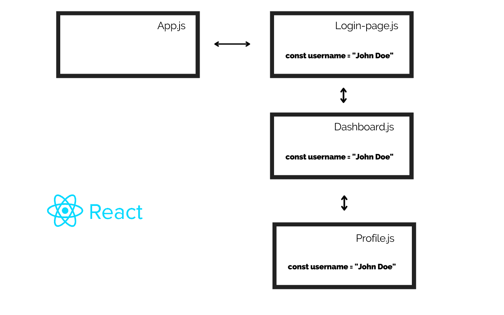

# 如何使用 React 上下文 API 避免道具钻取

> 原文：<https://www.freecodecamp.org/news/avoid-prop-drilling-with-react-context-api/>

React 上下文 API 提供了一种通过组件的多个嵌套级别传递数据的方法，而不必手动将数据传递到每个级别。

React context 是在应用程序中全局管理数据的一种可靠方法，也是避免钻牛角尖的好方法。

在本教程中，我们将学习如何使用 React 上下文 API (useContext hook)来避免钻取。

## 什么是道具钻？

在传统的 React 应用程序中，通常使用 props 在组件之间共享数据。手动共享这些数据可能会很麻烦，尤其是在多个嵌套组件之间共享时。此外，在两个子组件之间共享数据可能很麻烦。因此需要全球状态管理。

**Prop drilling** 是一种情况，数据从一个组件通过多个相互依赖的组件传递，直到到达需要数据的组件。这里有一个道具演练的图解，帮助你理解:



通过多个组件传递数据并不是编写干净的、可重用的、干巴巴的代码的好方法。

React context API 是一种避免适当钻探并确保您的数据得到全局管理的快速方法，无需使用庞大的第三方状态管理应用程序，如 [Redux](https://redux.js.org/) 和 [MobX](https://mobx.js.org/README.html) 。

## 什么是 React 上下文 API？

React context 是一个内置的 API，它使用 useContext 挂钩来跨组件共享数据。

想象一下，将经过身份验证的用户的数据从父组件传递到深层嵌套的子组件。如果您需要通过许多中间组件传递数据，这将非常麻烦。

更好的方法是使用 React 上下文来处理数据。

## 如何使用 React 上下文 API

### 如何创建上下文

useContext 是 React 中的内置钩子。您可以通过从 React 导入 createContext 函数来开始使用上下文 API，如下所示:

```
Import {createContext} from ‘react’;
const AuthContext = createContext();
```

这里，我们初始化了上下文，并将其命名为 **AuthContext。**下一步是提供上下文。

### 如何向需要上下文的组件提供上下文

上下文 API 使用提供者将数据传递给其子组件。您必须用提供者组件包装所有组件。

```
<AuthContext.Provider value={...}>
	<ParentComponent/>
<AuthContext.Provider>
```

如上所示，提供者组件具有一个**值**属性。可以使用**值**属性更新或设置上下文的值。在我们的例子中，我们将把值 prop 设置为经过身份验证的用户的名称。

```
import React from ‘react’;

function App() {

	const username = “John Doe”

	return(
        <AuthContext.Provider value={username}>
        	<Dashboard/>
        <AuthContext.Provider>
    )
}

export default App;
```

万岁！这个**应用**组件中的所有组件都可以访问用户名数据。接下来，我们来看看如何使用上下文。

### 如何消费上下文

我们可以通过使用 **useContext** 钩子来使用上下文。无需通过嵌套组件传递数据，您可以在任何想要的组件中访问您的上下文。以下是方法。

```
import { useContext } from ‘react’;

const Profile = () => {

	const value = useContext(AuthContext);

	return (
        <div>
        	{value}
        </div>
    )
}

export default Profile
```

## 结论

除了解决道具演练的问题，你还可以使用 React context 进行主题配置、全局状态管理等等。

注意，React 上下文 API 不是 Redux 和 MobX 等全局状态管理工具的替代品。你可以在这里阅读更多关于 React Context [的内容。](https://reactjs.org/docs/context.html)

我希望你喜欢这个教程。

**编码快乐！**