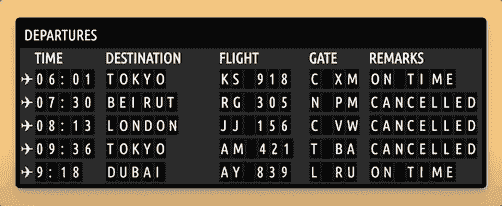

# 用三种不同的方式编码一个项目(JavaScript + REST API +数据库)

> 原文：<https://www.freecodecamp.org/news/code-a-project-three-different-ways-javascript-rest-api-database/>

当你用不同的方法编写一个类似的项目时，它会帮助你更好地理解每一种方法。

我们刚刚在 freeCodeCamp.org YouTube 频道上发布了一门课程，将教你如何使用多种方法用 JavaScript 编写一个航班小部件。

首先，您将学习使用 JavaScript 初学者方法创建项目。接下来，您将学习如何更新项目以使用 API 来获取小部件的数据。最后，您将使用 Node.js 创建一个带有迷你后端的 React 应用程序来与云中托管的数据库通信。

Ania Kubow 开发了这个课程。Ania 是一个受欢迎的创作者和软件开发者。她为 freeCodeCamp 频道和她自己的频道创建了许多课程。

You will build this flight widget.

这三个部分如下:

*   纯 JavaScript 的航班小部件
*   使用 REST API 的 JavaScript 和 Node.js 中的 Flight 小部件
*   React 和 Node.js 中使用数据库的 Flight 小部件

观看以下全部课程或在 freeCodeCamp.org YouTube 频道观看[(2 小时观看)。](https://youtu.be/_uSrE-gIdFc)

[https://www.youtube.com/embed/_uSrE-gIdFc?feature=oembed](https://www.youtube.com/embed/_uSrE-gIdFc?feature=oembed)