# 电子邮件别名——如何免费设置专业电子邮件

> 原文：<https://www.freecodecamp.org/news/email-alias-set-up-a-professional-email-for-free/>

我需要登录 AWS。但是我的主邮箱被拒绝了。显然，我在过去这样做了，该帐户已被不可逆转地删除。

没有重置选项–只有一条消息，说明帐户已被永久删除:

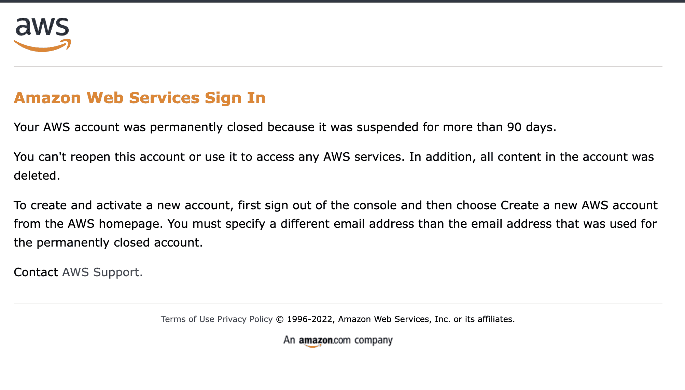

有大约一百万种方法可以获得一个新的电子邮件地址，但是我想用电子邮件建立一个我自己的域名。

我想可能有办法把它转发到我的 Gmail 邮箱。

我是对的！

在本快速指南中，我将带您了解:

*   如何创建电子邮件别名
*   将邮件从别名转发到 g mail 帐户
*   以电子邮件别名发送邮件

## 如何创建电子邮件别名

我用的是谷歌产品:[谷歌域名](https://domains.google.com/registrar/)和 [Gmail](https://gmail.com/) 。所有这些步骤应该普遍适用于其他领域和电子邮件服务。

首先，登录您的域名提供商并选择**电子邮件**菜单。您可以从菜单选项中选择“**添加电子邮件别名**”。

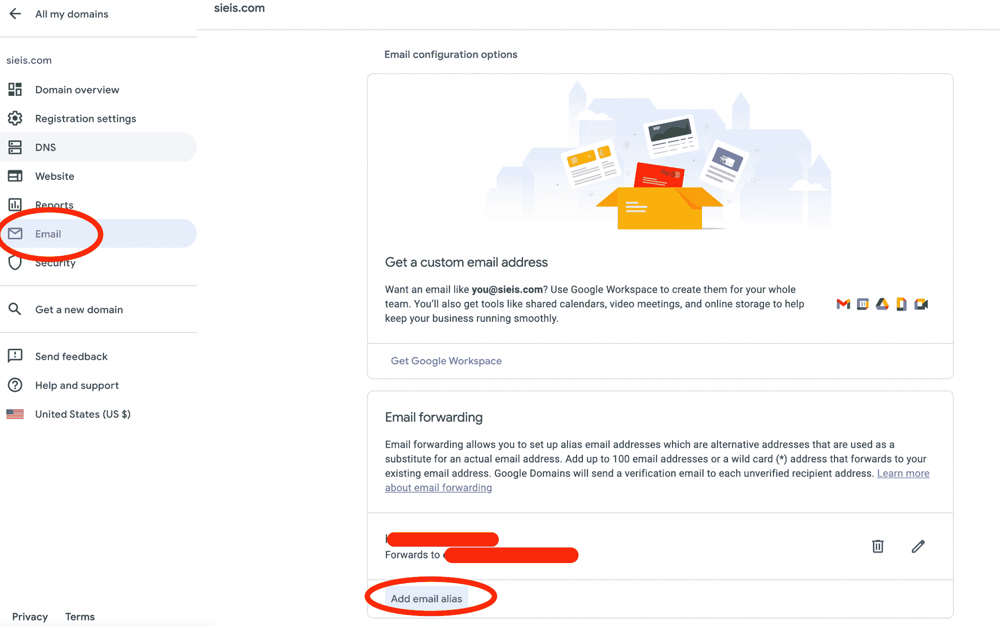

## 如何将电子邮件转发到另一个地址

注意:如果添加星号(*)，这将创建一个通配符别名，将任何电子邮件转发到指定的地址。我们将在本教程中添加一个特定的别名。

添加您选择的任何电子邮件，并输入您希望邮件转发到的位置。我会把 hi@sieis.com 的邮件转发到我的 Gmail 主地址。

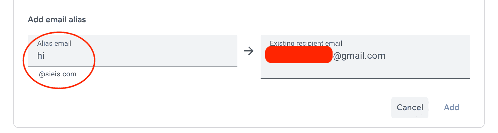

如果你使用谷歌域名服务器，那么谷歌域名将自动设置正确的邮件记录(MX)。

否则，您需要设置这些 MX 记录。这个过程就像建立域名服务器，如果你曾经在不同于你购买域名的地方建立你的网站。

| 名称/主机/别名 | 类型 | 生存时间 | 优先 | 价值/答案/目的地 |
| --- | --- | --- | --- | --- |
| 空白或@ | 麦克斯韦(maxwellˌ磁通量单位)ˌ中性(Middlesex) | 1H | five | gmr-smtp-in.l.google.com |
| 空白或@ | 麦克斯韦(maxwellˌ磁通量单位)ˌ中性(Middlesex) | 1H | Ten | alt1.gmr-smtp-in.l.google.com |
| 空白或@ | 麦克斯韦(maxwellˌ磁通量单位)ˌ中性(Middlesex) | 1H | Twenty | alt2.gmr-smtp-in.l.google.com |
| 空白或@ | 麦克斯韦(maxwellˌ磁通量单位)ˌ中性(Middlesex) | 1H | Thirty | alt3.gmr-smtp-in.l.google.com |
| 空白或@ | 麦克斯韦(maxwellˌ磁通量单位)ˌ中性(Middlesex) | 1H | Forty | alt4.gmr-smtp-in.l.google.com |

额外收获:我为 Netlify 上的一个网站做过这个，非常简单。从 Netlify 仪表板中，选择**选项**，**转到 DNS 面板**，然后输入 MX 记录:

👇

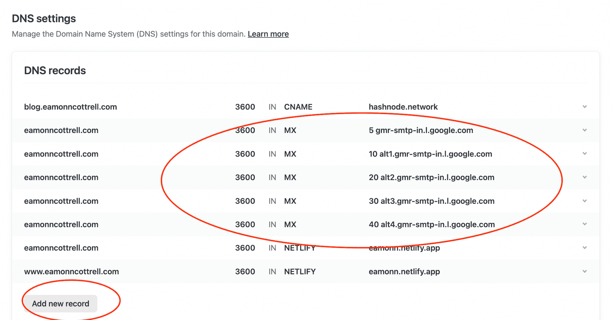

谷歌将在此处发送一封一次性验证邮件，但如果您之前已经完成了此验证，它可能不会发送另一封邮件。

从不同的地址给自己发一封电子邮件，然后检查一下！

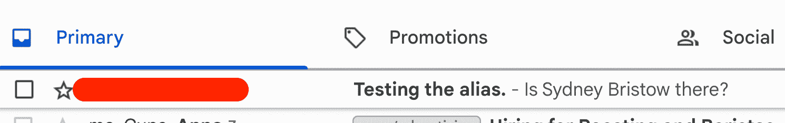

Email sent to Alias and forwarded to main Gmail

注意:从你的 Gmail 主地址发送的邮件不会像你自己发邮件那样显示为未读邮件。此时从不同的地址发送。完成其余步骤后，当我们完成“以别名发送电子邮件”部分时，它将正常工作。

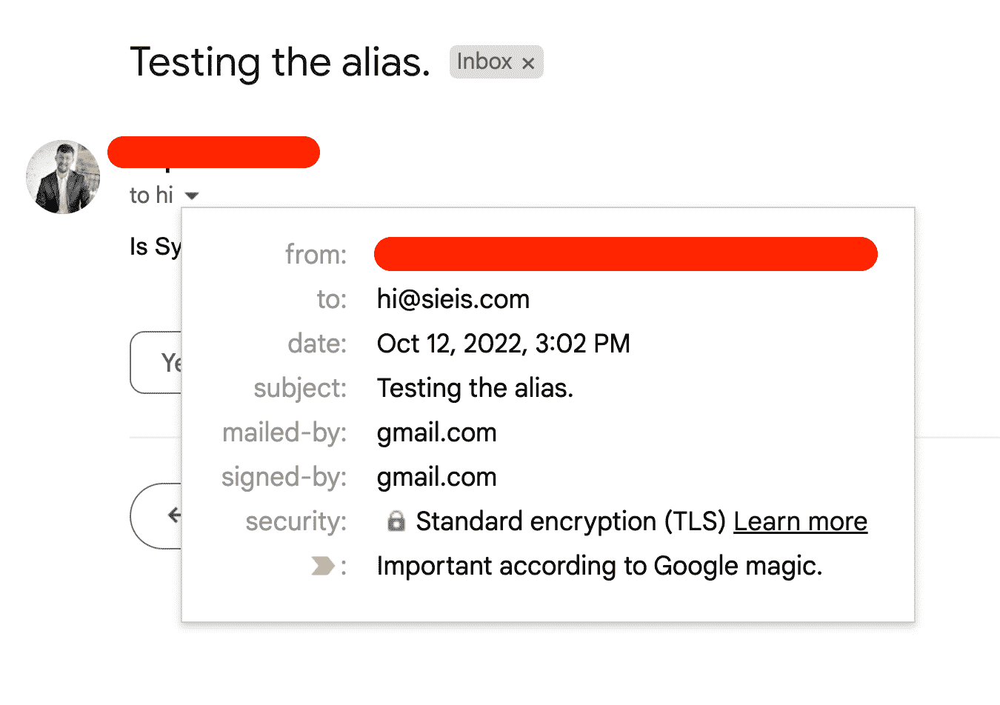

## 如何以别名发送电子邮件

如果您目前从主 Gmail 回复，当您回复时，收件人将看到该地址，而不是别名。根据使用情况，这可能不是什么大问题，但是我们当然可以设置它，以便发送的邮件也像来自自定义域一样。

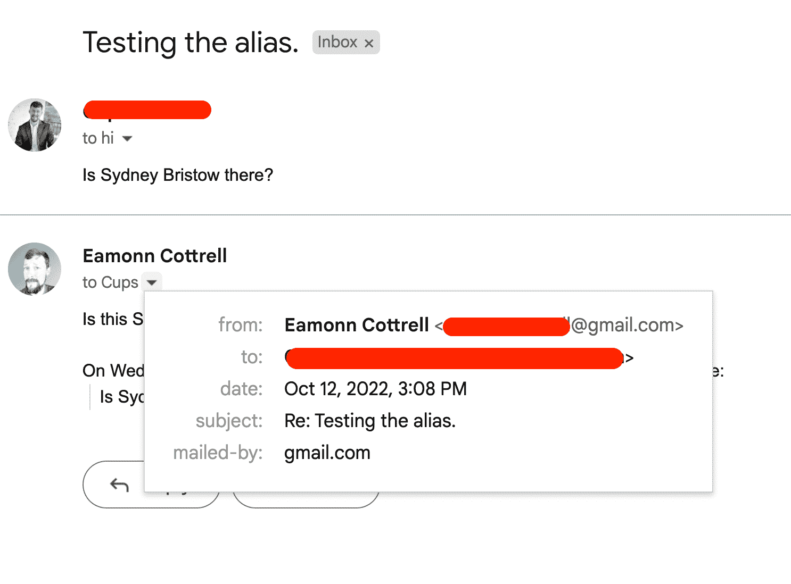

你需要进入你的 [**谷歌账户安全**](https://myaccount.google.com/security) ，点击**应用密码**。

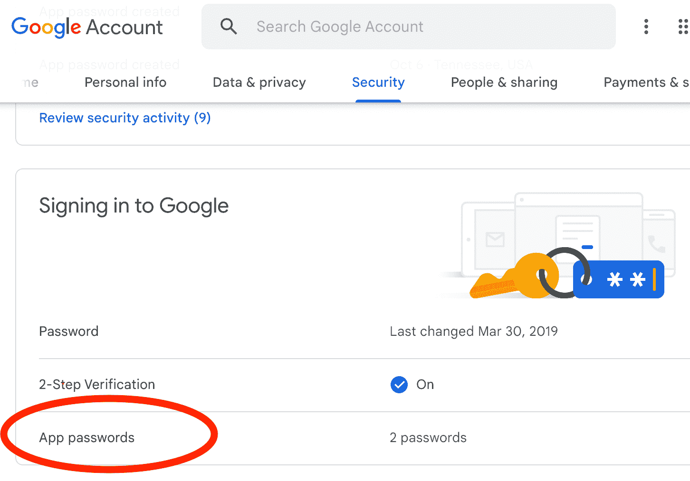

在应用下拉框中选择**邮件**，在设备下拉框中选择**其他**。

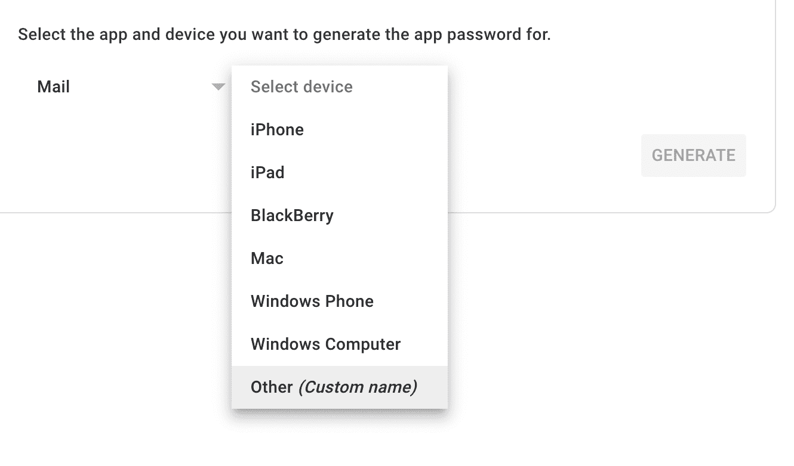

输入域名，点击**生成**。它会给你一个 16 位数的密码。保存此邮件以便在 Gmail 中使用...

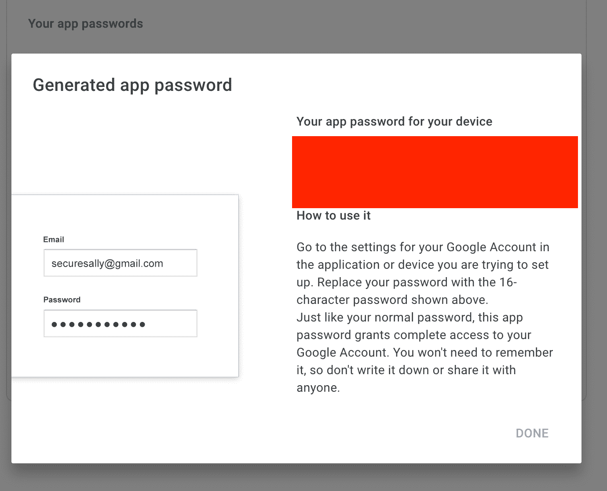

在 Gmail 中，进入设置-> **账户，导入**，点击**添加另一个电子邮件地址**。

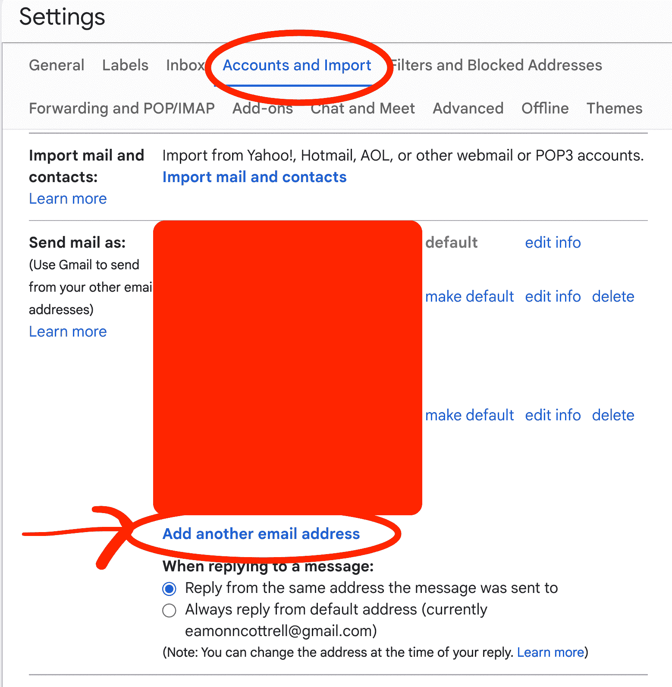

这将弹出一个新的小窗口，您可以在其中输入别名的详细信息。输入您希望收件人查看的**名称**和别名的**地址**。确保“**作为别名**处理”复选框被选中。

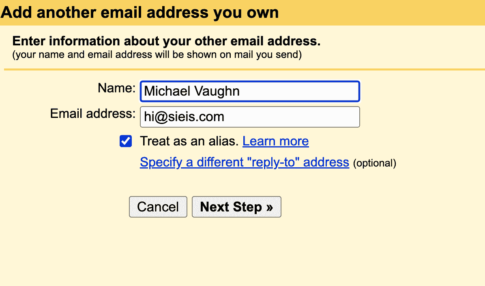

在下一个屏幕上，您需要将 **SMTP 服务器**更改为 smtp.gmail.com，将**用户名**更改为您的 Gmail 用户名，然后粘贴您在上述步骤中从 Google Security 生成的 **16 位密码**。

**口**应为 587，检查 **TLS** 径向按钮。

点击**添加账号**。

这将提示向电子邮件别名发送验证码...这些钱应该会转到 Gmail 账户。把它输入进去，你就可以开始了！

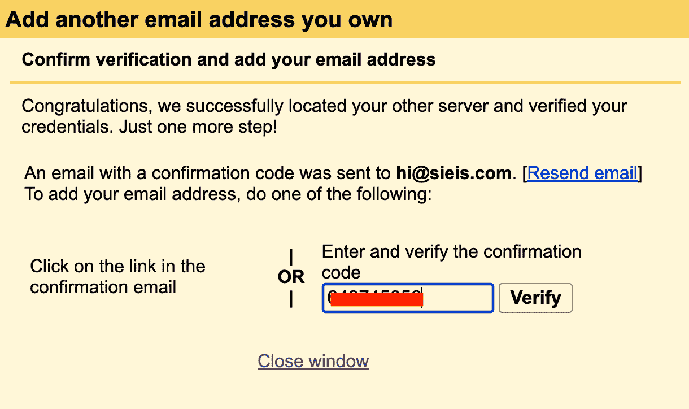

回到我们在 Gmail 中的电子邮件主题，在撰写新邮件时，您可以通过下拉选项选择您希望从哪个帐户发送邮件。

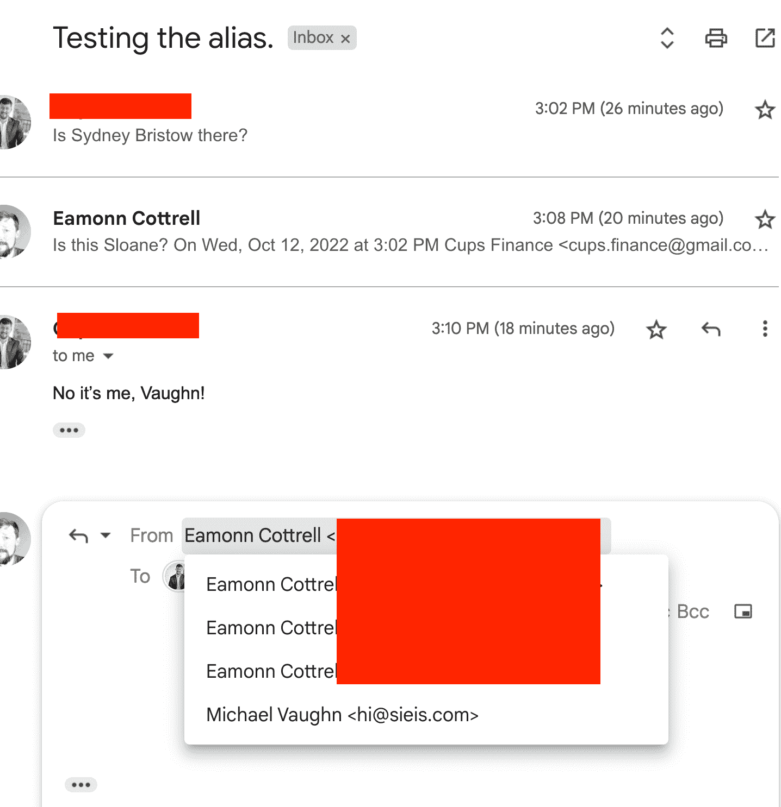

现在，我们可以从我们的完整主题中看到，我们的电子邮件使用我们选择的电子邮件别名和显示名称转发到我们的 Gmail 帐户，并从我们的 Gmail 帐户发送。

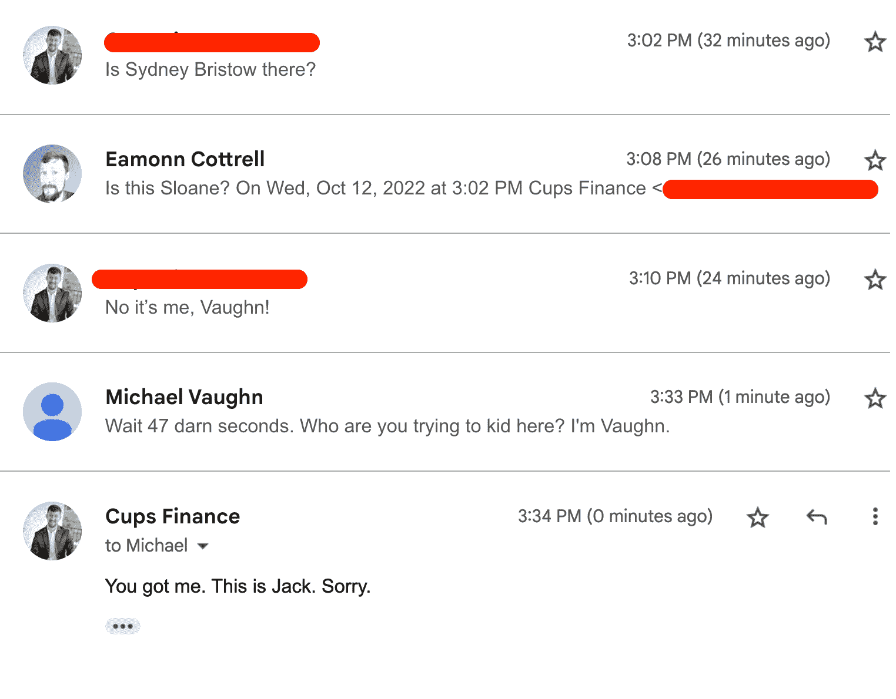

## 感谢阅读！

这对我很有启发，希望对你也有帮助。

在推特上打声招呼:[https://twitter.com/EamonnCottrell](https://twitter.com/EamonnCottrell)

