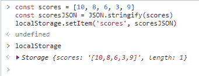
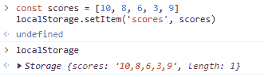

# Web 存储的工作原理——解释了本地存储与会话存储

> 原文：<https://www.freecodecamp.org/news/how-web-storage-works/>

任何使用网络的人都需要存储数据以备后用。后端开发人员的工具包中有一些强大的数据库。但是如果你是一个前端开发人员，你仍然可以使用 web 存储来存储和处理数据。

在本文中，您将了解什么是 web 存储，不同类型的 web 存储，以及何时使用每种存储。

## 什么是网络存储？

Web 存储是 HTML5 的一个特性，允许您在浏览器中以键值对的形式存储数据。这使得应用程序能够将数据存储在客户端，以便您可以在以后访问或操作它。存储在 web 存储器中的所有数据都保留在浏览器中，不会传输到其他地方。

## web 存储的类型

两种主要类型的 web 存储 are‌‌本地 storage‌‌和会话 storage‌‌.每一个都有自己独特的特点。

但它们的一个共同点是，它们将数据存储在用户用来访问网页的特定浏览器中。您将无法通过另一个浏览器访问相同的数据。

现在让我们详细讨论这两个问题。

### 局部存储器

在应用程序的生命周期内，本地存储可以为每个应用程序存储 5MB 的数据。关闭浏览器不会以任何方式影响数据——除非您删除数据，否则数据会保留在浏览器中。

您只能通过`localStorage`访问本地存储对象。可用于对 localStorage 对象执行操作的方法有:

```
localStorage // to access the localStorage object 
localStorage.setItem('name', 'John') // sets name equal to john localStorage.getItem('name') // "John" 
localStorage.removeItem('name') // removes name from the localStorage localStorage.clear() // clears the localStorage
```

`localStorage.setItem()`以键和值为参数，在本地存储对象中设置一个新项等于给定的键值对。

`localStorage.getItem()`将一个键作为参数，并返回存储在存储器中该键的值。

清除整个 localStorage 对象。

`localStorage.removeItem()`接受一个键作为参数，并删除相应的键-值对。‌‌

存储在 localStorage 中的任何项目都将存储为字符串。这意味着您需要将其他数据类型(如数组或对象)转换为字符串——否则您会丢失它们的结构。

请参见下面的示例:

```
const scores = [10, 8, 6, 3, 9] 
const scoresJSON = JSON.stringify(scores) 
localStorage.setItem('scores', scoresJSON) 
localStorage // output >> {scores: '[10, 8, 6, 3, 9]', length: 1}
```

在上面的例子中，我们首先创建了一个数组 score，然后使用 JSON.stringify()将其转换为一个字符串，最后将 stringified scores 数组保存在 localStorage 中。

请花点时间看看我在浏览器控制台中运行相同代码片段时得到的输出。



Example code in browser console

注意，key scores 的值等于我们的 stringified scores 数组。但是如果我们不把分数数组转换成一个字符串，我们的数组将失去它的结构，条目将保存为一个字符串，如下所示:

```
const scores = [10, 8, 6, 3, 9] 
localStorage.setItem('scores', scores) 
localStorage // output >> {scores: '10, 8, 6, 3, 9', length: 1} 
```

让我们在浏览器控制台中运行代码，看看控制台记录了什么:



Saving an array without converting it into a string

看看我们的 scores 数组在没有使用 JSON.stringify()将其转换为字符串时是如何转换为字符串的？

### 会话存储

会话存储允许您根据系统内存和浏览器中存储的数据将数据存储在浏览器中，直到浏览器关闭。换句话说，关闭浏览器将清除会话存储中存储的所有数据。

与 localStorage 一样，您可以通过在浏览器控制台中键入 session storage 来访问会话存储。

```
sessionStorage // access the session storage 
sessionStorage.setItem('name', 'John') // add name to session storage with value john 
sessionStorage.getItem('name') // get the name item from session storage sessionStorage.removeItem('name') // remove name item from the session storage sessionStorage.clear() // clear the session storage
```

`sessionStorage.setItem()`以键和值为参数，在本地存储对象中设置一个新项等于给定的键值对。

`sessionStorage.getItem()`将 key 作为参数，并返回存储在存储器中该键的值。

`sessionStorage.removeItem()`接受一个键作为参数，并删除相应的键-值对。

清除整个 localStorage 对象。‌‌

与 localStorage 一样，sessionStorage 中存储的任何项都将存储为字符串。这意味着我们需要在存储到 sessionStorage 之前将它们转换成字符串。

## Web 存储示例使用案例

当用户再次访问网页时，如果您希望您的数据可用，例如购物车或游戏/测验分数，您可以使用**本地存储**。请记住，保存在本地存储中的信息不应该是敏感的。‌‌

当需要保存的数据比较敏感时，可以使用**会话存储**。用户验证是一个数据示例，您希望在用户关闭标签时立即清除该数据。

## 结论

在本文中，您了解了在浏览器中存储临时数据的现代方法。我希望这有助于您理解如何以及何时在您的项目中使用这两种类型的 web 存储。

有兴趣在 LinkedIn 上联系吗？在 Tooba Jamal 给我打电话。