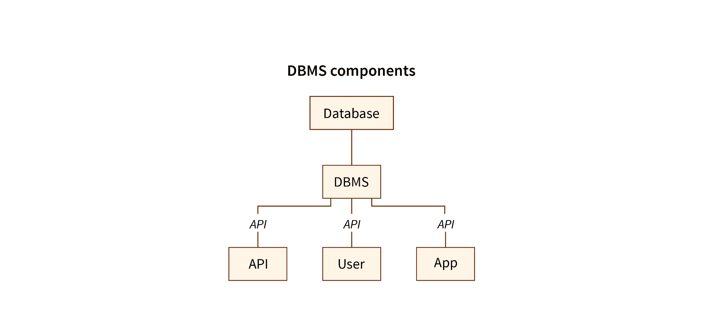
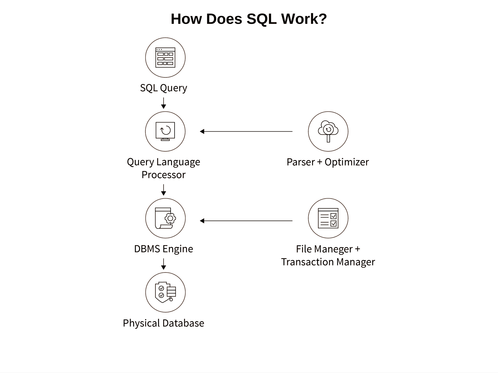

# 数据库管理系统和 SQL 初学者教程

> 原文：<https://www.freecodecamp.org/news/dbms-and-sql-basics/>

数据库管理系统和 SQL 是当今互联网上最重要和最广泛使用的两种工具。

您使用数据库管理系统(DBMS)来存储从各种来源收集的数据，并使用 SQL 来高效地操作和访问您想要的特定数据。

许多不同的企业使用这些工具来增加销售和改进产品。其他机构如学校和医院也使用它们来改善他们的行政服务。

在本文中，您将了解到:

*   数据库管理系统和 SQL 的基础
*   DBMS 和 SQL 最重要的特性
*   你应该学习 DBMS 和 SQL 的理由。

## 数据库管理系统是做什么的？

正如我们上面提到的，DBMS 代表数据库管理系统。 [SQL](https://www.freecodecamp.org/news/learn-sql-free-relational-database-courses-for-beginners/) 代表结构化查询语言。

如果您有大量数据需要存储，您不只是想把它们保存在任何地方，那么就没有人知道这些大量的数据意味着什么或能告诉您什么。这就是我们使用数据库管理系统的原因。

数据库基本上是我们存储彼此相关的数据的地方，也就是相互关联的数据。这种相互关联的数据很容易处理。

DBMS 是管理数据库的软件。一些常用的数据库管理系统(软件)是 MS ACCESS、MySQL、Oracle 等。

假设你有一些数据，比如学生的不同姓名、年级和身份证号码。您可能更喜欢将这些数据放在一个漂亮的表中，表中的特定行包含学生的姓名、成绩和 ID 号。为了帮助你有效地组织和读取数据，你需要使用 DBMS。

使用数据库管理系统与 SQL 密切相关。这是因为当您存储数据并想要访问和更改它时，您将使用 SQL。

数据库以各种形式存储数据，如模式、视图、表格、报告等。

## DBMS 的类型

有两种类型的数据库管理系统。

首先，你有关系数据库(RDBMS)。在这些类型的数据库中，软件以表格的形式存储数据。在 RDBMS 中，每一行仅由特定实体的数据组成。

常用的 RDBMS 有 MySQL、MSSQL、Oracle 等。

然后是非关系数据库。在这些数据库中，数据以键和值对的形式存储。

一些常用的非关系 DBMSs 有 MongoDB、Amazon、Redis 等。

### DBMS 的组件

通过查看下图，您可以了解 DBMS 的四个主要组成部分:



你有你的用户。可以有多个用户，比如管理数据库的人(数据库管理员)、系统开发人员，以及像客户这样的普通用户。

您还拥有数据库应用程序。数据库的应用可以是部门的，也可以是个人的，也可以是组织内部使用的。

然后是我们一直在讨论的 DBMS。这个软件可以帮助用户创建数据库，并以高效的方式访问其中的数据。

最后，您有数据库，它是以单个单元的形式存储的数据的集合。

DBMS 的一个重要特征是它有助于减少存储数据中的冗余。将相同的数据存储在数据库的多个位置称为冗余。

为了消除和减少数据库中的冗余，使用了规范化。

规范化是通过移除异常来结构化 RDBMS 中的数据的过程。重要的是能够从数据库中方便地检索数据，以及在不丢失一致性的情况下添加或删除数据。这可以借助 DBMS 中的“范式”来实现。这些范式有助于在关系数据库中建立关系，而不是一次又一次地重新定义现有字段。这样，规范化减少了冗余。

## 什么是 SQL？

SQL 是一种数据库语言。SQL 被广泛使用，几乎所有的关系数据库管理系统都能识别它。

SQL 包含一组使您能够创建数据库的命令。您还可以使用它来执行关系数据库管理系统中的命令。

SQL 具有某些优势，这些优势帮助它从 20 世纪 70 年代发展到现在。它被人们和平台所广泛接受，部分原因在于以下特性:

*   SQL 很快
*   SQL 是一种非常高级的语言
*   SQL 是一种平台无关的语言
*   SQL 是一种标准化语言
*   SQL 是一种可移植的语言

除了上面提到的所有特性，使用 SQL 几乎不需要任何编码技能。

SQL 执行各种任务，如创建、更改、维护和检索数据、设置属性等。所有任务都是基于您编写的命令完成的，这些命令被分为不同的类别，如 DDL 命令、DML 命令、DCL 命令等等。

让我们讨论一些常用的命令及其类型。

### DDL 命令

DDL 代表数据定义语言。它包括一组用于执行与数据定义相关的各种任务的命令。您可以使用这些命令来指定存储结构和访问数据库系统的方法。

您可以使用 DDL 命令来执行以下功能:

*   创建、删除和更改。
*   授予和撤销各种角色和权限。
*   维护命令

DDL 命令的例子包括`CREATE`、`ALTER`、`DROP`和`TRUNCATE`。

### DML 命令

DML 代表数据操作语言。顾名思义，它由用于操作数据的命令组成。

您可以将这些命令用于以下操作:

*   删除
*   插入
*   检索
*   修正

DML 命令的例子有`SELECT`、`INSERT`、`UPDATE`和`DELETE`。

### TCL 命令

TCL 代表事务控制语言。顾名思义，您使用这些命令来控制和管理事务。

包含各种步骤的一个完整的工作单元称为事务。

您可以将这些命令用于以下目的:

*   创建保存点
*   设置正在进行的事务的属性
*   撤消对数据库的更改(永久)
*   在数据库中进行更改(永久)

TCL 命令的例子包括`COMMIT`、`ROLLBACK`和`SAVE TRANSACTION`。

## 如何用 SQL 编写基本查询

您可以在 SQL 中使用各种关键字，如 SELECT、FROM、WHERE 等。这些 SQL 关键字不区分大小写。

要创建一个名为 Student 的表，其中包含姓名、卷号和分数，您可以编写:

```
CREATE TABLE student
(Name char(20)  NOT NULL,
Rollno int,
Marks int );
```

这里 CREATE、TABLE 和 NOT NULL 是关键字。您使用 CREATE and TABLE 创建一个表，并使用 NOT NULL 指定在创建记录时该列不能为空。

要从表中进行查询，您需要编写:

```
SELECT what_to_select FROM table_name WHERE condition_to_satisfy.
```

您使用“select”关键字从表中提取信息。“From”关键字选择从中提取信息的表。“where”关键字指定要指定的条件。

例如，假设我们想从包含分数、卷号和姓名数据的 student 表中检索分数。该命令如下所示:

```
SELECT Name FROM student WHERE marks>95
```

如果你想为初学者学习更多关于 SQL 的知识，你可以[看看这个备忘单](https://www.freecodecamp.org/news/learn-sql-in-10-minutes/)，它会很快教会你基础知识。

您也可以通过这个[面向初学者的关系数据库课程](https://www.freecodecamp.org/news/learn-sql-free-relational-database-courses-for-beginners/)来更扎实地理解查询语言。

## DBMS 和 SQL 为什么重要？

能够使用 DBMS 和 SQL 是当今世界最重要的技能之一。毕竟，你知道他们说什么——“数据是新的石油。”所以你应该知道如何有效地使用它。

这里有几个你应该学习如何使用至少一个 DBMS 和 SQL 的理由。

## 学习如何使用数据库管理系统的理由

### 如果你存储了大量的数据

如果您的组织需要存储大量数据，您会希望使用 DBMS 来组织这些数据，并能够轻松地访问它们。

DBMS 以非常符合逻辑的方式存储数据，使得处理海量数据变得非常容易。你可以在 freeCodeCamp 的、[的](https://en.wikipedia.org/wiki/SQL)[本教程和 Scaler 的](https://www.freecodecamp.org/news/sql-and-databases-full-course/)、中阅读更多关于数据库管理系统的内容，以便更好地理解 DBMS 中的数据存储。

### 如果你在做数据挖掘

数据挖掘是从非常大的数据集中提取仅包含相关信息的可用数据的过程。使用 DBMS，您可以非常有效地执行数据挖掘。

为了管理数据，您使用了 [CRUD 操作](https://www.freecodecamp.org/news/learn-crud-operations-in-javascript-by-building-todo-app/)，代表创建、读取、更新和删除。您可以使用 DBMS 轻松高效地执行这些操作。

### 完整性约束和可伸缩性

存储在数据库中的数据满足完整性约束。完整性约束是一组已经定义的规则，负责维护数据库中数据的质量和一致性。DBMS 确保数据是一致的。

可扩展性是 DBMS 的另一个重要特征。你可以很容易地向数据库中插入大量数据，用户只需进行一些基本的查询就可以快速访问这些数据。

你不需要编写新的代码，也不需要花费大量的时间和金钱去扩充同一个数据库。

### 当您有多个用户界面时

当您使用 DBMS 时，您可以让多个用户同时访问系统。就像在 UNIX 操作系统中，两个用户可以同时登录一个帐户。

### 安全性

DBMS 使存储数据变得简单。您还可以添加数据访问的安全权限，以确保访问受到限制，数据的隐私保持不变。

DBMS 保护存储在其中的数据的机密性、可用性、完整性和一致性。

在保证数据安全的同时，它还减少了开发应用程序所需的时间，提高了流程效率。

### 学习 DBMS 是一项热门技能:

大多数公司，无论大小，都有大量的数据要处理。所以他们需要人来分析它。

如果您知道如何使用 DBMS，那么您可以在几乎所有面向数据的技术中使用这些技能。所以一旦你学会了数据库管理系统，在任何数据驱动的技术上工作都会很容易。

## 学习 SQL 的理由

由于 SQL 是一种用于数据库管理的语言，所以上面的一些要点也适用于学习它(比如数据存储、数据挖掘等等)。

以下是您应该学习 SQL 的一些额外原因。

### SQL 相对容易学

在数据库管理环境中，SQL 非常容易学习。SQL 查询类似于我们在日常生活中使用的简单英语。例如，如果我们想制作一个名为 Topics 的表，我们只需使用命令:

```
CREATE TABLE Topics;
```

了解计算机如何工作有助于你学习与计算机相关的其他技能，如任何编程语言、MS Excel 等电子表格软件和 MS word 等文字处理软件。

您还可以使用 SQL 来管理各种平台上的数据，如 [SQLite](https://www.sqlite.org/) 。

### SQL 是标准化的

SQL 是在 20 世纪 70 年代开发的，已经被广泛使用了 50 多年，但并没有对它进行太多的重大修改。这使它成为处理数据的标准技能，所以通常当你申请工作时，他们会使用 SQL 来存储和管理数据。

这种通用的标准化也使学习变得更容易，因为你不需要不断地更新你的知识，一次又一次地去熟练它。

### SQL 很容易排除故障

你在使用 SQL 时遇到的任何错误都会用非常简单的英语清楚地显示出来。

例如，如果您试图使用一个不存在的表或任何数据库，它将显示一个错误，表明您试图访问的表或数据库不存在。

就像任何其他编程语言一样，SQL 中也有异常处理的概念。

异常处理用于通过 TRY CATCH 构造处理查询运行时错误。TRY 块用于指定需要检查错误的语句集，而 CATCH 块在发生错误时执行某些语句。异常处理对于编写无错误代码至关重要。

### 易于操作数据

数据操作是指添加(或插入)、删除(移除)和修改(更新)数据库中的数据。

您存储在 SQL 中的数据本质上是动态的，这使得您可以轻松地在任何时间点操作数据。

您还可以使用一行 SQL 命令轻松检索数据。如果您希望以图表或图形的形式呈现数据，那么 SQL 在这方面起着关键作用，并使数据可视化对您来说很容易。

### 客户端和服务器数据共享

每当应用程序被使用时，存储在数据库管理系统中的数据根据用户选择的选项被检索。

创建和管理服务器，使用 SQL。SQL 用于浏览存储在数据库管理系统中的大量数据。

### 易于同步来自多个来源的数据

当您必须从多个来源获取数据并组合它们以获得想要的输出时，您会遇到许多情况。这意味着您将同时处理来自多个来源的输出，这可能是一项耗时且乏味的工作。

但是当您使用 SQL 时，更容易同时处理来自多个来源的数据，并将它们组合起来以获得所需的输出。

在 SQL 中，您可以使用 UNION 操作来组合数据，如下所示:

```
SELECT name FROM customers
UNION
SELECT order_id FROM orders;
```

使用这个函数将分别来自“customers”和“orders”表的“name”和“order_id”列组合起来，并呈现组合后的表。

### 灵活性、多功能性和数据分析

SQL 是一种编程语言，但是这种语言的范围不仅仅局限于编程任务。你可以将它用于各种用途，比如在金融部门、销售和市场营销中。通过执行一些查询，您可以获得您需要的数据，并根据您的目的对其进行分析。

有各种特定于 SQL 的角色，如 SQL 开发人员、SQL 数据库管理员、数据库测试人员、SQL 数据分析师 DBA、数据建模人员等等。点击可以了解更多薪资见解[。](https://www.glassdoor.co.in/Salaries/sql-developer-salary-SRCH_KO0,13.htm)

另一个重要的角色是数据分析师。对数据进行清理、建模和转换以根据某些信息从中得出结论的过程称为数据分析。

数据分析师的角色在任何组织中都很重要，因为它有助于分析趋势，并根据可用数据做出快速灵活的决策。

SQL 和 DBMS 是数据分析中最受欢迎的两种技能。

## DBMS 和 SQL 如何协同工作

DBMS 和 SQL 是相互依赖的，它们相互协作来组织和访问数据。现在，让我们了解 SQL 如何与数据库管理系统同步工作。



How SQL + DBMS work

SQL 是您与数据库管理系统交互的方式。您可以使用它来检索、插入、更新或删除数据(CRUD 操作)，以及其他操作。

当您执行 SQL 命令时，DBMS 会找出执行该命令的最有效方式。对要执行的任务的解释由 SQL 引擎决定。

经典查询引擎用于处理所有非 SQL 查询，但它不处理任何逻辑文件。

查询处理器解释用户的查询，并将它们翻译成数据库可理解的格式。

解析器用于翻译目的(在查询处理中)。它还检查查询的语法并查找错误(如果存在的话)。

优化引擎，顾名思义，在有用的见解的帮助下优化数据库的性能。

DBMS 引擎是在数据库上执行 CRUD 操作的底层软件组件。

文件管理器用于管理数据库中的文件，一次一个。

事务管理器用于管理事务以保持访问数据时的并发性。

## 结论

在本文中，我们讨论了 DBMS 和 SQL 的基础知识，以及为什么应该学习这些技能。

我们已经讨论了 DBMS 和 SQL 的用途和重要性，它们的用途，以及使用数据库和 SQL 的专业人员的工作。

阅读完本文后，您将对 DBMS 和 SQL 知识的应用领域有一个很好的理解。

快乐学习！